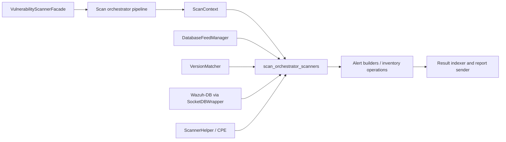
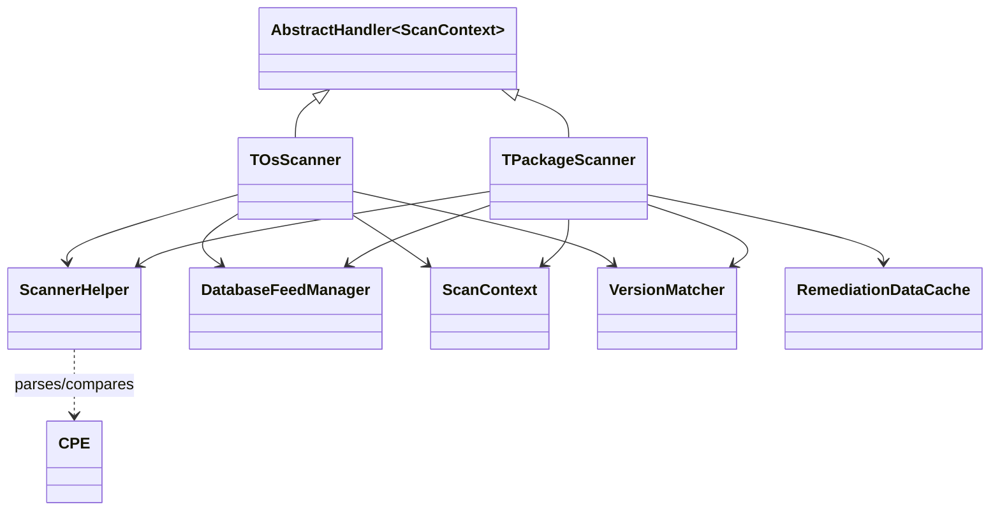
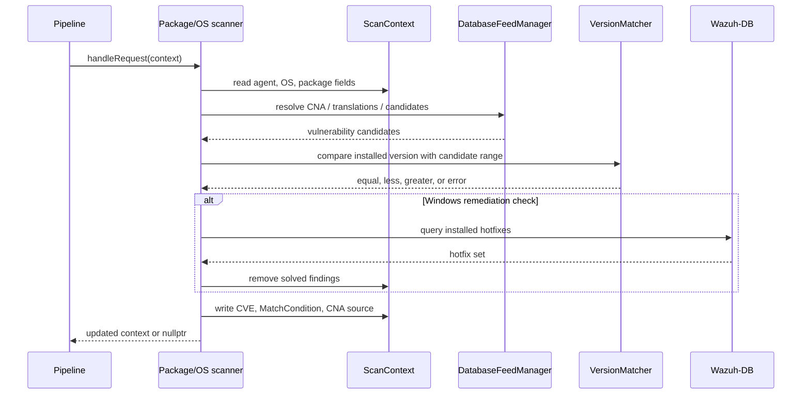

# `scan_orchestrator_scanners`

## Purpose

This module contains the vulnerability-scanning handlers used by Wazuh's vulnerability scanner orchestration chain. It converts agent inventory into feed queries, validates platform/vendor/version constraints, and writes vulnerability findings and match provenance into a shared `ScanContext`.

The module is intentionally split by concern:

- [OS scanner](complete_scan_orchestrator_scanners_os.md) — evaluates Windows and Darwin operating-system versions and removes Windows findings solved by installed hotfixes.
- [Package scanner](scan_orchestrator_scanners_package.md) — resolves CNA selection, translates package identities through L1/L2 caches, validates platform/vendor, and matches package versions.
- [Scanner helper](scan_orchestrator_scanners_helper.md) — parses and compares CPE 2.2/2.3 strings.

## Position in the vulnerability scanner

The handlers are downstream of the vulnerability scanner facade and database-feed manager, and upstream of the reporting/indexing pipeline. They operate on one context at a time and can stop processing by returning `nullptr` when no findings remain or the input is unsupported.

## Architecture

`TOsScanner` and `TPackageScanner` implement `AbstractHandler<std::shared_ptr<ScanContext>>`. Each handler enriches the context and delegates to the next handler through the base implementation. `ScannerHelper` is a stateless utility used by both scanners for CPE parsing and wildcard-aware comparison.

## End-to-end data flow

Package scanning selects the CNA using package format, source, vendor, platform, and configured mappings. It then checks translations, falls back to the normalized package identity, and applies candidate filters before version matching. OS scanning follows a similar candidate callback pattern but uses the OS CPE and OS version directly.

## Shared contracts and dependencies

- `ScanContext` carries agent identity, OS/package attributes, findings, match conditions, CNA provenance, and the selected vulnerability source.
- `DatabaseFeedManager` supplies CNA mappings, package translations, vulnerability candidates, and remediation updates.
- `VersionMatcher` creates typed version objects for DPKG, RPM, PEP 440, SemVer, and platform-specific strategies, then performs ordered comparisons.
- `RemediationDataCache` caches per-agent installed hotfixes and can populate them from Wazuh-DB.
- The surrounding [version matcher module](version_matcher.md) owns the version-object implementations; this module only selects the appropriate type or strategy.

## Operational notes

- `nvd` is the default CNA for both OS and package paths.
- Package formats map to distinct comparison semantics; unsupported formats fall back to an unspecified strategy.
- Findings from higher-priority CNAs are not overwritten.
- A scanner can return `nullptr` after scanning when its context contains no findings, allowing the pipeline to skip downstream reporting work.
- Exceptions are generally isolated per candidate so malformed feed content does not abort the entire agent scan; Wazuh-DB failures retain special handling.

## Source map

| Concern | Source |
|---|---|
| OS matching and hotfix filtering | `src/wazuh_modules/vulnerability_scanner/src/scanOrchestrator/osScanner.hpp` |
| Package CNA, translation, and version matching | `src/wazuh_modules/vulnerability_scanner/src/scanOrchestrator/packageScanner.hpp` |
| CPE model and comparison | `src/wazuh_modules/vulnerability_scanner/src/scanOrchestrator/scannerHelper.hpp` |

