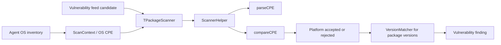
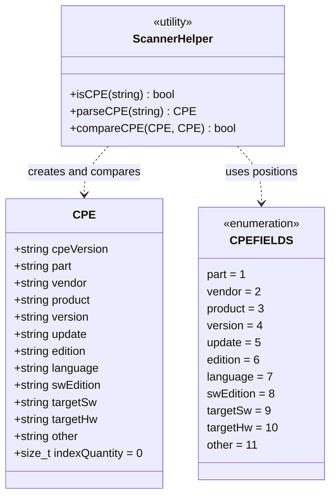
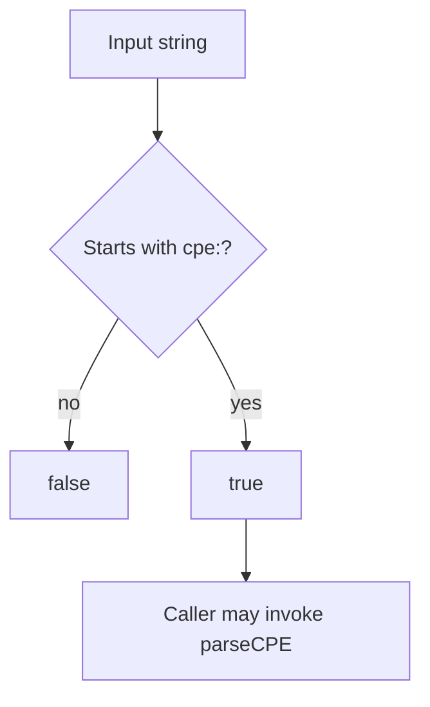
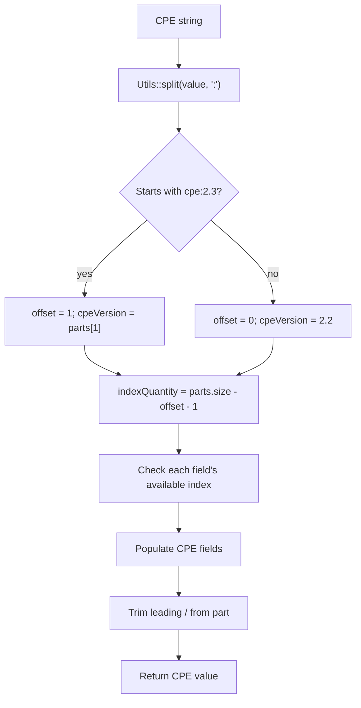
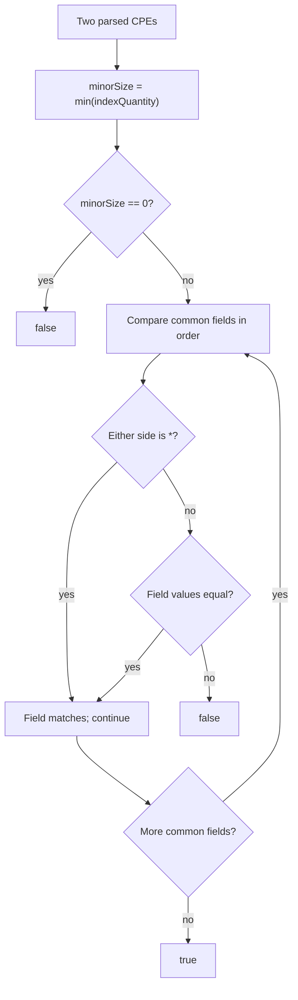
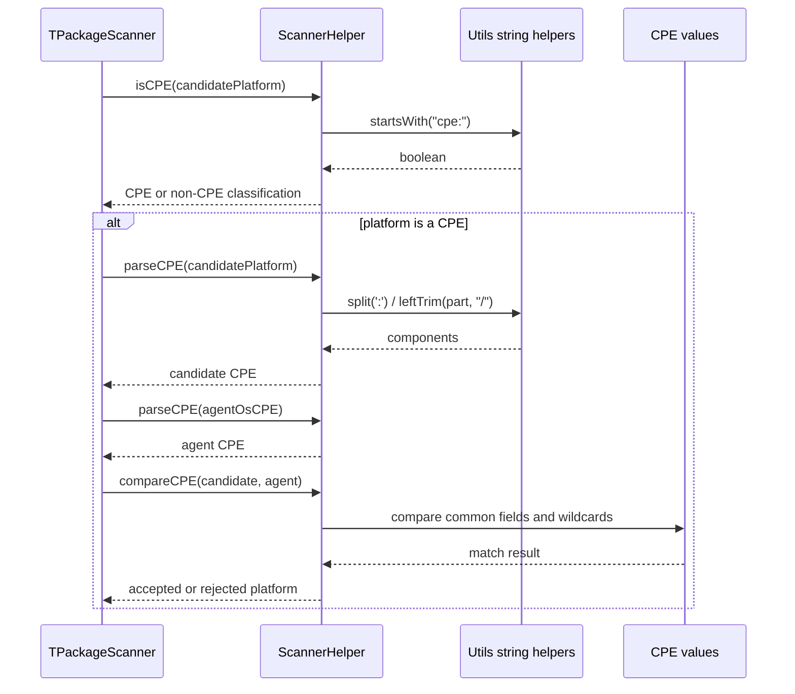
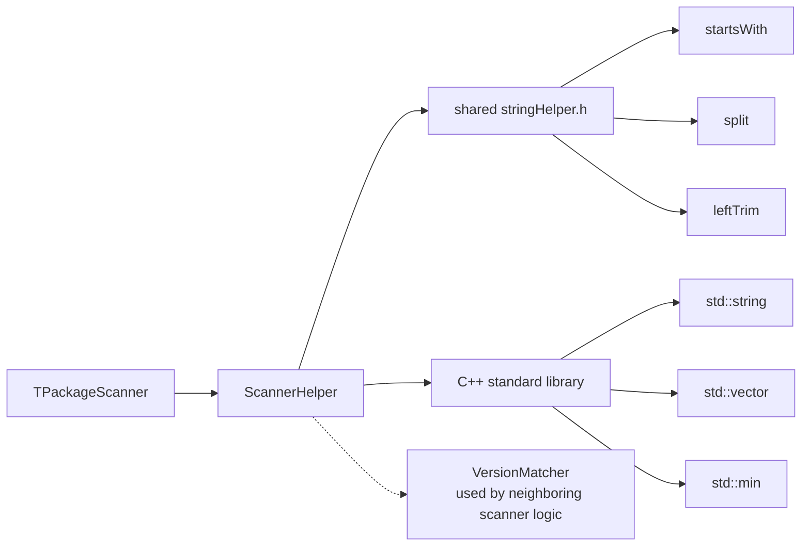
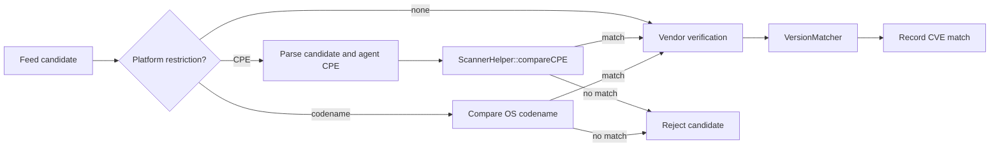

# Scan Orchestrator Scanner Helper

## Introduction

The `scan_orchestrator_scanners_helper` module provides the small, shared CPE utility layer used by Wazuh vulnerability scanners. It recognizes CPE strings, parses CPE 2.2 and 2.3 colon-delimited representations into named fields, and compares two parsed CPEs using field-wise equality with wildcard support.

The module is intentionally independent of feed storage, inventory collection, alert creation, and version ordering. Package candidate evaluation is described in the [scan orchestrator package scanner](scan_orchestrator_scanners_package.md); feed lookup belongs to the [database feed manager](database_feed_manager.md); software-version semantics belong to the [version matcher](version_matcher.md); and process lifecycle belongs to the [vulnerability scanner facade](vulnerability_scanner_facade.md).

## Location and public API

Source file: `src/wazuh_modules/vulnerability_scanner/src/scanOrchestrator/scannerHelper.hpp`

| Symbol | Role |
|---|---|
| `CPE` | Plain value object containing the parsed CPE version and up to eleven CPE attributes. |
| `CPE_VERSION_INDEX` | Constant value `1`, identifying the CPE 2.3 version component. |
| `CPEFIELDS` | One-based field positions for `part` through `other`. |
| `ScannerHelper::isCPE(value)` | Returns whether `value` begins with `cpe:`. |
| `ScannerHelper::parseCPE(cpeString)` | Splits a CPE into a `CPE` value. |
| `ScannerHelper::compareCPE(cpe1, cpe2)` | Compares the common populated prefix of two CPE values, treating `*` as a wildcard. |

`ScannerHelper` is a `final` class with static operations and no instance state. The header includes Wazuh’s shared string utilities for prefix checks, splitting, and trimming.

## Position in the scanner architecture

The helper sits below scanner-specific policy and candidate evaluation. It is principally used when a vulnerability candidate expresses an operating-system platform as a CPE and the installed agent OS is also represented by a CPE.

The helper does not decide whether a package is vulnerable. It only supplies the platform comparison used by the package scanner’s broader candidate-validation sequence. See the [package scanner](scan_orchestrator_scanners_package.md) for CNA resolution, candidate retrieval, vendor checks, package-version checks, and remediation handling.

## Data model

`CPE` stores the logical components of a CPE in strings. `indexQuantity` records how many CPE attributes were available after removing the leading `cpe` token and, for 2.3, the `2.3` token.

### Field mapping

The parser uses one-based CPE field positions because element zero is the `cpe` prefix. CPE 2.3 adds a version token at element one, so all named fields are read with an offset of one.

| Logical field | CPE 2.2 position | CPE 2.3 position |
|---|---:|---:|
| Prefix | 0 | 0 |
| CPE specification version | implicit `2.2` | 1 (`2.3`) |
| `part` | 1 | 2 |
| `vendor` | 2 | 3 |
| `product` | 3 | 4 |
| `version` | 4 | 5 |
| `update` | 5 | 6 |
| `edition` | 6 | 7 |
| `language` | 7 | 8 |
| `swEdition` | 8 | 9 |
| `targetSw` | 9 | 10 |
| `targetHw` | 10 | 11 |
| `other` | 11 | 12 |

The `part` value is left-trimmed of `/`; the remaining populated fields are copied without additional normalization.

## Recognition and parsing

### CPE recognition

`isCPE()` performs a case-sensitive prefix test for `cpe:`. It does not validate the number of components, field encoding, escaping, or whether the string is a standards-compliant CPE.

### `parseCPE()` flow

For incomplete strings, fields whose positions are unavailable remain empty. The parser returns a default-initialized `CPE` for an empty split result. The caller is expected to use `isCPE()` and provide a structurally meaningful value; parsing itself is not a validation boundary.

## CPE comparison semantics

`compareCPE()` compares only the common prefix of the two parsed values:

1. `minorSize` is the smaller `indexQuantity`.
2. If `minorSize` is zero, the result is `false`.
3. Each available field is compared in order from `part` through `other`.
4. A field mismatches only when both values are not `*` and the strings differ.
5. If no mismatch is found, the result is `true`.

This is symmetric wildcard matching: `*` on either side matches the corresponding field. It is also prefix-oriented: a shorter CPE can compare successfully with a longer CPE when all fields present in the shorter value agree. The CPE specification version (`cpeVersion`) is not compared, and extra fields beyond the shorter CPE are ignored.

## Component interaction

Non-CPE platform values are handled by the package scanner through OS codename comparison; that policy is outside this module.

## Dependencies

The direct functional dependency is `stringHelper.h`. `std::string`, `std::vector`, and `std::min` are used by the implementation. The relationship to `VersionMatcher` is architectural rather than a direct dependency of this header: CPE platform matching and package version matching are separate gates.

## Process flows in the overall scan

The helper participates in one branch of the package scanner’s candidate-validation process:

The result of `compareCPE()` is not persisted by the helper. The package scanner uses it to decide whether to continue evaluating the candidate, then stores any resulting CVE and match condition in its scan context.

## Edge cases and maintenance notes

- Recognition is case-sensitive and requires the exact `cpe:` prefix.
- `parseCPE()` assumes a `cpe:2.3` string has a component at index `1`; callers should avoid passing malformed 2.3 prefixes.
- Missing trailing components are represented as empty strings rather than causing a parse error when their indexes are unavailable.
- `part` removes leading slash characters; other fields are not unescaped or normalized.
- `compareCPE()` returns `false` when either parsed CPE has no comparable fields.
- Wildcard handling applies only to the literal `*`; empty strings are ordinary values and do not act as wildcards.
- Comparison ignores `cpeVersion`, so a 2.2 and 2.3 value may compare equal if their common parsed fields match.
- Comparison stops at the shorter CPE’s populated length. This supports comparing a partial CPE to a more detailed CPE, but it also means callers should choose input granularity deliberately.
- The helper has no logging, I/O, synchronization, cache, or ownership responsibilities.

## Testing guidance

Tests for this module should cover:

- valid CPE 2.2 and 2.3 parsing;
- partial CPEs and missing trailing fields;
- trimming of `/` from `part`;
- non-CPE and case-variant prefixes;
- equal fields, unequal fields, and mismatches at every CPE position;
- wildcard on either operand;
- empty CPEs and zero `indexQuantity`;
- shorter-prefix comparison and ignored extra fields;
- malformed `cpe:2.3` inputs, if the caller-facing contract is tightened.

For end-to-end behavior, consult the package scanner tests and documentation because platform acceptance is only one stage among CNA selection, vendor verification, version matching, remediation handling, and result publication.

## Related modules

- [Scan orchestrator package scanner](scan_orchestrator_scanners_package.md) — direct consumer and complete package-candidate workflow.
- [Database feed manager](database_feed_manager.md) — vulnerability candidates, translations, CPE rules, and remediation data.
- [Version matcher](version_matcher.md) — package and software-version parsing/comparison, which is distinct from CPE field comparison.
- [Vulnerability scanner facade](vulnerability_scanner_facade.md) — lifecycle and integration boundary for the scanner subsystem.
