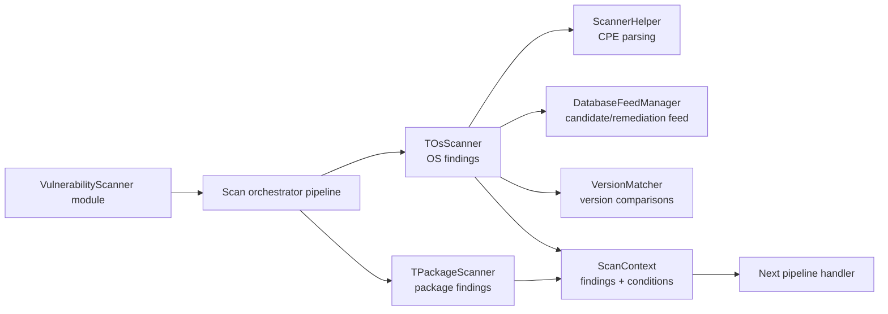
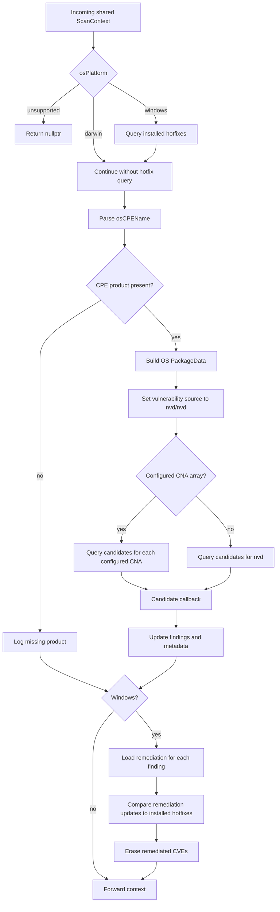
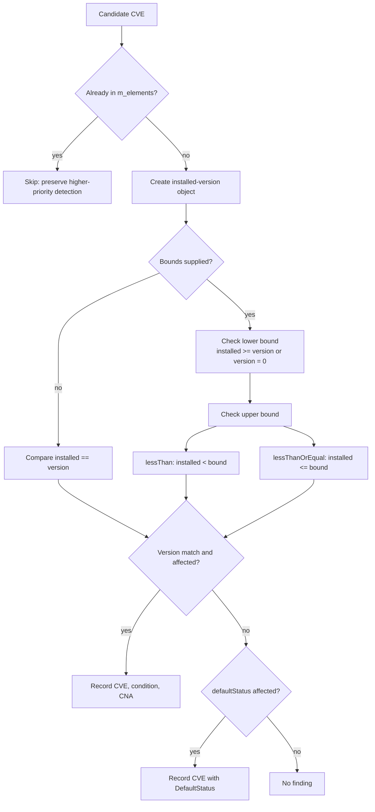
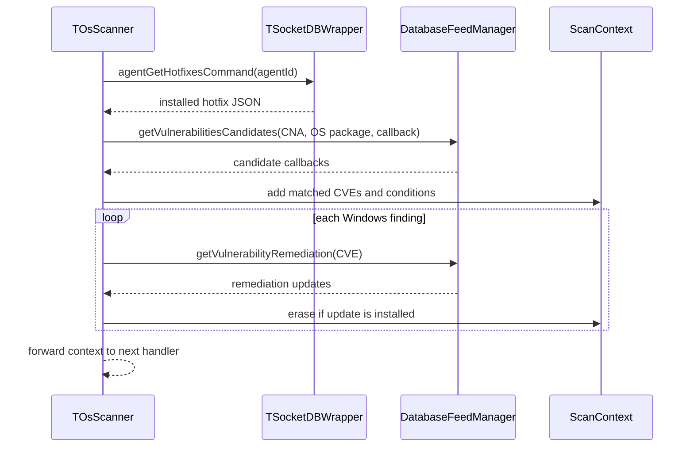
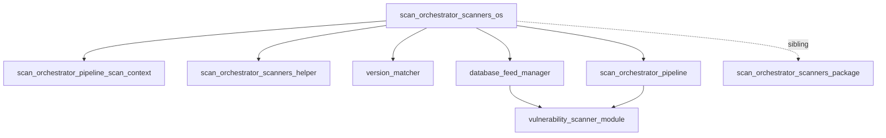

# Scan orchestrator: OS scanner

`scan_orchestrator_scanners_os` is the operating-system branch of the vulnerability scanner's scan-orchestrator chain. Its production type is `OsScanner`, an alias for the templated `TOsScanner<>` handler in `osScanner.hpp`. The handler receives a shared [`ScanContext`](scan_orchestrator_pipeline_scan_context.md), evaluates the agent's OS CPE and version against vulnerability-feed candidates, records matches, removes remediated Windows findings, and passes the context to the next handler.

This module is deliberately narrow: package scanning, inventory mutation, alert construction, indexing, and feed maintenance belong to neighboring modules and are linked below.

## Position in the vulnerability-scanner system

The scanner is hosted by the [vulnerability scanner module](vulnerability_scanner_module.md). The orchestrator composes multiple handlers; this module is the OS-specific sibling of the [package scanner](scan_orchestrator_scanners_package.md) and uses shared parsing/matching utilities from the [scanner helper](scan_orchestrator_scanners_helper.md), [database feed manager](database_feed_manager.md), and [version matcher](version_matcher.md).

## Responsibilities

- Restrict OS scanning to `windows` and `darwin` platforms.
- Retrieve Windows installed hotfixes through the Wazuh DB socket.
- Convert the OS CPE into a product identifier used for feed lookup.
- Select the configured default CNA list, or fall back to the `nvd` CNA.
- Evaluate exact versions, open-ended ranges, and closed upper bounds.
- Honor candidate and default vulnerability status.
- Preserve an existing CVE when a higher-priority CNA already found it.
- Store CVE findings, match conditions, and detection-source metadata in the scan context.
- For Windows, discard findings whose feed remediation is already installed.

## Main components

| Component | Role |
| --- | --- |
| `TOsScanner<TDatabaseFeedManager, TScanContext, TGlobalData, TSocketDBWrapper>` | Templated chain handler; owns the feed-manager dependency and implements `handleRequest`. |
| `DatabaseFeedManager` | Supplies vulnerability candidates and remediation records; see [database feed manager](database_feed_manager.md). |
| `ScanContext` | Carries agent identity, OS metadata, findings, match conditions, and CNA sources; see [scan context](scan_orchestrator_pipeline_scan_context.md). |
| `ScannerHelper::parseCPE` | Extracts the product from the OS CPE; see [scanner helper](scan_orchestrator_scanners_helper.md). |
| `VersionMatcher` | Compares the installed OS version with feed thresholds; see [version matcher](version_matcher.md). |
| `TGlobalData` | Provides the optional CNA priority array through `vendorMaps()`. |
| `TSocketDBWrapper` | Retrieves Windows hotfixes using the generated Wazuh DB query. |
| `AbstractHandler` | Forwards the updated context to the next chain element. |

The template parameters are important for tests: production uses the defaults, while unit tests can substitute feed, context, global-data, and socket implementations without changing the scan algorithm.

## Processing flow

If the platform is unsupported, the method returns immediately and does not invoke the next chain handler. For supported platforms, normal completion returns the result of the base `AbstractHandler::handleRequest`, which is the chain-forwarding operation.

## Candidate evaluation

The feed manager invokes the local callback once per candidate. The callback follows this order:

1. Read the candidate CVE. If it is already present in `m_elements`, skip it so a finding from a higher-priority CNA is not overwritten.
2. Create a version object for the installed OS version. The current implementation selects `VersionObjectType::DPKG` for OS comparisons.
3. Evaluate every version constraint in the candidate.
4. Only an `affected` status produces a finding from an explicit version match.
5. If no explicit version matches, use `defaultStatus`; an affected default status produces a finding with a `DefaultStatus` condition.

### Exact versions

When both upper-bound fields are empty, the installed version must compare equal to `version`. An affected candidate records:

- `m_elements[cveId]` as an empty JSON object;
- `m_matchConditions[cveId] = {version, Equal}`;
- `m_cnaDetectionSource[cveId] = cnaName`.

### Version ranges

For a ranged candidate, the lower bound is inclusive. A lower bound of `"0"` is treated as automatically satisfied. The upper bound is exclusive for `lessThan` and inclusive for `lessThanOrEqual`. The stored match condition records the selected upper-bound value and condition type.

### Default status

If no explicit version entry matches, `defaultStatus` is authoritative. An affected default status creates a finding with an empty threshold and `MatchRuleCondition::DefaultStatus`; otherwise the callback reports no match.

Any exception raised while evaluating one candidate is logged and converted to a non-match, allowing subsequent candidates to be processed.

## Windows remediation filtering

Windows is the only platform that performs the additional remediation phase. Before candidate evaluation, the scanner queries hotfixes using `agentGetHotfixesCommand(agentId)`. After findings are collected, each CVE is looked up in the feed's remediation data. A CVE is removed when:

- no remediation updates are available; or
- at least one remediation update matches an installed hotfix.

The implementation removes findings without remediation data immediately. For a matching installed update it erases the CVE from all three context maps: `m_elements`, `m_matchConditions`, and `m_cnaDetectionSource`.

## Error handling and edge cases

- `SocketDbWrapperException` while reading Windows hotfixes is translated to `WdbDataException` with the agent ID, preserving the Wazuh DB failure category for callers.
- Other hotfix-query exceptions are logged and return `nullptr`.
- An empty or unparseable CPE product does not create an OS package lookup; the scan completes without OS findings.
- Unsupported platforms log the platform and return `nullptr`.
- Exceptions around the overall scan are logged as warnings; the handler does not rethrow them in that outer path.
- A candidate-level exception is isolated to that candidate and does not abort the remaining candidate stream.
- A CVE found earlier remains authoritative, preventing a later CNA from replacing it.

The distinction between `nullptr` and a forwarded context matters to callers: `nullptr` indicates an unsupported or failed path in this handler, while a shared context reaching the base handler indicates normal chain continuation.

## Dependencies and related documentation

- [Scan orchestrator scanners](scan_orchestrator_scanners.md) — parent scanner family and sibling relationships.
- [Package scanner](scan_orchestrator_scanners_package.md) — package-vulnerability branch; it owns package-specific matching.
- [Scanner helper](scan_orchestrator_scanners_helper.md) — CPE parsing and shared scanner helpers.
- [Version matcher](version_matcher.md) and [version objects](version_matcher_version_objects.md) — supported comparison strategies and representations.
- [Scan orchestrator pipeline](scan_orchestrator_pipeline.md) — handler composition and downstream result processing.
- [Database feed manager](database_feed_manager.md) — vulnerability and remediation feed access.
- [Vulnerability scanner module](vulnerability_scanner_module.md) — daemon/module lifecycle and integration boundary.

## Source reference

Implementation: `src/wazuh_modules/vulnerability_scanner/src/scanOrchestrator/osScanner.hpp` (`TOsScanner`, `OsScanner`, and `OS_SCANNER_CNA`).
