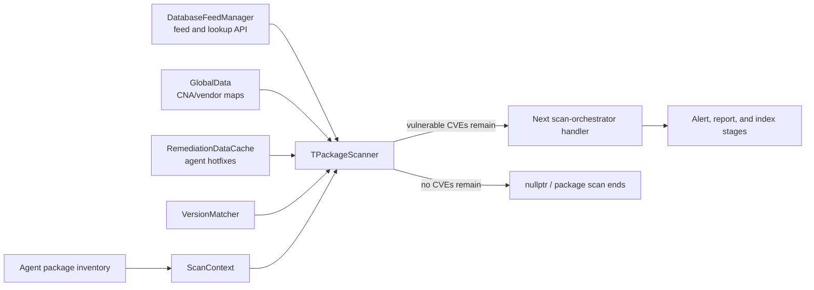
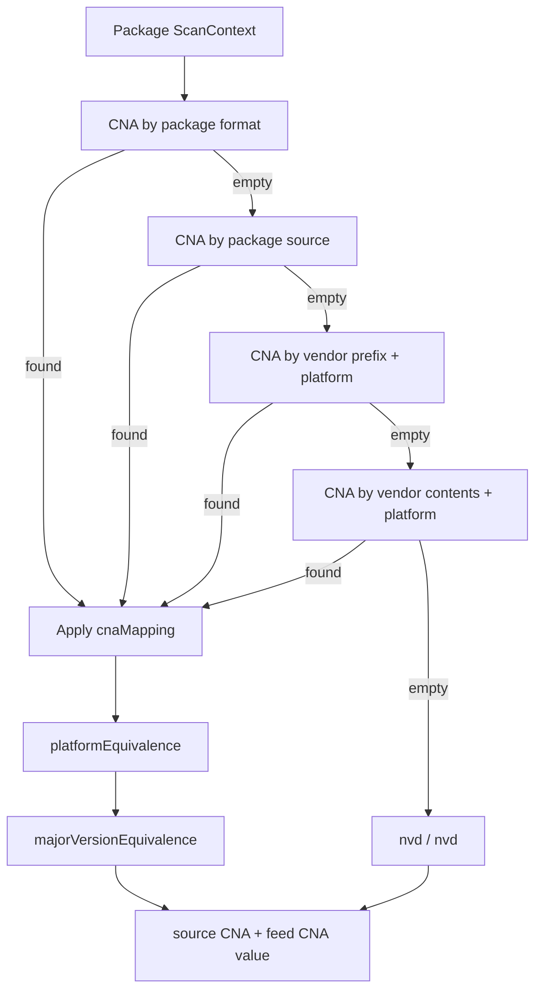
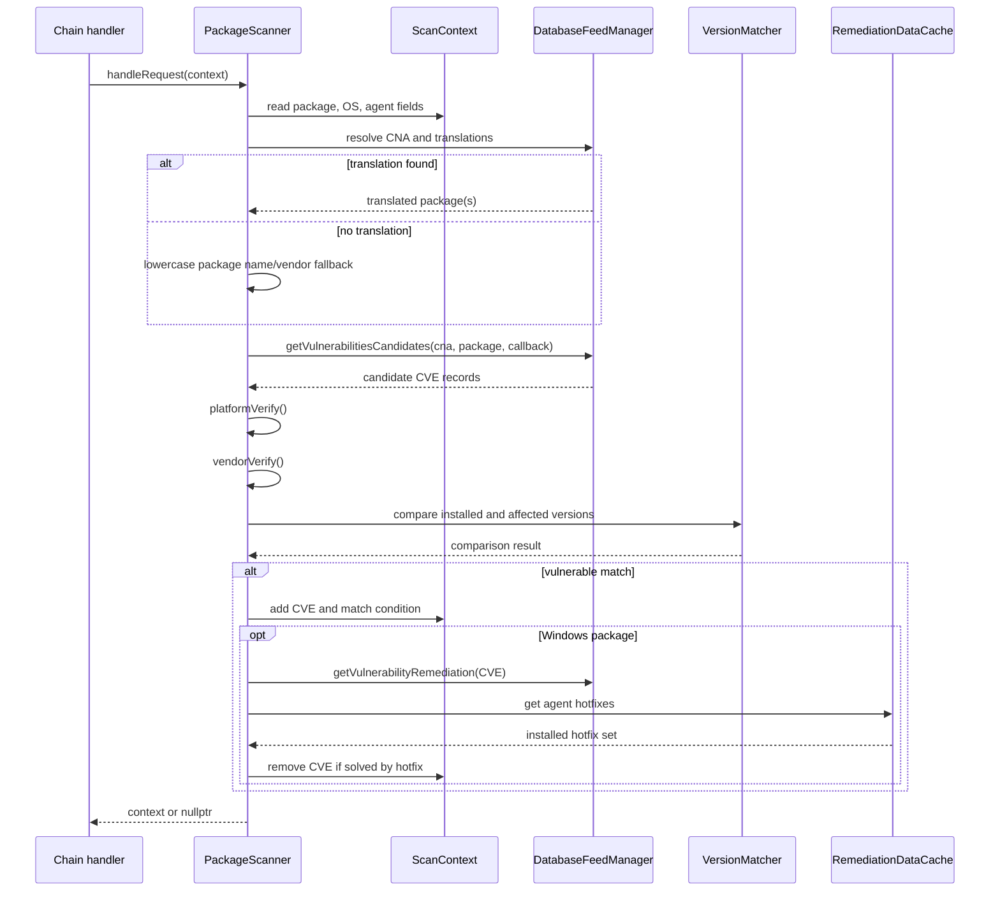
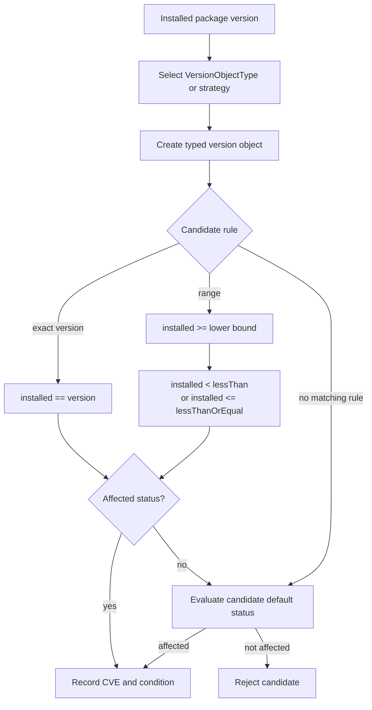
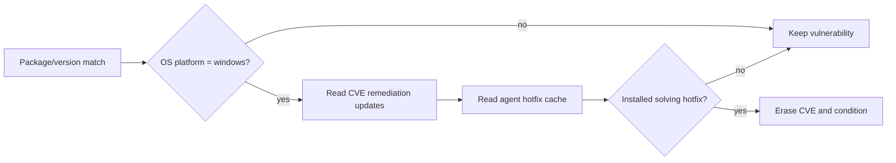
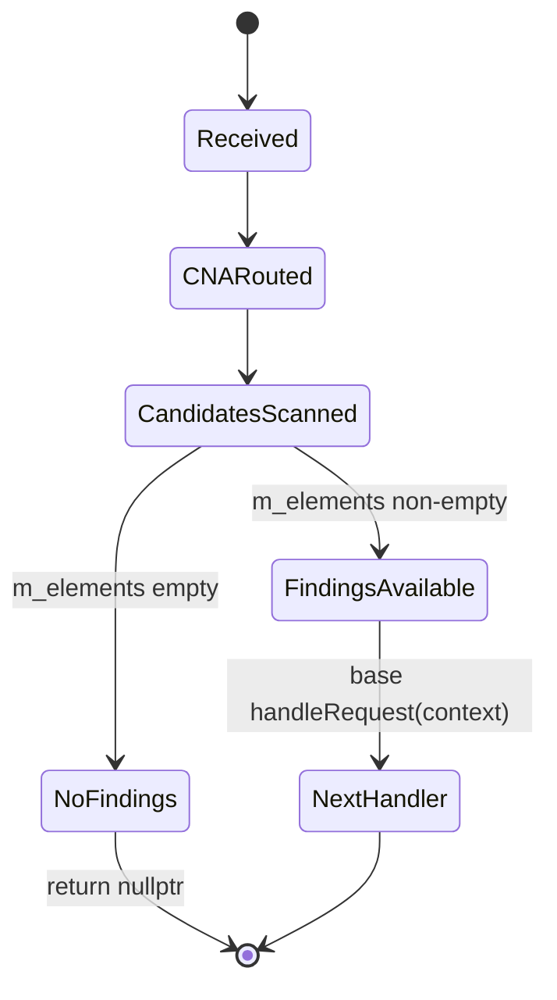

# Scan Orchestrator Package Scanner

## Introduction

The `scan_orchestrator_scanners_package` module implements the package side of Wazuh's vulnerability scan orchestrator. `TPackageScanner` receives one package and its agent-level scan context, selects the applicable CVE Numbering Authority (CNA), resolves package translations, retrieves vulnerability candidates from the feed, and applies platform, vendor, and version constraints. On Windows, an installed hotfix can remove an otherwise matching vulnerability from the result.

The scanner is a chain-of-responsibility handler. It either returns the enriched `ScanContext` to the next orchestrator stage or returns `nullptr` when no vulnerability remains. Feed storage and candidate retrieval belong to the [database feed manager](database_feed_manager.md); version parsing and comparison belong to the [version matcher](version_matcher.md); downstream indexing, reporting, and alert construction belong to the vulnerability scanner pipeline and alert-builder modules.

## Module location and public API

File: `src/wazuh_modules/vulnerability_scanner/src/scanOrchestrator/packageScanner.hpp`

| Symbol | Role |
|---|---|
| `TPackageScanner<...>` | Dependency-injectable package scanner handler. |
| `PackageScanner` | Default alias using `DatabaseFeedManager`, `ScanContext`, `GlobalData`, and `RemediationDataCache<>`. |
| `handleRequest(data)` | Selects CNA(s), scans the package, and forwards or terminates the chain. |
| `getCNA(ctx)` | Resolves the source CNA and the feed lookup value. |
| `packageScan(ctx, cna)` | Retrieves candidates and evaluates each candidate. |

The template parameters support unit testing and alternative implementations of feed access, context, global data, and remediation caching without changing scanner logic.

## Position in the vulnerability scanner



The scanner does not own feed ingestion, agent inventory collection, or alert serialization. See the [vulnerability scanner façade](vulnerability_scanner_facade.md) for lifecycle integration and the [database feed manager](database_feed_manager.md) for feed persistence and lookup details.

## Architecture

```mermaid
classDiagram
    class AbstractHandler~shared_ptr<ScanContext>~ {
      +handleRequest(data)
    }
    class TPackageScanner {
      -m_packageMap
      -m_databaseFeedManager
      -m_translationL1Cache
      +TPackageScanner(feedManager)
      +handleRequest(data)
      -getCNA(ctx)
      -packageScan(ctx, cna)
      -scanPackageTranslation(cna, package, ctx, callback)
      -platformVerify(package, candidate, ctx)
      -vendorVerify(package, candidate)
      -versionMatch(package, candidate, ctx)
      -packageHotfixSolved(package, candidate, ctx)
    }
    class DatabaseFeedManager
    class ScanContext
    class GlobalData
    class RemediationDataCache
    class VersionMatcher
    class AbstractHandler

    TPackageScanner --|> AbstractHandler
    TPackageScanner --> DatabaseFeedManager : candidate / translation / remediation lookup
    TPackageScanner --> ScanContext : reads package; writes CVE matches
    TPackageScanner --> GlobalData : CNA and platform mappings
    TPackageScanner --> RemediationDataCache : Windows hotfixes
    TPackageScanner --> VersionMatcher : typed version comparison
    AbstractHandler --> AbstractHandler : forwards to next handler
```

### Core state

`m_packageMap` maps package formats to either a concrete version-object type or a matcher strategy:

| Package format | Matching selection |
|---|---|
| `deb` | `VersionObjectType::DPKG` |
| `rpm` | `VersionObjectType::RPM` |
| `pypi` | `VersionObjectType::PEP440` |
| `npm` | `VersionObjectType::SemVer` |
| `pacman` | `VersionMatcherStrategy::Pacman` |
| `snap` | `VersionMatcherStrategy::Snap` |
| `pkg` | `VersionMatcherStrategy::PKG` |
| `apk` | `VersionMatcherStrategy::APK` |
| `win` | `VersionMatcherStrategy::Windows` |
| `macports` | `VersionMatcherStrategy::MacOS` |

Unknown formats use `VersionMatcherStrategy::Unspecified` through the version matcher. The cache `m_translationL1Cache` is an in-memory LRU with capacity `2048`; the feed manager supplies Level 2 translation data.

## CNA resolution

`getCNA()` returns a pair:

1. the selected CNA name (`m_vulnerabilitySource` source value); and
2. the actual feed lookup value after platform and major-version substitutions.

The lookup precedence is:



When a CNA mapping exists in `GlobalData::instance().cnaMappings()`, `$(PLATFORM)` and `$(MAJOR_VERSION)` are replaced using the corresponding equivalence maps. If no CNA can be resolved, both values default to `nvd`.

For the default lookup value, `handleRequest()` checks `GlobalData::instance().vendorMaps()` for `ADP_DEFAULT_ARRAY_KEY`. If present, the package is scanned once for every CNA in that array, preserving the configured priority order. Otherwise it scans only `nvd`.

## Package scan data flow



## Translation handling

`scanPackageTranslation()` first builds a Level 1 key:

```text
<osPlatform>_<vendor>_<packageName>
```

On an L1 hit, each cached `TranslatedData` record can replace the package product, vendor, and version. The translated package is then passed to `getVulnerabilitiesCandidates()`.

On an L1 miss, the scanner calls `getTranslationFromL2(package, osPlatform)` on the feed manager. Non-empty Level 2 results are scanned and moved into the L1 cache under the same key. If neither cache contains a translation, the original package is scanned after lowercasing its name and vendor.

Translation is an optimization and normalization step: failure to translate does not reject the package.

## Candidate validation and matching

For every candidate returned by the feed manager, the callback applies these gates in order:

### Duplicate-CVE priority

If the CVE already exists in `ScanContext::m_elements`, the candidate is skipped. This prevents a lower-priority CNA from replacing a result already found by a higher-priority CNA.

### Platform verification

If the candidate has platform restrictions, each platform is accepted when either:

- it is a CPE with operating-system part `o` and compares equal to the agent OS CPE through `ScannerHelper`; or
- it is a non-CPE OS codename equal to `ScanContext::osCodeName()`.

An empty candidate platform list imposes no platform restriction.

### Vendor verification

If the candidate specifies a vendor, the installed package must have a non-empty vendor and it must compare exactly with the candidate vendor. A missing or mismatched vendor rejects the candidate.

### Version verification

`versionMatch()` creates a typed version object using the package-format map and evaluates every candidate version rule:



Exact rules require equality. Range rules use an inclusive lower bound; the upper bound is exclusive for `lessThan` and inclusive for `lessThanOrEqual`. A lower bound of `0` is treated as unbounded, and `lessThan == "*"` is treated as an open upper bound. If no rule matches, `defaultStatus` determines whether the package is vulnerable.

When a match is recorded:

- `m_elements[cveId]` receives an empty JSON object;
- `m_matchConditions[cveId]` records `Equal`, `LessThan`, `LessThanOrEqual`, or `DefaultStatus`; and
- `m_cnaDetectionSource[cveId]` records the CNA that produced the match.

The scanner catches exceptions per candidate, logs the failure, and continues scanning other candidates.

## Windows hotfix suppression

After a version match on Windows, `packageHotfixSolved()` obtains remediation metadata for the CVE from the feed manager. It then reads the agent's installed hotfix set from `RemediationDataCache`. If any remediation update is installed, the CVE and its match condition are erased from the scan context.



No remediation data, no agent hotfixes, or no matching installed hotfix leaves the vulnerability in the result.

## Chain completion behavior

`handleRequest()` stores the CNA pair in `data->m_vulnerabilitySource`, scans one or more CNA values, and logs completion. If `m_elements` is empty, it returns `nullptr`, terminating this package path. Otherwise it calls `AbstractHandler::handleRequest()` with the context, allowing the next handler to process the findings.



## Dependencies and related documentation

| Dependency | Relationship | Documentation |
|---|---|---|
| `DatabaseFeedManager` | CNA lookup, translations, candidate CVEs, remediation FlatBuffers | [database feed manager](database_feed_manager.md) |
| `ScanContext` | Package/OS input and mutable CVE output | [vulnerability scanner façade](vulnerability_scanner_facade.md) |
| `GlobalData` | CNA, vendor, platform, and version-equivalence maps | [database feed manager](database_feed_manager.md) |
| `VersionMatcher` | Package-format-aware parsing and comparison | [version matcher](version_matcher.md) |
| `ScannerHelper` | CPE parsing and comparison | `src/wazuh_modules/vulnerability_scanner/src/scanOrchestrator/scannerHelper.hpp` |
| `RemediationDataCache` | Installed Windows hotfix lookup | [vulnerability scanner façade](vulnerability_scanner_facade.md) |
| Alert builders | Consume the resulting CVE/match context | [scan orchestrator alert builders](scan_orchestrator_alert_builders.md) |
| Inventory operations | Maintain package and hotfix inventory used by scans | [scan orchestrator inventory operations](scan_orchestrator_inventory_ops.md) |

The scanner-helper and data-cache headers are direct dependencies without standalone overview pages in this documentation set. The alert-builder and inventory-operation links lead to the available module overviews; their child pages contain implementation-specific details.

## Maintenance considerations

- Keep CNA precedence and `ADP_DEFAULT_ARRAY_KEY` behavior aligned with feed-map generation.
- Add a package format to `m_packageMap` only with matching parser/strategy support in the [version matcher](version_matcher.md).
- Preserve the L1 cache key format when changing translation matching; changing it can affect cache hit behavior and memory use.
- Keep platform and vendor checks before version comparison to avoid unnecessary feed traversal.
- When changing match conditions, update downstream alert and resolved-CVE consumers rather than duplicating their behavior here.
- Test exact versions, open ranges, default statuses, duplicate CVEs, translation hits/misses, CPE/codename platform checks, vendor mismatches, and Windows hotfix suppression.
