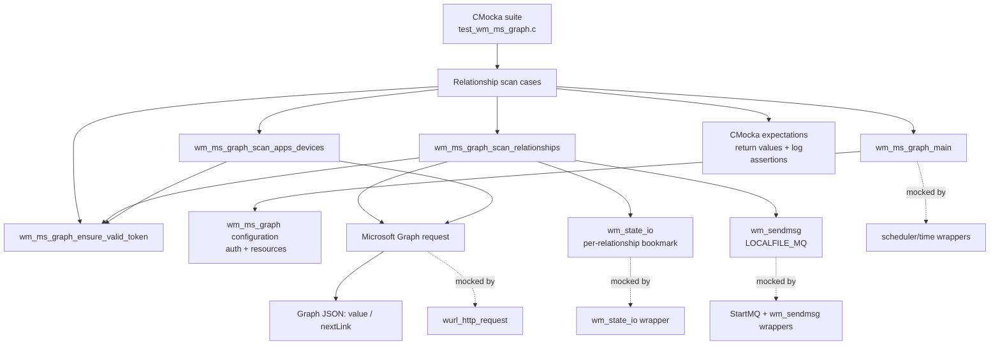
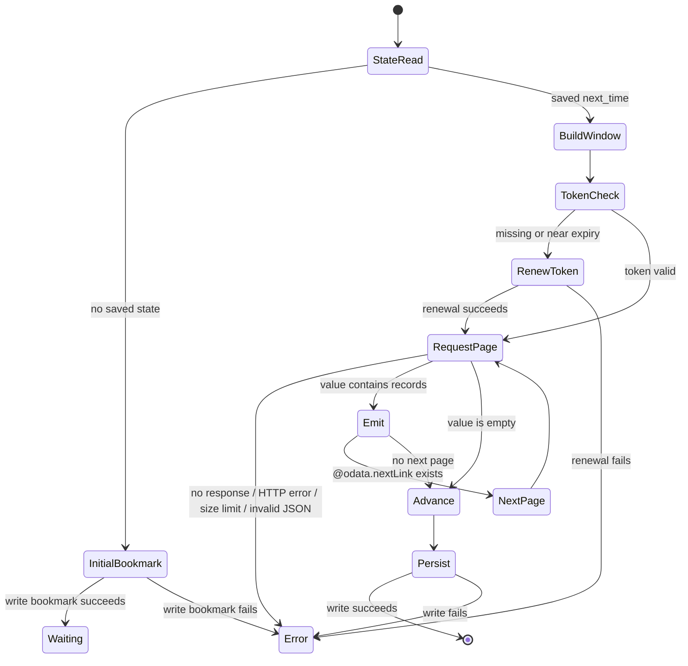
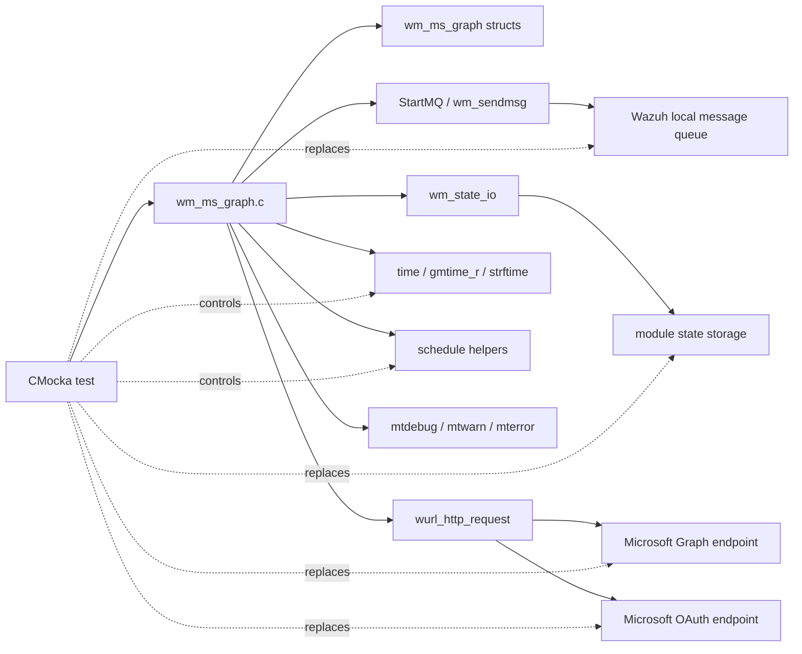

# `scan_relationships_tests`

## Purpose

`scan_relationships_tests` documents the CMocka coverage for the Microsoft Graph relationship-scanning path in `src/unit_tests/wazuh_modules/ms_graph/test_wm_ms_graph.c`. The tests exercise the production implementation included from `../../wazuh_modules/wm_ms_graph.c`, while replacing network, queue, scheduler, state, time, and logging boundaries with deterministic wrappers.

The module verifies that Wazuh can initialize a relationship scan, maintain a per-relationship bookmark, renew Microsoft Graph tokens, page through Graph responses, enrich application records with managed-device data, and forward normalized records to the Wazuh message queue. It also verifies the principal failure contracts without requiring Microsoft Graph, a running queue, or persisted module state.

For the broader integration, configuration parsing, and token acquisition suite, see [`wm_ms_graph_tests_test_infrastructure.md`](wm_ms_graph_tests_test_infrastructure.md). Shared scheduler behavior is described in [`test_schedule_scan.md`](test_schedule_scan.md).

## Position in the system

The test target sits below the Wazuh modules daemon and above three external boundaries: Microsoft Graph HTTPS, module state storage, and the local analysis queue. The production module is responsible for translating configured `(tenant, resource, relationship)` tuples into incremental Graph scans.



The unit tests compile the production implementation into the test translation unit. This keeps control-flow coverage close to production code, but means that changes to internal structures or static helpers can require coordinated fixture updates.

## Components and responsibilities

| Component | Responsibility in the tested path |
|---|---|
| `wm_ms_graph_main` | Validates runtime configuration, starts the queue, initializes scheduling, and dispatches configured relationship scans. |
| `wm_ms_graph_scan_relationships` | Iterates resources and relationships, loads or creates bookmark state, constructs Graph URLs, handles pagination, emits records, and persists the next bookmark. |
| `wm_ms_graph_ensure_valid_token` | Treats a missing or near-expiry token as invalid, obtains a replacement, and reports whether request headers must change. |
| `wm_ms_graph_scan_apps_devices` | Performs the related `managedDevices` lookup used by application/device enrichment and returns the collected JSON array. |
| `wm_state_io` | Persists independent state for each tenant/resource/relationship combination. |
| `wurl_http_request` | Represents both the OAuth token request and Graph relationship requests. Tests script status, body, headers, and maximum-size results. |
| `wm_sendmsg` | Represents delivery into the local Wazuh message queue. A send failure is logged and subsequent records can still be processed. |
| CMocka setup/teardown | Allocates nested auth/resource/relationship fixtures and releases them through `wm_ms_graph_destroy`. |

### Persistent state

The state key is assembled as:

```text
ms-graph-<tenant>-<resource>-<relationship>
```

Each relationship therefore advances independently. A missing state record does not immediately query historical data: the implementation creates a bookmark and waits for the configured scan interval before the first scan. The `only_future_events` and `initial` inputs select this initial-bookmark behavior. Successful scans advance the bookmark to the end of the queried time window, even when the response contains no records.



## Data flow

```mermaid
sequenceDiagram
    participant T as Test case
    participant S as wm_ms_graph_scan_relationships
    participant ST as State wrapper
    participant TK as Token helper
    participant G as wurl_http_request
    participant Q as wm_sendmsg

    T->>S: tenant + configured resources + initial flag
    S->>ST: Read relationship bookmark
    ST-->>S: saved next_time or missing state
    alt Missing bookmark
        S->>ST: Write initial bookmark
        S-->>T: log delay; no Graph request
    else Existing bookmark
        S->>S: Build time window or initial resource URL
        S->>TK: Ensure token is valid
        TK-->>S: existing token or renewed token
        S->>G: GET Graph URL with Authorization header
        G-->>S: status, body, pagination link, size flag
        loop Each returned record and each nextLink page
            S->>S: Add integration/resource/relationship fields
            opt detectedApps relationship
                S->>G: GET related managedDevices
                G-->>S: related records
                S->>S: Attach managedDevices array
            end
            S->>Q: Send JSON through LOCALFILE_MQ
        end
        S->>ST: Write end-of-window bookmark
    end
```

The test harness asserts both values and interaction order where behavior depends on sequencing. For example, token-renewal tests verify that the subsequent Graph request carries `Authorization: Bearer new_token`; pagination tests verify that `@odata.nextLink` becomes the next URL; and state tests verify that the bookmark write follows record processing.

## Test scenarios

| Test | Scenario and contract |
|---|---|
| `test_main_relationships` | Main-loop integration: queue and scheduler initialization succeed, missing relationship state is initialized, and the configured relationship is dispatched. |
| `test_wm_ms_graph_scan_relationships_single_initial_only_no` | Initial scan with `only_future_events=no` creates a bookmark and waits for the first interval without querying Graph. |
| `test_wm_ms_graph_scan_relationships_single_initial_only_yes_fail_write` | The same initial-state path reports `Couldn't save running state.` when persistence fails. |
| `test_wm_ms_graph_scan_relationships_single_no_initial_no_timestamp` | A non-initial invocation with no timestamp still establishes state and delays the first scan. |
| `test_wm_ms_graph_scan_relationships_single_initial_only_no_next_time_no_response` | A saved timestamp creates a bounded Graph time-window request; an absent HTTP response is warned and does not emit data. |
| `test_wm_ms_graph_scan_relationships_single_unsuccessful_status_code` | HTTP 400 is surfaced with status and response body. |
| `test_wm_ms_graph_scan_relationships_single_reached_curl_size` | A response-size limit aborts processing and advises increasing `curl_max_size`. |
| `test_wm_ms_graph_scan_relationships_single_failed_parse` | Malformed Graph JSON is rejected with a parse warning. |
| `test_wm_ms_graph_scan_relationships_single_no_logs` | `{"value":[]}` produces “No new logs received.” and still advances/persists the bookmark. |
| `test_wm_ms_graph_scan_relationships_single_success_one_log` | One Graph record is wrapped as an `ms-graph` integration event, queued, and followed by state persistence. |
| `test_wm_ms_graph_scan_relationships_single_success_two_logs` | Multiple records are emitted; a queue failure is logged, related managed devices are fetched, and pagination/enrichment continue. |
| `test_wm_ms_graph_scan_relationships_single_success_two_pages` | `@odata.nextLink` is followed and records from both pages are emitted. |
| `test_wm_ms_graph_scan_relationships_single_success_two_resources` | Two resources use separate state keys and requests; a failure writing the second resource’s state is isolated and logged. |
| `test_wm_ms_graph_scan_relationships_renew_token` | Near-expiry token renewal occurs before the relationship request and the renewed token is used to send the record. |
| `test_wm_ms_graph_scan_apps_devices_renew_token` | The app/device helper renews an expired token, updates its caller-owned header, and returns related data. |

The source file also registers configuration, startup, dump, and OAuth-token tests in the same executable. Those cases are intentionally referenced rather than repeated here; see [`wm_ms_graph_tests_test_infrastructure.md`](wm_ms_graph_tests_test_infrastructure.md) for the complete harness scope.

## Error and observability contracts

The tests treat logs as part of the observable API. Important categories are:

- `mtinfo`: token renewal begins.
- `mtdebug1`: generated OAuth/Graph URLs and bookmark scheduling decisions.
- `mtdebug2`: emitted messages and empty-result notifications.
- `mtwarn`: network absence, unsuccessful status, response truncation, parse failure, incomplete token data, and renewal failure.
- `mterror`: state persistence failure and queue access failure.

Network failures do not become fabricated events. Invalid or truncated responses stop the current relationship scan. A queue send failure is reported with the queue path and error string; the multi-record tests demonstrate that processing can continue for later records or pages. A state-write failure is reported after processing and is kept distinct from Graph response failures.

## Dependency and isolation model



The wrappers are not merely convenience mocks: they define the module’s boundary contracts. When changing production code, update expectations for URL construction, header ownership, state tags, response cleanup, and log wording together. Keep fixture ownership explicit because resources contain nested names and relationship arrays.

## Maintenance guidance

When adding a relationship behavior, extend the matrix with at least one successful case and one boundary/error case. Prefer asserting the externally meaningful contract—Graph URL, authorization header, emitted JSON, state key, and log category—over private local variables. For pagination or enrichment changes, retain cases that prove the loop continues after a queue failure and that each relationship persists state independently.

The test group is registered in `tests_with_startup[]` and executed by `cmocka_run_group_tests`. The neighboring no-startup group covers parsing and validation fixtures; it is not part of the scan state-machine coverage described above.

## Related documentation

- [`wm_ms_graph_tests_test_infrastructure.md`](wm_ms_graph_tests_test_infrastructure.md) — complete Microsoft Graph test harness, fixtures, wrappers, and suite scope.
- [`test_schedule_scan.md`](test_schedule_scan.md) — scheduler fixtures and timing abstractions used by module tests.
- [`wazuh_modules_core_cloud_integrations_ms_graph.md`](wazuh_modules_core_cloud_integrations_ms_graph.md) — production Microsoft Graph integration and configuration reference.
- [`Wazuh_Modules_Daemon_(C).md`](Wazuh_Modules_Daemon_%28C%29.md) — broader modules-daemon lifecycle and integration context.
