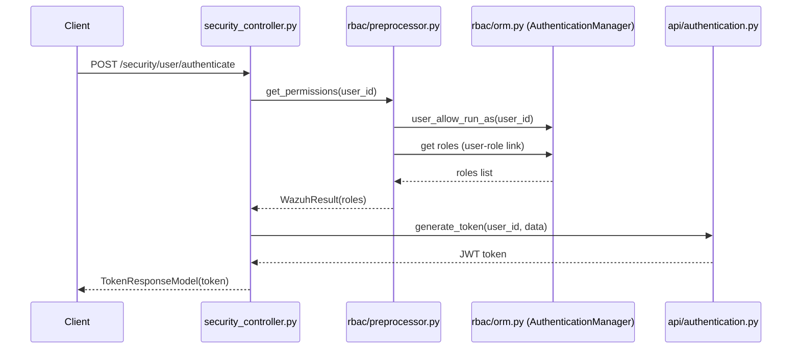
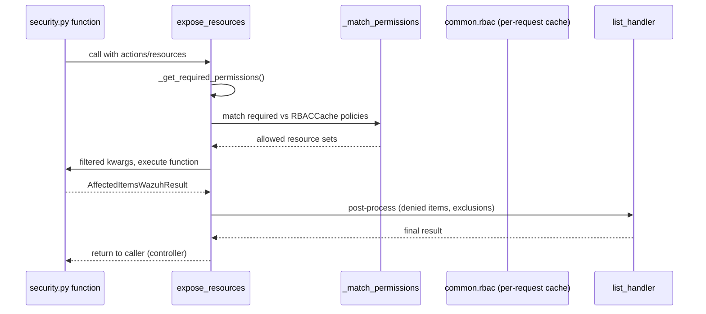
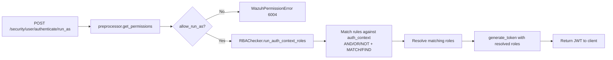
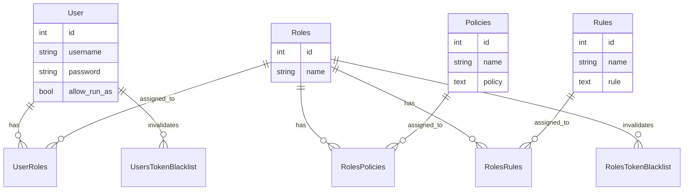

# Security & RBAC Module

## 1. Introduction and Purpose

The **Security & RBAC Module** is the authentication and authorization subsystem of the Wazuh API/Framework. It is
responsible for:

- **Authentication**: issuing and validating JWT access tokens for API users (password-based login and
  authorization-context/`run_as` login).
- **User management**: creating, updating, and deleting internal Wazuh API users.
- **Role-Based Access Control (RBAC)**: defining **Users**, **Roles**, **Rules**, and **Policies** and the
  many-to-many relationships between them, and using this information to determine which actions/resources a given
  user is allowed to operate on.
- **Authorization-context matching**: evaluating rules written as logical expressions (`AND`/`OR`/`NOT`,
  `MATCH`/`MATCH$`/`FIND`/`FIND$`) against an external authorization context (e.g., data coming from an LDAP/SAML
  provider) in order to dynamically assign roles to a user at login time (`run_as`).
- **Persistence**: storing all RBAC entities (users, roles, rules, policies and their relationships) and token
  invalidation rules in a dedicated SQLite database (`rbac.db`), including schema migration between Wazuh versions.
- **CLI Administration**: a command line tool (`rbac_control.py`) to reset the RBAC database or restore default
  user passwords.

This module underpins **every** protected endpoint of the Wazuh API: any framework function decorated with
`@expose_resources(...)` (used pervasively across the [agent](agent_module_core.md),
[manager](manager_module.md), [cluster](cluster_module.md), and other modules) relies on the RBAC engine defined
here to resolve the effective set of resources a request is allowed to touch.

## 2. Architecture Overview

The module is organized into four cooperating layers: the **API layer** (Connexion controllers and Swagger
models), the **Service layer** (business logic orchestrating RBAC operations and coordinating with the
[Cluster / Distributed API](cluster_dapi.md)), the **RBAC Engine** (authorization-context matching, the
`expose_resources` decorator, and permission preprocessing), and the **Persistence layer** (SQLAlchemy ORM models
and database managers backed by SQLite). A standalone **CLI tool** operates directly against the service layer for
administrative tasks.

```mermaid
graph TB
    subgraph "Client"
        C[API Client / wazuh-dashboard]
    end

    subgraph "API Layer"
        SC[security_controller.py<br/>Connexion endpoints]
        MODELS[Pydantic-like Models<br/>PolicyModel, RoleModel, RuleModel,<br/>UpdateUserModel, SecurityConfigurationModel,<br/>TokenResponseModel]
    end

    subgraph "Service Layer"
        SEC[framework/wazuh/security.py<br/>expose_resources-decorated functions]
        CORESEC[framework/wazuh/core/security.py<br/>revoke_tokens, check_relationships,<br/>rbac_db_factory_reset]
    end

    subgraph "RBAC Engine"
        DEC[rbac/decorators.py<br/>expose_resources / async_list_handler]
        PRE[rbac/preprocessor.py<br/>PreProcessor, get_permissions]
        AUTHCTX[rbac/auth_context.py<br/>RBAChecker]
    end

    subgraph "Persistence Layer"
        ORM[rbac/orm.py<br/>User, Roles, Rules, Policies,<br/>Managers, DatabaseManager]
        DB[(rbac.db - SQLite)]
    end

    subgraph "CLI"
        CLI[scripts/rbac_control.py]
    end

    C -->|HTTP request + JWT| SC
    SC --> MODELS
    SC -->|DistributedAPI dispatch| SEC
    SEC --> DEC
    SEC --> CORESEC
    DEC --> PRE
    PRE --> AUTHCTX
    AUTHCTX --> ORM
    DEC --> ORM
    SEC --> ORM
    CORESEC --> ORM
    ORM --> DB
    CLI --> SEC
    CLI --> CORESEC

    classDef api fill:#4A90D9,color:#fff
    classDef svc fill:#50B848,color:#fff
    classDef engine fill:#F5A623,color:#fff
    classDef persist fill:#9B59B6,color:#fff
    classDef cli fill:#E74C3C,color:#fff
    class SC,MODELS api
    class SEC,CORESEC svc
    class DEC,PRE,AUTHCTX engine
    class ORM,DB persist
    class CLI cli
```

### Relationship to other modules

- The [API Core Infrastructure](api_core_infrastructure_auth_config.md) module handles JWT decoding/validation
  (`authentication.py`) and consumes `RBACManager`/`TokenManager` data (via this module) at request time in
  middlewares.
- The [Cluster module](cluster_dapi.md) `DistributedAPI` class is used by `security_controller.py` to dispatch RBAC
  operations to the master node in a Wazuh cluster.
- `rbac/decorators.py` expands wildcard resources by calling into the [Agent module](agent_module_core.md)
  (`get_agents_info`, `get_groups`, `expand_group`) and into the [Rule](rule_module_details_business_logic.md) /
  [CDB list](cdb_list_module.md) modules (`expand_rules`, `expand_lists`, `expand_decoders`) to resolve `*`
  wildcards against real system resources.
- [Framework Core Utilities](framework_core_utils.md) (`wazuh.core.common`, `wazuh.core.results`) provide shared
  primitives (`AffectedItemsWazuhResult`, `WazuhResult`, context-local variables such as `rbac`, `broadcast`) used
  throughout this module.

## 3. Sub-Modules

The Security & RBAC module is split into the following documented sub-modules:

| Sub-module | Description | Documentation |
|---|---|---|
| **API Layer** | Connexion controller endpoints and request/response models for authentication, users, roles, rules, policies and security configuration. | [security_rbac_module_api.md](security_rbac_module_api.md) |
| **Service Layer** | Framework-level business logic (`wazuh.security`, `wazuh.core.security`) that implements CRUD operations over RBAC entities and coordinates token invalidation. | [security_rbac_module_service.md](security_rbac_module_service.md) |
| **RBAC Engine** | The `expose_resources` decorator, permission preprocessing, and the `RBAChecker` authorization-context matching engine that together compute effective per-request permissions. | [security_rbac_module_engine.md](security_rbac_module_engine.md) |
| **Persistence Layer (ORM)** | SQLAlchemy models, table managers (Users/Roles/Rules/Policies/Token blacklist) and the `DatabaseManager` responsible for schema creation and migration of `rbac.db`. | [security_rbac_module_orm.md](security_rbac_module_orm.md) |
| **CLI Administration** | The `rbac_control.py` command line tool for resetting the RBAC database or restoring default user passwords. | [security_rbac_module_cli.md](security_rbac_module_cli.md) |

## 4. High-Level Data Flow

### 4.1 Login flow (password-based)



### 4.2 Authorization check flow (`expose_resources`)



### 4.3 `run_as` / authorization-context login



## 5. Core Entities and Relationships



## 6. Key Design Points

- **RBAC modes**: the system supports `white` (deny by default, only explicitly allowed resources are granted) and
  `black` (allow by default, only explicitly denied resources are removed) modes, configurable via
  `SecurityConfigurationModel`.
- **Reserved/admin resources**: IDs `<= MAX_ID_RESERVED` (99) are reserved for default Wazuh users, roles, rules and
  policies, and most delete/update operations on them are blocked (`SecurityError.ADMIN_RESOURCES`).
- **Token invalidation**: rather than actively revoking JWTs, the system stores "invalidation rules"
  (`UsersTokenBlacklist`, `RolesTokenBlacklist`, `RunAsTokenBlacklist`) with an `nbf_invalid_until` timestamp; any
  token issued before that timestamp is considered invalid.
- **Database migration**: `check_database_integrity()` in the ORM sub-module transparently upgrades the RBAC SQLite
  schema and re-links custom/default relationships when the product version changes.

## 7. Further Reading

- [security_rbac_module_api.md](security_rbac_module_api.md) — API controllers and Swagger models.
- [security_rbac_module_service.md](security_rbac_module_service.md) — Framework business logic.
- [security_rbac_module_engine.md](security_rbac_module_engine.md) — RBAC decorator, preprocessing and auth-context matching.
- [security_rbac_module_orm.md](security_rbac_module_orm.md) — Database schema, managers and migration.
- [security_rbac_module_cli.md](security_rbac_module_cli.md) — CLI administration tool.
- [api_core_infrastructure_auth_config.md](api_core_infrastructure_auth_config.md) — JWT decoding and authentication middleware.
- [cluster_dapi.md](cluster_dapi.md) — Distributed API dispatch used by the security controller.
- [agent_module_core.md](agent_module_core.md) — Agent resource expansion used by the RBAC decorator.
- [framework_core_utils.md](framework_core_utils.md) — Shared result types and context-local variables.
