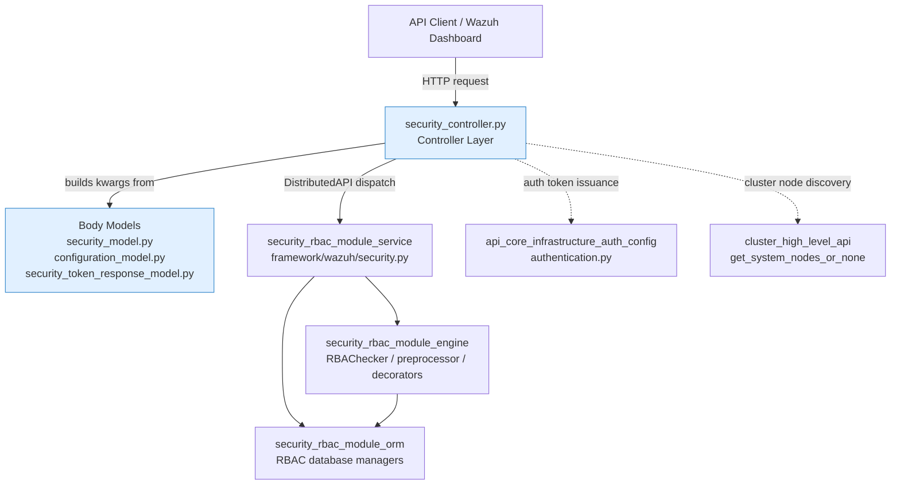
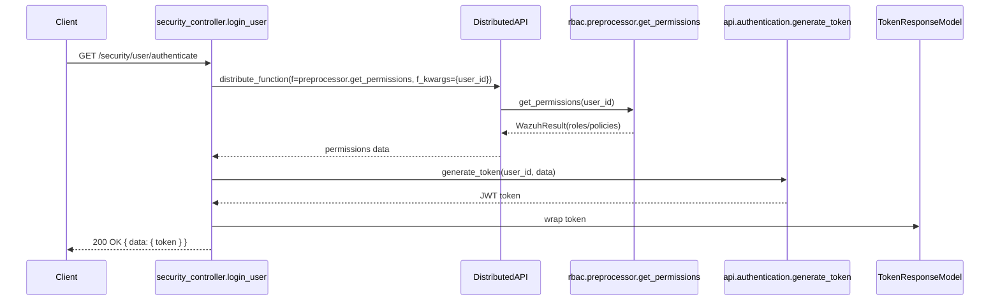
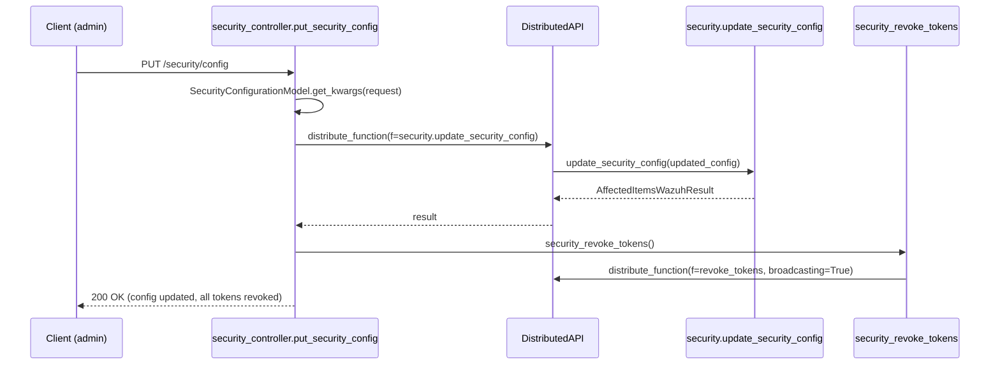
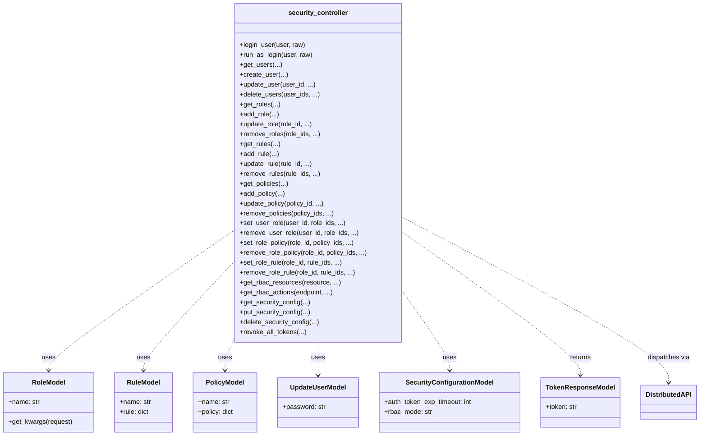

# Security & RBAC Module — API Layer

## 1. Introduction and Purpose

The **`security_rbac_module_api`** is the HTTP-facing sub-module of Wazuh's broader **Security & RBAC** subsystem. It exposes the REST endpoints that manage authentication, users, roles, rules and policies, and it defines the request/response data contracts (models) used by those endpoints.

This module is intentionally thin: it is responsible for **HTTP concerns only** — parsing/validating incoming requests, building keyword-argument payloads, dispatching work to the cluster-aware business layer via the Distributed API (`DistributedAPI`), and serializing the results back to JSON/plain-text HTTP responses. All actual RBAC business logic (permission evaluation, database access, token issuance rules) lives in sibling sub-modules described below.

Typical responsibilities covered here:
- Authenticating users and issuing JWT access tokens (basic login, deprecated login, and "run as"/authorization-context login).
- CRUD operations on **users**, **roles**, **rules**, and **policies**.
- Managing relationships between these entities (assigning roles to users, policies to roles, rules to roles).
- Exposing introspection endpoints for available RBAC **actions** and **resources**.
- Reading/updating/restoring the global **security configuration** (e.g., token expiration timeout, RBAC mode) and triggering a global token revocation when that configuration changes.
- Revoking all active tokens on demand (logout, admin-triggered revocation).

## 2. Architecture Overview

The module sits directly on top of the Distributed API mechanism common to all Wazuh API controllers, and it forwards nearly every call to the `security_rbac_module_service` layer (`framework/wazuh/security.py`), which in turn coordinates with the RBAC engine and the RBAC ORM layer.

**Key architectural facts:**
- The controller module (`security_controller.py`) never talks to the database directly; every function builds an `f_kwargs` dictionary and hands it, together with the target business function (e.g., `security.add_policy`), to a `DistributedAPI` instance. This allows the same controller code to run transparently on a single node or be broadcast/routed across a cluster (see [cluster_api_controller.md](cluster_api_controller.md) and [cluster_dapi.md](cluster_dapi.md) for the distribution mechanism).
- RBAC permission checks are enforced declaratively by passing `rbac_permissions=request.context['token_info']['rbac_policies']` into each `DistributedAPI` call — the actual enforcement happens inside the engine layer (`security_rbac_module_engine`), not in this module.
- Authentication/login endpoints call `generate_token` (from `api_core_infrastructure_auth_config`, see [api_core_infrastructure_auth_config.md](api_core_infrastructure_auth_config.md)) after first fetching the user's permission set via `preprocessor.get_permissions` (part of `security_rbac_module_engine`).
- Configuration changes (`put_security_config` / `delete_security_config`) always trigger a follow-up **global token revocation** across the cluster to force re-authentication under the new settings.

## 3. Sub-modules / Components of this Documentation Unit

Because this module is small and cohesive (a single controller file plus three small model files, all serving the same HTTP surface), it is documented as **one self-contained unit** rather than split into further sub-module pages. Its two logical halves are:

### 3.1 Controller Layer — `api/api/controllers/security_controller.py`
Implements all async endpoint handler functions. Grouped by responsibility:

| Group | Functions |
|---|---|
| Authentication / Tokens | `login_user`, `deprecated_login_user`, `run_as_login`, `logout_user`, `revoke_all_tokens`, `security_revoke_tokens` (internal helper) |
| Current user info | `get_user_me`, `get_user_me_policies` |
| User management | `get_users`, `create_user`, `update_user`, `delete_users`, `edit_run_as` |
| Role management | `get_roles`, `add_role`, `update_role`, `remove_roles` |
| Rule management | `get_rules`, `add_rule`, `update_rule`, `remove_rules` |
| Policy management | `get_policies`, `add_policy`, `update_policy`, `remove_policies` |
| Relationship management | `set_user_role`, `remove_user_role`, `set_role_policy`, `remove_role_policy`, `set_role_rule`, `remove_role_rule` |
| RBAC introspection | `get_rbac_resources`, `get_rbac_actions` |
| Security configuration | `get_security_config`, `put_security_config`, `delete_security_config` |

All handlers follow the same pattern:
1. (Optionally) validate the request body content-type and build a Pydantic-like model via `<Model>.get_kwargs(request)`.
2. Assemble `f_kwargs` (function keyword arguments) — including pagination/sorting/search parameters parsed via `api_core_infrastructure_request_utils` (`parse_api_param`) for list endpoints.
3. Instantiate `DistributedAPI(f=<business_function>, f_kwargs=..., rbac_permissions=..., ...)`.
4. `await dapi.distribute_function()` and unwrap exceptions with `raise_if_exc`.
5. Return a `json_response(data, pretty=pretty)` or, for login endpoints, a raw/JSON `ConnexionResponse` carrying the token.

### 3.2 Data Models — `api/api/models/*.py`

| File | Class(es) | Purpose |
|---|---|---|
| `security_model.py` | `RoleModel`, `RuleModel`, `PolicyModel`, `UpdateUserModel` (extends `CreateUserModel`) | Request-body schemas for creating/updating roles, rules, policies, and users. Each model declares `swagger_types`/`attribute_map` and exposes typed properties consumed by `Body.get_kwargs()`. |
| `configuration_model.py` | `SecurityConfigurationModel` | Request-body schema for `auth_token_exp_timeout` and `rbac_mode`, used by `put_security_config`/`delete_security_config`. |
| `security_token_response_model.py` | `TokenResponseModel` | Response schema wrapping the issued JWT (`token` field), used by all three login endpoints. |

These models are thin data-transfer objects — they carry no business logic and rely on the shared base model utilities described in [api_core_infrastructure_models.md](api_core_infrastructure_models.md) (`Body`, `Model`, `AllOf`, `Data`, `Items`).

## 4. Request Flow Example — Login

## 5. Request Flow Example — Updating Security Configuration

## 6. Relationship to Other Modules in the Security & RBAC Subsystem

This API layer is the entry point for a larger subsystem. The full picture:

| Sub-module | Responsibility | Documentation |
|---|---|---|
| **security_rbac_module_api** (this module) | HTTP controllers & request/response models | *this file* |
| **security_rbac_module_service** | Business logic invoked by the controllers (`framework/wazuh/security.py`, `framework/wazuh/core/security.py`) — validates input, talks to the ORM, builds `AffectedItemsWazuhResult` | [security_rbac_module_service.md](security_rbac_module_service.md) |
| **security_rbac_module_engine** | RBAC evaluation engine: `RBAChecker` (authorization-context matching), `preprocessor.get_permissions`, `async_list_handler` decorator | [security_rbac_module_engine.md](security_rbac_module_engine.md) |
| **security_rbac_module_orm** | SQLAlchemy-based persistence layer for users, roles, rules, policies and their relations, plus token blacklists | [security_rbac_module_orm.md](security_rbac_module_orm.md) |
| **security_rbac_module_cli** | `rbac_control` administrative CLI script (reset DB, restore default passwords) | [security_rbac_module_cli.md](security_rbac_module_cli.md) |

Related infrastructure consumed by this module (documented elsewhere):
- [api_core_infrastructure_auth_config.md](api_core_infrastructure_auth_config.md) — `check_token`, `decode_token`, `generate_token` used for issuing/validating JWTs.
- [api_core_infrastructure_models.md](api_core_infrastructure_models.md) — shared `Body`/`Model` base classes and JSON encoder.
- [api_core_infrastructure_request_utils.md](api_core_infrastructure_request_utils.md) — `parse_api_param` used for pagination/sort/search query parsing.
- [api_core_infrastructure_middleware.md](api_core_infrastructure_middleware.md) — rate limiting / blocked-IP / access-logging middleware that wraps every request before it reaches these controllers.
- [cluster_dapi.md](cluster_dapi.md) and [cluster_high_level_api.md](cluster_high_level_api.md) — the `DistributedAPI` dispatch mechanism and `get_system_nodes_or_none` used to broadcast token revocation across a cluster.

## 7. Component Interaction Diagram

## 8. Notes for Maintainers
- **No direct DB or RBAC-logic changes should be made in this module.** If you need to change how permissions are computed or how entities are persisted, modify `security_rbac_module_service`, `security_rbac_module_engine`, or `security_rbac_module_orm` instead — this module should remain a pure HTTP adapter.
- All "bulk delete" endpoints (`delete_users`, `remove_roles`, `remove_rules`, `remove_policies`, `remove_user_role`, `remove_role_policy`, `remove_role_rule`) special-case the literal string `'all'` in the ID list to signal "delete everything," converting it to `None` before dispatch.
- `deprecated_login_user` is kept for backward compatibility and is marked with `@deprecate_endpoint`; new integrations should use `login_user`.
- Any change to the security configuration (`put_security_config`, `delete_security_config`) **must** continue to call `security_revoke_tokens()` afterward to avoid leaving stale tokens valid under a new configuration.
