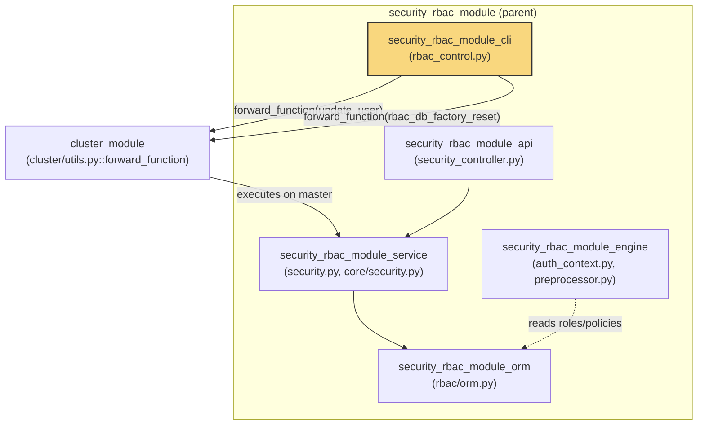
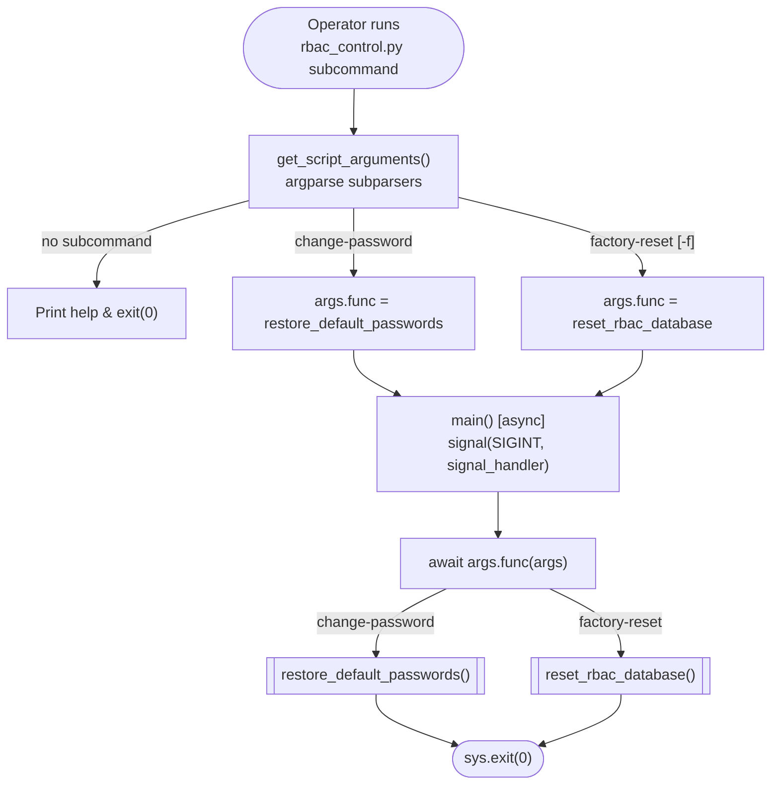
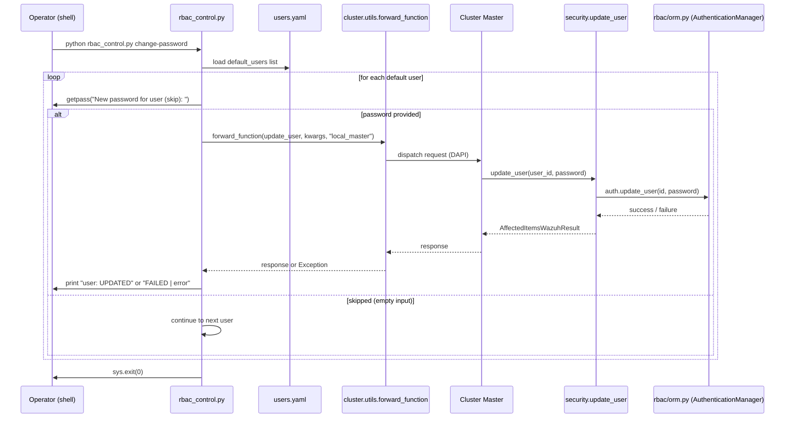
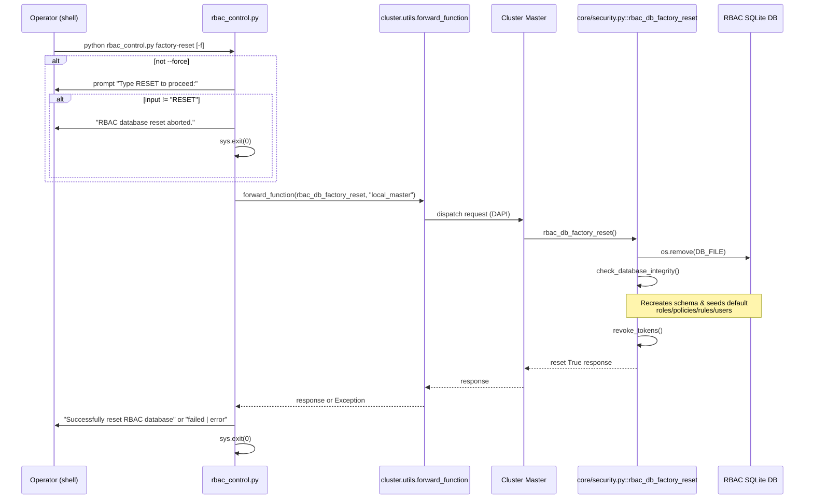
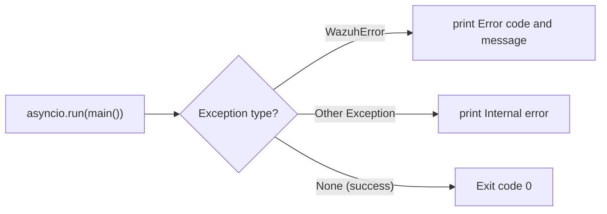

# RBAC CLI Administration Tool (`security_rbac_module_cli`)

## Introduction

The `security_rbac_module_cli` module provides the **command-line administration interface** for Wazuh's Role-Based Access Control (RBAC) subsystem. It is implemented as a single standalone script, `framework/scripts/rbac_control.py`, that system administrators run directly on a Wazuh manager to perform two critical, high-impact maintenance operations that are intentionally **not exposed through the REST API** for security reasons:

1. **Restoring default user passwords** — interactively resets the passwords of the built-in RBAC users (e.g. `wazuh`, `wazuh-wui`) shipped with Wazuh.
2. **Factory-resetting the RBAC database** — completely wipes all custom roles, policies, rules, and user-role assignments, restoring the RBAC subsystem to its default, out-of-the-box state.

Because these operations can lock administrators out of the API or destroy authorization configuration irreversibly, they are guarded by console confirmation prompts and are only accessible via direct shell access to the manager, rather than through the API layer that other RBAC operations (see [security_rbac_module.md](security_rbac_module.md)) go through.

This document describes the CLI tool's architecture, how it fits within the broader RBAC and Wazuh cluster ecosystem, and the operational flows of each supported command.

---

## Role in the Overall System

`rbac_control.py` is a thin orchestration script. It does not implement RBAC business logic itself; instead, it **delegates** to the core RBAC and security services and routes execution through the Wazuh cluster's Distributed API (DAPI) forwarding mechanism to guarantee the action always executes against the **cluster master** node, regardless of which node the operator is logged into.



Key relationships:

- **security_rbac_module_service** (`framework/wazuh/security.py`, `framework/wazuh/core/security.py`) — provides the actual business functions (`update_user`, `rbac_db_factory_reset`) that the CLI invokes. See [security_rbac_module.md](security_rbac_module.md).
- **security_rbac_module_orm** (`framework/wazuh/rbac/orm.py`) — the SQLAlchemy-based data layer underlying the reset and update operations (`DatabaseManager`, `RBACManager`, `User`, etc.). See [security_rbac_module_orm.md](security_rbac_module_orm.md).
- **cluster_module** (`framework/core/cluster/utils.py`, `dapi/dapi.py`) — supplies `forward_function`, the mechanism used by the CLI to guarantee requests run on the master node in a clustered deployment.
- **security_rbac_module_api** — the REST API surface for RBAC, which deliberately does **not** expose factory-reset or bulk-default-password-reset endpoints; these remain CLI-only for safety. See [security_rbac_module_api.md](security_rbac_module_api.md).
- **framework_core_utils** (`framework/wazuh/core/common.py`) — supplies `DEFAULT_RBAC_RESOURCES`, the path to the shipped `users.yaml` file describing default RBAC users.

---

## Component Breakdown

| Component | Responsibility |
|---|---|
| `get_script_arguments` | Defines and parses the CLI's subcommands (`change-password`, `factory-reset`) using `argparse`. |
| `main` | Async entry point; installs the `SIGINT` handler and dispatches to the selected subcommand's handler function. |
| `signal_handler` | Handles `Ctrl+C` (SIGINT) gracefully, printing a blank line and exiting with status 1. |
| `restore_default_passwords` | Implements the `change-password` subcommand: loads the list of default RBAC usernames, interactively prompts for new passwords, and forwards `update_user` calls to the cluster master. |
| `reset_rbac_database` | Implements the `factory-reset` subcommand: asks for typed confirmation (`RESET`) unless `--force` is used, then forwards `rbac_db_factory_reset` to the cluster master. |

### Source Reference

- `framework/scripts/rbac_control.py::get_script_arguments`
- `framework/scripts/rbac_control.py::main`
- `framework/scripts/rbac_control.py::reset_rbac_database`
- `framework/scripts/rbac_control.py::restore_default_passwords`
- `framework/scripts/rbac_control.py::signal_handler`

---

## Architecture Diagram



---

## Command Flows

### 1. `change-password` — Restore Default User Passwords

This subcommand walks through every default user defined in the packaged `users.yaml` resource file (path resolved via `DEFAULT_RBAC_RESOURCES`) and interactively asks whether to set a new password.



**Key details:**
- Uses `getpass.getpass` so passwords are never echoed to the terminal.
- Empty input for a given user **skips** that user without change.
- Delegates to `framework/wazuh/security.py::update_user`, which enforces password policy (length 8–64 chars, complexity via `_user_password` regex) and, for reserved/default user IDs, prevents privilege-escalation edge cases (`WazuhError(5011)` if invoked improperly).
- `update_user` also invalidates existing tokens for the affected user (`invalid_users_tokens`), forcing re-authentication with the new password.
- Uses `cluster_utils.forward_function(..., request_type="local_master")` to ensure the update always targets the **master** node's RBAC database, which is the authoritative source of truth in a multi-node Wazuh cluster.

### 2. `factory-reset` — Reset RBAC Database to Defaults

This subcommand is a destructive operation guarded by an explicit typed confirmation (unless `--force`/`-f` is passed).



**Key details:**
- `rbac_db_factory_reset` (in `framework/wazuh/core/security.py`) physically deletes the RBAC SQLite database file, then calls `check_database_integrity()` to recreate the schema and re-seed it with default roles, policies, rules, and users — effectively the same bootstrap logic used on fresh installs. This depends on the ORM layer described in [security_rbac_module_orm.md](security_rbac_module_orm.md) (`DatabaseManager`, `RBACManager`).
- All existing security tokens are revoked (`revoke_tokens()`) since role/policy assignments referenced by prior tokens are no longer valid.
- Like `change-password`, the operation is forwarded to the master node to guarantee database consistency across the cluster.

---

## Error Handling



- Top-level `try/except` in the `__main__` block distinguishes `WazuhError` (structured, user-facing errors with error codes) from generic exceptions.
- Within `restore_default_passwords` and `reset_rbac_database`, any exception raised by the forwarded remote call is captured by `forward_function` and returned as a value (not raised), allowing the CLI to print a per-user `FAILED | <error>` message without aborting the whole password-reset loop.
- `SIGINT` (Ctrl+C) is intercepted via `signal_handler`, ensuring a clean exit rather than a stack trace during interactive password prompts.

---

## Dependencies Summary

| Dependency | Purpose | Module Reference |
|---|---|---|
| `wazuh.WazuhError` | Structured exception type for user-facing CLI error reporting | Framework core (see `wazuh/__init__.py`) |
| `wazuh.core.results.AffectedItemsWazuhResult` | Result envelope returned by `update_user` | Framework core results module |
| `wazuh.core.cluster.utils.forward_function` | Routes CLI actions to the cluster master node | [cluster_module docs](cluster_utils.md) (if available) |
| `wazuh.core.common.DEFAULT_RBAC_RESOURCES` | Path to shipped default RBAC resource definitions (`users.yaml`) | Framework core common module |
| `wazuh.security.update_user` | Business logic for updating a user's password and invalidating tokens | [security_rbac_module_service.md](security_rbac_module_service.md) |
| `wazuh.core.security.rbac_db_factory_reset` | Deletes and re-seeds the RBAC database | [security_rbac_module_service.md](security_rbac_module_service.md) |
| `wazuh.rbac.orm` (indirectly, via service layer) | SQLAlchemy models/manager backing all RBAC persistence | [security_rbac_module_orm.md](security_rbac_module_orm.md) |

---

## Usage Reference

```bash
# Interactively reset passwords for default RBAC users
./rbac_control.py change-password

# Factory-reset RBAC database (will prompt for "RESET" confirmation)
./rbac_control.py factory-reset

# Factory-reset without confirmation prompt (for automation/scripting)
./rbac_control.py factory-reset --force
```

## Security Considerations

- Both operations require **local shell access** to the manager — they are intentionally excluded from the [security_rbac_module_api.md](security_rbac_module_api.md) controller surface to prevent remote/API-triggered destructive changes to authorization state.
- `factory-reset` is irreversible: all custom roles, policies, rules, and role/user/policy relationships are lost, and only the shipped defaults remain.
- Password updates go through the same validation (`update_user`) used by the API, so password complexity/length policies are consistently enforced regardless of entry point.
- Because operations are forwarded to the master node, running this tool on a **worker** node in a cluster still results in the change being applied cluster-wide (propagated from master), preventing split-brain RBAC state.

## Related Documentation

- [security_rbac_module.md](security_rbac_module.md) — Parent module overview covering the full RBAC subsystem (API, service, engine, and ORM layers).
- [security_rbac_module_api.md](security_rbac_module_api.md) — REST API controllers and models for RBAC (roles, policies, rules, users).
- [security_rbac_module_service.md](security_rbac_module_service.md) — Business logic layer (`security.py`, `core/security.py`) invoked by this CLI.
- [security_rbac_module_engine.md](security_rbac_module_engine.md) — Runtime permission evaluation engine (`RBAChecker`, `PreProcessor`).
- [security_rbac_module_orm.md](security_rbac_module_orm.md) — SQLAlchemy ORM models and `DatabaseManager`/`RBACManager` used for persistence.
