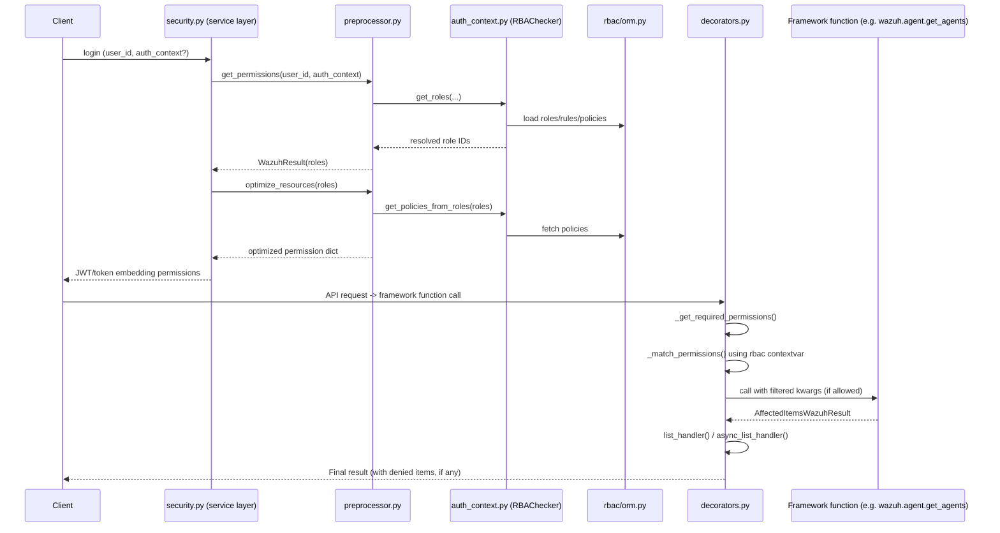

# Security RBAC Module — Engine

## 1. Introduction and Purpose

The **RBAC Engine** is the decision-making core of Wazuh's Role-Based Access Control system. While other RBAC sub-modules deal with exposing the security API ([security_rbac_module_api.md](security_rbac_module_api.md)), implementing business logic ([security_rbac_module_service.md](security_rbac_module_service.md)), and persisting data ([security_rbac_module_orm.md](security_rbac_module_orm.md)), the **Engine** is responsible for actually **evaluating whether a given user/request is authorized to execute a specific framework function against specific resources**.

It answers three fundamental questions on every API request:

1. **Which roles apply to this user?** — resolved either through the static user-role link stored in the database, or dynamically through an *authorization context* (external identity provider claims) matched against role rules.
2. **What permissions (policies) do those roles grant?** — expressed as `action:resource` pairs with `allow`/`deny` effects.
3. **Does the current framework call's requested resource set fall inside the granted permission set?** — evaluated at call time via a decorator that wraps framework functions.

This module contains no HTTP layer and no database schema definitions of its own — it is a pure, in-memory rule-evaluation engine consumed by:
- The **service layer** (`framework/wazuh/security.py`, see [security_rbac_module_service.md](security_rbac_module_service.md)) which calls `get_permissions()` when building a user's session/token payload.
- Nearly **every framework function across the entire API** (agents, rules, decoders, manager, cluster, etc.) via the `@expose_resources` decorator, making it one of the most widely depended-upon components in the whole codebase.
- The **ORM layer** ([security_rbac_module_orm.md](security_rbac_module_orm.md)) for reading roles, rules, and policies from the RBAC SQLite database.

## 2. Architecture Overview

The engine is composed of three cooperating files, each with a distinct responsibility in the authorization pipeline:

| File | Responsibility |
|---|---|
| `framework/wazuh/rbac/auth_context.py` | Matches an *authorization context* (JSON claims from an external IdP, e.g. SAML/OAuth attributes) against the **rules** attached to roles, to dynamically determine which roles a user holds. |
| `framework/wazuh/rbac/preprocessor.py` | Converts a set of raw **policies** (`actions` + `resources` + `effect`) into an optimized, conflict-resolved dictionary structure used at runtime. Also provides the top-level `get_permissions()` entry point used to answer "what can this user do?". |
| `framework/wazuh/rbac/decorators.py` | Implements `@expose_resources`, the decorator applied to nearly all framework functions. At call time it expands wildcards/resources, matches them against the user's optimized permission dictionary, and either allows, filters, or denies the call. |

### 2.1 High-Level Data Flow

```mermaid
flowchart TD
    subgraph Auth["Authentication / Login Time"]
        A[User logs in] --> B{Uses Authorization Context?}
        B -- Yes --> C[RBAChecker.run_auth_context_roles]
        B -- No --> D[RBAChecker.run_user_role_link_roles]
        C --> E[Roles resolved]
        D --> E
        E --> F[get_policies_from_roles]
        F --> G[PreProcessor.process_policy]
        G --> H[Optimized permission dict<br/>stored in token / rbac context]
    end

    subgraph Runtime["Per-Request Authorization"]
        I[Framework function call<br/>e.g. wazuh.agent.get_agents] --> J["@expose_resources decorator"]
        J --> K[_get_required_permissions]
        K --> L[_match_permissions]
        H -.contextvar rbac.get.-> L
        L --> M{Resources allowed?}
        M -- Yes / filtered --> N[Execute wrapped function]
        M -- No --> O[Raise WazuhPermissionError 4000]
        N --> P[list_handler post-processing<br/>adds denied items if needed]
    end
```

### 2.2 Component Relationship Diagram

```mermaid
classDiagram
    class RBAChecker {
        +authorization_context
        +roles_list
        +user_id
        +check_rule(rule, role_id) bool
        +match_item(role_chunk, auth_context, mode) bool
        +find_item(role_chunk, auth_context, mode) bool
        +get_user_roles() list
        +run_auth_context() dict
        +run_auth_context_roles() list
        +run_user_role_link(user_id)$ dict
        +run_user_role_link_roles(user_id)$ list
    }

    class PreProcessor {
        +odict dict
        +process_policy(policy)
        +remove_previous_elements(resource, action)
        +is_combination(resource)$ tuple
        +get_optimize_dict() dict
    }

    class get_permissions_fn["get_permissions() function"]
    class get_roles_fn["get_roles() function"]
    class optimize_resources_fn["optimize_resources() function"]

    class expose_resources["expose_resources() decorator"]
    class async_list_handler["async_list_handler()"]
    class list_handler["list_handler()"]

    RBAChecker --> orm : reads Roles/Rules/Policies
    get_roles_fn --> RBAChecker : instantiates
    get_permissions_fn --> get_roles_fn : uses
    optimize_resources_fn --> RBAChecker : get_policies_from_roles()
    optimize_resources_fn --> PreProcessor : feeds policies

    expose_resources --> optimize_resources_fn : via rbac contextvar set at login time
    expose_resources --> list_handler : default post-processor
    async_list_handler --> list_handler : delegates after await

    orm["security_rbac_module_orm (RolesManager, RulesManager, PoliciesManager, AuthenticationManager, RolesPoliciesManager, UserRolesManager)"]
```

*Note*: The `orm` box refers to components documented separately in [security_rbac_module_orm.md](security_rbac_module_orm.md).

## 3. Core Components

### 3.1 `auth_context.py` — `RBAChecker`

`RBAChecker` implements a small **logic/pattern-matching DSL** used to encode role "rules" — JSON structures that describe which external identity attributes (the *authorization context*) must be present for a role to apply to a user.

**Supported logical operators** (`AND`, `OR`, `NOT`) and **functions** (`MATCH`, `MATCH$`, `FIND`, `FIND$`) allow expressing arbitrarily nested conditions, for example: *"role applies if the authorization context contains `department: engineering` AND NOT `contractor: true`"*.

Key responsibilities:
- **`__init__`**: Loads either a specific role/list of roles or *all* system roles (via `orm.RolesManager`), attaching each role's associated rules (via `orm.RulesManager`).
- **`check_regex`**: Detects and compiles values prefixed with `r'...'` as regular expressions, enabling flexible attribute matching (e.g., `r'^admin.*'`).
- **`match_item` / `find_item`**: Recursive structural matching between a role's rule chunk and the authorization context — `match_item` requires exact structural alignment while `find_item` searches at any depth of the context tree.
- **`check_rule`**: The rule evaluator — walks a rule's logical operators and functions and returns whether the rule holds true against the loaded authorization context.
- **`get_user_roles` / `run_auth_context` / `run_auth_context_roles`**: Determine the roles that match a dynamic authorization context.
- **`run_user_role_link` / `run_user_role_link_roles`** (static methods): The alternative, static path — instead of matching rules, directly reads the persisted user↔role links from `orm.UserRolesManager`.
- **`get_policies_from_roles`** (module-level function): Given a list of resolved role IDs, fetches and returns their associated policies via `orm.RolesPoliciesManager`.

### 3.2 `preprocessor.py` — `PreProcessor` and `get_permissions`

Once roles are resolved, their associated **policies** (each a set of `actions`, `resources`, and an `effect` of `allow`/`deny`) must be merged into a single, conflict-free permission set. This is the job of `PreProcessor`.

- **`process_policy`**: Validates resource syntax via regex, detects resource *combinations* (pairs joined by `&`, e.g. `agent:id:001&agent:group:default`), and inserts/overwrites entries in an internal ordered dict (`self.odict`) keyed by `action`. Newer/more specific policies can override broader previous ones via `remove_previous_elements`.
- **`remove_previous_elements`**: Implements policy precedence — e.g., a wildcard permission previously granted for `agent:id:*` is removed/narrowed once a more specific policy for `agent:id:001` is processed, and existing conflicting single/combination resources are cleaned up.
- **`is_combination`**: Utility to detect and split combined resources on `&`.
- **`optimize_resources`** (module-level function): Orchestrates `get_policies_from_roles()` + repeated `process_policy()` calls to produce the final optimized permission dictionary — **this dictionary is what gets attached to the RBAC context (`rbac` contextvar) used later by the decorators layer at request time.**
- **`get_roles`**: Convenience function bridging `AuthenticationManager` (username→id lookup) and `RBAChecker` to resolve roles either via authorization context or the static user-role link.
- **`get_permissions`**: The primary public entry point of this file. Given a `user_id` (and optionally an `auth_context`), it:
  1. Verifies via `AuthenticationManager.user_allow_run_as` whether the user is permitted to authenticate using an authorization context (raises `WazuhPermissionError(6004)` otherwise).
  2. Resolves the applicable roles.
  3. Returns a `WazuhResult` containing the resolved `roles` list — used by the security service layer when handling login (see `framework/wazuh/security.py::get_user_me` and `create_user`/`run_as_login` flows in [security_rbac_module_service.md](security_rbac_module_service.md)).

### 3.3 `decorators.py` — `expose_resources`, `async_list_handler`, and supporting internals

This file implements the **enforcement point**: the `@expose_resources` decorator that framework functions across the entire codebase (agents, rules, decoders, cluster, manager, etc.) use to declare which `actions`/`resources` they require, and to have those requirements automatically checked against the caller's optimized permission dictionary (read from the `rbac` context variable, defined in `framework/wazuh/core/common.py`).

Internal helper functions:
- **`_expand_resource`**: Expands wildcard resource identifiers (e.g., `agent:id:*`) into the concrete set of existing resource values in the system (e.g., fetching all agent IDs via `get_agents_info()`, all roles via `orm.RolesManager`, all cluster nodes, etc.). Special-cased for `agent:group`, `rule:file`, `decoder:file`, `list:file`, `node:id`, and the resourceless `*:*` action.
- **`_optimize_resources`**: Groups a flat list of `identifier:value` resource strings into a `defaultdict(set)` keyed by identifier, for efficient matching.
- **`_black_expansion`**: Implements "black-list mode" RBAC semantics — resources are allowed by default unless explicitly denied.
- **`_process_effect`**: Applies an individual `allow`/`deny` permission entry against the expanded resource set, mutating the final permission accumulator.
- **`_single_processor` / `_combination_processor` / `_combination_defined_rbac`**: Handle the two resource-matching modes — independent (single) resources vs. paired/combined resources (e.g., an agent must belong to a specific group *and* have a specific OS) — ensuring combinations are matched holistically rather than as independent resource checks.
- **`_match_permissions`**: The central matcher — given the required permissions for a function call and the RBAC mode (`white`/`black`), computes the final `allow` dictionary of resources the caller may access for each action.
- **`_get_required_permissions`**: Introspects the decorator's declared `actions`/`resources` template strings (which may contain `{param}` placeholders resolved from the wrapped function's kwargs) and produces the concrete list of required resources for this specific call.
- **`_get_denied`**: Computes the set difference between originally requested resources and those actually allowed, used to report `WazuhPermissionError(4000)` with details on denied items.
- **`list_handler`**: Default post-processing function; annotates an `AffectedItemsWazuhResult` with `failed_items` for any denied resources (unless the caller explicitly filtered/broadcasted), and can apply default/exclusion post-processing rules.
- **`async_list_handler`**: Async-compatible variant of `list_handler`, used to await a coroutine result (e.g. from cluster distributed calls) before applying the same post-processing logic. This is the sole component explicitly imported by name in the parent module tree, and is used throughout the security controller/service functions that operate over cluster-distributed calls.
- **`expose_resources`**: The decorator factory itself. When a decorated framework function is called:
  1. Computes required permissions from the declared `actions`/`resources`.
  2. Matches them against the caller's permission set (`rbac.get()`).
  3. Filters the function's resource-bearing kwargs down to only the allowed values, or raises `WazuhPermissionError(4000)` if `add_denied` semantics require an explicit failure.
  4. Invokes the wrapped function (unless resourceless execution should be skipped).
  5. Runs the configured post-processing function (`list_handler` by default) to attach denied-item information to the result.

## 4. Authorization Evaluation Sequence



## 5. Relationship to Other RBAC Sub-modules

- **[security_rbac_module_api.md](security_rbac_module_api.md)** — Exposes the HTTP endpoints (`api/api/controllers/security_controller.py`) that let administrators create roles, rules, and policies which this engine later evaluates.
- **[security_rbac_module_service.md](security_rbac_module_service.md)** — The business-logic layer (`framework/wazuh/security.py`) that calls into `get_permissions()` (this module) during login/token-generation flows, and CRUD-manages roles/policies/rules via the ORM.
- **[security_rbac_module_orm.md](security_rbac_module_orm.md)** — Provides the SQLAlchemy models and manager classes (`RolesManager`, `RulesManager`, `PoliciesManager`, `RolesPoliciesManager`, `UserRolesManager`, `AuthenticationManager`) that this engine reads from to resolve roles, rules, and policies.
- **[security_rbac_module_cli.md](security_rbac_module_cli.md)** — The `rbac_control` CLI script used to reset/manage the RBAC database that underlies the engine's data source.
- **framework_core_utils** (`framework/wazuh/core/common.py`) — Supplies the `rbac` context variable (via `get_context_cache`) that carries the optimized per-request permission dictionary consumed by `decorators.py`.

## 6. Summary

| Aspect | Detail |
|---|---|
| Language | Python |
| Primary Files | `auth_context.py`, `preprocessor.py`, `decorators.py` |
| Key Classes | `RBAChecker`, `PreProcessor` |
| Key Functions | `get_permissions`, `get_roles`, `optimize_resources`, `expose_resources`, `list_handler`, `async_list_handler` |
| Consumers | Virtually all Wazuh framework functions (via `@expose_resources`), the security service layer (login/token issuance) |
| Dependencies | `framework/wazuh/rbac/orm.py` (data access), `framework/wazuh/core/common.py` (context variables), `framework/wazuh/core/exception.py` (`WazuhError`, `WazuhPermissionError`), `framework/wazuh/core/results.py` (`AffectedItemsWazuhResult`, `WazuhResult`) |
