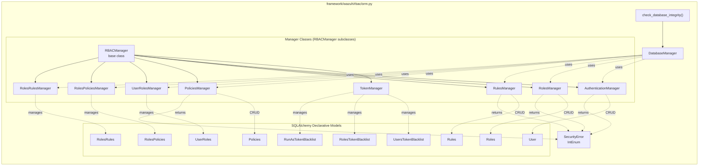
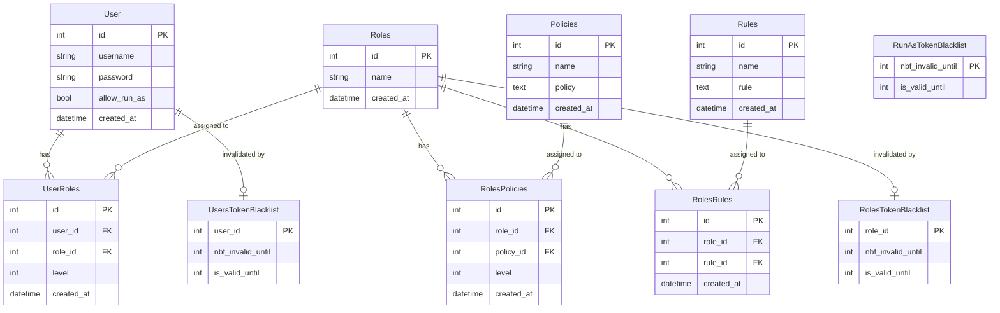
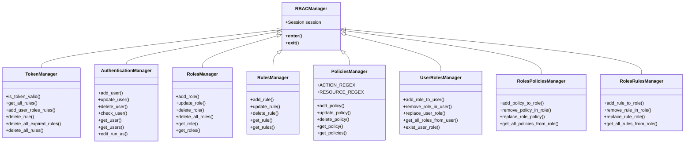
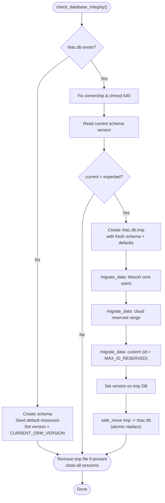
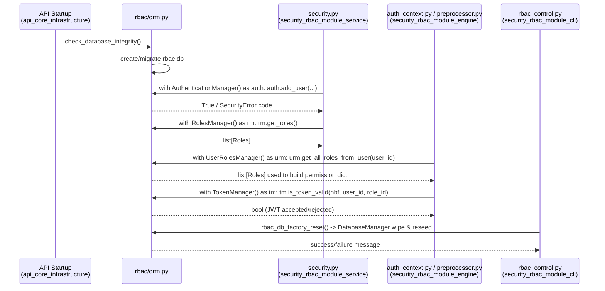
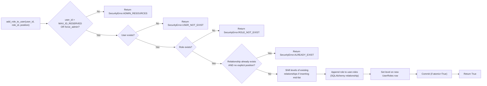
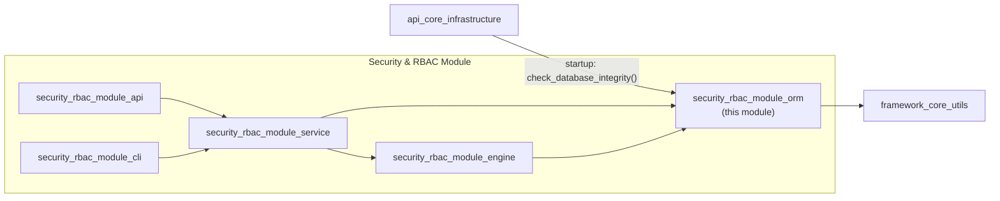

# RBAC ORM — Persistence Layer for Role-Based Access Control

## Introduction

The **RBAC ORM** module (`framework/wazuh/rbac/orm.py`) is the data-persistence backbone of Wazuh's Role-Based Access Control system. It defines the SQLAlchemy object-relational model for the `rbac.db` SQLite database, exposes a set of **Manager** classes that encapsulate all CRUD and relationship operations on RBAC entities (Users, Roles, Rules, Policies, and their many-to-many associations), and provides the **`DatabaseManager`** class responsible for database creation, default-resource seeding, and schema-version migration.

This module is a leaf component within the broader [`security_rbac_module`](security_rbac_module.md) — it has no dependencies on other RBAC submodules, but it is depended upon by nearly everything else in that module tree: the [RBAC engine](security_rbac_module_engine.md) (permission preprocessing and auth-context evaluation), the [RBAC service layer](security_rbac_module_service.md) (`framework/wazuh/security.py`), the [RBAC CLI](security_rbac_module_cli.md) (`rbac_control.py`), and indirectly the [Security API controllers](security_rbac_module_api.md).

It is invoked once at process start-up (via `check_database_integrity()`) by the [API core infrastructure](api_core_infrastructure_auth_config.md) to guarantee the RBAC database exists, is writable by the `wazuh` user, and is on the latest schema version.

---

## 1. Purpose & Responsibilities

| Responsibility | Description |
|---|---|
| **Schema definition** | Declares SQLAlchemy ORM classes mapping to the eight tables that make up the RBAC schema. |
| **CRUD operations** | Provides manager classes (`AuthenticationManager`, `RolesManager`, `RulesManager`, `PoliciesManager`) for creating, reading, updating and deleting each entity type. |
| **Relationship management** | Provides manager classes (`UserRolesManager`, `RolesPoliciesManager`, `RolesRulesManager`) for linking/unlinking entities and controlling their priority ordering (`level`). |
| **Token invalidation** | `TokenManager` maintains blacklist tables so JWT tokens can be revoked per-user, per-role, or globally (run_as tokens). |
| **Database lifecycle** | `DatabaseManager` creates the SQLite file, seeds default resources from YAML, and performs versioned migrations between schema upgrades. |
| **Security-error signaling** | The `SecurityError` `IntEnum` provides a consistent set of negative return codes used across all managers to signal domain-specific failures (e.g., `ROLE_NOT_EXIST`, `ADMIN_RESOURCES`). |

---

## 2. Architecture Overview

### 2.1 Component Diagram

### 2.2 Database Schema (Entity-Relationship Diagram)

**Notes on the schema:**
- `User`, `Roles`, `Rules`, and `Policies` are the four primary entities.
- `UserRoles`, `RolesPolicies`, and `RolesRules` are pure association tables that also carry ordering metadata (`level`) used to resolve conflicts when a user/role has multiple roles/policies attached (lower `level` = higher priority).
- IDs `1..99` (`MAX_ID_RESERVED`) are reserved for Wazuh's built-in/default resources and cannot be deleted or renamed through the standard managers (protected by the `SecurityError.ADMIN_RESOURCES` check). IDs `1..89` (`CLOUD_RESERVED_RANGE`) receive extra protection during cloud-managed deployments.
- The three blacklist tables implement token-revocation ("logout"/"revoke all tokens") by recording an `nbf_invalid_until` timestamp; any JWT issued before this time is rejected.

---

## 3. Core Component Reference

### 3.1 `SecurityError` (IntEnum)
A shared enumeration of negative-integer error codes returned by manager methods instead of raising exceptions, allowing calling code (typically `framework/wazuh/security.py` in the [service layer](security_rbac_module_service.md)) to distinguish between different failure modes without try/except chains:

| Code | Meaning |
|---|---|
| `ALREADY_EXIST` (0) | Resource with same name/body already exists |
| `INVALID` (-1) | Malformed resource (wrong types, invalid regex, etc.) |
| `ROLE_NOT_EXIST` (-2) | Referenced role ID/name not found |
| `POLICY_NOT_EXIST` (-3) | Referenced policy ID/name not found |
| `ADMIN_RESOURCES` (-4) | Attempt to modify/delete a protected default (ID ≤ 99) resource |
| `USER_NOT_EXIST` (-5) | Referenced user ID not found |
| `TOKEN_RULE_NOT_EXIST` (-6) | No blacklist rule found to delete |
| `RULE_NOT_EXIST` (-7) | Referenced rule ID/name not found |
| `RELATIONSHIP_ERROR` (-8) | Failure while replacing/bulk-removing relationships |

### 3.2 ORM Model Classes

| Class | Table | Purpose |
|---|---|---|
| `User` | `users` | Wazuh API user accounts, including hashed password and `allow_run_as` flag. |
| `Roles` | `roles` | Named groupings of policies and rules assignable to users. |
| `Rules` | `rules` | JSON-encoded matching conditions (auth-context based) that automatically attach roles to a user session. |
| `Policies` | `policies` | JSON-encoded `actions`/`resources`/`effect` definitions — the actual permission grants. |
| `UserRoles` | `user_roles` | User↔Role association with priority `level`. |
| `RolesPolicies` | `roles_policies` | Role↔Policy association with priority `level`. |
| `RolesRules` | `roles_rules` | Role↔Rule association. |
| `UsersTokenBlacklist` / `RolesTokenBlacklist` / `RunAsTokenBlacklist` | corresponding tables | Token-revocation bookkeeping. |

Each entity class exposes:
- A constructor accepting the relevant fields plus an optional explicit `*_id` (used during migration to preserve IDs).
- A lightweight getter (`get_role()`, `get_rule()`, `get_policy()`, `get_user()`) returning only the entity's own fields.
- A richer `to_dict()` method that also resolves related entities (e.g., `Roles.to_dict()` includes attached policy/user/rule IDs), often via a nested manager instantiation using the same session.

### 3.3 Manager Classes

All managers inherit from **`RBACManager`**, a lightweight context-manager base class that owns a SQLAlchemy `Session` (created via `sessionmaker(bind=_engine)` if none is supplied) and guarantees session closure on exit (`with XManager() as mgr: ...`).

**Key design patterns shared across all managers:**
- **Protected default resources:** Every mutating operation checks `id > MAX_ID_RESERVED` before allowing modification, unless `force_admin=True`/`check_default=False` is explicitly passed (used internally only by `DatabaseManager` while seeding/migrating).
- **Atomicity control:** Relationship-mutating methods accept an `atomic: bool = True` flag; when composing several relationship changes in a loop, callers pass `atomic=False` and commit once at the end to avoid partial states.
- **Priority (`level`) recalculation:** `add_role_to_user`, `add_policy_to_role`, and `remove_policy_in_role` contain logic to shift `level` values of sibling relationships when inserting/removing at a specific position, preserving a dense, ordered priority list.
- **Validation via regex:** `PoliciesManager` validates `actions` against `ACTION_REGEX` (`resource:action` format) and `resources` against `RESOURCE_REGEX` before allowing insert/update.

### 3.4 `DatabaseManager`

`DatabaseManager` is a *multi-database* helper — it can hold connections to more than one SQLite file simultaneously (used to migrate old → new schema versions). Its key methods:

| Method | Purpose |
|---|---|
| `connect(database_path)` | Opens a new engine/session for a given file path and stores it internally keyed by path. |
| `create_database(database)` | Creates all tables (`_Base.metadata.create_all`) for a connected database. |
| `get_database_version(database)` | Reads SQLite's `pragma user_version` to determine schema version. |
| `set_database_version(database, version)` | Writes the new schema version after a successful migration. |
| `insert_default_resources(database)` | Loads `users.yaml`, `roles.yaml`, `rules.yaml`, `policies.yaml`, and `relationships.yaml` from `DEFAULT_RBAC_RESOURCES` and populates the fresh database with Wazuh's built-in security configuration. |
| `get_table(session, table)` | Returns a query object, gracefully degrading to an older column set if the current schema doesn't match (handles partially-migrated schemas). |
| `get_data(source, table, col_a, col_b, from_id, to_id)` | Fetches rows from a source DB filtered by an ID range across up to two columns (used for id-range–based migration passes). |
| `migrate_data(source, target, from_id, to_id)` | Copies Users → Roles → Rules → Policies → relationship tables from `source` to `target`, resolving name collisions with default resources (renaming or relinking) and preserving custom priorities. |
| `rollback(database)` | Rolls back a pending transaction on a specific connection. |
| `close_sessions()` | Closes all sessions/engines held by the manager — called at the end of every integrity-check pass. |

### 3.5 `check_database_integrity()` — Module-Level Entry Point

This is the function invoked at API start-up (a module-level singleton `db_manager = DatabaseManager()` is created for this purpose). Its logic:

1. **If `rbac.db` exists:**
   - Fix ownership/permissions (`wazuh:wazuh`, `0640`).
   - Read current schema version via `pragma user_version`.
   - If `current_version < CURRENT_ORM_VERSION`: perform a safe, atomic upgrade using a temporary database file (`rbac.db.tmp`), migrate data in three ID-range passes (`WAZUH_USER_ID`→`WAZUH_WUI_USER_ID`, `CLOUD_RESERVED_RANGE`→`MAX_ID_RESERVED`, `MAX_ID_RESERVED+1`→∞), then atomically replace the old file with `safe_move`.
2. **If `rbac.db` does not exist:** treat as fresh install — create schema, seed defaults, set version, done.
3. **Cleanup:** the temporary file is always removed in a `finally` block, regardless of success/failure.

---

## 4. Data Flow: How Other Modules Use This ORM

**Typical consumers:**
- **[`security_rbac_module_service`](security_rbac_module_service.md)** (`framework/wazuh/security.py`, `framework/wazuh/core/security.py`) wraps every manager call with Wazuh's standard `AffectedItemsWazuhResult` response formatting and business-logic validation (e.g., `check_relationships()` looks up users affected by a role change before it's deleted).
- **[`security_rbac_module_engine`](security_rbac_module_engine.md)** (`preprocessor.py`, `auth_context.py`) reads Roles/Policies/Rules at request-authorization time to compute the effective permission set and evaluate `run_as` authorization contexts against stored `Rules`.
- **[`security_rbac_module_api`](security_rbac_module_api.md)** (`security_controller.py`) never touches the ORM directly — it always goes through the service layer.
- **[`security_rbac_module_cli`](security_rbac_module_cli.md)** (`rbac_control.py`) calls `rbac_db_factory_reset()` (defined in `core/security.py`, which itself uses `DatabaseManager`) to wipe and reseed the database from the command line.
- **API core infrastructure** ([`api_core_infrastructure_auth_config`](api_core_infrastructure_auth_config.md)) calls `check_database_integrity()` once during process bootstrap.

---

## 5. Key Operational Scenarios

### 5.1 Adding a Role to a User (with priority ordering)

### 5.2 Schema Migration Flow (High-Level)

Data migration is split into three ID ranges to correctly handle overlaps between old and new default resource IDs:

1. **`WAZUH_USER_ID` → `WAZUH_WUI_USER_ID`** (IDs 1–2): Special-cased — passwords for the two built-in system users are updated in place rather than re-inserted, since these are guaranteed to exist in both schemas.
2. **`CLOUD_RESERVED_RANGE` → `MAX_ID_RESERVED`** (IDs 89–99): Cloud-managed default resources; migrated normally with collision handling.
3. **`MAX_ID_RESERVED + 1` → ∞**: All user-created custom resources; migrated with automatic renaming (`{name}_user`) if a name collision with a new default resource occurs, and automatic relationship relinking if a policy/rule body collision occurs (i.e., the user had created a policy/rule identical to one that's now a built-in default).

---

## 6. Relationship to the Wider System

- **Upstream dependency:** `framework/wazuh/core/common.py` (`wazuh_uid`, `wazuh_gid`, `DEFAULT_RBAC_RESOURCES`) and `framework/wazuh/core/utils.py` (`get_utc_now`, `safe_move`) from [`framework_core_utils`](framework_core_utils.md) are used for OS-level ownership handling and safe atomic file replacement during migration.
- **No downstream dependency** on API controllers or the engine — this module is intentionally kept as a pure persistence layer to keep it testable and reusable (e.g., by the CLI tool without needing a running API process).

---

## 7. Security & Reliability Considerations

- **File permissions:** The database file is always created/repaired with `0640` permissions and `wazuh:wazuh` ownership, preventing unauthorized local read/write access.
- **Atomic upgrades:** Migrations are staged into a `.tmp` file and only swapped into place via `safe_move` after successful completion — a crash mid-migration cannot corrupt the live database.
- **Reserved ID protection:** All destructive/renaming operations on IDs ≤ `MAX_ID_RESERVED` are blocked by default, preventing accidental deletion of the built-in `wazuh`, `wazuh-wui` users or default roles/policies/rules.
- **Password hashing:** `AuthenticationManager.add_user`/`update_user` always hash plaintext passwords with `werkzeug.security.generate_password_hash` unless `hashed_password=True` is explicitly passed (used only during migration of already-hashed values).
- **Token blacklist cache invalidation:** `TokenManager.add_user_roles_rules` calls `clear_tokens_cache()` (from `wazuh.rbac.utils`) after writing new blacklist rules, ensuring in-memory token caches (used by [`security_rbac_module_engine`](security_rbac_module_engine.md)) stay consistent with the database.

---

## 8. Related Documentation

- [`security_rbac_module.md`](security_rbac_module.md) — Parent module overview covering the full RBAC subsystem.
- [`security_rbac_module_engine.md`](security_rbac_module_engine.md) — Permission preprocessing (`PreProcessor`) and authorization-context evaluation (`RBAChecker`) that consume this ORM's data.
- [`security_rbac_module_service.md`](security_rbac_module_service.md) — Business-logic layer wrapping these managers with API-facing semantics.
- [`security_rbac_module_api.md`](security_rbac_module_api.md) — REST API controllers and models exposing RBAC management endpoints.
- [`security_rbac_module_cli.md`](security_rbac_module_cli.md) — `rbac_control.py` command-line tool for database reset and default password restoration.
- [`api_core_infrastructure_auth_config.md`](api_core_infrastructure_auth_config.md) — API authentication/authorization request pipeline that relies on a healthy RBAC database.
- [`framework_core_utils.md`](framework_core_utils.md) — Shared utilities (`safe_move`, `wazuh_uid`/`wazuh_gid`, time helpers) used by `DatabaseManager`.
