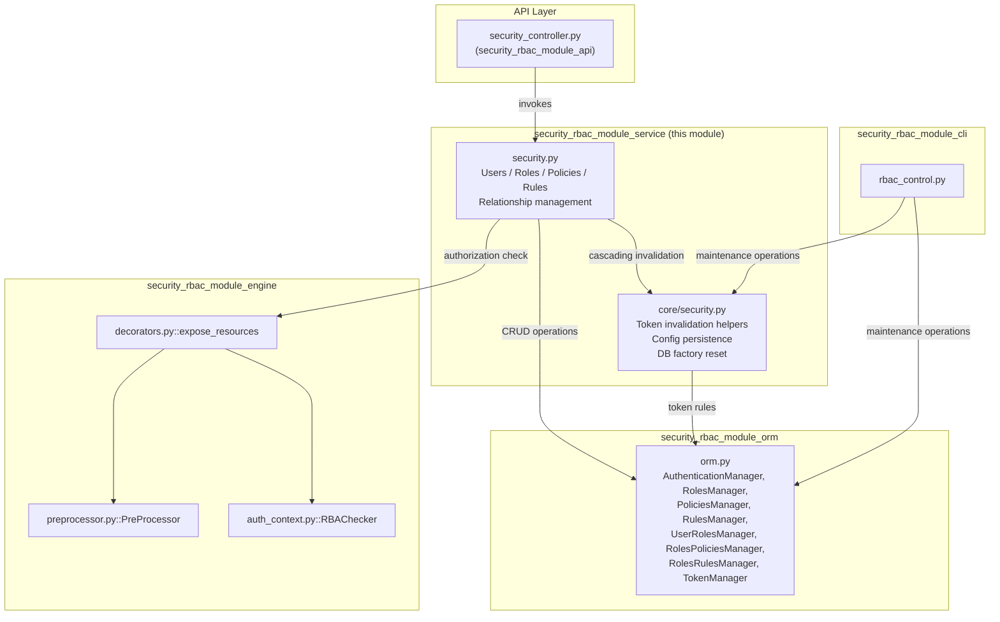
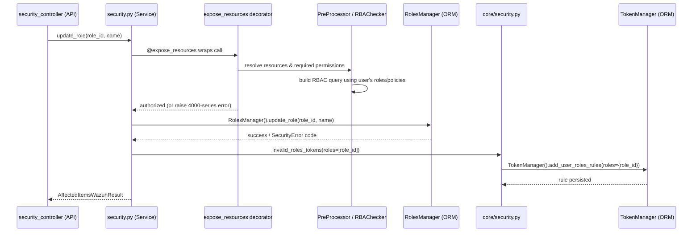
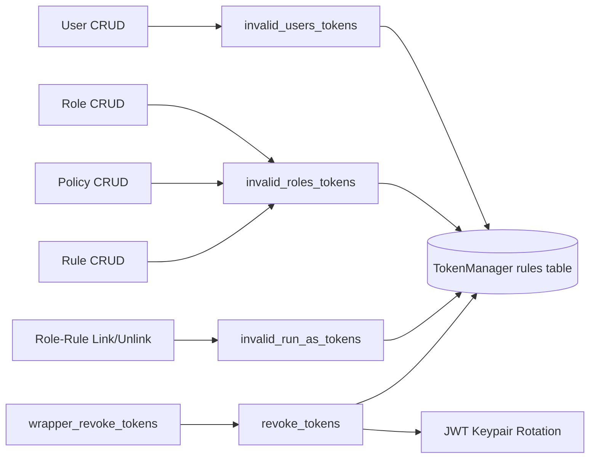

# Security RBAC Module – Service Layer

## 1. Introduction and Purpose

The **Security RBAC Module Service** is the business-logic layer of Wazuh's Role-Based Access Control (RBAC) subsystem. It sits between the REST API controllers (`security_rbac_module_api`) and the low-level RBAC data/engine layers (`security_rbac_module_orm`, `security_rbac_module_engine`). Its responsibility is to:

- Validate and orchestrate CRUD operations over the core RBAC entities: **Users**, **Roles**, **Policies**, and **Rules**.
- Manage the relationships between these entities (user↔role, role↔policy, role↔rule).
- Enforce authorization on every operation through the `@expose_resources` decorator (RBAC-on-RBAC).
- Invalidate JWT tokens whenever a change could affect a user's permissions (role changes, policy changes, password changes, etc.).
- Expose introspection endpoints for the RBAC catalog (available actions/resources) and for reading/updating the global security configuration (`security.yaml`).
- Provide low-level helper utilities (in `framework/wazuh/core/security.py`) used both by this service layer and by other parts of the security subsystem (e.g., cascading token revocation, database factory reset).

This module implements **no HTTP concerns** and **no persistence details** itself — it is a thin, well-tested orchestration layer that composes lower-level building blocks from the ORM and engine sub-modules.

## 2. Module Scope

| File | Responsibility |
|---|---|
| `framework/wazuh/security.py` | Public, RBAC-protected service functions consumed by the API controller layer (users, roles, policies, rules, relationships, RBAC catalog introspection, security config). |
| `framework/wazuh/core/security.py` | Internal helper functions: token invalidation cascades, security config persistence, RBAC policy sanitization, and full RBAC database factory reset. |

## 3. Architecture Overview

The service layer is a mediator between the API layer and the persistence/engine layer. Every public function is decorated with `@expose_resources`, which itself relies on the RBAC engine (`PreProcessor`, `RBAChecker`) to check whether the requesting user is authorized to operate on the given resources **before** the function body executes.

### Data flow for a typical write operation (e.g., updating a role)

## 4. Key Responsibilities Detail

### 4.1 User Management
- `get_user_me`: returns the authenticated user's profile, expanded with the full role → rule/policy tree resolved from `RolesManager`, `RulesManager`, and `PoliciesManager`.
- `get_users`, `create_user`, `update_user`, `remove_users`, `edit_run_as`: standard CRUD plus password-strength validation (regex `_user_password`) and protection of "reserved" system users/roles (`MAX_ID_RESERVED`).
- Every mutating user operation calls `invalid_users_tokens()` (from `core/security.py`) so any previously issued JWTs for the affected user(s) are invalidated.

### 4.2 Role, Policy, and Rule Management
- Symmetric CRUD sets: `get_roles`/`add_role`/`update_role`/`remove_roles`, `get_policies`/`add_policy`/`update_policy`/`remove_policies`, `get_rules`/`add_rule`/`update_rule`/`remove_rules`.
- All deletions and updates protect "admin" (reserved) resources via `SecurityError.ADMIN_RESOURCES` checks propagated from the ORM layer (see [security_rbac_module_orm.md](security_rbac_module_orm.md)).
- Mutations trigger `invalid_roles_tokens()` so that role/policy/rule changes immediately revoke stale sessions.

### 4.3 Relationship Management
- `set_user_role` / `remove_user_role`: link/unlink roles to a user, with optional ordering (`position`).
- `set_role_policy` / `remove_role_policy`: link/unlink policies to a role.
- `set_role_rule` / `remove_role_rule`: link/unlink security rules (RBAC conditions, e.g., IP-based restrictions) to a role; these use `invalid_run_as_tokens()` because rules are tied to authorization-context ("run as") logins.

### 4.4 RBAC Catalog Introspection
- `get_api_endpoints`, `get_rbac_resources`, `get_rbac_actions`: parse the OpenAPI spec (`spec.yaml`, loaded via `core/security.py::load_spec`) to expose the full catalog of RBAC actions/resources available for policy authoring. Results are cached with `lru_cache` since the catalog is static per process lifetime.

### 4.5 Security Configuration & Token Revocation
- `get_security_config` / `update_security_config`: read/write `security.yaml` (max login attempts, block time, request rate limits) via `core/security.py::update_security_conf`. This also resets in-memory counters in `api.middlewares` (shared with [api_core_infrastructure_middleware.md](api_core_infrastructure_middleware.md)).
- `revoke_current_user_tokens` / `wrapper_revoke_tokens`: revoke the current user's tokens or **all** tokens system-wide (rotates the JWT keypair via `api.authentication.change_keypair` and clears all `TokenManager` rules).
- `check_relationships`: utility to compute the set of users affected by a list of role changes — used internally to decide the scope of token invalidation.
- `rbac_db_factory_reset`: deletes the RBAC SQLite database file and re-triggers `check_database_integrity()` (from the ORM layer) to recreate default roles/policies/rules; also revokes all tokens. This is the function backing the `rbac_control.py` CLI reset command (see [security_rbac_module_cli.md](security_rbac_module_cli.md)).

## 5. Token Invalidation Strategy

A central design theme of this module is **defense-in-depth token invalidation**: any change that could alter what a user is allowed to do must immediately invalidate their existing JWTs so stale permissions cannot be exploited before natural token expiry. The service layer offloads the actual rule bookkeeping to `TokenManager` (ORM layer) through three helper functions in `core/security.py`:

| Helper | Triggered when... |
|---|---|
| `invalid_users_tokens(users)` | A user's password, roles, or run_as flag changes, or the user is deleted. |
| `invalid_roles_tokens(roles)` | A role is updated/deleted, or a policy/rule linked to it changes. |
| `invalid_run_as_tokens()` | A role-rule relationship changes (rules gate authorization-context logins). |
| `revoke_tokens()` | Full system-wide revocation: rotates the API JWT keypair and clears all token rules. |

## 6. Relationship to Sibling Modules

This service module is one of five sibling sub-modules under the parent **Security RBAC Module**:

- **[security_rbac_module_api.md](security_rbac_module_api.md)** – FastAPI controllers and Pydantic request/response models that call into this service layer.
- **security_rbac_module_service.md** *(this file)* – Business logic (users, roles, policies, rules, relationships, token invalidation).
- **[security_rbac_module_engine.md](security_rbac_module_engine.md)** – The RBAC authorization engine: `RBAChecker` (evaluates authorization-context rules), `PreProcessor`/`get_permissions` (resolves effective permissions from roles/policies), and the `expose_resources`/`async_list_handler` decorators used to guard every service function in this module.
- **[security_rbac_module_orm.md](security_rbac_module_orm.md)** – SQLAlchemy ORM models and manager classes (`DatabaseManager`, `RBACManager`, `Roles`, `Policies`, `Rules`, `User`, `UserRoles`, `RolesPolicies`, `RolesRules`, `*TokenBlacklist`) providing the actual persistence used by this service layer.
- **[security_rbac_module_cli.md](security_rbac_module_cli.md)** – The `rbac_control.py` command-line tool for offline RBAC database maintenance (reset, restore default passwords), which reuses functions from this service layer (e.g., `rbac_db_factory_reset`).

This module is itself a child of the broader Security RBAC Module described in the [security_rbac_module_api.md](security_rbac_module_api.md) overview, and is exposed to end users through the API & Management Framework HTTP layer (see [api_core_infrastructure.md](api_core_infrastructure.md)).

## 7. Error Handling Conventions

Functions in this module surface domain errors using two patterns:
1. **`WazuhError` / `WazuhResourceNotFound`** exceptions (from `wazuh.core.exception`) for immediate, single-item failures (e.g., invalid password format → `WazuhError(5007)`).
2. **`AffectedItemsWazuhResult`** aggregation pattern for bulk operations: each item in a list request (e.g., `remove_roles(role_ids)`) is processed independently, and failures are collected via `result.add_failed_item(id_, error)` while successes accumulate in `result.affected_items`. This allows partial success semantics consistent with the rest of the Wazuh API.

Common `SecurityError` codes returned by the ORM layer (`ALREADY_EXIST`, `INVALID`, `ROLE_NOT_EXIST`, `POLICY_NOT_EXIST`, `RULE_NOT_EXIST`, `ADMIN_RESOURCES`, `RELATIONSHIP_ERROR`) are translated into the appropriate `WazuhError` codes (4000–5999 range) by this service layer before being returned to the API. See [security_rbac_module_orm.md](security_rbac_module_orm.md) for the `SecurityError` enum definition.

## 8. Summary

| Aspect | Description |
|---|---|
| **Layer** | Business logic / service (mid-tier), no HTTP or persistence concerns |
| **Key file** | `framework/wazuh/security.py` (public API), `framework/wazuh/core/security.py` (internal helpers) |
| **Protected by** | `@expose_resources` decorator from [security_rbac_module_engine.md](security_rbac_module_engine.md) |
| **Persists via** | Manager classes from [security_rbac_module_orm.md](security_rbac_module_orm.md) |
| **Consumed by** | [security_rbac_module_api.md](security_rbac_module_api.md) controllers, [security_rbac_module_cli.md](security_rbac_module_cli.md) tool |
| **Cross-cutting concern** | JWT token invalidation on every permission-affecting change |
