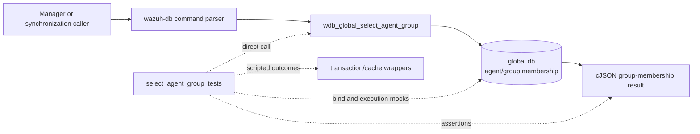
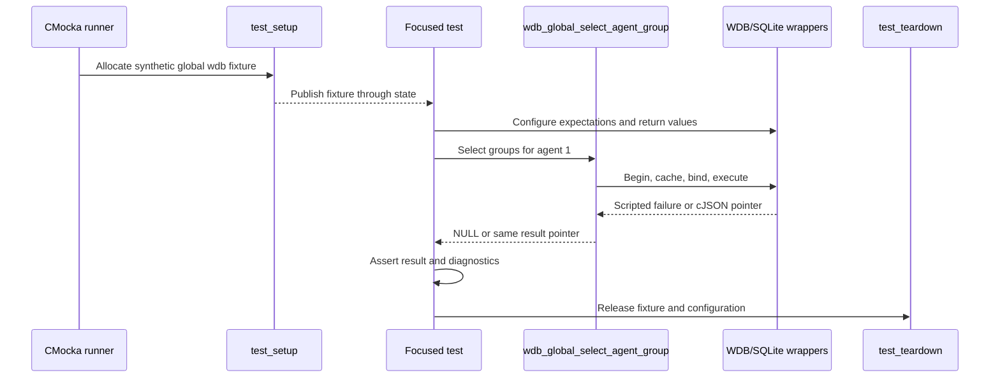
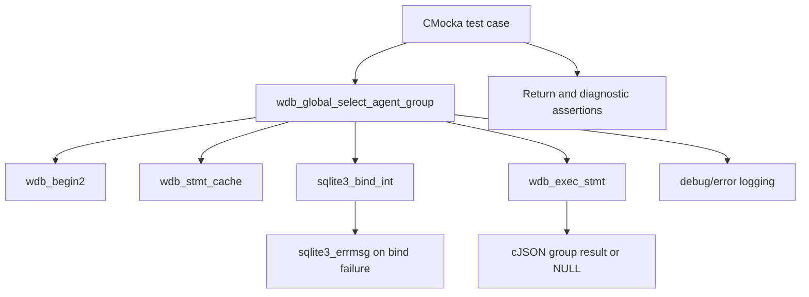
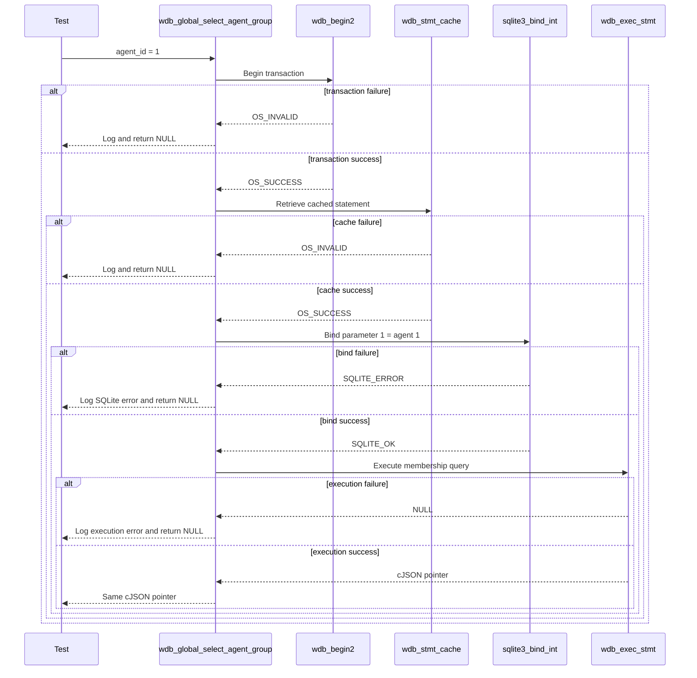

# `select_agent_group_tests`

## Introduction

`select_agent_group_tests` documents the focused CMocka tests for
`wdb_global_select_agent_group()`. The operation reads the group membership
records associated with one agent from Wazuh's global database and returns the
query result as a `cJSON *` value.

The five cases are a leaf of `src/unit_tests/wazuh_db/test_wdb_global.c`.
Together they cover transaction startup, statement caching, agent-ID binding,
statement execution, and successful result propagation. The tests replace
SQLite and Wazuh DB calls with link-time wrappers; no live `global.db` file is
opened. The parent test suite is described in [`test_wdb_global.md`](test_wdb_global.md),
and the shared fixture and wrapper helpers are described in
[`test_wdb_global_test_infrastructure.md`](test_wdb_global_test_infrastructure.md).

> Scope note: the source file contains many other agent/group operations. This
> document covers only the five `wdb_global_select_agent_group` cases listed in
> the module definition.

## Position in the system

Agent-to-group membership is stored in the global Wazuh database and is used
by manager-side group management, synchronization, and agent metadata flows.
Production callers normally reach this operation through the Wazuh DB command
parser and Unix-socket protocol. This leaf invokes the database operation
directly so that each database boundary can be tested independently.



The broader global-database architecture, including the helper layer and
daemon boundary, is documented in [`wazuh_db_global.md`](wazuh_db_global.md).
Related membership retrieval through a group name is covered by
[`get_group_agents_tests.md`](get_group_agents_tests.md).

## Contract under test

The tested call has the following observable contract:

```c
cJSON *wdb_global_select_agent_group(wdb_t *wdb, int agent_id);
```

Its expected execution pipeline is:

1. Begin or join a transaction with `wdb_begin2()`.
2. Retrieve/cache the prepared statement with `wdb_stmt_cache()`.
3. Bind `agent_id` to SQLite parameter `1` with `sqlite3_bind_int()`.
4. Execute the statement with `wdb_exec_stmt()`.
5. Return the resulting `cJSON *` unchanged.
6. On a preparation, bind, or execution failure, log the error and return
   `NULL`.

```mermaid
flowchart TD
    Start([wdb_global_select_agent_group(wdb, agent_id)]) --> Begin{Transaction begins?}
    Begin -- no --> TxError[Log: Cannot begin transaction] --> Null[Return NULL]
    Begin -- yes --> Cache{Statement cache succeeds?}
    Cache -- no --> CacheError[Log: Cannot cache statement] --> Null
    Cache -- yes --> Bind{Bind agent_id at parameter 1?}
    Bind -- no --> BindError[Log global SQLite bind error] --> Null
    Bind -- yes --> Execute{wdb_exec_stmt returns a result?}
    Execute -- no --> ExecError[Log execution error] --> Null
    Execute -- yes --> Result[Return cJSON group result]
```

The supplied tests establish result propagation and failure short-circuiting;
they do not define the complete JSON schema or SQL text. Those details belong
to the production global database implementation and integration coverage.

## Test harness and isolation

Every case is registered with `cmocka_unit_test_setup_teardown()`. The shared
`test_setup()` allocates a minimal `test_struct_t`, a synthetic `wdb_t` whose
ID is `"global"`, a placeholder SQLite-handle slot, and an output buffer. It
also initializes Wazuh DB configuration. `test_teardown()` frees those
allocations and calls `wdb_free_conf()`.



The complete lifecycle is maintained in
[`test_wdb_global_test_infrastructure.md`](test_wdb_global_test_infrastructure.md).

## Dependencies and component relationships

| Dependency | Role in this leaf |
|---|---|
| `wdb.h` | Declares `wdb_t` and the operation under test. |
| `wdb_global_select_agent_group()` | Production membership lookup being exercised. |
| `wdb_begin2` wrapper | Controls transaction-start success or failure. |
| `wdb_stmt_cache` wrapper | Controls prepared-statement cache success or failure. |
| `sqlite3_bind_int` wrapper | Verifies parameter index `1`, agent ID `1`, and SQLite return code. |
| `sqlite3_errmsg` wrapper | Supplies deterministic text for bind/execution diagnostics. |
| `wdb_exec_stmt` wrapper | Returns a mocked `cJSON *` result or simulates query failure. |
| Logging wrappers | Verify exact debug/error messages on failed branches. |
| cJSON | Represents the group-membership result; success uses a sentinel pointer. |
| CMocka | Registers tests, configures wrappers, and performs assertions. |



The wrapper implementation and linker-substitution model are documented in
[`wazuh_db_wrappers.md`](wazuh_db_wrappers.md). The parent global test module
contains the complete dependency inventory in [`test_wdb_global.md`](test_wdb_global.md).

## Test scenarios

| Test case | Simulated condition | Expected behavior |
|---|---|---|
| `test_wdb_global_select_agent_group_transaction_fail` | `wdb_begin2()` returns `OS_INVALID`. | Expects `Cannot begin transaction`; returns `NULL` and does not cache, bind, or execute. |
| `test_wdb_global_select_agent_group_cache_fail` | Transaction succeeds; `wdb_stmt_cache()` returns `OS_INVALID`. | Expects `Cannot cache statement` and returns `NULL`. |
| `test_wdb_global_select_agent_group_bind_fail` | Binding agent `1` at SQLite parameter `1` returns `SQLITE_ERROR`. | Supplies `ERROR MESSAGE` through `sqlite3_errmsg`, expects `DB(global) sqlite3_bind_int(): ERROR MESSAGE`, and returns `NULL`. |
| `test_wdb_global_select_agent_group_exec_fail` | Transaction, cache, and bind succeed; `wdb_exec_stmt()` returns `NULL`. | Expects `wdb_exec_stmt(): ERROR MESSAGE` and returns `NULL`. |
| `test_wdb_global_select_agent_group_success` | All preparation steps succeed; execution returns `(cJSON *)1`. | Returns the exact sentinel pointer, proving the query result is propagated without transformation. |

The tests intentionally configure only the wrappers needed for the selected
branch. This makes short-circuit behavior visible: later database calls must
not occur after an earlier failure.

## Component interaction flow



## Return and diagnostic behavior

This leaf establishes the following observable behavior:

- transaction failure returns `NULL` and logs `Cannot begin transaction`;
- statement-cache failure returns `NULL` and logs `Cannot cache statement`;
- SQLite bind failure returns `NULL` and includes the database ID and SQLite
  error text in the diagnostic;
- query execution failure returns `NULL` and logs the execution error;
- successful execution returns the exact `cJSON *` supplied by the wrapper.

Response-size handling is not part of these five cases. For the related
size-aware group-agent listing path, see [`get_group_agents_tests.md`](get_group_agents_tests.md)
and the `WDBC_DUE` conventions in [`test_wdb_global.md`](test_wdb_global.md).

## Maintenance guidance

When changing `wdb_global_select_agent_group()` or its prepared statement:

1. Preserve coverage for transaction, cache, bind, execution, and success
   boundaries.
2. Keep the agent-ID binding assertion at parameter index `1` unless the SQL
   statement contract changes.
3. Update exact diagnostic assertions when logging messages intentionally
   change.
4. Continue using the shared fixture and wrappers so this leaf remains
   independent of SQLite files and daemon state.
5. Add JSON-shape assertions only if this leaf becomes the owner of the group
   result schema.

## Source reference

- Production test source: `src/unit_tests/wazuh_db/test_wdb_global.c`
- Focused cases: `test_wdb_global_select_agent_group_transaction_fail`,
  `..._cache_fail`, `..._bind_fail`, `..._exec_fail`, and `..._success`
- Registered under the `/* Tests wdb_global_select_agent_group */` section in
  `main()`
- Production implementation: `src/wazuh_db/wdb_global.c`
- Broader suite: [`test_wdb_global.md`](test_wdb_global.md)
