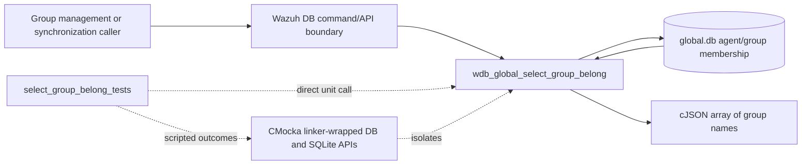
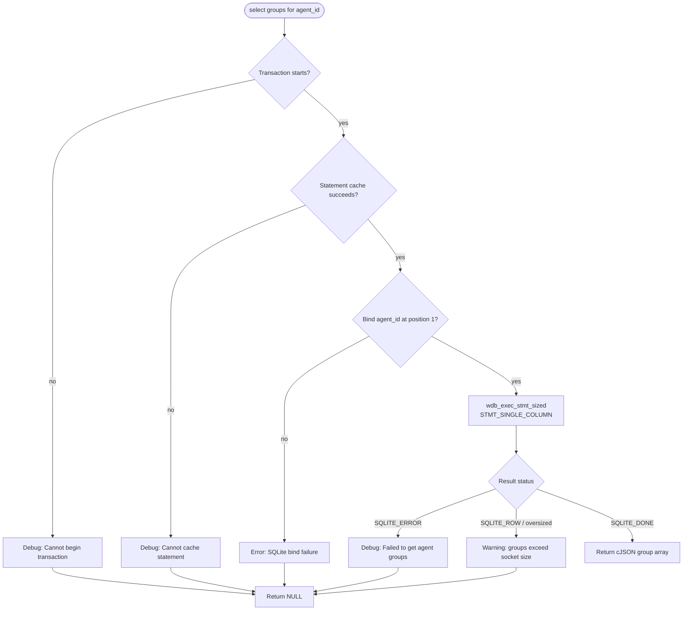
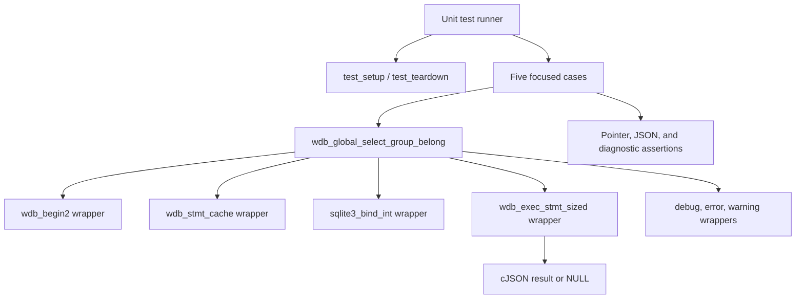
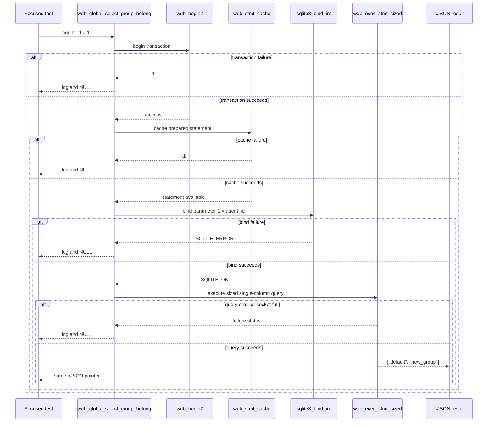

# `select_group_belong_tests`

## Introduction

`select_group_belong_tests` documents the focused CMocka tests for
`wdb_global_select_group_belong()`. The operation reads the groups assigned to
one agent from Wazuh's global database and returns the result as a `cJSON *`
array.

These tests are defined in `src/unit_tests/wazuh_db/test_wdb_global.c` and are
registered in the broader [`test_wdb_global.md`](test_wdb_global.md) suite.
They isolate transaction setup, statement caching, parameter binding, query
execution, and response-size handling. The source file contains many other
global-database tests; this document covers only the five selected cases.

## System position

Agent-to-group membership is persisted in the global Wazuh database. The
selection operation is a low-level database primitive used by group
synchronization and higher-level agent/group-management workflows. Related
membership operations are documented in
[`select_agent_group_tests.md`](select_agent_group_tests.md),
[`insert_agent_belong_tests.md`](insert_agent_belong_tests.md), and
[`delete_tuple_belong_tests.md`](delete_tuple_belong_tests.md).



## Contract under test

```c
cJSON *wdb_global_select_group_belong(wdb_t *wdb, int agent_id);
```

The expected execution pipeline is:

1. Begin or join a transaction through `wdb_begin2()`.
2. Obtain the prepared statement through `wdb_stmt_cache()`.
3. Bind `agent_id` to SQLite parameter position `1`.
4. Execute the query using the size-aware `wdb_exec_stmt_sized()` helper with
   `STMT_SINGLE_COLUMN` mode and `WDB_MAX_RESPONSE_SIZE`.
5. Return the resulting JSON array unchanged.

The operation returns `NULL` when preparation, binding, or execution fails.
If the serialized response exceeds the socket limit, it also returns `NULL`
after logging a warning. The tests verify the observable behavior and do not
duplicate the SQL definition or JSON schema owned by the production global DB
implementation.



## Test harness and dependencies

Each test uses `cmocka_unit_test_setup_teardown()` with the shared fixture
`test_setup()`/`test_teardown()`. Setup creates a minimal `wdb_t`, assigns the
database ID `"global"`, allocates a placeholder SQLite handle, and initializes
Wazuh DB configuration. Teardown releases those allocations and calls
`wdb_free_conf()`.



| Dependency | Role |
|---|---|
| `wdb.h` | Declares `wdb_t`, status constants, and the target API. |
| `wdb_begin2` | Simulates transaction success or failure. |
| `wdb_stmt_cache` | Simulates prepared-statement lookup/caching. |
| `sqlite3_bind_int` | Verifies parameter position `1` and the supplied agent ID. |
| `wdb_exec_stmt_sized` | Controls query success, SQLite failure, and socket-full outcomes. |
| `sqlite3_errmsg` | Supplies deterministic error text for assertions. |
| cJSON | Represents the returned single-column group-name array. |
| CMocka and linker wrappers | Provide expectations, controlled returns, and isolation from a live database. |

The shared fixture and wrapper model are described by the parent documentation
in [`test_wdb_global.md`](test_wdb_global.md). Production declarations and
database behavior belong to the Wazuh DB implementation and are not redefined
here.

## Test scenarios

| Test case | Simulated condition | Expected behavior |
|---|---|---|
| `test_wdb_global_select_group_belong_transaction_fail` | `wdb_begin2()` returns `-1`. | Expects `Cannot begin transaction`; returns `NULL` and stops immediately. |
| `test_wdb_global_select_group_belong_cache_fail` | Transaction succeeds; `wdb_stmt_cache()` returns `-1`. | Expects `Cannot cache statement`; returns `NULL`. |
| `test_wdb_global_select_group_belong_bind_fail` | Binding agent `1` at parameter `1` returns `SQLITE_ERROR`. | Expects `DB(global) sqlite3_bind_int(): ERROR MESSAGE`; returns `NULL`. |
| `test_wdb_global_select_group_belong_exec_fail` | Preparation and binding succeed; sized execution returns `SQLITE_ERROR`. | Expects `Failed to get agent groups: ERROR MESSAGE.`; returns `NULL`. |
| `test_wdb_global_select_group_belong_success` | Execution returns `cJSON` array `["default","new_group"]`. | Returns the array and preserves both group names and order. |

The helper `wrap_wdb_exec_stmt_sized_*()` configures the common execution
boundary. The success case uses `STMT_SINGLE_COLUMN`; failure and socket-full
cases verify that the function handles the size-aware query contract rather
than using the generic multi-column path.

## Interaction and data flow



The tests intentionally configure only the calls needed by the active branch.
Therefore, a failure at transaction, cache, or bind level also verifies
short-circuit behavior: later database operations must not be invoked.

## Maintenance notes

- Keep the expected bind index at `1`; changing it would alter the prepared
  statement contract.
- Preserve `STMT_SINGLE_COLUMN` and `WDB_MAX_RESPONSE_SIZE` expectations when
  changing the query helper.
- Update the warning and error assertions if production diagnostics change;
  these messages are part of the current test contract.
- If group membership response structure changes, update this leaf together
  with the related selection and synchronization documentation rather than
  duplicating the broader global DB behavior.
