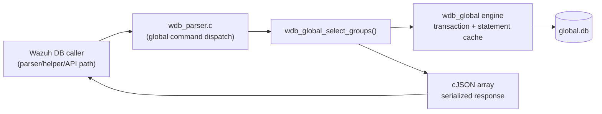
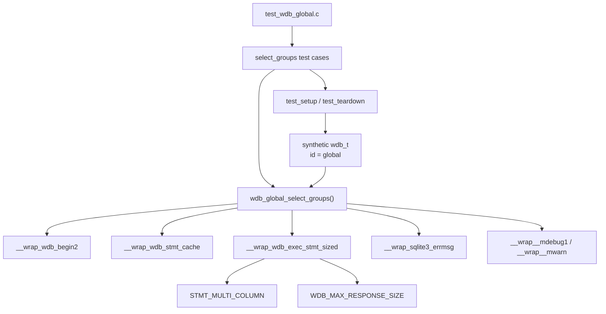
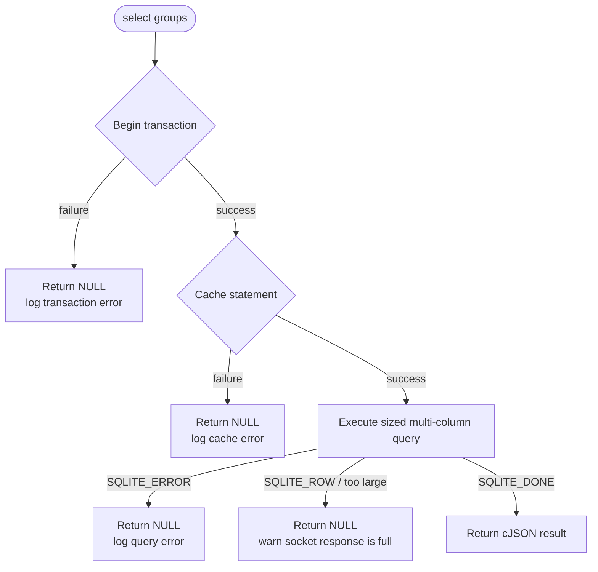
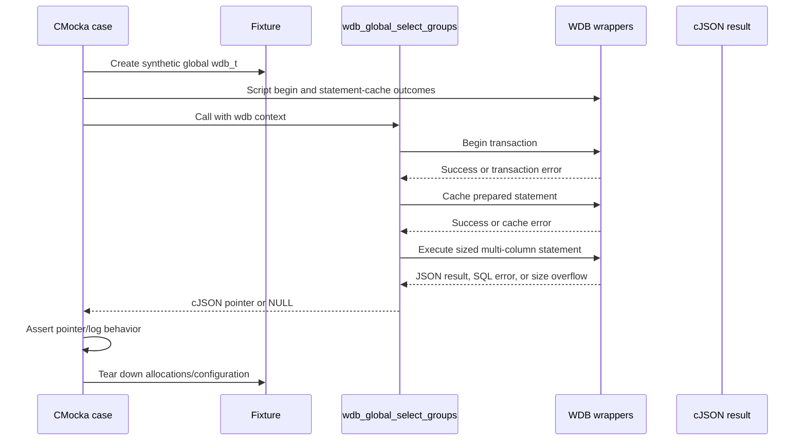

# `select_groups_tests`

## Introduction

`select_groups_tests` documents the CMocka tests for `wdb_global_select_groups()`, the Wazuh DB operation that reads the manager's complete group catalog from `global.db`. The tests verify the operation's transaction setup, prepared-statement caching, bounded multi-column query execution, normal JSON return, SQL failure handling, and response-size protection.

The tests are implemented in `src/unit_tests/wazuh_db/test_wdb_global.c`; this page isolates the `test_wdb_global_select_groups_*` cases from that broader file. For the shared fixture and wrapper conventions, see [`test_wdb_global_test_infrastructure.md`](test_wdb_global_test_infrastructure.md). For the production operation and its place in the database daemon, see [`wazuh_db_global.md`](wazuh_db_global.md), [`wazuh_db_engine.md`](wazuh_db_engine.md), and [`Unit_Tests_-_Wazuh_DB.md`](Unit_Tests_-_Wazuh_DB.md).

## Scope and intent

The module contains five scenarios:

| Test | Simulated condition | Expected result |
|---|---|---|
| `test_wdb_global_select_groups_transaction_fail` | `wdb_begin2()` fails | `NULL`; logs `Cannot begin transaction` |
| `test_wdb_global_select_groups_cache_fail` | `wdb_stmt_cache()` fails | `NULL`; logs `Cannot cache statement` |
| `test_wdb_global_select_groups_exec_fail` | Sized execution returns `SQLITE_ERROR` | `NULL`; logs `Failed to get groups: ERROR MESSAGE.` |
| `test_wdb_global_select_groups_socket_full` | Sized execution returns `SQLITE_ROW`, indicating an oversized response | `NULL`; warns that groups exceed socket capacity |
| `test_wdb_global_select_groups_success` | Sized execution returns `SQLITE_DONE` and a JSON result | Returns the supplied `cJSON *` unchanged |

The tests deliberately do not open a real SQLite database. They verify the observable contract of the function by scripting the wrapper calls and checking return values and diagnostics.

## Position in the system

`wdb_global_select_groups()` belongs to the core global-database layer inside `wazuh-db`. A command parser or a higher-level helper reaches the function through the Wazuh DB protocol; the function then uses the generic database engine and returns a JSON array representing group rows.

The implementation dependency is intentionally indirect in the unit test: SQLite and the database file are replaced by linker-wrapped seams. This keeps the test deterministic and makes each failure branch independently reproducible.

## Test architecture

The fixture allocates a minimal `wdb_t`, stores the identifier `global`, allocates a placeholder SQLite-handle slot, initializes global Wazuh DB configuration, and releases all of these objects after each case. The detailed lifecycle is maintained in [`test_wdb_global_test_infrastructure.md`](test_wdb_global_test_infrastructure.md).

## Dependency contracts exercised

### Transaction and statement preparation

The normal path begins with `wdb_begin2()` and then calls `wdb_stmt_cache()`. The first two tests stop at these boundaries. This establishes that the operation does not attempt query execution when the transaction or cached statement is unavailable.

### Bounded query execution

All query-path cases use `wrap_wdb_exec_stmt_sized_*` with:

- `max_size = WDB_MAX_RESPONSE_SIZE`
- `column_mode = STMT_MULTI_COLUMN`

`STMT_MULTI_COLUMN` indicates that each result row contains multiple columns, matching the group catalog query. The helper also scripts the SQLite-style outcome used by the production code:

The tests therefore cover both database failure and transport-boundary behavior. The socket-full case is not a successful partial result: it expects a `NULL` result and a warning, making the size limit an explicit failure boundary for this API.

## Data flow

On success, the test supplies `(cJSON *)1` as the mocked result and asserts pointer identity. This is intentional: the test checks that the production function forwards the query result rather than rebuilding or altering it. The test does not inspect group field names; row shape and schema belong to the production/global database documentation.

## Failure behavior and observability

The module verifies the following contract:

| Failure boundary | Observable behavior |
|---|---|
| Transaction initialization | `NULL` return and debug diagnostic |
| Statement cache initialization | `NULL` return and debug diagnostic |
| Query execution error | `NULL` return and debug diagnostic containing SQLite error text |
| Response exceeds socket maximum | `NULL` return and warning diagnostic |

The expected messages are part of the tests, so changes to operational diagnostics can require updating this module even if the return-value behavior remains unchanged.

## Relationship to neighboring documentation

- [`wazuh_db_global.md`](wazuh_db_global.md) — production global database responsibilities, group catalog, protocol position, and related group operations.
- [`wazuh_db_engine.md`](wazuh_db_engine.md) — transaction handling, statement caching, and SQLite execution abstractions used by the function.
- [`test_wdb_global_test_infrastructure.md`](test_wdb_global_test_infrastructure.md) — fixture construction and `wrap_wdb_exec_stmt_sized_*` helper semantics.
- [`wazuh_db_wrappers_global.md`](wazuh_db_wrappers_global.md) — wrapper boundary definitions used by the broader global test file.
- [`test_wdb_global.md`](test_wdb_global.md) — complete `test_wdb_global.c` coverage, including agent, group, synchronization, and backup tests.
- [`Unit_Tests_-_Wazuh_DB.md`](Unit_Tests_-_Wazuh_DB.md) — parent suite and execution model.

## Maintenance notes

When changing `wdb_global_select_groups()` or its SQL statement, preserve or deliberately revise these invariants:

1. The query is executed through the sized statement API.
2. The size passed to the wrapper remains `WDB_MAX_RESPONSE_SIZE` unless the socket protocol changes.
3. The query uses `STMT_MULTI_COLUMN`.
4. Transaction, cache, execution, and oversized-response branches remain distinguishable through return values and logs.
5. The returned JSON ownership contract remains consistent with the surrounding Wazuh DB code.

