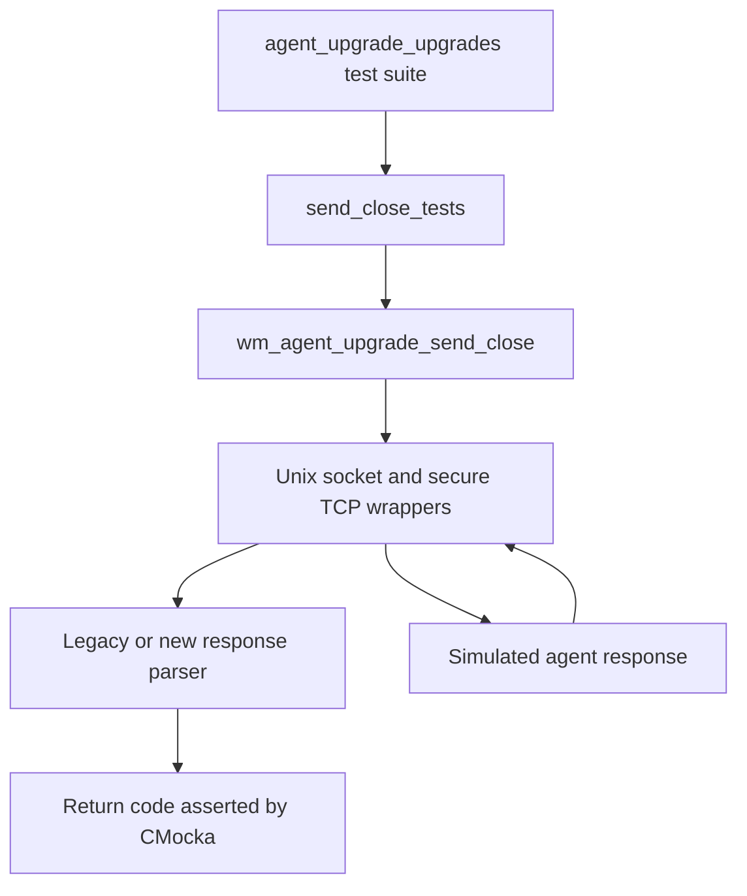
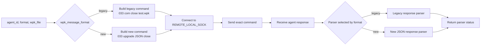
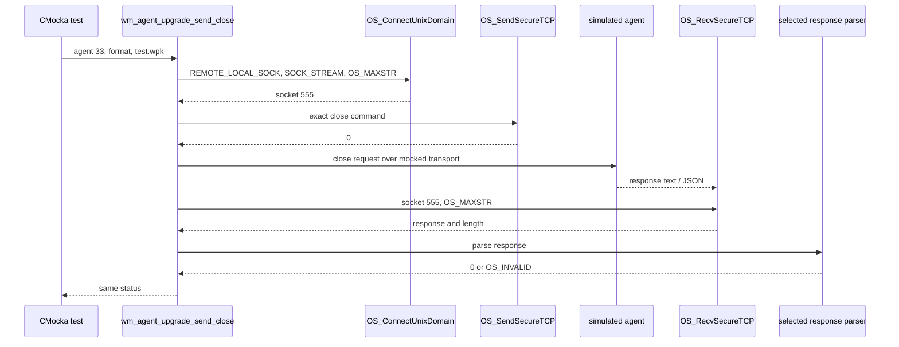
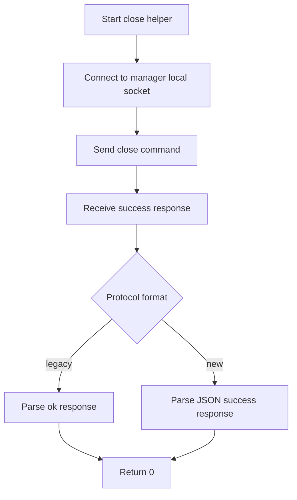
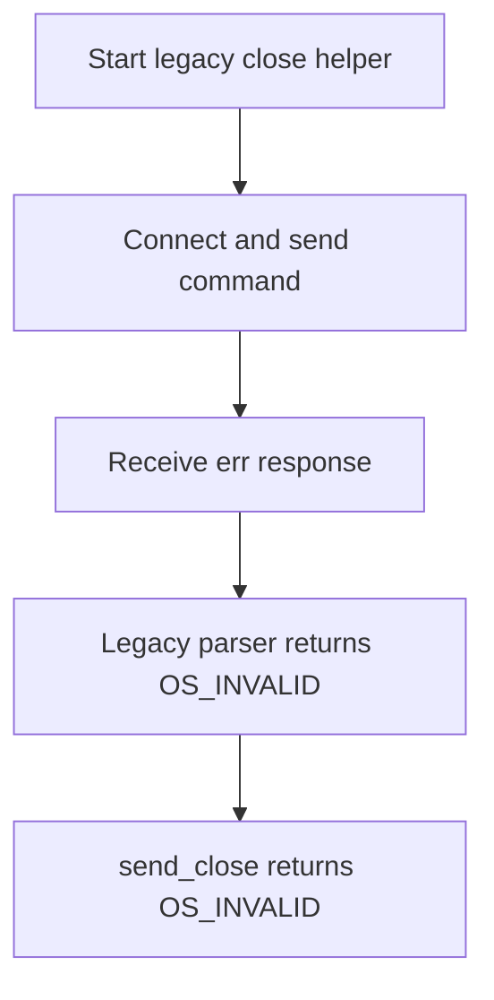
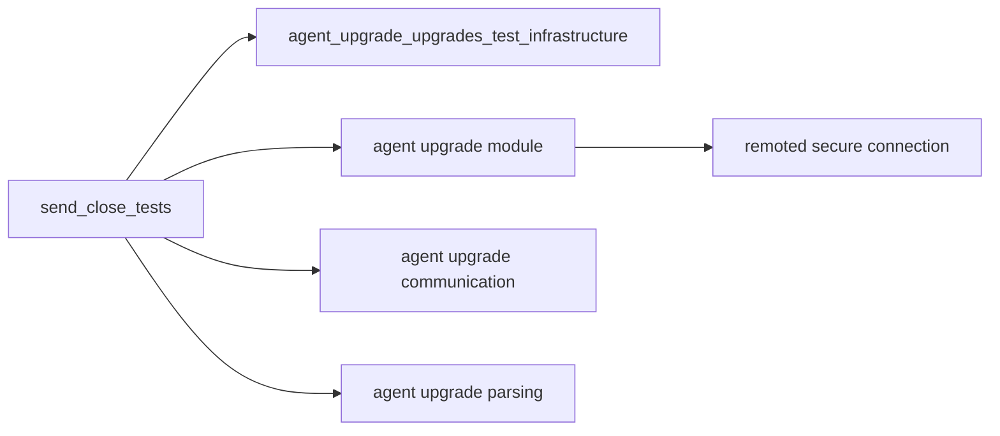

# `send_close_tests`

## Introduction

`send_close_tests` documents the CMocka tests for `wm_agent_upgrade_send_close`, the manager-side helper that asks an agent to close a transferred WPK file. The tests are located in `src/unit_tests/wazuh_modules/agent_upgrade/test_wm_agent_upgrade_upgrades.c` and focus on the close stage of the larger WPK transfer workflow.

The module does not implement production behavior. It verifies the contract between the upgrade worker, the remoted Unix-domain socket, the agent response parser, and the returned status code. General fixture setup and wrapper behavior are documented in [agent upgrade upgrades test infrastructure](agent_upgrade_upgrades_test_infrastructure.md). The surrounding manager/agent protocol is described in [agent upgrade module](agent_upgrade_module.md) and [agent upgrade communication](agent_upgrade_com.md).

## Scope and position in the system

The tests sit below the agent-upgrade transfer layer:

The production helper is one stage in the standard sequence:

`lock_restart` → `open` → `write` (possibly repeated) → **`close`** → `sha1` → `upgrade`.

This page covers only the bolded close operation. Transfer sequencing, retries, hashing, and installer execution belong to the broader [agent upgrade module](agent_upgrade_module.md) documentation.

## Covered behavior

The three registered tests are:

| Test | Protocol format | Command sent | Simulated response | Expected result |
| --- | --- | --- | --- | --- |
| `test_wm_agent_upgrade_send_close_ok` | Legacy | `033 com close test.wpk` | `ok ` | `0` |
| `test_wm_agent_upgrade_send_close_ok_new` | New | `033 upgrade {"command":"close","parameters":{"file":"test.wpk"}}` | `{"error":0,"message":"ok","data": []}` | `0` |
| `test_wm_agent_upgrade_send_close_err` | Legacy | `033 com close test.wpk` | `err Could not close file in agent` | `OS_INVALID` |

All cases use agent ID `33`, WPK filename `test.wpk`, and a mocked socket descriptor `555`. The tests deliberately use the same legacy error case to establish that a parsed agent-side failure is returned by the low-level helper rather than converted into a higher-level transfer error.

## Component responsibilities

| Component | Role in these tests |
| --- | --- |
| `wm_agent_upgrade_send_close` | Builds the protocol-specific command, sends it, receives the response, selects the parser, and returns the parser result. |
| `OS_ConnectUnixDomain` | Provides the simulated connection to `REMOTE_LOCAL_SOCK`. |
| `OS_SendSecureTCP` | Verifies the exact command bytes and command length. |
| `OS_RecvSecureTCP` | Supplies the simulated agent response using a bounded `OS_MAXSTR` receive. |
| `wm_agent_upgrade_parse_agent_response` | Parses legacy `ok`/`err` responses. |
| `wm_agent_upgrade_parse_agent_upgrade_command_response` | Parses the structured response used by the new protocol. |
| `__wrap__mtdebug2` | Verifies send and receive diagnostics tagged `wazuh-modulesd:agent-upgrade`. |

The wrappers are test seams, not alternate implementations. Their expectations make the external protocol observable without requiring a running agent or remoted daemon.

## Input, command, and result flow

The observed contract is:

1. The helper receives an agent ID, a message-format selector, and the remote filename.
2. The agent ID is rendered as a three-character field (`033` for ID `33`) in the command examples.
3. The helper connects with `SOCK_STREAM` and `OS_MAXSTR` as the maximum message size.
4. It sends a command whose length is exactly `strlen(command)`.
5. It receives the response with `OS_MAXSTR` as the receive limit.
6. It invokes the parser associated with the selected protocol.
7. The parser result is returned unchanged for the tested success and failure cases.

## Component interaction

The test also expects two debug events for each request: one for the outgoing command (`8165`) and one for the received response (`8166`). The error case therefore verifies both the transport exchange and the diagnostic visibility of the agent failure.

## Process flows

### Successful close

### Agent-reported close failure

These tests do not assert a retry loop or a cleanup-specific return value. Any retry policy or stage-level mapping is tested by the enclosing WPK-transfer cases and documented in [agent upgrade upgrades test infrastructure](agent_upgrade_upgrades_test_infrastructure.md).

## Mock expectations and invariants

Each test establishes the following transport invariants:

- Connection path: `REMOTE_LOCAL_SOCK`.
- Socket type: `SOCK_STREAM`.
- Maximum message size: `OS_MAXSTR`.
- Socket returned by the connect wrapper: `555`.
- Send and receive operations use socket `555`.
- Send succeeds with return value `0`.
- Receive length is `strlen(response) + 1`.
- Debug logging uses tag `wazuh-modulesd:agent-upgrade`.

The command text is checked byte-for-byte, which protects the compatibility boundary between legacy and new agents. The parser wrapper is also checked with the exact response string, ensuring that a successful transport exchange cannot accidentally be treated as a successful close without response validation.

## Registration and execution

The tests are registered in the `main` CMocka array with `cmocka_unit_test` and run as part of the common `cmocka_run_group_tests` suite. They share the group fixture described in [agent upgrade upgrades test infrastructure](agent_upgrade_upgrades_test_infrastructure.md), including unit-test mode and common wrapper setup.

Because these cases do not allocate a WPK task or exercise worker dispatch, they use the lightweight test registration path rather than the configuration-and-agent fixtures used by `wm_agent_upgrade_send_wpk_to_agent` tests.

## Dependencies and references

- [Agent upgrade upgrades test infrastructure](agent_upgrade_upgrades_test_infrastructure.md) — fixtures, wrapper conventions, and suite registration.
- [Agent upgrade module](agent_upgrade_module.md) — manager-side transfer sequence and legacy/new protocol context.
- [Agent upgrade communication](agent_upgrade_com.md) — agent-side command vocabulary and communication boundary.
- [Agent upgrade parsing](agent_upgrade_parsing.md) — parsing and response-validation behavior shared by upgrade commands.
- [Remoted secure connection](remoted_secure_connection.md) — lower-level secure communication behavior used by the mocked socket boundary.

## Maintenance guidance

When changing close-command behavior, update this module if any of the following changes:

- command formatting or the three-digit agent-ID representation;
- the legacy/new format discriminator;
- the parser selected for either response format;
- socket path, socket type, buffer limit, or send/receive API;
- response strings or parser return-code mapping;
- diagnostic message identifiers or text.

Keep the close tests focused on this single protocol stage. Changes to package validation, transfer retries, SHA-1 verification, installer execution, queueing, or task status should be documented and tested in the broader modules linked above.
