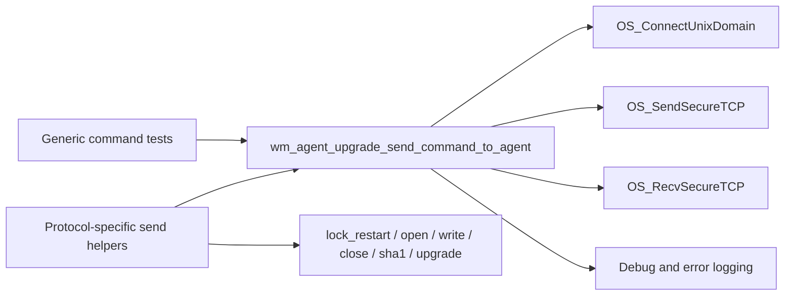
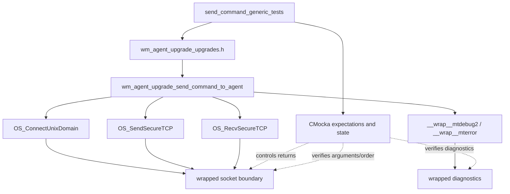
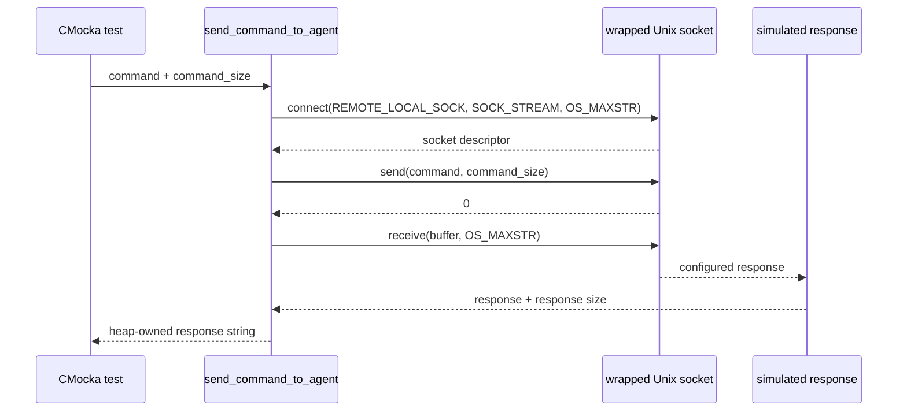
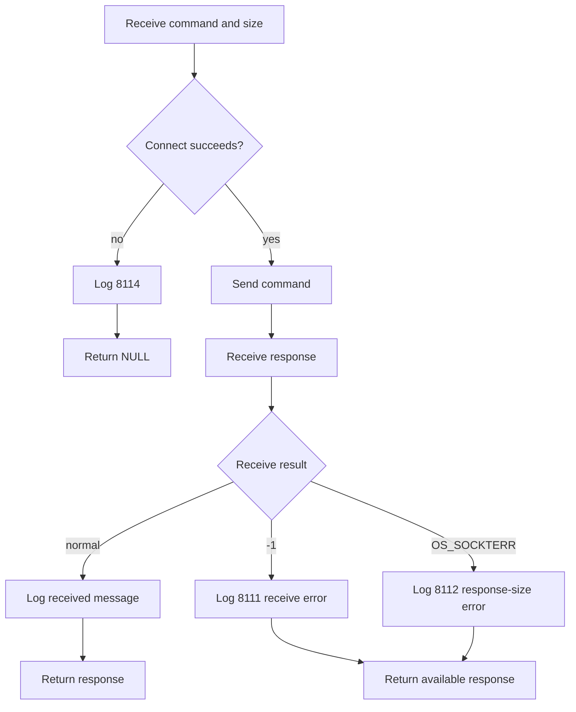
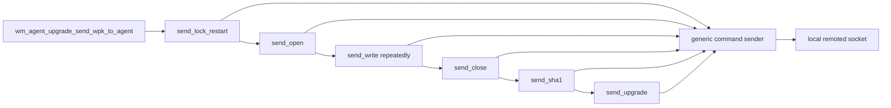

# `send_command_generic_tests`

## Introduction

`send_command_generic_tests` documents the CMocka tests for
`wm_agent_upgrade_send_command_to_agent`, the lowest-level manager-side command
transport used by the Wazuh agent-upgrade module. The tests verify connection
setup, command transmission, bounded response reception, response ownership,
and the observable behavior of connection and receive failures.

The tests are a focused part of
`src/unit_tests/wazuh_modules/agent_upgrade/test_wm_agent_upgrade_upgrades.c`.
The same source file also contains tests for WPK transfer and upgrade
orchestration; those broader concerns are covered by the
[agent-upgrade module documentation](agent_upgrade_module.md) and the shared
[upgrades test infrastructure documentation](agent_upgrade_upgrades_test_infrastructure.md).

## Scope and position

| Item | Description |
|---|---|
| Test module | `send_command_generic_tests` |
| Source file | `src/unit_tests/wazuh_modules/agent_upgrade/test_wm_agent_upgrade_upgrades.c` |
| Production symbol | `wm_agent_upgrade_send_command_to_agent` |
| Transport | `REMOTE_LOCAL_SOCK` via `OS_ConnectUnixDomain`, `OS_SendSecureTCP`, and `OS_RecvSecureTCP` |
| Test framework | CMocka, with wrapped networking and logging functions |
| Primary concern | Generic command/response transport, independent of a live agent or socket |

The helper is deliberately below the protocol-specific operations. Functions
such as lock-restart, open, write, close, SHA-1, and upgrade command senders
build the command text and interpret the response; this helper performs the
common local IPC exchange. The relationship is:

## Architecture and dependencies

The test does not start `wazuh-modulesd`, connect to a real agent, or exercise
the remote agent command parser. Instead, CMocka wrappers replace the external
seams and make every call observable.

The important test dependencies are:

| Dependency | Role in the tests |
|---|---|
| `OS_ConnectUnixDomain` | Supplies a simulated socket or a connection error. |
| `OS_SendSecureTCP` | Verifies the exact command and byte count sent. |
| `OS_RecvSecureTCP` | Supplies the simulated response, receive error, or oversized-response condition. |
| `__wrap__mtdebug2` | Verifies send/receive diagnostic messages. |
| `__wrap__mterror` | Verifies error diagnostics for failed reception or connection. |
| `teardown_string` | Releases the heap response retained in CMocka state. |

For fixture allocation, global test mode, queue state, and suite registration,
see the linked [test infrastructure documentation](agent_upgrade_upgrades_test_infrastructure.md)
instead of duplicating those details here.

## Observable command contract

The tests establish the following behavioral contract:

1. Connect to `REMOTE_LOCAL_SOCK` as a stream socket with `OS_MAXSTR` as the
   maximum message size.
2. Send the caller-provided command with the caller-provided command length.
3. Receive into a bounded buffer using `OS_MAXSTR`.
4. Log the outgoing and incoming messages at debug level.
5. Return the received response as caller-owned memory when a response is
   available.
6. Return `NULL` when the socket connection cannot be established.

The tests intentionally pass the command length explicitly. They therefore
verify the transport call contract rather than treating the helper as a
string-validation routine.

## Test scenarios

The four tests are registered together in `main()` under the
`wm_agent_upgrade_send_command_to_agent` group.

| Test | Simulated condition | Main assertions |
|---|---|---|
| `test_wm_agent_upgrade_send_command_to_agent_ok` | Connect, send, and receive succeed. | Correct socket arguments, command bytes, response size, logs, and returned response. |
| `test_wm_agent_upgrade_send_command_to_agent_recv_error` | Receive returns `-1`. | Receive error `(8111)` is logged and a response object remains available to the caller. |
| `test_wm_agent_upgrade_send_command_to_agent_sockterr_error` | Receive returns `OS_SOCKTERR`. | Oversized-response error `(8112)` is logged and the supplied response is preserved. |
| `test_wm_agent_upgrade_send_command_to_agent_connect_error` | Connection returns `OS_SOCKTERR`. | Connection error `(8114)` is logged and the helper returns `NULL`. |

The success test uses the representative command
`Command to agent: restart agent now.` and response
`Command received OK.`. The exact strings are less important than the fact
that the wrapper expectations prove the command is sent unchanged and the
returned response is unchanged.

## Happy-path data flow

Every arrow crossing the socket boundary is checked with CMocka
`expect_*` assertions. `will_return` controls the simulated result, so the
test is deterministic and does not depend on timing, agent availability, or
network configuration.

## Error and process flow

The tests distinguish connection failure from receive failure. A connection
failure prevents a usable transport from existing and produces `NULL`; receive
failures are validated as response-side conditions and retain the response
buffer observed by the test. This distinction is important to callers that
map transport errors to stage-specific upgrade failures.

## Interaction with higher-level upgrade operations

The generic helper is reused by the staged WPK transfer path. Higher-level
tests verify the sequencing and error mapping for those stages; this module
only verifies the common command exchange.

The resulting division of responsibility is:

- generic command tests: connection, send/receive calls, response ownership,
  and transport diagnostics;
- WPK transfer tests: package validation, chunking, retries, SHA-1 matching,
  platform installer selection, and stage-specific error codes;
- orchestration tests: task status updates, worker dispatch, semaphores, and
  queue preparation.

See the [agent upgrade module](agent_upgrade_module.md) for the end-to-end
manager/agent architecture and [agent upgrade manager](agent_upgrade_manager.md)
for the manager-side IPC and task entry points.

## Maintenance guidance

When changing this transport boundary, update these tests whenever any of the
following changes:

- socket path, socket type, or maximum receive size;
- command byte-count semantics;
- response allocation or ownership;
- error-code mapping or diagnostic message IDs;
- retry or response-size handling in the wrapped socket functions.

Keep the test focused on observable transport behavior. Changes to WPK
validation, file chunking, protocol selection, or task status should be
covered in the neighboring tests already registered in
`test_wm_agent_upgrade_upgrades.c` and documented through the linked
agent-upgrade pages.

