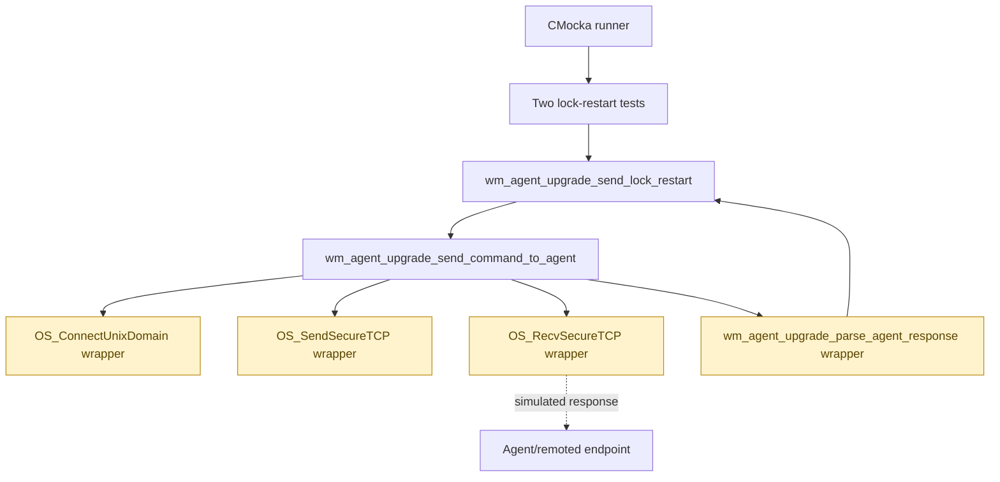
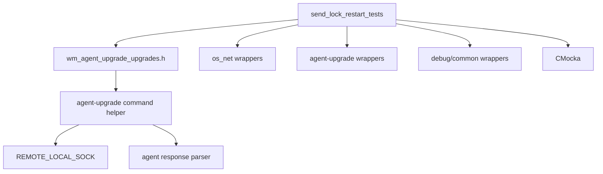
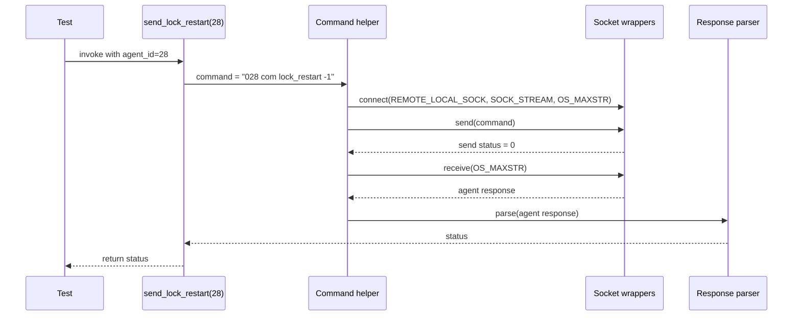

# `send_lock_restart_tests`

## Introduction

`send_lock_restart_tests` documents the focused CMocka tests for
`wm_agent_upgrade_send_lock_restart`. The tests verify the first command sent
to an agent during the Wazuh agent-upgrade protocol: locking agent restart
while the upgrade package is transferred and installed.

The module is a unit-test slice, not a production transport. Socket operations,
agent responses, response parsing, and logging are replaced by wrappers so the
tests assert the command contract deterministically.

## Scope and location

The tests are defined in:

`src/unit_tests/wazuh_modules/agent_upgrade/test_wm_agent_upgrade_upgrades.c`

The focused test cases are:

| Test | Scenario | Expected result |
| --- | --- | --- |
| `test_wm_agent_upgrade_send_lock_restart_ok` | The agent acknowledges `lock_restart` with `ok ` | Returns `0` |
| `test_wm_agent_upgrade_send_lock_restart_err` | The agent returns `err Could not restart agent` | Returns `OS_INVALID` |

These tests are registered directly in the CMocka suite under the
`wm_agent_upgrade_send_lock_restart` section. They do not use a per-test
fixture; the shared test-group setup only enables wrapper test mode.

## Role in the upgrade subsystem

The lock-restart operation is the first phase of the package-transfer path.
The broader upgrade orchestration, task lifecycle, and command family are
documented in [agent_upgrade_upgrades_test_infrastructure.md](agent_upgrade_upgrades_test_infrastructure.md),
[agent_upgrade_tasks_callbacks.md](agent_upgrade_tasks_callbacks.md),
[agent_upgrade_commands.md](agent_upgrade_commands.md), and
[agent_upgrade_module.md](agent_upgrade_module.md).


The focused module validates only `Lock`; the neighboring phases are tested
elsewhere in the same source file and should not be inferred from these two
cases.

## Architecture and component relationships

The subject under test formats the agent command and delegates transport to
the generic agent-upgrade command helper. The helper connects to the manager's
local remoted socket, sends the command, receives one response, and passes the
response to the agent-upgrade response parser.



In the unit-test process, the four wrapper nodes are mocks. No Unix-domain
socket is opened and no live agent is contacted.

## Dependencies

| Dependency | Function in this module | Related documentation |
| --- | --- | --- |
| `wm_agent_upgrade_upgrades.h` | Declares the upgrade command behavior under test | [agent_upgrade_upgrades_test_infrastructure.md](agent_upgrade_upgrades_test_infrastructure.md) |
| `wm_agent_upgrade_tasks.h` | Supplies adjacent upgrade task definitions used by the containing test translation unit | [agent_upgrade_tasks_callbacks.md](agent_upgrade_tasks_callbacks.md) |
| `os_net_wrappers` | Mocks connect, send, and receive calls | [os_net.md](os_net.md) |
| `wm_agent_upgrade_wrappers` | Mocks response parsing and upgrade helpers | [agent_upgrade_upgrades_test_infrastructure.md](agent_upgrade_upgrades_test_infrastructure.md) |
| Shared/debug wrappers | Capture logging and common Wazuh behavior | [test_infrastructure.md](test_infrastructure.md) |
| CMocka | Provides test registration, expectations, and assertions | [test_infrastructure.md](test_infrastructure.md) |
| `REMOTE_LOCAL_SOCK`, `SOCK_STREAM`, `OS_MAXSTR` | Define the expected local transport, socket type, and receive bound | [os_net.md](os_net.md) |



## Command contract

For agent ID `28`, both tests require the exact command:

```text
028 com lock_restart -1
```

The test therefore documents these behavioral requirements:

1. The numeric agent ID is rendered as a three-character, zero-padded field.
2. The command uses the `com` agent-command namespace.
3. The command operation is `lock_restart`.
4. The command argument is `-1`.
5. The command is sent through `REMOTE_LOCAL_SOCK` as a stream socket.
6. The receive operation is bounded by `OS_MAXSTR`.
7. The parsed agent response status is returned to the caller.

The tests also assert the debug messages emitted around transport:

```text
(8165): Sending message to agent: '028 com lock_restart -1'
(8166): Receiving message from agent: 'ok '
```

## Data flow



The success case injects `ok ` and makes the parser return `0`. The error case
injects `err Could not restart agent` and makes the parser return `OS_INVALID`.

## Process flows

### Successful acknowledgment

```mermaid
flowchart TD
    A[Call with agent ID 28] --> B[Format 028 com lock_restart -1]
    B --> C[Connect to REMOTE_LOCAL_SOCK]
    C --> D[Send command]
    D --> E[Receive "ok "]
    E --> F[Parser returns 0]
    F --> G[Test asserts return value is 0]
```

### Agent-level failure

```mermaid
flowchart TD
    A[Call with agent ID 28] --> B[Format 028 com lock_restart -1]
    B --> C[Connect and send successfully]
    C --> D[Receive "err Could not restart agent"]
    D --> E[Parser returns OS_INVALID]
    E --> F[Subject propagates OS_INVALID]
    F --> G[Test asserts failure result]
```

Transport failures are intentionally outside this module's focused contract.
They are covered by the neighboring
`wm_agent_upgrade_send_command_to_agent` tests, which exercise connect, send,
and receive failures independently.

## Interaction and assertion matrix

| Stage | Expected interaction | Why it matters |
| --- | --- | --- |
| Formatting | `28` becomes `028` | The agent protocol expects a fixed-width ID prefix |
| Connection | `OS_ConnectUnixDomain(REMOTE_LOCAL_SOCK, SOCK_STREAM, OS_MAXSTR)` | Confirms the manager-side local transport is selected |
| Send | Exact command and `strlen(command)` | Prevents protocol drift and incorrect payload sizing |
| Receive | `OS_RecvSecureTCP(..., OS_MAXSTR)` | Confirms the standard response bound |
| Logging | Send and receive debug records | Preserves operational traceability |
| Parsing | Parser receives the exact response string | Separates protocol interpretation from transport |
| Return | Parser status is returned unchanged | Makes agent acknowledgment/failure visible to upgrade orchestration |

## Maintenance guidance

Update this module and its expectations together when changing any of the
following:

- command formatting or the `lock_restart` protocol token;
- socket path, socket type, or receive-size constants;
- response prefixes (`ok ` / `err `) or parser return codes;
- debug message identifiers or wording;
- the generic command helper's call order.

If the generic transport changes, update the generic command-helper tests and
the [os_net.md](os_net.md) reference as well. If the lock-restart operation is
removed from the package-transfer sequence, update the orchestration
documentation and the end-to-end upgrade tests rather than retaining this
unit-test contract unchanged.

## Source map

| Source | Relevant symbols |
| --- | --- |
| `src/unit_tests/wazuh_modules/agent_upgrade/test_wm_agent_upgrade_upgrades.c` | `test_wm_agent_upgrade_send_lock_restart_ok`, `test_wm_agent_upgrade_send_lock_restart_err` |
| `src/wazuh_modules/agent_upgrade/manager/wm_agent_upgrade_upgrades.h` | `wm_agent_upgrade_send_lock_restart`, command-helper declarations |
| `src/unit_tests/wrappers/wazuh/os_net/os_net_wrappers.c` | Mocked socket connection, send, and receive boundaries |
| `src/unit_tests/wrappers/wazuh/wazuh_modules/wm_agent_upgrade_wrappers.c` | Mocked response parser and upgrade-specific collaborators |

