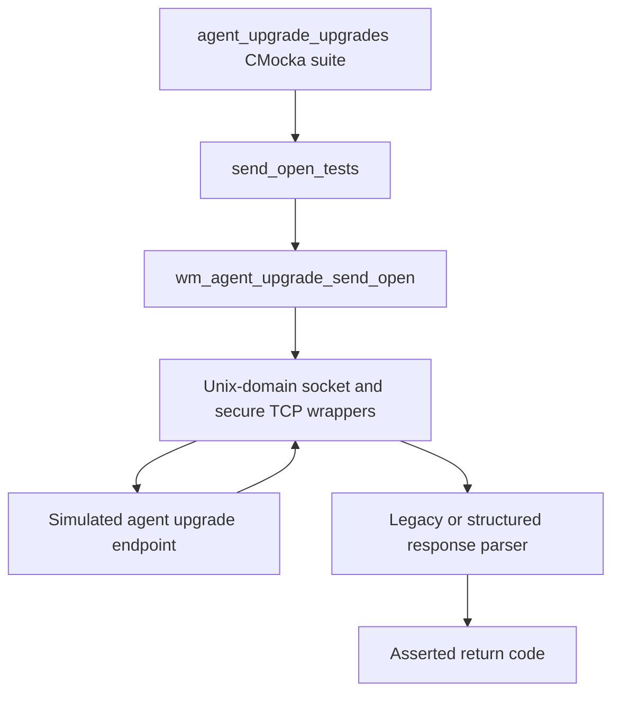
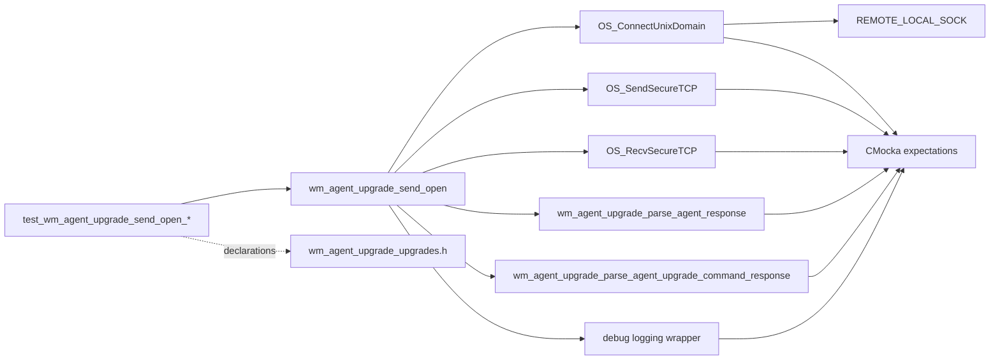
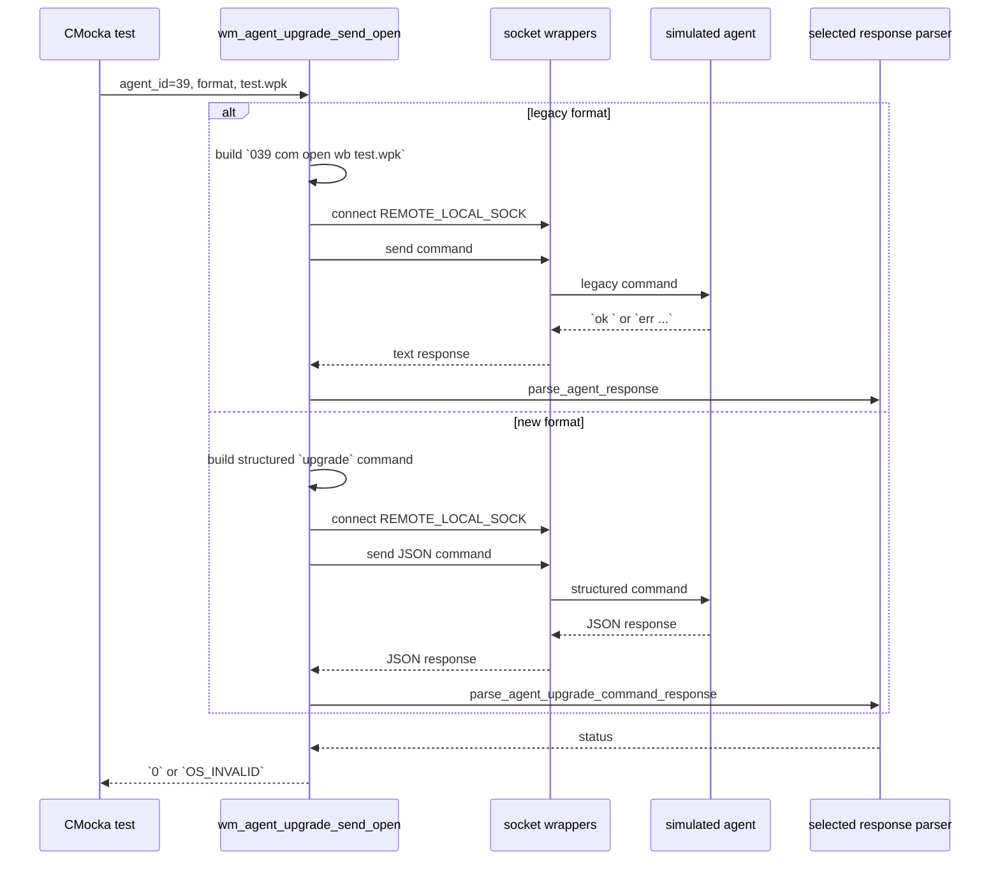
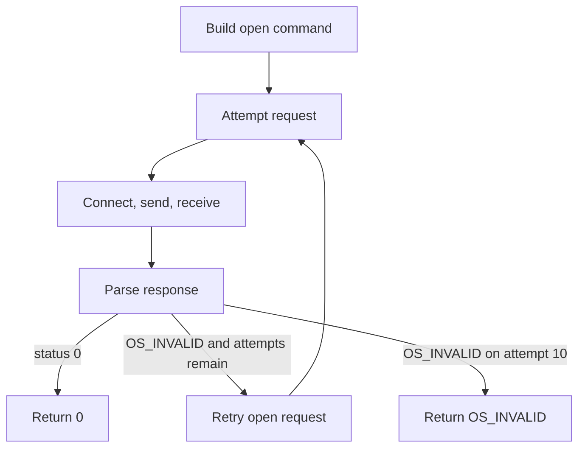
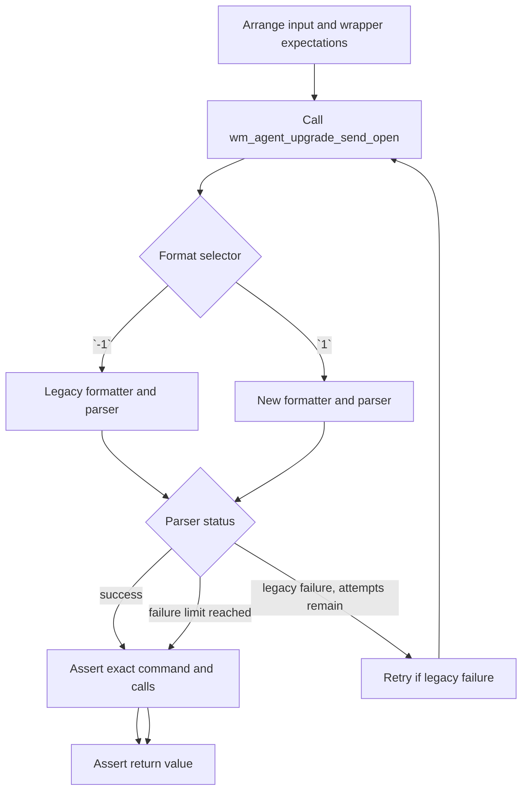

# `send_open_tests`

## Introduction

`send_open_tests` documents the CMocka tests for `wm_agent_upgrade_send_open`, the manager-side helper that asks an agent to open the destination WPK file before the package is transferred. The tests validate command construction, protocol-specific response parsing, Unix-domain socket usage, and retry behavior without requiring a live agent or remoted daemon.

The tests are implemented in `src/unit_tests/wazuh_modules/agent_upgrade/test_wm_agent_upgrade_upgrades.c`. They exercise production code from `src/wazuh_modules/agent_upgrade/manager/wm_agent_upgrade_upgrades.c`. Shared fixtures and wrapper conventions are described in [agent upgrade upgrades test infrastructure](agent_upgrade_upgrades_test_infrastructure.md); the broader transfer lifecycle belongs to [agent upgrade module](agent_upgrade_module.md).

## Position in the system

The module is a focused child of the agent-upgrade “upgrades” suite. It verifies one stage of the WPK transfer pipeline:

In the complete transfer, the open stage follows `lock_restart` and precedes `write`, `close`, `sha1`, and `upgrade`. The neighboring stages are documented by the broader [agent upgrade module](agent_upgrade_module.md) page and related focused test pages such as [send close tests](send_close_tests.md).

## Scope and responsibilities

The four tests establish that `wm_agent_upgrade_send_open`:

- formats the command using the supplied agent ID and WPK filename;
- supports both the legacy `com` protocol and the newer structured upgrade protocol;
- connects through `REMOTE_LOCAL_SOCK` using a stream socket;
- sends the complete command and receives a bounded response;
- selects the matching response parser;
- retries a legacy open request after an agent-level error; and
- returns `OS_INVALID` after ten unsuccessful attempts.

The test module does not test the real socket implementation, file transfer, SHA1 computation, or agent-side file handling. Those concerns are represented by wrappers and belong to the surrounding upgrade tests.

## Covered test cases

| Test | Format | Command observed | Response sequence | Expected result |
| --- | --- | --- | --- | --- |
| `test_wm_agent_upgrade_send_open_ok` | Legacy (`-1`) | `039 com open wb test.wpk` | `ok ` | `0` |
| `test_wm_agent_upgrade_send_open_ok_new` | New (`1`) | `039 upgrade {"command":"open","parameters":{"mode":"wb","file":"test.wpk"}}` | `{"error":0,"message":"ok","data": []}` | `0` |
| `test_wm_agent_upgrade_send_open_retry_ok` | Legacy (`-1`) | Same legacy command on both attempts | `err ...`, then `ok ` | `0` |
| `test_wm_agent_upgrade_send_open_retry_err` | Legacy (`-1`) | Same legacy command ten times | Ten `err ...` responses | `OS_INVALID` |

All cases use agent ID `39`, filename `test.wpk`, and mocked socket descriptor `555`. The exact command strings are significant: the tests protect the wire protocol, including the three-character zero-padded agent ID and the fixed remote write mode `wb`.

## Components and dependencies

### Production helper

`wm_agent_upgrade_send_open` is the code under test. Its inputs are an agent ID, a message-format selector, and a WPK filename. It builds one protocol command, delegates the request/response exchange to the upgrade communication helpers, invokes the appropriate parser, and exposes the parser status to its caller.

### Communication wrappers

The tests replace these external boundaries with CMocka wrappers:

| Boundary | Contract checked |
| --- | --- |
| `OS_ConnectUnixDomain` | `REMOTE_LOCAL_SOCK`, `SOCK_STREAM`, and `OS_MAXSTR` are used. |
| `OS_SendSecureTCP` | The expected command and `strlen(command)` are sent on socket `555`. |
| `OS_RecvSecureTCP` | The response is read from socket `555` with an `OS_MAXSTR` limit. |
| `__wrap__mtdebug2` | Each send and receive is logged with the agent-upgrade tag and expected message. |

### Response parsers

The format selector controls the parser:

- Legacy format (`-1`) uses `wm_agent_upgrade_parse_agent_response`, which consumes text such as `ok ` or `err Could not open file in agent`.
- New format (`1`) uses `wm_agent_upgrade_parse_agent_upgrade_command_response`, which consumes the structured response containing `error`, `message`, and `data` fields.

The parser wrappers return controlled values. A return value of `0` means the agent accepted the open request; `OS_INVALID` represents an agent-side failure.

## Command and response data flow

The tests assert the complete request/response boundary rather than only the final status. This catches regressions in command spelling, JSON shape, message length, socket parameters, logging, and parser dispatch.

## Retry process

Only the legacy retry path is covered explicitly. The first failure is parsed as `OS_INVALID`, after which the helper reconnects and resends the open command. A successful second response terminates the loop. When every response is invalid, the test expects ten complete attempts and the final `OS_INVALID` status.

The ten-attempt limit is documented here as a tested behavior: `test_wm_agent_upgrade_send_open_retry_err` sets ten connection, send, receive, logging, and parser expectations. The test does not distinguish whether the limit is represented by a named constant or an internal loop condition.

## Test interaction details

For each attempt, CMocka verifies the following order:

1. Connect to `REMOTE_LOCAL_SOCK` with `SOCK_STREAM` and `OS_MAXSTR`.
2. Emit the send debug message.
3. Send the exact command and its string length.
4. Receive the response with `OS_MAXSTR`.
5. Emit the receive debug message.
6. Pass the response to the format-specific parser.

The retry test repeats this contract rather than merely calling the helper twice, so a retry that skips reconnection or parser invocation would fail.

## Failure semantics and maintenance notes

- A parser result of `0` is surfaced as helper success.
- An agent response parsed as `OS_INVALID` causes another open attempt while the retry budget remains.
- Exhausting the retry budget returns `OS_INVALID` in the focused test contract.
- The new-format happy path proves parser selection and JSON command construction, but no new-format retry case is registered here.
- Socket and logging behavior is verified through wrappers; changes to the underlying transport should be documented and tested in the shared [test infrastructure](agent_upgrade_upgrades_test_infrastructure.md).
- Changes to command syntax should update both the exact-string expectations in this module and the protocol documentation in [agent upgrade communication](agent_upgrade_com.md).

## Source and related documentation

- Test implementation: `src/unit_tests/wazuh_modules/agent_upgrade/test_wm_agent_upgrade_upgrades.c`
- Production helper: `src/wazuh_modules/agent_upgrade/manager/wm_agent_upgrade_upgrades.c`
- [Agent upgrade module](agent_upgrade_module.md)
- [Agent upgrade communication](agent_upgrade_com.md)
- [Agent upgrade upgrades test infrastructure](agent_upgrade_upgrades_test_infrastructure.md)
- [Send-close tests](send_close_tests.md)
