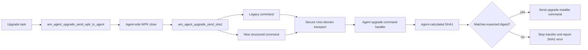
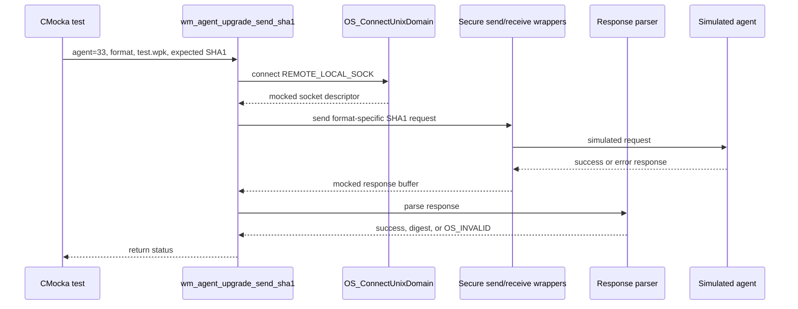
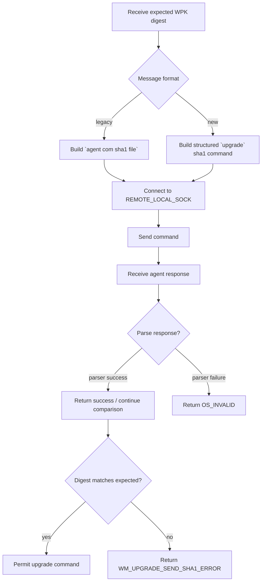
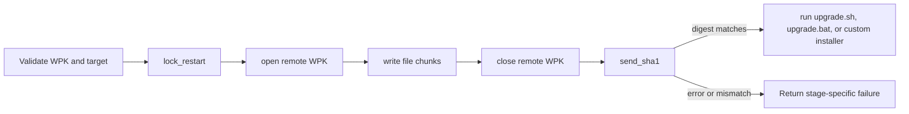

# `send_sha1_tests`

## Introduction

`send_sha1_tests` documents the focused CMocka tests for
`wm_agent_upgrade_send_sha1()`, the manager-side step that asks an agent to
calculate the SHA1 of the WPK file transferred during an upgrade. The tests
verify both supported agent command formats and the error path when the agent
cannot calculate the digest.

The tests are part of the larger `wm_agent_upgrade_upgrades` suite. Shared
fixtures, wrappers, ownership rules, and test registration are documented in
[`agent_upgrade_upgrades_test_infrastructure.md`](agent_upgrade_upgrades_test_infrastructure.md).
The complete upgrade command lifecycle is covered by
[`agent_upgrade_module.md`](agent_upgrade_module.md) and
[`agent_upgrade_commands.md`](agent_upgrade_commands.md).

## Scope and source map

| Concern | Source or boundary | Role |
| --- | --- | --- |
| Focused tests | `src/unit_tests/wazuh_modules/agent_upgrade/test_wm_agent_upgrade_upgrades.c` | Defines the three SHA1 test cases |
| Production helper | `wm_agent_upgrade_send_sha1()` in the agent-upgrade upgrades implementation | Builds, sends, and validates the agent SHA1 command |
| Transport | `OS_ConnectUnixDomain`, `OS_SendSecureTCP`, `OS_RecvSecureTCP` | Manager-to-agent IPC, replaced by CMocka wrappers |
| Legacy parser | `wm_agent_upgrade_parse_agent_response()` | Parses responses such as `ok <sha1>` or `err <message>` |
| New parser | `wm_agent_upgrade_parse_agent_upgrade_command_response()` | Parses structured JSON upgrade responses |
| Larger transfer | `wm_agent_upgrade_send_wpk_to_agent()` | Calls SHA1 verification after close and before upgrade execution |

The target tests are unit tests. They do not open a real socket, contact an
agent, read a WPK file, or calculate SHA1 locally.

## Position in the upgrade architecture

The SHA1 helper is a narrow boundary between WPK transfer and installer
execution. The manager already knows the expected digest, obtained from WPK
validation or local-file hashing. It asks the agent to hash its received copy
and compares the returned value before permitting the upgrade command.



## Command contracts

The protocol format is selected by the `wpk_message_format` argument. The
tests use `-1` for the legacy protocol and `1` for the newer protocol.

| Format | Request sent by the manager | Simulated successful response | Parser boundary |
| --- | --- | --- | --- |
| Legacy (`-1`) | `033 com sha1 test.wpk` | `ok d321af65983fa412e3a12c312ada12ab321a253a` | `wm_agent_upgrade_parse_agent_response` |
| New (`1`) | `033 upgrade {"command":"sha1","parameters":{"file":"test.wpk"}}` | `{"error":0,"message":"d321af65983fa412e3a12c312ada12ab321a253a","data":[]}` | `wm_agent_upgrade_parse_agent_upgrade_command_response` |

The agent ID is formatted as a three-digit field in both command forms. The
test uses ID `33`, resulting in the wire prefix `033`.

## Component interaction



The tests assert the exact socket setup and wire message. This makes command
format regressions visible even though the transport itself is mocked.

## Test cases

### `test_wm_agent_upgrade_send_sha1_ok`

This is the legacy-format success case. It configures:

- agent ID `33`;
- WPK name `test.wpk`;
- expected digest `d321af65983fa412e3a12c312ada12ab321a253a`;
- message format `-1`.

The test expects a connection to `REMOTE_LOCAL_SOCK` using `SOCK_STREAM` and
`OS_MAXSTR`, followed by one secure send and one secure receive. The legacy
parser is mocked as successful, and the helper must return `0`.

### `test_wm_agent_upgrade_send_sha1_ok_new`

This is the structured-protocol success case. It uses the same agent, file,
and digest but passes format `1`. The expected request is a JSON-shaped
`upgrade` command. The new response parser is mocked to expose the returned
digest and a successful status. The helper must return `0`.

This test verifies protocol selection and response-parser selection; it does
not independently validate JSON parsing because that parser is a mocked
boundary in this unit.

### `test_wm_agent_upgrade_send_sha1_err`

This is the legacy error case. The simulated agent returns:

```text
err Could not calculate sha1 in agent
```

The legacy parser returns `OS_INVALID`, which must propagate from
`wm_agent_upgrade_send_sha1()`. The test also verifies that the error response
is received through the same secure transport path as a successful response.

## SHA1 process flow



The parser-success branch is deliberately shown separately from digest
comparison. The focused `send_sha1` tests mock parser behavior; sibling WPK
transfer tests exercise the aggregate mismatch behavior, including the log
message `(8118): The SHA1 of the file doesn't match in the agent.` and the
`WM_UPGRADE_SEND_SHA1_ERROR` result.

## Integration with WPK transfer

For a normal or custom upgrade, the surrounding transfer function follows
this order:



Consequently, a successful SHA1 request is necessary but not sufficient for a
successful upgrade: the returned digest must match the expected WPK digest,
and the installer command must also succeed. Conversely, a parser or agent
error stops the pipeline before the installer is run.

## Test isolation and assertions

The focused tests rely on the shared wrappers described in
[`agent_upgrade_upgrades_test_infrastructure.md`](agent_upgrade_upgrades_test_infrastructure.md):

- socket path, socket type, and maximum message size are asserted;
- the exact outgoing command is asserted;
- the receive buffer size and simulated response are asserted;
- the applicable response parser is asserted;
- parser return values are controlled to isolate the helper’s propagation
  behavior;
- no real network, agent process, or filesystem is involved.

The tests therefore protect the helper’s observable contract:

1. select the correct command encoding;
2. send it through the expected local IPC boundary;
3. dispatch the response to the matching parser;
4. return parser failure unchanged; and
5. allow a successful parsed response to proceed to digest validation.

## Coverage boundaries and maintenance notes

These three tests do not cover every failure that can occur around SHA1
verification. In particular, transport failures, response allocation, digest
mismatch handling inside the aggregate WPK workflow, retry policy, and
post-verification installer failures are covered by neighboring tests in the
same suite or by the broader upgrade documentation.

When changing the wire protocol, update both success tests together and keep
the following synchronized:

- the format discriminator;
- the exact command string or JSON structure;
- the parser wrapper used by the helper;
- the simulated response;
- the expected return code.

When changing the transfer sequence, preserve the invariant that SHA1
verification occurs after the remote file is closed and before the upgrade
installer command is sent.

## Related documentation

- [`agent_upgrade_module.md`](agent_upgrade_module.md) — overall agent-upgrade architecture and execution lifecycle.
- [`agent_upgrade_commands.md`](agent_upgrade_commands.md) — command orchestration and task preparation.
- [`agent_upgrade_com.md`](agent_upgrade_com.md) — manager/agent command communication.
- [`agent_upgrade_agent.md`](agent_upgrade_agent.md) — agent-side upgrade behavior.
- [`agent_upgrade_upgrades_test_infrastructure.md`](agent_upgrade_upgrades_test_infrastructure.md) — shared fixtures, wrappers, and CMocka setup.
