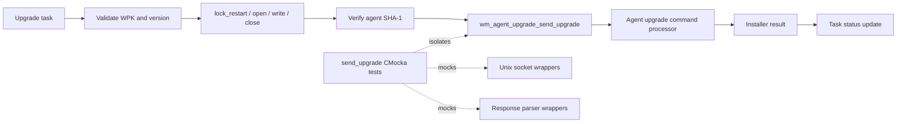
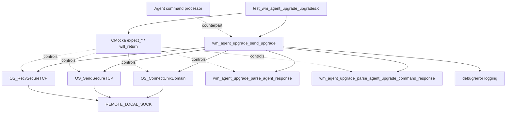
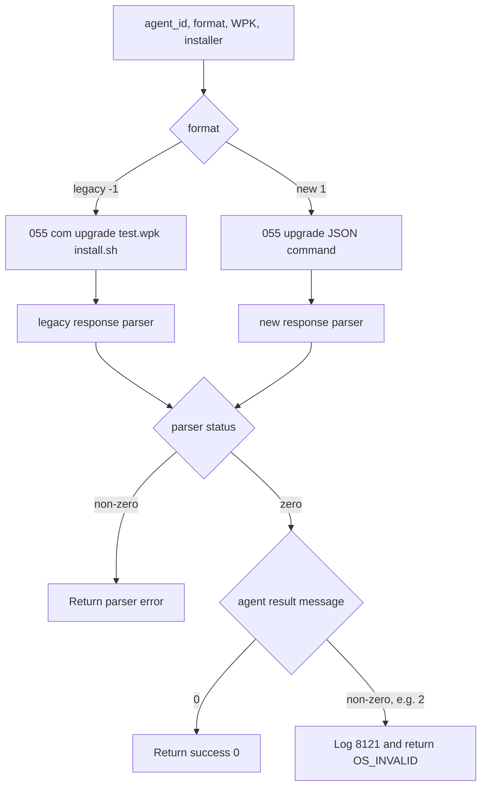
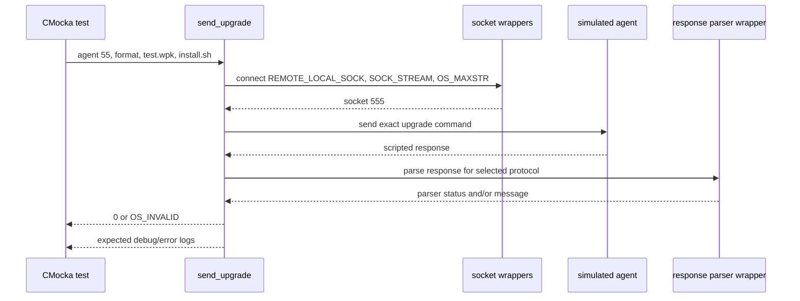
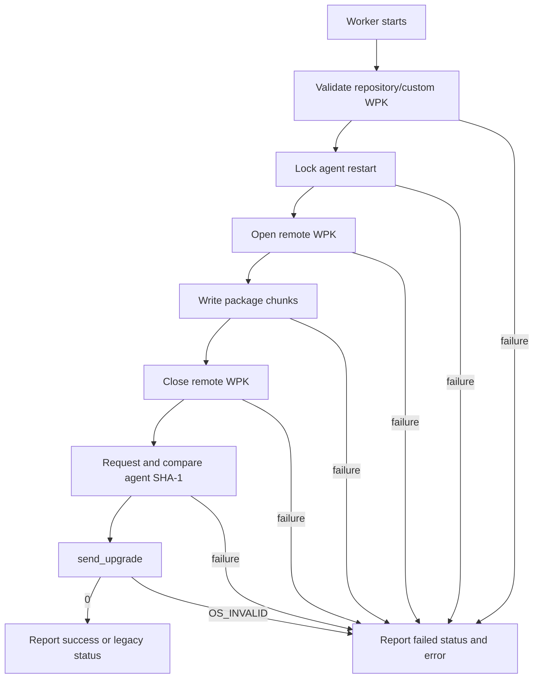

# `send_upgrade` tests

## Introduction

This module documents the CMocka tests for `wm_agent_upgrade_send_upgrade`, the manager-side helper that sends the final upgrade command to a Wazuh agent after its WPK has been transferred and verified. The tests cover both the legacy `com` protocol and the newer JSON-based protocol, plus agent-command and installer failures.

The tests are part of the broader [agent-upgrade test infrastructure](agent_upgrade_upgrades_test_infrastructure.md). They verify command construction, socket usage, response parsing, logging, and return-code translation without requiring a live agent or Unix socket. The production module’s wider scheduling and transfer workflow is described in [agent upgrade module](agent_upgrade_module.md).

## Scope and position in the system

The helper is the final step in the manager-side WPK workflow:



`send_upgrade` does not download or write the WPK. It only asks the agent to execute the already-uploaded package, selecting the wire format through `wpk_message_format`.

## Components and dependencies

The focused source file is `src/unit_tests/wazuh_modules/agent_upgrade/test_wm_agent_upgrade_upgrades.c`. The production implementation belongs to `wm_agent_upgrade_upgrades.c` and its declarations are exposed by `wm_agent_upgrade_upgrades.h`.



Related responsibilities are documented rather than repeated here:

- [Agent-side command processing](agent_upgrade_com.md) handles the received `upgrade` command and installer execution.
- [Upgrade orchestration](agent_upgrade_module.md) covers validation, queueing, worker threads, status updates, and the complete `send_wpk_to_agent` sequence.
- [Shared test fixtures and wrappers](agent_upgrade_upgrades_test_infrastructure.md) documents setup/teardown, socket wrappers, parser mocks, and neighboring test groups.

## Function contract

`wm_agent_upgrade_send_upgrade(agent_id, wpk_message_format, wpk_file, installer)` receives:

| Argument | Meaning | Evidence in tests |
|---|---|---|
| `agent_id` | Target agent numeric identifier. It is rendered as a three-digit field in the legacy command and the JSON command prefix. | `55` becomes `055`. |
| `wpk_message_format` | Selects the wire protocol. The tests use `-1` for legacy and `1` for the newer format. | Both branches are exercised. |
| `wpk_file` | Name of the WPK already present on the agent. | `test.wpk`. |
| `installer` | Installer script to execute. | `install.sh`. |

The helper connects to `REMOTE_LOCAL_SOCK` using a stream socket and `OS_MAXSTR` as the maximum message size. It sends one command, receives one response, logs both directions, parses the response, and returns a status code.

## Wire formats

### Legacy protocol

For `wpk_message_format = -1`, the command is:

```text
055 com upgrade test.wpk install.sh
```

The response is parsed by `wm_agent_upgrade_parse_agent_response`. A response beginning with `ok` indicates that the command was accepted; the numeric payload still determines whether the installer itself succeeded.

### New protocol

For `wpk_message_format = 1`, the command is structured JSON after the agent prefix:

```text
055 upgrade {"command":"upgrade","parameters":{"file":"test.wpk","installer":"install.sh"}}
```

The response is parsed by `wm_agent_upgrade_parse_agent_upgrade_command_response`. The test supplies:

```json
{"error":0,"message":"0","data":[]}
```

The parser returns the message string (`"0"`) and a zero parser status.



## Component interaction

The tests use CMocka expectations to make the interaction sequence observable. The socket is not opened: `OS_ConnectUnixDomain` returns a test socket value (`555`), and the send/receive wrappers return scripted values.



## Test matrix

| Test | Format | Command/response | Parser outcome | Expected result |
|---|---:|---|---|---:|
| `test_wm_agent_upgrade_send_upgrade_ok` | `-1` | Legacy command; `ok 0` | Legacy parser returns `0` | `0` |
| `test_wm_agent_upgrade_send_upgrade_ok_new` | `1` | JSON command; `error: 0`, message `"0"` | New parser returns message `"0"`, status `0` | `0` |
| `test_wm_agent_upgrade_send_upgrade_err` | `-1` | Legacy command; `err Could not run script in agent` | Legacy parser returns `OS_INVALID` | `OS_INVALID` |
| `test_wm_agent_upgrade_send_upgrade_script_err` | `-1` | Legacy command; `ok 2` | Parser succeeds, agent reports non-zero script result | `OS_INVALID` and log 8121 |

The matrix separates three failure classes:

1. **Transport/protocol parsing failure** — an `err` response causes the parser to return `OS_INVALID`.
2. **Agent execution failure** — an `ok` response can still contain a non-zero installer result (`2`); the helper logs `Script execution failed in the agent.` and returns `OS_INVALID`.
3. **Successful execution** — legacy `ok 0` and new-protocol message `"0"` both return `0`.

## Detailed behavior

### Request construction

The tests assert the complete transmitted string, not only its fields. This protects the three-digit agent formatting, command keyword, WPK filename, installer name, JSON property names, and JSON nesting. A change to whitespace, field order, or the protocol discriminator would therefore be visible in the unit suite.

### Socket contract

Each test expects:

- `OS_ConnectUnixDomain(REMOTE_LOCAL_SOCK, SOCK_STREAM, OS_MAXSTR)`;
- `OS_SendSecureTCP` with the exact command and `strlen(command)`;
- `OS_RecvSecureTCP` with the test socket and `OS_MAXSTR`;
- the scripted response length including its terminating byte.

The helper emits debug messages 8165 and 8166 for the outgoing and incoming messages. The error-path test also verifies the agent-upgrade error log 8121.

### Response interpretation

The parser’s return value is checked before the agent’s execution result. Thus, a syntactically valid response with a non-zero script result is not treated as a transport failure; it is converted into the common `OS_INVALID` result and logged as an installer failure.

## Process flow in the complete upgrade

`send_upgrade` is called only after earlier stages succeed. The surrounding workflow is:



See [send WPK to agent tests](agent_upgrade_upgrades_test_infrastructure.md) for the neighboring transfer-stage coverage and [start-upgrade tests](agent_upgrade_upgrades_test_infrastructure.md) for status-update orchestration in the shared test file.

## Test design and maintenance notes

- Keep command strings synchronized with the production protocol and the agent-side contract in [agent upgrade command processing](agent_upgrade_com.md).
- When adding a protocol variant, add both a request assertion and the corresponding parser expectation.
- Preserve separate tests for parser errors and non-zero installer results; they exercise different branches even though both return `OS_INVALID`.
- Prefer wrapper expectations over real sockets or installers. The shared fixture already provides deterministic response ownership and cleanup.
- If the return-code mapping changes, update both the test matrix and the broader stage-specific error documentation in [agent upgrade module](agent_upgrade_module.md).

## References

- [Agent upgrade module](agent_upgrade_module.md)
- [Agent-side command processor](agent_upgrade_com.md)
- [Agent upgrade test infrastructure](agent_upgrade_upgrades_test_infrastructure.md)
- [Agent upgrade agent runtime](agent_upgrade_agent.md)
- [Task manager module](task_manager_module.md)
