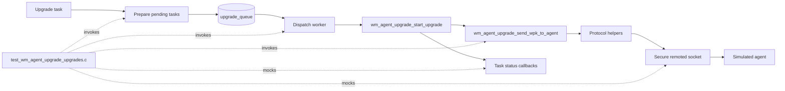
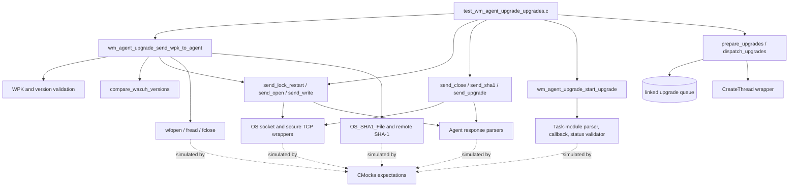
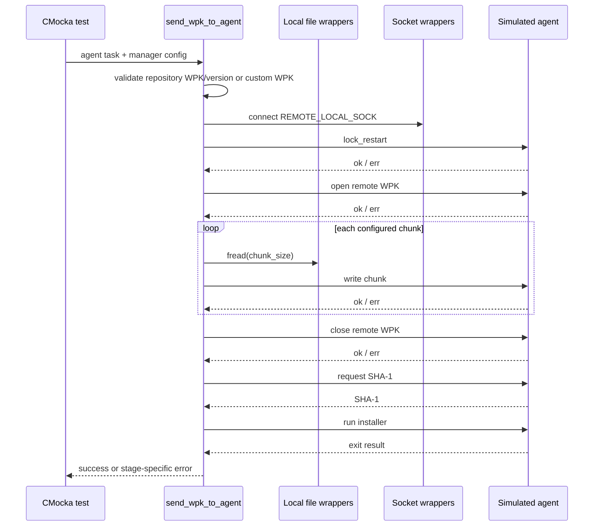
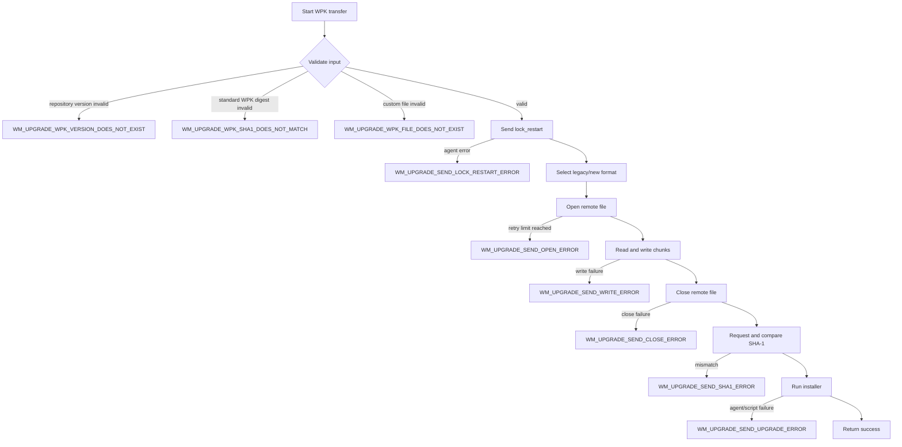
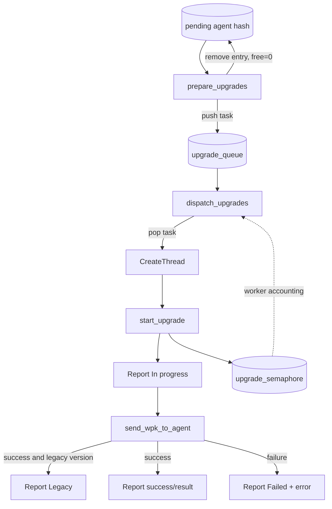
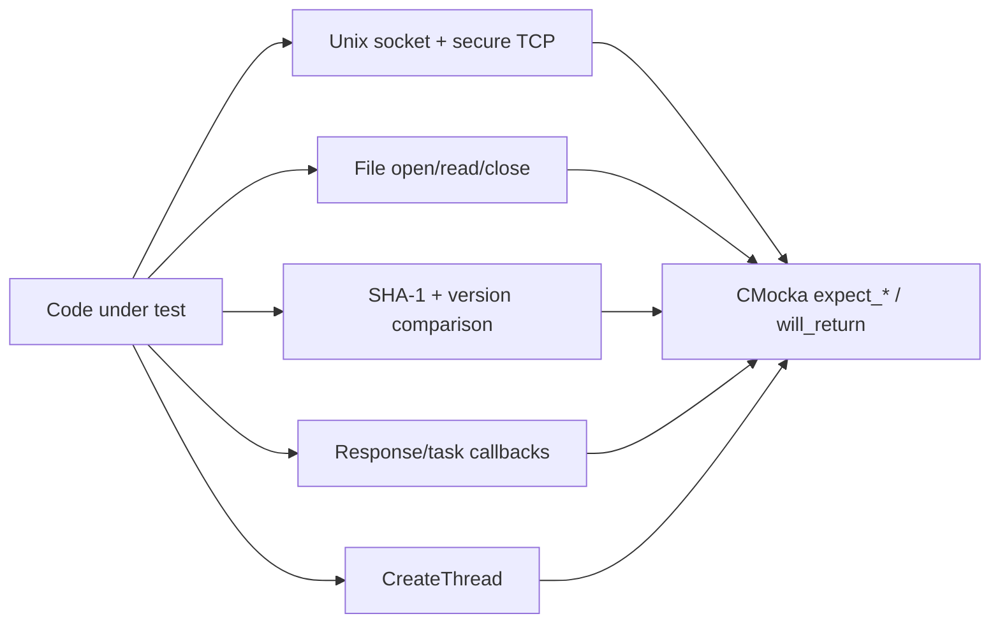

# `send_wpk_to_agent` tests

## Introduction

This page documents the CMocka coverage for `wm_agent_upgrade_send_wpk_to_agent` and adjacent upgrade helpers in `src/unit_tests/wazuh_modules/agent_upgrade/test_wm_agent_upgrade_upgrades.c`. The suite verifies manager-side WPK transfer to an agent, including protocol selection, chunked file transfer, remote SHA-1 verification, installer execution, queue dispatch, and task-status reporting.

The page is focused on the test contract. The broader production lifecycle is described in [agent upgrade module](agent_upgrade_module.md), while common fixtures and wrappers are described in [agent upgrade upgrades test infrastructure](agent_upgrade_upgrades_test_infrastructure.md).

## Position in the system

The tests exercise the transfer portion of the manager-side agent-upgrade pipeline. External effects are replaced with wrappers, so no live agent, repository, socket, worker thread, or real package is required.

## Components and dependencies

The key boundary is the difference between real control flow and mocked dependencies: transfer functions, branching, retry logic, and return-code mapping are under test; network, filesystem, hashing, parsing, logging, and thread scheduling are controlled seams.

## Covered functions

| Area | Functions | What the tests establish |
|---|---|---|
| Generic command transport | `wm_agent_upgrade_send_command_to_agent` | Connect, send, receive, logging, and transport-error behavior. |
| Remote file lifecycle | `send_lock_restart`, `send_open`, `send_write`, `send_close` | Command construction, response parsing, chunk writes, local file handling, and open retries. |
| Integrity and execution | `send_sha1`, `send_upgrade` | SHA-1 comparison, installer selection, legacy/new protocol handling, and agent execution results. |
| WPK orchestration | `wm_agent_upgrade_send_wpk_to_agent` | Validation followed by lock, open, write, close, SHA-1, and upgrade in order. |
| Worker lifecycle | `wm_agent_upgrade_start_upgrade` | In-progress, legacy, success, and failed status updates plus semaphore release. |
| Scheduling | `wm_agent_upgrade_prepare_upgrades`, `dispatch_upgrades` | Hash-to-queue movement, queue consumption, thread entry-point selection, and ownership handoff. |

## WPK transfer contract

For a standard upgrade, tests configure an agent task, repository URL, package name, expected digest, platform, and agent version. For a custom upgrade, they provide a local WPK path and optionally an installer name. Both paths converge on the same remote transfer sequence.

The happy-path fixtures use a five-byte chunk size and payload `test\\n`. Standard Linux and Windows cases differ in the final installer (`upgrade.sh` versus `upgrade.bat`). Custom cases use `test.sh` when supplied and default to `upgrade.sh` otherwise.

## Protocol formats

The suite verifies both the legacy `com` protocol and the newer structured `upgrade` protocol. Version comparison against `WM_UPGRADE_NEW_UPGRADE_MECHANISM` controls the selected format.

| Operation | Legacy example | New-protocol behavior |
|---|---|---|
| Lock restart | `111 com lock_restart -1` | Structured `upgrade` command with lock-restart operation. |
| Open | `111 com open wb test.wpk` | JSON command containing mode and file. |
| Write | `111 com write 5 test.wpk test\\n` | JSON command containing file, length, and encoded chunk. |
| Close | `111 com close test.wpk` | Structured close operation. |
| SHA-1 | `111 com sha1 test.wpk` | Structured SHA-1 operation. |
| Upgrade | `111 com upgrade test.wpk upgrade.sh` | Structured upgrade operation with package and installer. |

Legacy responses are represented by `ok ...` and `err ...`; new responses are JSON error/message/data objects. See [agent upgrade commands](agent_upgrade_commands.md) and [send upgrade tests](send_upgrade_tests.md) for detailed command-level contracts.

## Validation and failure flow

Direct helper tests generally assert `0` or `OS_INVALID`. Orchestration tests verify the more specific `WM_UPGRADE_*` mapping at the failure stage.

## Retry and error behavior

`send_open` is tested for immediate success, success after a retry, and repeated failures. The repeated-failure case supplies ten failed responses and expects `WM_UPGRADE_SEND_OPEN_ERROR`. Earlier stages short-circuit later stages: a failed write does not close, hash, or execute the package in the scripted interaction.

The suite distinguishes an agent command error from a non-zero installer result. A parsed `err` response is a command failure. A parsed `ok 2` response means the command was understood but the installer returned a failure result; this is logged as script execution failure and mapped to `OS_INVALID` by the helper, then to the upgrade-stage error by the orchestrator.

## Worker, queue, and status flow

`prepare_upgrades` moves each pending task from the hash table into the linked queue and removes the original entry without freeing the task payload prematurely. `dispatch_upgrades` supplies `wm_agent_upgrade_start_upgrade` and the expected task/configuration arguments to `CreateThread`. The thread wrapper checks ownership and frees its argument, avoiding real concurrency while preserving the handoff contract.

`start_upgrade` reports `In progress` before transfer. Tests cover successful standard upgrades, a legacy completion path, custom upgrades, and failed lock-restart status. The semaphore value is inspected after completion to detect missing worker-slot release.

## Test fixtures and mocking strategy

Shared fixture details live in [agent upgrade upgrades test infrastructure](agent_upgrade_upgrades_test_infrastructure.md). The suite uses:

- `setup_config_agent_task` for direct WPK-transfer tests;
- `setup_upgrade_args` for worker/status tests and a known semaphore value;
- `setup_nodes` for one- and two-entry queue preparation;
- socket wrappers for `REMOTE_LOCAL_SOCK`, secure send/receive, and exact message assertions;
- file wrappers for `wfopen`, `fread`, and `fclose`;
- `OS_SHA1_File` and `compare_wazuh_versions` wrappers;
- legacy/new response parsers and task-module status wrappers;
- `test_mode` group setup for deterministic unit-test mode.

## Coverage matrix

| Test group | Representative scenarios | Expected result |
|---|---|---|
| Command sender | Connect, send, receive, socket failures | Success or controlled transport error. |
| Lock restart | `ok` and `err` responses | `0` or `OS_INVALID`. |
| Open | Legacy/new command, retry success, retry exhaustion | `0` or open error. |
| Write | Chunk success, agent write error, local open error | `0` or write error. |
| Close | Legacy/new success and agent error | `0` or close error. |
| SHA-1 | Matching digest, agent error, digest mismatch | `0` or SHA-1 error. |
| Upgrade command | Linux/Windows installer, custom installer, script error | `0` or `OS_INVALID`. |
| Full standard transfer | Linux and Windows package paths | `0`. |
| Full custom transfer | Explicit and default installer | `0`. |
| Full-transfer failures | Validation, lock, open, write, close, SHA-1, upgrade | Stage-specific `WM_UPGRADE_*` code. |
| Worker start | In-progress, legacy, custom, failed status | Correct callbacks and semaphore accounting. |
| Queue management | One/multiple pending tasks, dispatch | Tasks queued, removed, popped, and handed to worker. |

## Maintenance guidance

When changing the transfer protocol or orchestration, update exact-message expectations and the corresponding Mermaid sequence together. Preserve coverage for:

1. legacy and new message formats;
2. standard versus custom WPK validation;
3. platform-specific and default installers;
4. the ten-attempt open retry boundary;
5. remote SHA-1 comparison rather than only local hashing;
6. stage-specific error translation;
7. queue removal, thread argument ownership, and semaphore release.

Changes to shared fixtures, wrapper ownership, or test registration belong in [agent upgrade upgrades test infrastructure](agent_upgrade_upgrades_test_infrastructure.md). Changes to task parsing/status behavior should cross-reference [agent upgrade tasks](agent_upgrade_tasks.md) and [task manager module](task_manager_module.md) instead of duplicating those contracts here.

## Related documentation

- [Agent upgrade module](agent_upgrade_module.md) — production architecture and manager/agent responsibilities.
- [Agent upgrade commands](agent_upgrade_commands.md) — command vocabulary and protocol details.
- [Send upgrade tests](send_upgrade_tests.md) — focused final installer-command tests.
- [Send open tests](send_open_tests.md), [send write tests](send_write_tests.md), [send close tests](send_close_tests.md), and [send SHA-1 tests](send_sha1_tests.md) — helper-level protocol tests.
- [Agent upgrade upgrades test infrastructure](agent_upgrade_upgrades_test_infrastructure.md) — fixtures, wrappers, and runner lifecycle.
- [Dispatch and prepare upgrades tests](dispatch_prepare_upgrades_tests.md) — queue and worker scheduling coverage.
- [Agent upgrade tasks](agent_upgrade_tasks.md) — task structures and callbacks.

