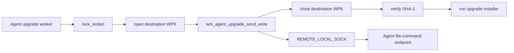
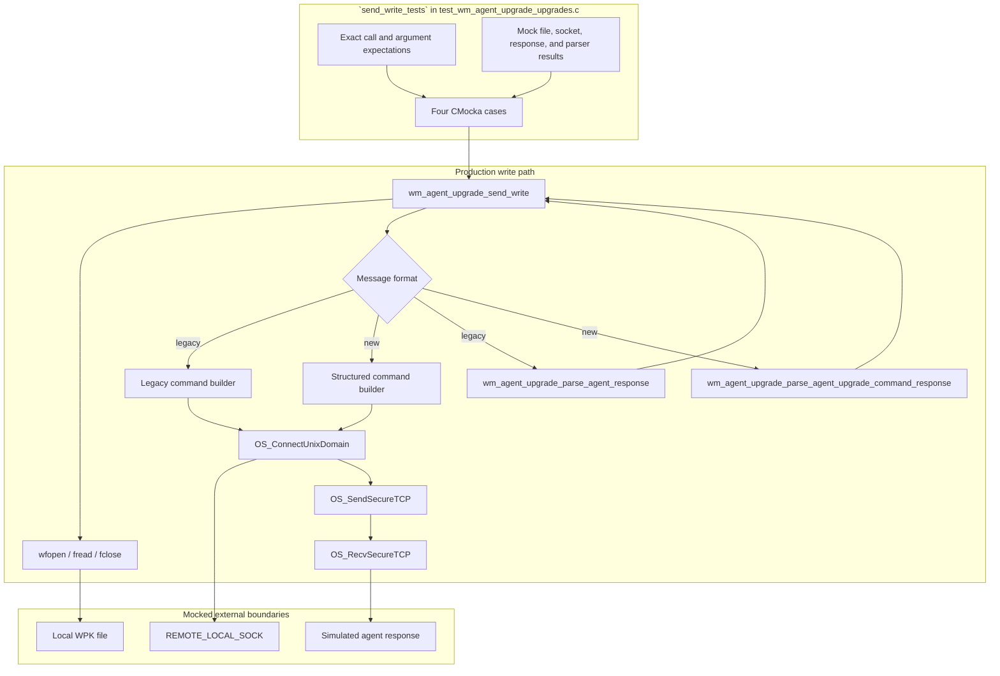
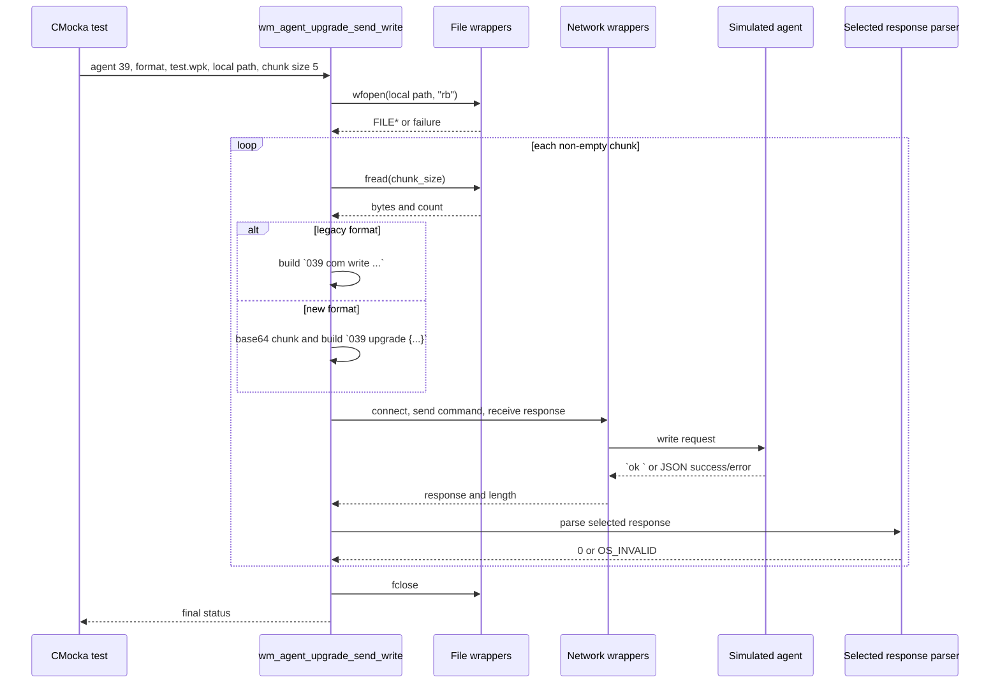
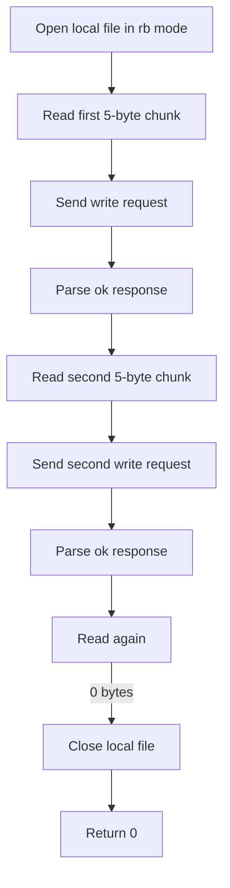
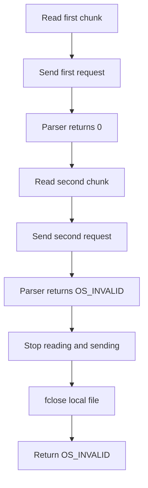
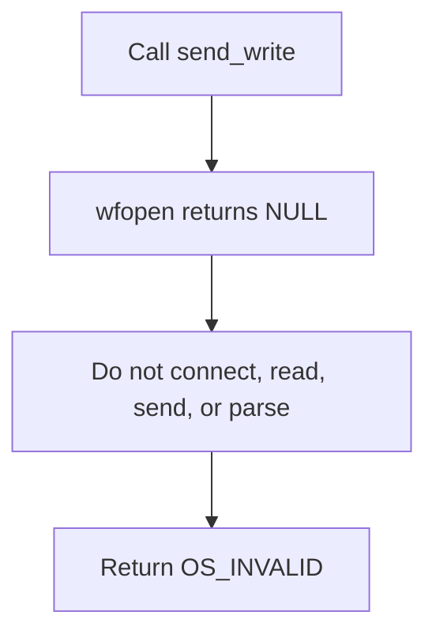

# `send_write_tests`

## Introduction

`send_write_tests` documents the CMocka tests for `wm_agent_upgrade_send_write`, the manager-side helper that transfers WPK file contents to an agent in chunks. The suite verifies local file handling, chunk iteration, protocol-specific command encoding, agent-response parsing, and failure propagation without requiring a live agent or remoted daemon.

The tests are implemented in `src/unit_tests/wazuh_modules/agent_upgrade/test_wm_agent_upgrade_upgrades.c`. They cover one stage of the larger WPK transfer lifecycle; shared fixtures, wrapper conventions, and the surrounding orchestration are documented in [agent upgrade upgrades test infrastructure](agent_upgrade_upgrades_test_infrastructure.md) and [agent upgrade module](agent_upgrade_module.md).

## Scope and position in the system

The write helper runs after the destination file has been opened and before it is closed, hashed, and used by the upgrade command:



This page focuses on the bolded write stage represented by `W`. It does not duplicate the retry policy for opening files, the SHA-1 stage, installer selection, task dispatch, or status reporting. Those concerns belong to the focused pages for [send open](send_open_tests.md), [send close](send_close_tests.md), [send SHA-1](send_sha1_tests.md), [send upgrade](send_upgrade_tests.md), and the broader [agent upgrade module](agent_upgrade_module.md).

## Production contract observed by the tests

The tested production API is:

```c
int wm_agent_upgrade_send_write(int agent_id,
                                int wpk_message_format,
                                const char *wpk_file,
                                const char *file_path,
                                int chunk_size);
```

| Input | Meaning | Values used by the suite |
| --- | --- | --- |
| `agent_id` | Target agent identifier, formatted into the command prefix. | `39` → `039` |
| `wpk_message_format` | Selects the legacy text protocol or the newer structured command protocol. | `-1` legacy, `1` new |
| `wpk_file` | Remote filename that receives the package data. | `test.wpk` |
| `file_path` | Local file opened for binary reading. | `/var/upgrade/wazuh_agent.wpk` |
| `chunk_size` | Number of bytes requested from the local file per read. | `5` |

The helper returns `0` when all chunks are accepted and the local file is closed successfully in the tested path. It returns `OS_INVALID` when the local file cannot be opened or when the agent response parser rejects a chunk.

The tests establish the low-level helper contract. Higher-level functions may translate this status into a stage-specific upgrade error; the broader mapping is covered by [agent upgrade module](agent_upgrade_module.md).

## Architecture and dependencies



### Main collaborators

| Collaborator | Responsibility exercised by this module |
| --- | --- |
| `wm_agent_upgrade_send_write` | Opens the local file, reads chunks, builds a request, performs the request/response exchange, parses each response, and returns the final status. |
| `wfopen`, `fread`, `fclose` | Provide the local input stream and make file-open, repeated-read, EOF, and cleanup behavior observable through wrappers. |
| `OS_ConnectUnixDomain` | Connects to `REMOTE_LOCAL_SOCK` using a stream socket and `OS_MAXSTR`. |
| `OS_SendSecureTCP` | Verifies the exact command bytes and their `strlen` length. |
| `OS_RecvSecureTCP` | Supplies the simulated agent response with an `OS_MAXSTR` receive limit. |
| `wm_agent_upgrade_parse_agent_response` | Parses legacy text responses such as `ok ` and `err ...`. |
| `wm_agent_upgrade_parse_agent_upgrade_command_response` | Parses structured responses containing `error`, `message`, and `data`. |
| CMocka and link-time wrappers | Isolate filesystem, socket, logging, and parser boundaries while asserting call order and arguments. |

The socket and parser implementations are not re-tested here. They are represented by controlled wrappers, allowing this module to test the write helper’s orchestration and branching logic.

## Data flow

The common data flow is a read–send–receive–parse loop. A command is emitted only for a successfully read chunk; a zero-byte read terminates the loop.

```mermaid
flowchart TD
    A[Local file path and remote WPK name] --> B[wfopen(file_path, "rb")]
    B -->|failure| E1[Return OS_INVALID]
    B -->|FILE*| C[fread(chunk_size)]
    C -->|0 bytes| D[fclose]
    D --> S[Return 0 if cleanup succeeds]
    C -->|chunk read| F{Message format}
    F -->|legacy| G[Build agent ID + com write + length + filename + raw chunk]
    F -->|new| H[Base64-encode chunk and build structured upgrade write command]
    G --> I[Connect and send over REMOTE_LOCAL_SOCK]
    H --> I
    I --> J[Receive agent response]
    J --> K{Selected parser status}
    K -->|0| C
    K -->|OS_INVALID| L[Stop write loop]
    L --> D
    D --> M[Return parser failure]
```

The `fclose` expectation is present in the tested agent-rejection path, so the helper’s failure behavior includes local-file cleanup before returning the parser error.

## Protocol-specific commands

### Legacy format

For the legacy test format (`-1`), the first five-byte chunk is the text `test\n`. The expected command is:

```text
039 com write 5 test.wpk test\n
```

The command contains the zero-padded agent ID, the `com write` operation, the chunk length, the remote filename, and the raw chunk bytes. The simulated success response is `ok `, parsed by `wm_agent_upgrade_parse_agent_response`.

### New structured format

For the new test format (`1`), the same chunk is encoded in a JSON-based upgrade command:

```text
039 upgrade {"command":"write","parameters":{"buffer":"dGVzdAo=","length":5,"file":"test.wpk"}}
```

`dGVzdAo=` is the base64 representation of `test\n`. The simulated response is:

```json
{"error":0,"message":"ok","data":[]}
```

This response is parsed by `wm_agent_upgrade_parse_agent_upgrade_command_response`. The new-format test proves that the write helper changes both payload encoding and parser selection when the format selector changes.

## Component interaction



The tests verify the transport parameters for each request: `OS_ConnectUnixDomain` receives `REMOTE_LOCAL_SOCK`, `SOCK_STREAM`, and `OS_MAXSTR`; `OS_SendSecureTCP` receives the exact command and `strlen(command)`; and `OS_RecvSecureTCP` receives socket `555` with an `OS_MAXSTR` limit.

## Process flows

### Successful multi-chunk transfer



Both successful tests use two five-byte reads containing `test\n`, followed by a zero-byte read. The legacy case sends the raw chunk twice; the new case sends the corresponding base64-encoded payload twice. The exact repeated interaction is important because it protects the loop, not just a single request.

### Agent-side write failure



`test_wm_agent_upgrade_send_write_err` supplies `ok ` for the first chunk and `err Could not write file in agent` for the second. The helper returns the parser failure rather than attempting later chunks.

### Local open failure



`test_wm_agent_upgrade_send_write_open_err` specifically asserts the absence of downstream file and network work by setting no expectations for those operations.

## Test matrix

| Test | Format | File behavior | Agent responses | Expected result |
| --- | --- | --- | --- | --- |
| `test_wm_agent_upgrade_send_write_ok` | Legacy (`-1`) | Open; two five-byte reads; EOF; close | `ok ` for both chunks | `0` |
| `test_wm_agent_upgrade_send_write_ok_new` | New (`1`) | Open; two five-byte reads; EOF; close | Structured success JSON for both chunks | `0` |
| `test_wm_agent_upgrade_send_write_err` | Legacy (`-1`) | Open; read first and second chunks; close after failure | `ok `, then `err Could not write file in agent` | `OS_INVALID` |
| `test_wm_agent_upgrade_send_write_open_err` | Legacy (`-1`) | `wfopen` fails | No network response | `OS_INVALID` |

All cases use mocked socket descriptor `555`, agent ID `39`, remote file `test.wpk`, local path `/var/upgrade/wazuh_agent.wpk`, and chunk size `5`. The tests also verify that the local file is opened in binary-read mode (`rb`) and closed with `fclose` on the exercised paths.

## Error and retry semantics

The focused write tests establish immediate failure propagation, not a write retry policy:

- A local open failure returns `OS_INVALID` before any socket activity.
- A rejected chunk causes the loop to stop and returns the parser’s `OS_INVALID` result after closing the local file.
- The happy paths continue reading until EOF and return success after cleanup.
- No write retry case is registered in the supplied test set. The retry behavior covered by neighboring tests belongs to `wm_agent_upgrade_send_open`; it should not be inferred as a property of `send_write` from this module.

At the higher level, `wm_agent_upgrade_send_wpk_to_agent` maps write-stage failure to the overall upgrade workflow. Consult [send upgrade tests](send_upgrade_tests.md) and [agent upgrade module](agent_upgrade_module.md) for task-level status handling rather than duplicating it here.

## Test isolation and maintenance guidance

The suite uses link-time wrappers for libc, POSIX, secure socket, logging, version, hashing, queue, and agent-upgrade operations. For this module, the most important seams are `stdio` wrappers, `os_net` wrappers, and the two response-parser wrappers.

When changing the write implementation:

1. Update the exact command expectations if the wire format changes.
2. Update both legacy and structured cases when payload encoding or parser dispatch changes.
3. Preserve the EOF and `fclose` assertions when changing chunk-buffer logic.
4. Add a focused case for any new failure boundary, such as a read error, send failure, receive failure, or cleanup failure.
5. Update the broader transfer documentation only for changes that affect stage ordering or task-level status mapping.

The test file is shared by several focused modules, so changes to common fixtures or wrapper behavior can affect [send lock-restart tests](send_lock_restart_tests.md), [send open tests](send_open_tests.md), [send close tests](send_close_tests.md), [send SHA-1 tests](send_sha1_tests.md), and [send command-generic tests](send_command_generic_tests.md).

## Source and related documentation

- Test implementation: `src/unit_tests/wazuh_modules/agent_upgrade/test_wm_agent_upgrade_upgrades.c`
- Production helper declaration: `src/wazuh_modules/agent_upgrade/manager/wm_agent_upgrade_upgrades.h`
- Production upgrade-stage implementation: `src/wazuh_modules/agent_upgrade/manager/wm_agent_upgrade_upgrades.c`
- [Agent upgrade module](agent_upgrade_module.md)
- [Agent upgrade upgrades test infrastructure](agent_upgrade_upgrades_test_infrastructure.md)
- [Send open tests](send_open_tests.md)
- [Send close tests](send_close_tests.md)
- [Send SHA-1 tests](send_sha1_tests.md)
- [Send upgrade tests](send_upgrade_tests.md)
