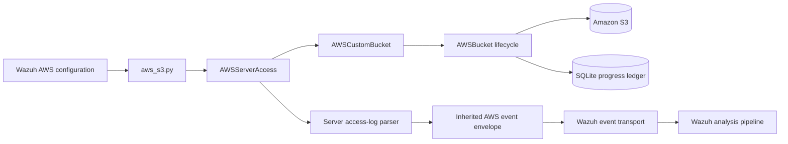
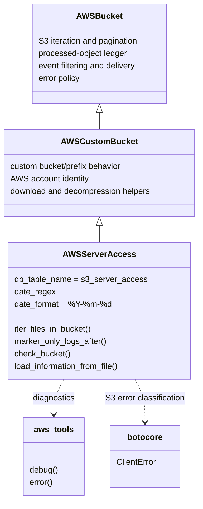
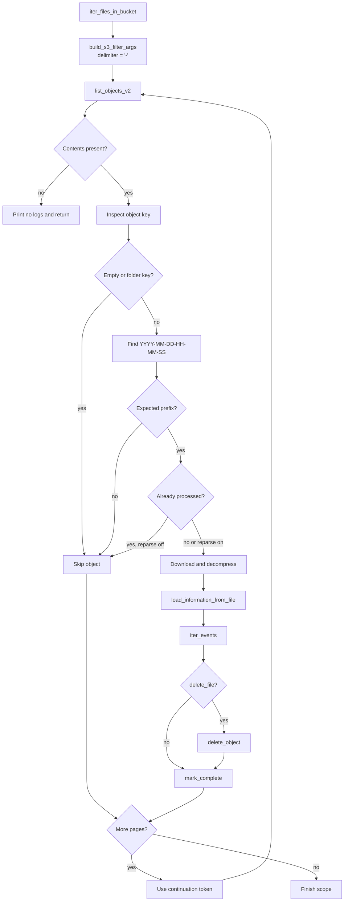
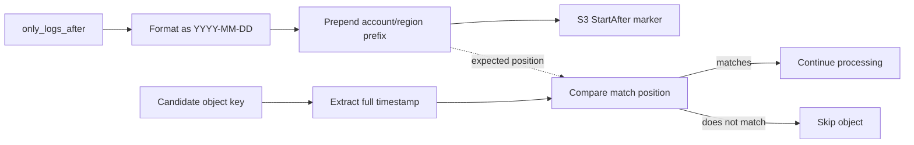
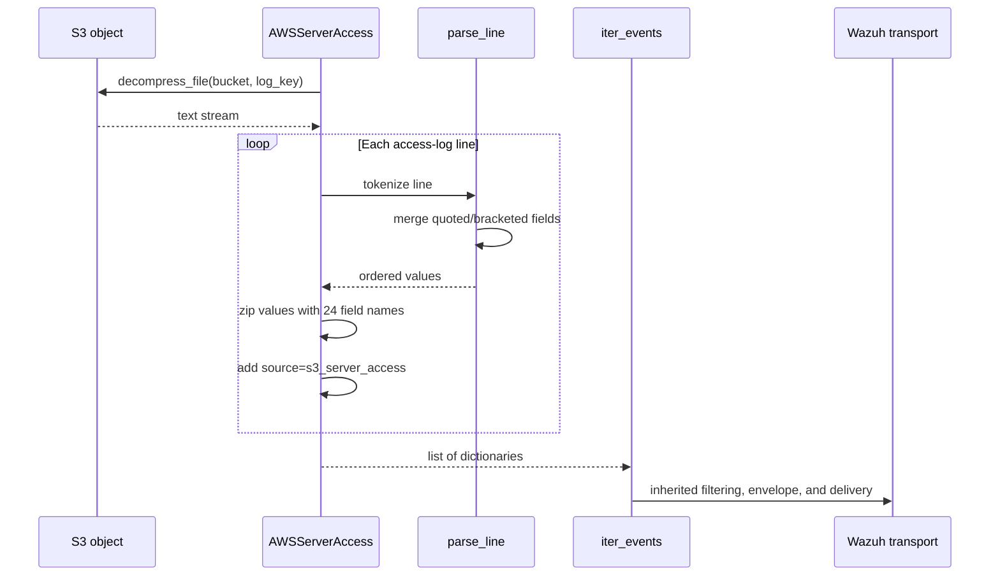
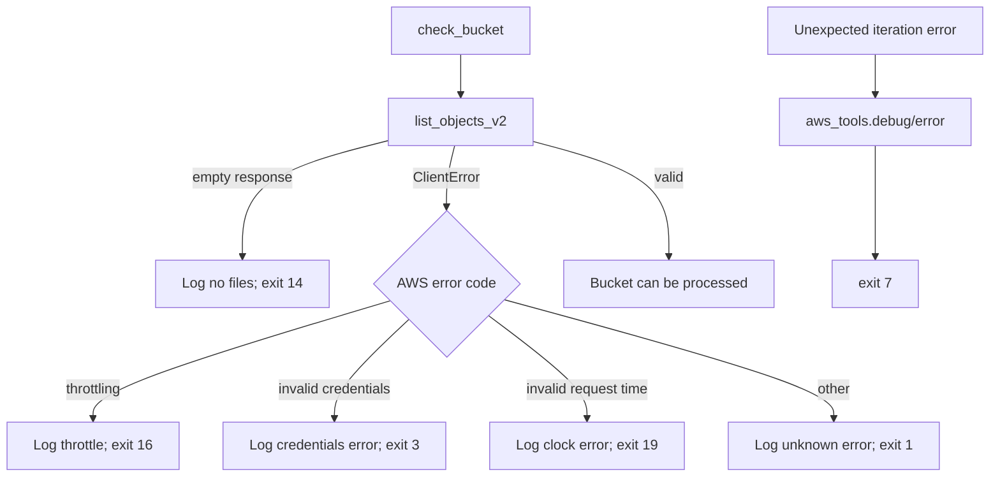

# AWS S3 server access-log bucket adapter

The `server_access` module implements `AWSServerAccess`, the S3 adapter for AWS S3 server access logs. It specializes the shared [`aws_buckets_s3_core.md`](aws_buckets_s3_core.md) ingestion lifecycle by selecting the `s3_server_access` processing ledger, validating server-access object names, reading compressed objects, and converting each space-delimited access-log line into a dictionary suitable for Wazuh event processing.

The adapter is part of the AWS bucket family summarized in [`aws_buckets_s3.md`](aws_buckets_s3.md). Account/region discovery, AWS event envelopes, duplicate tracking, decompression, filtering, delivery, and most error policy are inherited rather than reimplemented here.

## Position in the AWS ingestion system

The AWS Wodle selects this class from the S3 integration configuration. `AWSServerAccess` receives an S3 client and the common bucket options through `AWSCustomBucket`, then participates in the normal polling loop.



## Architecture and dependencies



### `AWSServerAccess.__init__`

The constructor forces the inherited database table name to `s3_server_access`, initializes `AWSCustomBucket`, and compiles the filename date expression:

```text
(YYYY-MM-DD-HH-MM-SS)
```

The date expression is used to locate the timestamp portion of an object key. `date_format` remains `%Y-%m-%d`, which is used when building the lower-bound marker for `only_logs_after`.

### Inherited responsibilities

The adapter relies on the base classes for the following concerns:

| Concern | Owning implementation |
| --- | --- |
| AWS client and bucket configuration | `AWSCustomBucket` / `AWSBucket` |
| Downloading and decompressing objects | `AWSCustomBucket` |
| Event filtering and Wazuh message wrapping | `AWSBucket` and `WazuhAWSDatabase` |
| Processed-object lookup and completion records | `AWSBucket` / inherited database layer |
| Account and region iteration | `AWSBucket` / `AWSCustomBucket` behavior |
| Shared S3 error and skip policy | Common bucket lifecycle |

See [`aws_buckets_s3_core.md`](aws_buckets_s3_core.md) for the complete contract instead of duplicating it here.

## Object discovery and processing

`iter_files_in_bucket()` lists objects with `list_objects_v2()` using filters built by the inherited `build_s3_filter_args()`. The custom delimiter is `-`, matching the hyphen-separated date layout used by S3 server-access object keys.

For each response page, the method:

1. Stops with a diagnostic if the response has no `Contents`.
2. Ignores empty keys and keys ending in `/`, which represent folders.
3. Searches the key for a timestamp matching `date_regex`.
4. Verifies that the match begins at the expected account/region prefix using `_same_prefix()`.
5. Skips objects already present in the inherited processing ledger unless `reparse` is enabled.
6. Downloads and decompresses the object, parses its records, and sends them through `iter_events()`.
7. Optionally deletes the S3 object, then records completion with `mark_complete()`.
8. Follows `NextContinuationToken` until all pages have been processed.



If a page contains objects but none are eligible for processing, the method emits the inherited “no logs to process” diagnostic for that scope. A file is marked complete after its events have been iterated; therefore a failure during download or parsing does not falsely advance the ledger.

## Date markers and prefix filtering

`marker_only_logs_after(aws_region, aws_account_id)` returns the full inherited prefix followed by the configured `only_logs_after` date formatted as `YYYY-MM-DD`:

```text
<full-account-region-prefix><only_logs_after:YYYY-MM-DD>
```

This marker is used by the inherited S3 filter construction to avoid listing objects older than the configured boundary. During normal iteration, the date embedded in each object key is also checked against the expected prefix position. This second check prevents an object from a neighboring account, region, or unrelated path from being processed merely because it appeared in the S3 listing.



## Access-log parsing

`load_information_from_file(log_key)` opens the object through the inherited `decompress_file()` context manager. Each line is parsed by a nested `parse_line()` helper and mapped to a fixed 24-field schema:

| Field | Meaning in the adapter |
| --- | --- |
| `bucket_owner` | S3 bucket owner identifier |
| `bucket` | Bucket name |
| `time` | Request timestamp |
| `remote_ip` | Requesting client address |
| `requester` | Requester identity |
| `request_id` | Request identifier |
| `operation` | S3 operation |
| `key` | Requested object key |
| `request_uri` | Request URI |
| `http_status` | HTTP response status |
| `error_code` | S3 error code, when present |
| `bytes_sent` | Response bytes sent |
| `object_sent` | Object size or sent-object value |
| `total_time` | Total request time |
| `turn_around_time` | Server turn-around time |
| `referer` | HTTP referrer |
| `user_agent` | User-agent string |
| `version_id` | S3 object version ID |
| `host_id` | S3 host identifier |
| `signature_version` | Request signature version |
| `cipher_suite` | TLS cipher suite |
| `authentication_type` | Authentication mechanism |
| `host_header` | HTTP host header |
| `tls_version` | TLS protocol version |

The returned record also includes `source: s3_server_access`, allowing downstream rules and indexes to identify this log family.

### Quote and bracket-aware tokenization

The source format is space-delimited, but several fields may contain spaces. `parse_line()` therefore does not use a plain `split()` result directly. It walks the tokens and merges subsequent tokens when a field starts with:

- `[` and has not yet reached `]`;
- `"` and has not yet reached the closing double quote; or
- `'` and has not yet reached the closing single quote.

The enclosing quote or bracket is removed for merged values, and a trailing newline is removed from the final field. The parsed list is zipped with the fixed field-name tuple. Python’s `zip()` behavior means malformed lines with fewer values produce dictionaries with only the available fields; extra values are ignored.



## Bucket validation and error handling

`check_bucket()` performs a lightweight validation before normal processing. It lists the configured bucket/prefix with `Delimiter='/'`; an empty response without `CommonPrefixes` or `Contents` terminates with exit code `14` and an error stating that no files were found.

`botocore.exceptions.ClientError` is classified using the AWS error code:

| Condition | Exit code | Behavior |
| --- | ---: | --- |
| Throttling exception | 16 | Emit the shared throttling message with `name='check_bucket'`. |
| Invalid credentials | 3 | Emit the shared invalid-credentials message. |
| Invalid request time / clock skew | 19 | Emit the shared request-time message. |
| Other `ClientError` | 1 | Emit the shared unknown-error message. |

Unexpected failures in `iter_files_in_bucket()` are logged through `aws_tools.debug()` and `aws_tools.error()`, then terminate with exit code `7`. The method handles both exception objects exposing a legacy `message` attribute and normal string conversion.



The common `skip_on_error` behavior governs failures encountered while downloading or parsing individual objects. This adapter’s filename validation has an additional branch: an invalid key is skipped with a warning when `skip_on_error` is enabled; otherwise it logs an error and exits with code `17`.

## Maintenance guidance

When modifying this adapter:

- Keep the 24-field order synchronized with the S3 server access-log format.
- Preserve `source: s3_server_access`, because downstream processing uses it to distinguish event families.
- Keep object listing, pagination, ledger updates, decompression, and event delivery in the shared S3 classes.
- Preserve quote/bracket-aware parsing; a simple whitespace split corrupts request URIs, user agents, and timestamps containing spaces.
- Route diagnostics through `aws_tools` and preserve the established exit-code behavior.
- Test keys from multiple accounts/regions, folder markers, malformed filenames, quoted fields, bracketed timestamps, empty pages, continuation pages, duplicate objects, and optional S3 deletion.

## Related documentation

- [`aws_buckets_s3_core.md`](aws_buckets_s3_core.md) — shared S3 lifecycle, event envelopes, decompression, progress ledger, and common error handling.
- [`aws_buckets_s3.md`](aws_buckets_s3.md) — complete S3 adapter family and processing overview.
- [`load_balancers.md`](load_balancers.md) — ALB, CLB, and NLB adapters using related access-log parsing patterns.
- [`aws_core.md`](aws_core.md) — AWS Wodle runtime and adapter selection.
