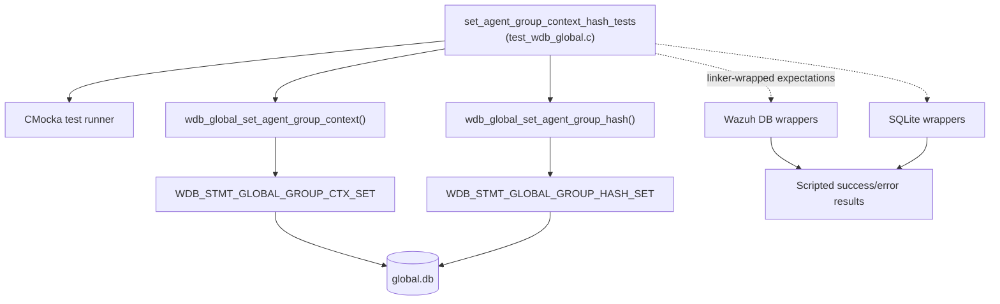
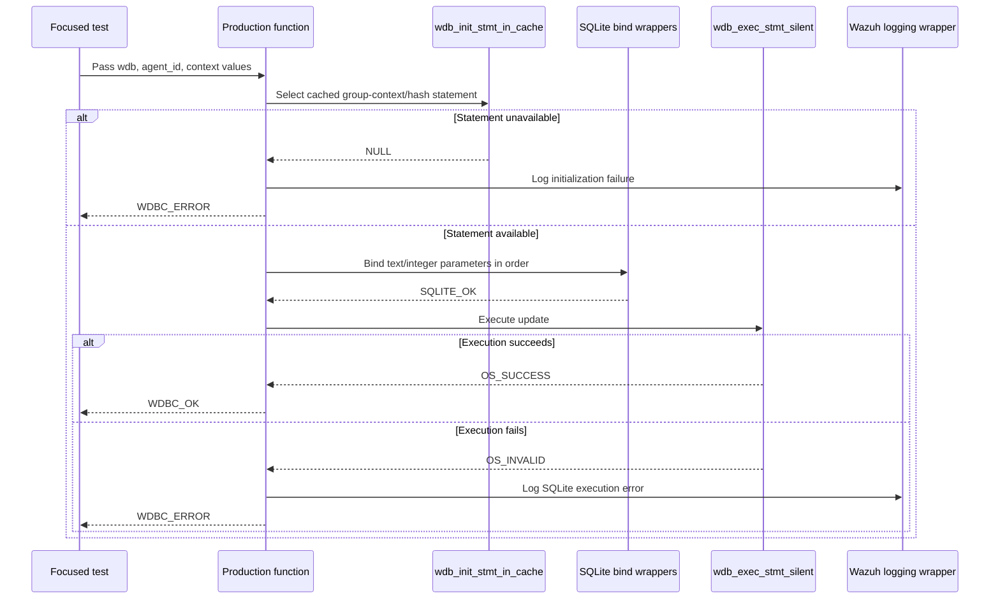
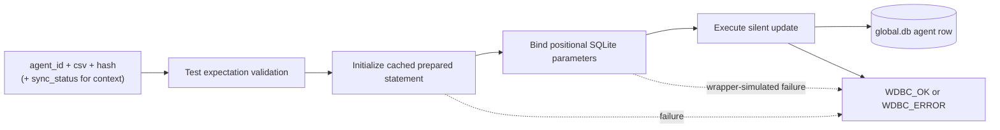
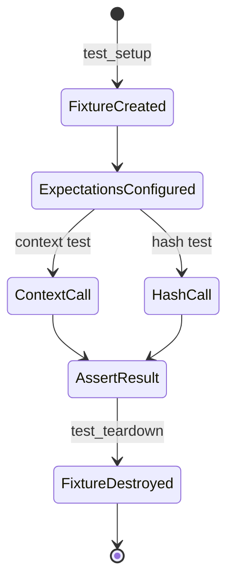

# `set_agent_group_context_hash_tests`

## Introduction

`set_agent_group_context_hash_tests` is the focused CMocka test module for the agent-group context and hash persistence operations in Wazuh's global database layer. The tests are implemented in `src/unit_tests/wazuh_db/test_wdb_global.c` and exercise the two target production functions:

- `wdb_global_set_agent_group_context()`
- `wdb_global_set_agent_group_hash()`

Both functions update prepared SQLite statements in `global.db`. The first stores the complete synchronization context—group CSV, group hash, and synchronization status—for an agent. The second updates the group CSV and hash without changing synchronization status. This document describes the focused test behavior; the complete surrounding suite is documented in [`test_wdb_global.md`](test_wdb_global.md), and the reusable fixture/wrapper design is documented in [`test_wdb_global_test_infrastructure.md`](test_wdb_global_test_infrastructure.md).

## Position in the system

The tests validate a narrow part of the `wazuh_db_global` module, which is reached by the Wazuh DB command parser and ultimately persists data in the manager's `global.db`. The production module's broader responsibilities—agent lifecycle, group membership, synchronization, integrity checks, and backups—are described in [`wazuh_db_global.md`](wazuh_db_global.md).

## Components under test

### `wdb_global_set_agent_group_context`

This operation writes four statement parameters in a fixed order:

| Parameter | Value | Meaning |
|---:|---|---|
| 1 | `csv` | Comma-separated group names for the agent |
| 2 | `hash` | Hash representing the group context |
| 3 | `sync_status` | Agent group synchronization state |
| 4 | `agent_id` | Target agent identifier |

The test `test_wdb_global_set_agent_group_context_success` verifies statement initialization with `WDB_STMT_GLOBAL_GROUP_CTX_SET`, all four bindings, successful silent execution, and the `WDBC_OK` result.

The error test, `test_wdb_global_set_agent_group_context_init_stmt_error`, simulates failure to initialize the cached statement and expects `WDBC_ERROR`. `test_wdb_global_set_agent_group_context_exec_stmt_error` lets initialization and binding succeed, then simulates execution failure and verifies the diagnostic `Error executing setting the agent group context: ERROR MESSAGE` and `WDBC_ERROR`.

The broader group-setting workflow calls this function after group membership has been changed and the CSV/hash have been recalculated. See the group-management and integrity descriptions in [`wazuh_db_global.md`](wazuh_db_global.md) rather than duplicating that orchestration here.

### `wdb_global_set_agent_group_hash`

This operation writes three statement parameters:

| Parameter | Value | Meaning |
|---:|---|---|
| 1 | `csv` | Current comma-separated group list |
| 2 | `hash` | Recomputed group hash |
| 3 | `agent_id` | Target agent identifier |

The test `test_wdb_global_set_agent_group_hash_success` verifies initialization with `WDB_STMT_GLOBAL_GROUP_HASH_SET`, the binding order, successful execution, and `WDBC_OK`.

The two failure tests cover statement initialization failure and execution failure. In the latter case the expected diagnostic is `Error executing setting the agent group hash: ERROR MESSAGE`, and the function must return `WDBC_ERROR`.

## Dependency and interaction model

The tests deliberately do not open a real SQLite database. They use a synthetic `wdb_t` and linker-wrapped dependencies so that each branch is controlled independently. The wrapper contracts and fixture lifecycle are maintained centrally in [`wazuh_db_wrappers_global.md`](wazuh_db_wrappers_global.md) and [`test_wdb_global_test_infrastructure.md`](test_wdb_global_test_infrastructure.md).

## Data flow

For the context variant, the persisted conceptual fields are `groups`, `group_hash`, and `group_sync_status`, keyed by `id`. For the hash-only variant, the test contract covers the group CSV/hash update keyed by the same agent ID; synchronization-status handling remains outside this function.

## Test process and fixture lifecycle

Each target case is registered with `cmocka_unit_test_setup_teardown`, so it receives a fresh fixture. The fixture allocates a minimal `wdb_t`, sets its database identifier to `"global"`, allocates storage for the synthetic SQLite pointer, and initializes Wazuh DB configuration. Teardown releases these objects and calls `wdb_free_conf()`.

The focused tests assert three observable dimensions:

1. The correct prepared-statement identifier is selected.
2. Parameters are bound at the expected positions with the expected values.
3. Database execution outcomes are translated into the expected Wazuh result code and log message.

## Coverage matrix

| Function | Success path | Statement initialization failure | Execution failure |
|---|---:|---:|---:|
| `wdb_global_set_agent_group_context` | `test_wdb_global_set_agent_group_context_success` | `test_wdb_global_set_agent_group_context_init_stmt_error` | `test_wdb_global_set_agent_group_context_exec_stmt_error` |
| `wdb_global_set_agent_group_hash` | `test_wdb_global_set_agent_group_hash_success` | `test_wdb_global_set_agent_group_hash_init_stmt_error` | `test_wdb_global_set_agent_group_hash_exec_stmt_error` |

The supplied test component listing identifies the two success tests as the module's core components; the neighboring failure cases in the same source file complete the branch coverage for these operations.

## Failure semantics

Both functions follow the same high-level failure policy:

- A missing cached statement prevents the update and returns `WDBC_ERROR`.
- A failed SQLite execution returns `WDBC_ERROR` and emits a function-specific debug message containing the SQLite error text.
- Successful statement execution returns `WDBC_OK`.

Parameter-binding failures are part of the shared Wazuh DB error-handling pattern and are exercised extensively by the parent [`test_wdb_global`](test_wdb_global.md) suite. The focused module's supplied tests emphasize statement selection and execution behavior for these two setters.

## Related documentation

- [`test_wdb_global.md`](test_wdb_global.md) — complete global-database unit-test suite.
- [`test_wdb_global_test_infrastructure.md`](test_wdb_global_test_infrastructure.md) — fixture, CMocka registration, composite helpers, and mocked dependency boundaries.
- [`wazuh_db_global.md`](wazuh_db_global.md) — production global database architecture and group-integrity workflows.
- [`wazuh_db_command_parser.md`](wazuh_db_command_parser.md) — command routing into the global database layer.
- [`wazuh_db_engine.md`](wazuh_db_engine.md) — generic Wazuh DB handles, transactions, statement caching, and execution primitives.

