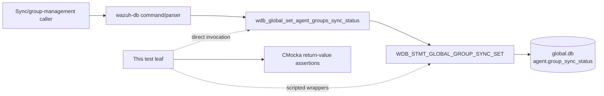
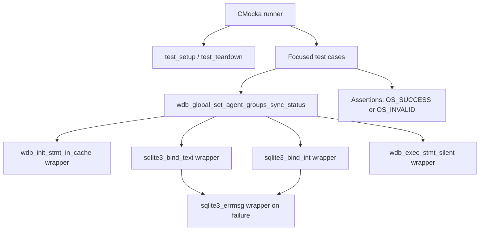

# `set_agent_groups_sync_status_tests`

## Introduction

`set_agent_groups_sync_status_tests` documents the named CMocka tests for
`wdb_global_set_agent_groups_sync_status()`, implemented in
`src/unit_tests/wazuh_db/test_wdb_global.c`. The function updates the
per-agent `group_sync_status` value in the Wazuh global database. This leaf
verifies statement initialization, text and integer parameter binding, and
silent statement execution.

The module tree identifies three core components: the two bind-failure tests
and the success test. The same source section also registers a neighboring
statement-initialization failure case, which is included below because it
defines the first boundary in the same operation.

The tests are part of the larger [`test_wdb_global`](test_wdb_global.md)
module. Shared fixture lifecycle and linker-wrapper behavior are documented in
[`test_wdb_global_test_infrastructure`](test_wdb_global_test_infrastructure.md);
the production database architecture is documented in
[`wazuh_db_global`](wazuh_db_global.md).

## Purpose and system position

The operation is used after an agent-group synchronization decision to persist
the status associated with one agent. It operates on the server-side global
database layer; callers and socket command routing are outside this test leaf.



The test does not validate socket parsing, SQL text, transaction ownership, or
the broader synchronization state machine. Those concerns belong to the
parent suite and the linked production documentation.

## Contract under test

The tested call has the following shape:

```c
int wdb_global_set_agent_groups_sync_status(wdb_t *wdb,
                                            int agent_id,
                                            const char *sync_status);
```

The expected implementation sequence is:

1. Resolve `WDB_STMT_GLOBAL_GROUP_SYNC_SET` from the statement cache.
2. Bind `sync_status` as SQLite parameter 1.
3. Bind `agent_id` as SQLite parameter 2.
4. Execute the prepared statement through the silent execution helper.
5. Return `OS_SUCCESS` or `OS_INVALID`.

```mermaid
flowchart TD
    Start([set_agent_groups_sync_status(wdb, id, status)]) --> Init{Initialize cached statement}
    Init -- fails --> Invalid1[Return OS_INVALID]
    Init -- succeeds --> BindStatus{Bind status at index 1}
    BindStatus -- SQLITE_ERROR --> LogStatus[Log SQLite error] --> Invalid2[Return OS_INVALID]
    BindStatus -- SQLITE_OK --> BindId{Bind agent ID at index 2}
    BindId -- SQLITE_ERROR --> LogId[Log SQLite error] --> Invalid3[Return OS_INVALID]
    BindId -- SQLITE_OK --> Execute{Silent statement execution}
    Execute -- OS_SUCCESS --> Success([Return OS_SUCCESS])
    Execute -- failure --> Failure([Return failure])
```

The tests use `sync = "test"` and `agent_id = 1`. The value is intentionally
treated as an opaque string here; validation or allowed-state transitions are
covered by neighboring synchronization tests in [`test_wdb_global`](test_wdb_global.md).

## Test architecture and dependencies

Each case receives the common `test_struct_t` fixture through
`test_setup()` and releases it through `test_teardown()`. The fixture creates
a synthetic `wdb_t` whose identifier is `"global"`; no real SQLite connection
is opened.



| Dependency | Role in this leaf |
|---|---|
| `wdb.h` | Declares the target function and Wazuh DB types/constants. |
| `test_setup` / `test_teardown` | Creates and destroys the synthetic global DB context. |
| `wdb_init_stmt_in_cache` wrapper | Simulates statement lookup success or failure and verifies the statement identifier. |
| `sqlite3_bind_text` wrapper | Verifies status binding at position 1 and simulates bind failure. |
| `sqlite3_bind_int` wrapper | Verifies agent-ID binding at index 2 and simulates bind failure. |
| `sqlite3_errmsg` wrapper | Supplies deterministic `test_error` text for SQLite diagnostics. |
| `wdb_exec_stmt_silent` wrapper | Simulates final database execution. |
| CMocka | Registers expectations and checks return values. |

Detailed wrapper implementation and linker-boundary conventions are maintained
in [`wazuh_db_wrappers_global`](wazuh_db_wrappers_global.md) and
[`wazuh_db_wrappers`](wazuh_db_wrappers.md).

## Test scenarios

| Test | Stimulated condition | Expected behavior |
|---|---|---|
| `test_wdb_global_set_agent_groups_sync_status_invalid_stmt` | Cached statement initialization returns `NULL`. | Stops before binding and returns `OS_INVALID`. |
| `test_wdb_global_set_agent_groups_sync_status_bad_bind_sync` | Binding `"test"` at position 1 returns `SQLITE_ERROR`. | Expects `DB(global) sqlite3_bind_text(): test_error` and returns `OS_INVALID`. |
| `test_wdb_global_set_agent_groups_sync_status_bad_bind_id` | Status binding succeeds; binding ID `1` at index 2 returns `SQLITE_ERROR`. | Expects `DB(global) sqlite3_bind_int(): test_error` and returns `OS_INVALID`. |
| `test_wdb_global_set_agent_groups_sync_status_success` | Statement lookup, both binds, and silent execution succeed. | Returns `OS_SUCCESS`. |

The requested module tree lists three core test components; the source also
contains the statement-initialization case shown above. The complete
registration is visible in `main()` under the “Tests
wdb_global_set_agent_groups_sync_status” section.

## Component interaction flow

```mermaid
sequenceDiagram
    participant T as CMocka test
    participant G as Target function
    participant S as Statement-cache wrapper
    participant ST as sqlite3_bind_text
    participant SI as sqlite3_bind_int
    participant E as Silent execution wrapper

    T->>G: wdb, agent_id=1, sync_status="test"
    G->>S: Initialize WDB_STMT_GLOBAL_GROUP_SYNC_SET
    alt statement unavailable
        S-->>G: NULL
        G-->>T: OS_INVALID
    else statement available
        S-->>G: sqlite3_stmt*
        G->>ST: Bind status at position 1
        alt status bind fails
            ST-->>G: SQLITE_ERROR
            G-->>T: Log error; OS_INVALID
        else status bind succeeds
            ST-->>G: SQLITE_OK
            G->>SI: Bind agent ID at index 2
            alt ID bind fails
                SI-->>G: SQLITE_ERROR
                G-->>T: Log error; OS_INVALID
            else ID bind succeeds
                SI-->>G: SQLITE_OK
                G->>E: Execute statement silently
                E-->>G: OS_SUCCESS
                G-->>T: OS_SUCCESS
            end
        end
    end
```

## Process and maintenance guidance

The test group is registered with `cmocka_unit_test_setup_teardown`, so each
case starts with an isolated fixture and wrapper expectation set. The failure
cases deliberately stop at the first failing boundary, proving that later
bindings or execution are not attempted.

When modifying this production operation or its prepared statement:

- preserve coverage for statement initialization, status binding, ID binding,
  and execution;
- update the expected parameter positions if bind order changes;
- retain SQLite diagnostic assertions when error handling changes;
- add a success assertion for any new successful post-processing; and
- update the parent [`test_wdb_global`](test_wdb_global.md) page if the
  synchronization contract expands.

## Source references

- Test source: [`src/unit_tests/wazuh_db/test_wdb_global.c`](../../src/unit_tests/wazuh_db/test_wdb_global.c)
- Production implementation: [`src/wazuh_db/wdb_global.c`](../../src/wazuh_db/wdb_global.c)
- Public declarations: [`src/wazuh_db/wdb.h`](../../src/wazuh_db/wdb.h)
- Parent test module: [`test_wdb_global`](test_wdb_global.md)
- Shared fixture: [`test_wdb_global_test_infrastructure`](test_wdb_global_test_infrastructure.md)
