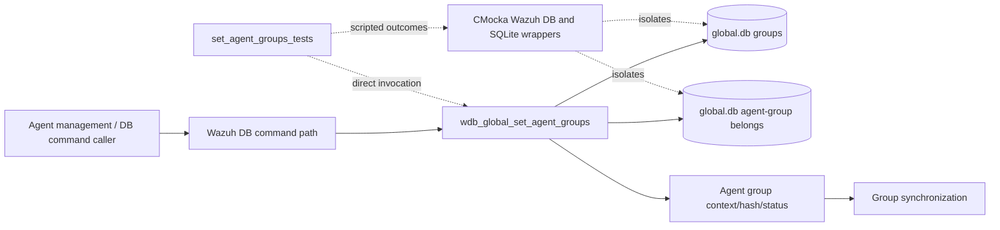
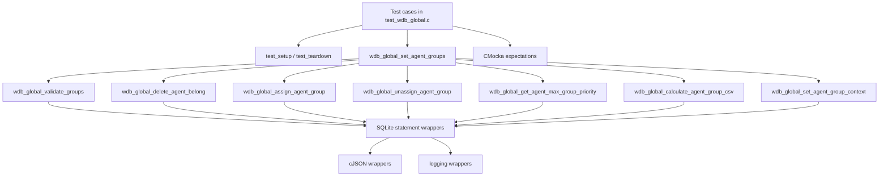
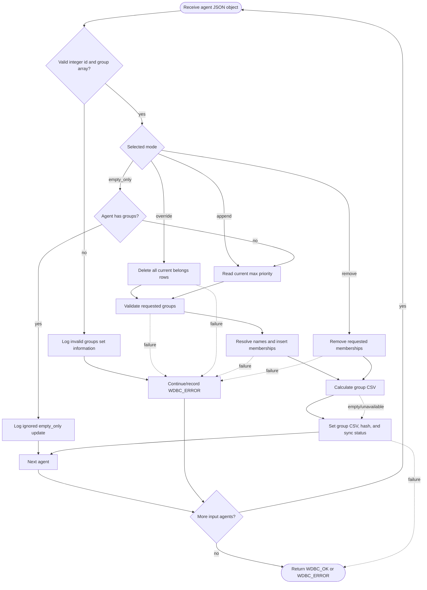
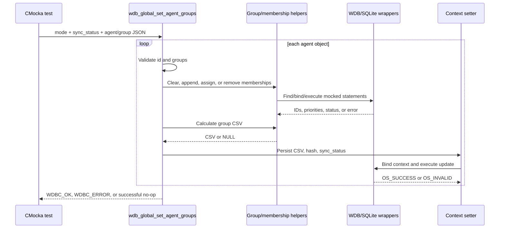
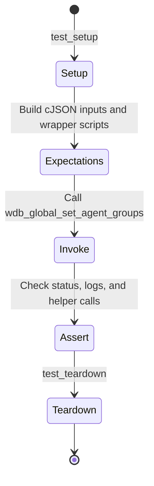

# `set_agent_groups_tests`

## Introduction

`set_agent_groups_tests` is the focused CMocka documentation for the agent-group batch update operation `wdb_global_set_agent_groups()`. The operation belongs to Wazuh's global database layer and applies a requested group change to one or more agent records, then refreshes each agent's derived group context.

The five documented core cases are implemented in `src/unit_tests/wazuh_db/test_wdb_global.c`:

- `test_wdb_global_set_agent_groups_override_success`
- `test_wdb_global_set_agent_groups_append_success`
- `test_wdb_global_set_agent_groups_calculate_csv_empty`
- `test_wdb_global_set_agent_groups_empty_only_success`
- `test_wdb_global_set_agent_groups_remove_success`

The source contains additional invalid-input and error-path tests around the same operation. This page documents the supplied core scenarios and the control flow they establish; the complete global-database test inventory is in [`test_wdb_global.md`](test_wdb_global.md).

## Position in the system

The test targets the manager-side `global.db` workflow that maintains agent-to-group relationships. Group names are stored in the group table, memberships in the belongs table, and an agent's comma-separated group context, hash, and synchronization status are maintained as derived fields. The production database architecture and schema ownership are described in [`wazuh_db_global.md`](wazuh_db_global.md).



This is a unit-level test boundary. It does not open a real database or exercise the command parser; those broader concerns are covered by the parent suite and related Wazuh DB documentation.

## Operation contract

The tested operation is conceptually:

```c
wdbc_result wdb_global_set_agent_groups(
    wdb_t *wdb,
    wdb_groups_set_mode_t mode,
    const char *sync_status,
    cJSON *agents_group_info);
```

`agents_group_info` is a JSON array of agent records. The cases establish these fields:

| Field | Shape | Purpose |
|---|---|---|
| `id` | integer | Target agent identifier. |
| `name` | optional string | Agent name used by some error messages and agent-creation paths. |
| `groups` | array of strings | Group names to add, remove, or assign. |
| `sync_status` | string argument | Status written into the refreshed group context. |

For each input agent, the operation validates the group list, performs the mode-specific membership change, recalculates the CSV representation, and persists the context. A failure in one sub-operation causes `WDBC_ERROR` in the relevant tests; an ignored `empty_only` update is intentionally treated as a successful no-op.

## Set modes

The tests cover the mode semantics below:

| Mode | Behavior exercised by the tests |
|---|---|
| `WDB_GROUP_OVERRIDE` | Remove all existing memberships, validate the requested groups, assign the new groups, and refresh context. |
| `WDB_GROUP_APPEND` | Preserve existing memberships, determine the current maximum priority, append the requested groups, and refresh context. |
| `WDB_GROUP_EMPTY_ONLY` | Assign only when the agent has no groups. If an existing group is detected, log that the update is ignored and continue successfully. |
| `WDB_GROUP_REMOVE` | Unassign the requested groups, recalculate the remaining group context, and refresh context. |

The supplied core cases directly exercise override, empty-only, and remove behavior. The append behavior is present in the source as a neighboring test and is included here because it is part of the same operation's mode contract.

## Architecture and dependencies



The target is an orchestration function rather than a single SQL statement. Its dependencies are tested through scripted wrappers:

- `wdb_global_delete_agent_belong()` clears an agent's current belongs rows for override mode.
- `wdb_global_validate_groups()` checks the requested names and the per-agent group-count limit.
- `wdb_global_get_agent_max_group_priority()` supplies the starting priority for append, empty-only, and post-remove logic.
- `wdb_global_assign_agent_group()` resolves names to group IDs and inserts belongs rows.
- `wdb_global_unassign_agent_group()` resolves names and deletes individual belongs tuples.
- `wdb_global_calculate_agent_group_csv()` reads the resulting memberships and creates the derived CSV string.
- `wdb_global_set_agent_group_context()` persists CSV, hash, and synchronization status. Its focused tests are documented in [`set_agent_group_context_hash_tests.md`](set_agent_group_context_hash_tests.md).

The common fixture and wrapper behavior are maintained in [`test_wdb_global_test_infrastructure.md`](test_wdb_global_test_infrastructure.md) and [`wazuh_db_wrappers.md`](wazuh_db_wrappers.md).

## Per-agent processing flow



The exact error-accumulation policy is observable in the tests: operation-specific failures are logged with the agent identifier, processing may still reach context recalculation, and the final result reports an error when a required step failed. The `empty_only` case is different: an already-populated agent is skipped deliberately and does not make the batch fail.

## Core scenarios

### Override success

`test_wdb_global_set_agent_groups_override_success` configures ten agent records using `WDB_GROUP_OVERRIDE`. For each record, the expected sequence is:

1. Delete all existing agent memberships.
2. Validate the requested group list.
3. Find the group ID and insert the belongs tuple.
4. Recalculate the CSV (`GROUP`).
5. Read the resulting group value and write the group context with hash `19dcd0dd` and status `synced`.

The test returns `WDBC_OK`. Repeating the sequence for `AGENTS_SIZE` records verifies that the orchestration resets and invokes its dependencies once per input agent rather than only handling the first item.

### Empty calculated CSV

`test_wdb_global_set_agent_groups_calculate_csv_empty` uses `WDB_GROUP_REMOVE`. Removal and priority lookup succeed, but CSV calculation cannot begin its transaction. The implementation logs that groups were empty immediately after the update and calls the context setter with `NULL` CSV and `NULL` hash while preserving `sync_status`.

The test expects `WDBC_OK`: an empty post-update group set is a valid resulting state, even though the optional recalculation produced no CSV.

### Empty-only success

`test_wdb_global_set_agent_groups_empty_only_success` uses `WDB_GROUP_EMPTY_ONLY` with an agent whose group count is zero. It follows the validation, assignment, CSV, and context-update path and returns `WDBC_OK`.

The neighboring `test_wdb_global_set_agent_groups_empty_only_not_empty_error` covers the complementary branch. When the maximum existing priority indicates that the agent already has groups, the function logs `Agent group set in empty_only mode ignored because the agent already contains groups` and returns `WDBC_OK` without assigning new memberships.

### Remove success

`test_wdb_global_set_agent_groups_remove_success` uses `WDB_GROUP_REMOVE`. Each requested group is resolved and removed through the tuple-delete path, then the remaining memberships are converted to CSV and persisted with the expected hash and synchronization status. The result is `WDBC_OK`.

The adjacent remove-error case supplies a non-string JSON group value. The unassign operation reports `WDBC_ERROR`, logs the invalid removal information, and the batch returns an error after the context-refresh expectations are evaluated.

### Append behavior

Although the supplied component list emphasizes the other modes, `test_wdb_global_set_agent_groups_append_success` documents the append contract: the current maximum priority is read first, requested groups are assigned with increasing priorities, and the derived context is refreshed. This mode does not clear existing memberships.

## Data and result flow



Responses are represented with cJSON arrays and objects, while database mutations return Wazuh status codes. The tests assert both the final `wdbc_result` and important diagnostics; they do not require a live `global.db` file.

## Fixture and test isolation

Every case is registered with `cmocka_unit_test_setup_teardown()`. `test_setup()` allocates a minimal `test_struct_t`, a synthetic `wdb_t` whose ID is `global`, a placeholder SQLite pointer, and an output buffer, then initializes Wazuh DB configuration. `test_teardown()` frees the allocations and calls `wdb_free_conf()`.



Composite helper functions in the source, such as `create_wdb_global_assign_agent_group_success_call()` and `create_wdb_global_set_agent_group_context_success_call()`, reduce repetition while preserving exact bind order and statement identifiers.

## Coverage matrix

| Scenario | Mode | Main injected behavior | Expected result |
|---|---|---|---|
| Override success | `WDB_GROUP_OVERRIDE` | Clear, validate, assign, calculate CSV, set context for each agent. | `WDBC_OK` |
| Calculated CSV empty | `WDB_GROUP_REMOVE` | Removal succeeds; CSV transaction cannot start. | `WDBC_OK`, context receives null derived values |
| Empty-only success | `WDB_GROUP_EMPTY_ONLY` | Empty agent accepts and persists requested groups. | `WDBC_OK` |
| Empty-only existing groups | `WDB_GROUP_EMPTY_ONLY` | Existing memberships cause an intentional no-op. | `WDBC_OK` |
| Remove success | `WDB_GROUP_REMOVE` | Requested memberships are removed and context refreshed. | `WDBC_OK` |
| Append success | `WDB_GROUP_APPEND` | Current priority is used and new memberships are appended. | `WDBC_OK` |
| Override/delete or assignment failure | Override/append/remove | A helper returns an error. | `WDBC_ERROR` in the corresponding source cases |
| Invalid JSON | Any | `id` or `groups` has the wrong JSON type. | `WDBC_ERROR` |

## Maintenance guidance

When changing `wdb_global_set_agent_groups()` or its helper contracts:

1. Preserve coverage for all four modes and the empty-only no-op rule.
2. Keep the JSON type checks and group-count validation aligned with the production limits documented by the global DB module.
3. Update composite wrapper expectations when statement identifiers, bind positions, priorities, or context fields change.
4. Keep derived context updates covered after both membership additions and removals.
5. Use the focused context/hash document and the parent [`test_wdb_global.md`](test_wdb_global.md) suite for adjacent behavior instead of duplicating those contracts here.

## Related documentation

- [`test_wdb_global.md`](test_wdb_global.md) — complete `test_wdb_global.c` suite.
- [`wazuh_db_global.md`](wazuh_db_global.md) — production global database and group-management architecture.
- [`set_agent_group_context_hash_tests.md`](set_agent_group_context_hash_tests.md) — derived group context and hash persistence tests.
- [`get_group_agents_tests.md`](get_group_agents_tests.md) — paginated group membership retrieval tests.
- [`test_wdb_global_test_infrastructure.md`](test_wdb_global_test_infrastructure.md) — shared fixture and mock setup.
- [`wazuh_db_wrappers.md`](wazuh_db_wrappers.md) — Wazuh DB linker-wrapper layer.

## Source reference

- Production test source: `src/unit_tests/wazuh_db/test_wdb_global.c`
- Core section: `/* wdb_global_set_agent_groups */`
- Related registered cases: `test_wdb_global_set_agent_groups_*`
