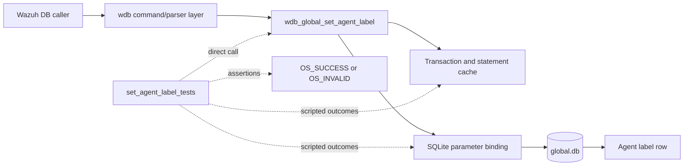
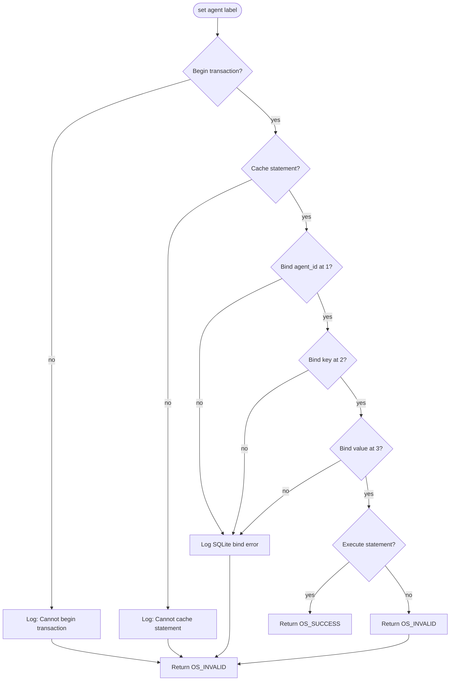
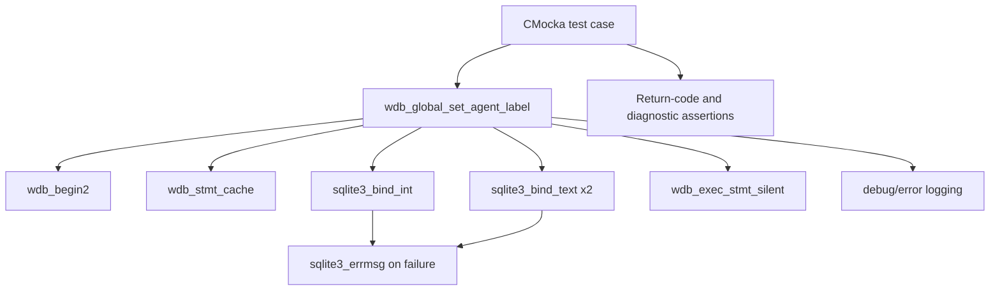
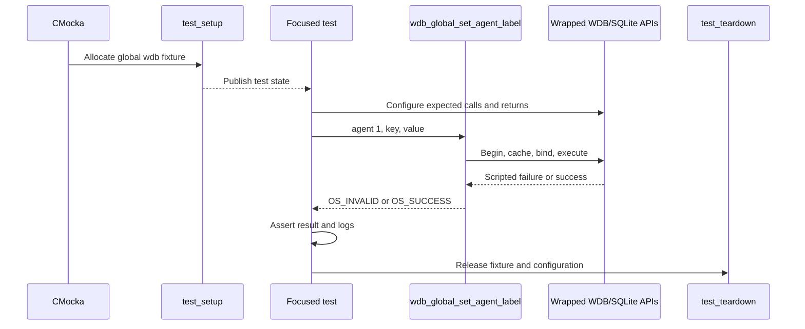
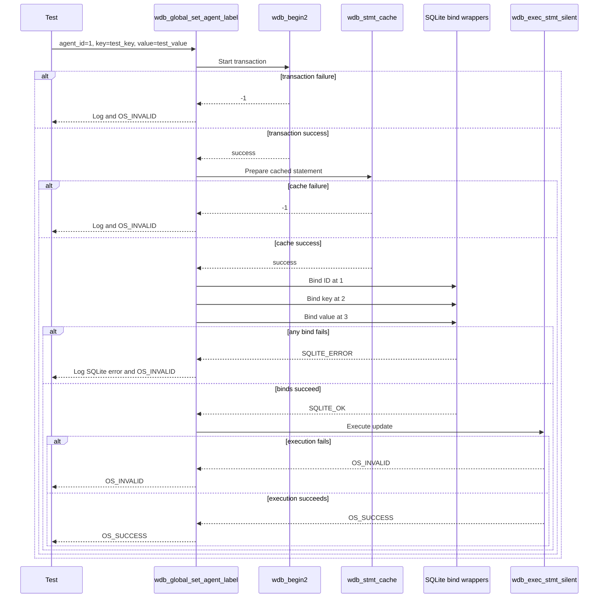

# `set_agent_label_tests`

## Introduction

`set_agent_label_tests` documents the focused CMocka coverage for `wdb_global_set_agent_label()`, the Wazuh DB operation that stores or updates one key/value label for an agent in the global database.

The tests are implemented in `src/unit_tests/wazuh_db/test_wdb_global.c`. They isolate the operation's transaction, statement-cache, SQLite binding, and statement-execution boundaries with linker-wrapped mocks. The complete global-database test suite is described in [`test_wdb_global.md`](test_wdb_global.md); label retrieval is covered separately in [`get_agent_labels_tests.md`](get_agent_labels_tests.md).

## Position in the system

The production function belongs to the global Wazuh database layer. A higher-level Wazuh DB command or API workflow can use it to persist agent metadata, while the global database stores the resulting label association in `global.db`.

The surrounding database architecture and command routing are documented in [`wazuh_db_global.md`](wazuh_db_global.md), [`wazuh_db_engine.md`](wazuh_db_engine.md), and [`wazuh_db_command_parser.md`](wazuh_db_command_parser.md), where available.

## Operation contract

The function is called with a global `wdb_t *`, an integer `agent_id`, and two strings: `key` and `value`. The tests establish the following ordered pipeline:

1. Begin a transaction with `wdb_begin2()`.
2. Prepare or retrieve the cached label statement with `wdb_stmt_cache()`.
3. Bind the agent ID at SQLite parameter position `1`.
4. Bind the label key at position `2`.
5. Bind the label value at position `3`.
6. Execute the prepared statement silently with `wdb_exec_stmt_silent()`.
7. Return `OS_SUCCESS` when execution succeeds; otherwise return `OS_INVALID`.

The implementation uses a prepared statement and positional parameters, so the tests intentionally verify both parameter positions and values. They do not inspect SQL text or perform a real database write.

## Components and dependencies

| Component | Role in the focused tests |
|---|---|
| `wdb_global_set_agent_label()` | Production function under test. |
| `wdb_t` from `wdb.h` | Minimal global-database context passed to the function. |
| `wdb_begin2` wrapper | Simulates transaction startup success or failure. |
| `wdb_stmt_cache` wrapper | Simulates statement preparation/cache success or failure. |
| `sqlite3_bind_int` wrapper | Verifies parameter `1` receives the agent ID. |
| `sqlite3_bind_text` wrapper | Verifies key/value parameters `2` and `3`. |
| `sqlite3_errmsg` wrapper | Supplies deterministic SQLite error text for bind failures. |
| `wdb_exec_stmt_silent` wrapper | Simulates the final update execution. |
| CMocka and Wazuh logging wrappers | Register cases and verify diagnostic messages. |

## Test fixture and isolation

Every focused case is registered with `cmocka_unit_test_setup_teardown()`. The shared setup allocates a minimal `test_struct_t`, creates a synthetic `wdb_t` whose ID is `"global"`, allocates a placeholder SQLite handle, creates an output buffer, and initializes Wazuh DB configuration. Teardown releases the allocations and frees the configuration.

No SQLite file, daemon, socket, or production transaction is used. Wrapper return values are scripted per test, making each failure boundary deterministic.

The common fixture and wrapper conventions are maintained in [`test_wdb_global_test_infrastructure.md`](test_wdb_global_test_infrastructure.md), so this page does not duplicate their implementation details.

## Test scenarios

| Test case | Simulated condition | Expected behavior |
|---|---|---|
| `test_wdb_global_set_agent_label_transaction_fail` | `wdb_begin2()` returns `-1`. | Logs `Cannot begin transaction`; returns `OS_INVALID`; no later database calls are expected. |
| `test_wdb_global_set_agent_label_cache_fail` | Transaction succeeds and `wdb_stmt_cache()` returns `-1`. | Logs `Cannot cache statement`; returns `OS_INVALID`. |
| `test_wdb_global_set_agent_label_bind1_fail` | Agent-ID bind at position `1` returns `SQLITE_ERROR`. | Supplies `ERROR MESSAGE`, expects `DB(global) sqlite3_bind_int(): ERROR MESSAGE`, and returns `OS_INVALID`. |
| `test_wdb_global_set_agent_label_bind2_fail` | ID bind succeeds; key bind at position `2` fails. | Verifies key `test_key`, expects `DB(global) sqlite3_bind_text(): ERROR MESSAGE`, and returns `OS_INVALID`. |
| `test_wdb_global_set_agent_label_bind3_fail` | ID and key binds succeed; value bind at position `3` fails. | Verifies value `test_value`, expects the SQLite text-bind diagnostic, and returns `OS_INVALID`. |
| `test_wdb_global_set_agent_label_step_fail` | All binds succeed; silent execution returns `OS_INVALID`. | Propagates the failed update as `OS_INVALID`. |
| `test_wdb_global_set_agent_label_success` | Transaction, cache, all three binds, and execution succeed. | Returns `OS_SUCCESS`. |

## Component interaction flow

## Error and return semantics

The focused module verifies a fail-fast contract. Transaction and statement-cache failures prevent all subsequent work. Binding failures identify the global database and SQLite operation in the expected diagnostic. Execution failure is represented by the Wazuh invalid result code. The success case confirms that a fully bound statement is passed to the silent execution wrapper and produces `OS_SUCCESS`.

The tests do not verify label retrieval, deletion, JSON formatting, or synchronization propagation. Those concerns are covered by [`get_agent_labels_tests.md`](get_agent_labels_tests.md) and the broader [`test_wdb_global.md`](test_wdb_global.md) suite.

## Maintenance guidance

When changing `wdb_global_set_agent_label()` or its prepared statement:

- Preserve coverage for transaction startup, cache preparation, each positional bind, execution, and success.
- Update the binding assertions if the SQL parameter order changes; such a change is part of the function contract.
- Keep SQLite diagnostic assertions synchronized with intentional logging changes.
- Continue using the shared fixture and wrappers to keep the test independent of database files and daemon state.
- Add schema or end-to-end assertions in the parent/global database tests rather than expanding this leaf unnecessarily.

## Source reference

- Test source: `src/unit_tests/wazuh_db/test_wdb_global.c`
- Target function: `wdb_global_set_agent_label()`
- Focused cases: `test_wdb_global_set_agent_label_transaction_fail`, `..._cache_fail`, `..._bind1_fail`, `..._bind2_fail`, `..._bind3_fail`, `..._step_fail`, and `..._success`
- Registration section: `/* Tests wdb_global_set_agent_label */` in `main()`
