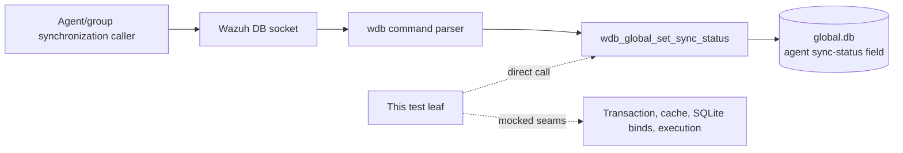
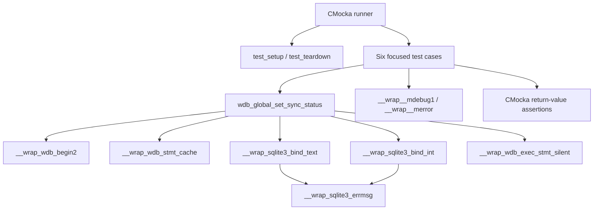
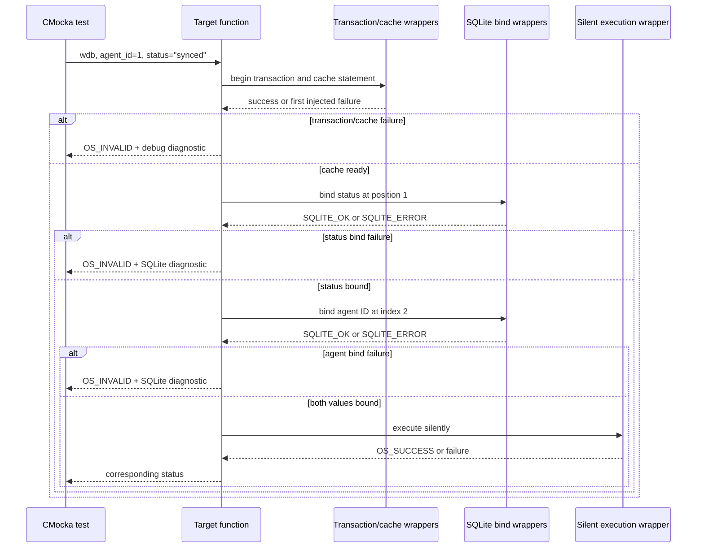

# `set_sync_status_tests`

## Introduction

`set_sync_status_tests` documents the six CMocka tests for
`wdb_global_set_sync_status()` in
[`src/unit_tests/wazuh_db/test_wdb_global.c`](../../src/unit_tests/wazuh_db/test_wdb_global.c).
The function updates the synchronization status of one agent in Wazuh's
`global.db`. The tests isolate the operation from SQLite and the real database
by scripting the transaction, statement-cache, bind, and execution wrappers.

This is a focused leaf of the broader [`test_wdb_global`](test_wdb_global.md)
suite. Fixture lifecycle and linker-wrapper conventions are described in
[`test_wdb_global_test_infrastructure`](test_wdb_global_test_infrastructure.md);
the production database layer and synchronization consumers are described in
[`wazuh_db_global`](wazuh_db_global.md).

## Purpose and system position

The operation persists a caller-provided status for a specific agent. It is a
server-side `wazuh-db` operation: normal callers reach it through the global
command parser and database socket, but this test leaf invokes it directly.



The test does not validate socket framing, command parsing, SQL text, or the
overall synchronization state machine. Those responsibilities belong to the
linked parent and production documentation.

## Contract under test

The exercised call has the following shape:

```c
int wdb_global_set_sync_status(wdb_t *wdb,
                               int agent_id,
                               const char *status);
```

For the test inputs `agent_id = 1` and `status = "synced"`, the expected
database sequence is:

1. Begin a transaction with `wdb_begin2()`.
2. Obtain/cache the prepared global statement with `wdb_stmt_cache()`.
3. Bind `status` as SQLite parameter 1.
4. Bind `agent_id` as SQLite parameter 2.
5. Execute the statement through `wdb_exec_stmt_silent()`.
6. Return `OS_SUCCESS` when execution succeeds; otherwise return
   `OS_INVALID` and log the relevant failure.

```mermaid
flowchart TD
    Start([set_sync_status(wdb, 1, "synced")]) --> Tx{Begin transaction}
    Tx -- failure --> E1[Debug log<br/>return OS_INVALID]
    Tx -- success --> Cache{Cache prepared statement}
    Cache -- failure --> E2[Debug log<br/>return OS_INVALID]
    Cache -- success --> Status{Bind status at position 1}
    Status -- SQLITE_ERROR --> E3[SQLite error log<br/>return OS_INVALID]
    Status -- SQLITE_OK --> Agent{Bind agent ID at index 2}
    Agent -- SQLITE_ERROR --> E4[SQLite error log<br/>return OS_INVALID]
    Agent -- SQLITE_OK --> Exec{Silent statement execution}
    Exec -- failure --> E5[return OS_INVALID]
    Exec -- OS_SUCCESS --> Done([return OS_SUCCESS])
```

The bind order is part of the tested contract. A failure case stops at the
first failing stage, demonstrating short-circuit behavior and preventing
later database calls from being silently attempted.

## Test architecture and dependencies

Each test is registered with `cmocka_unit_test_setup_teardown`, using the
common `test_setup()` and `test_teardown()` fixture from the same source file.
The fixture creates a synthetic `wdb_t` with ID `"global"`, allocates a
database-handle slot, initializes Wazuh DB configuration, and tears everything
down after the case. No real SQLite file or socket is opened.



| Dependency | Role in this leaf |
|---|---|
| `wdb.h` | Declares the target function and Wazuh DB types/constants. |
| `test_setup()` / `test_teardown()` | Provides an isolated synthetic global DB context. |
| `__wrap_wdb_begin2` | Controls transaction-start success or failure. |
| `__wrap_wdb_stmt_cache` | Controls prepared-statement cache success or failure. |
| `__wrap_sqlite3_bind_text` | Verifies and scripts the status binding at position 1. |
| `__wrap_sqlite3_bind_int` | Verifies and scripts the agent-ID binding at index 2. |
| `__wrap_wdb_exec_stmt_silent` | Scripts the final write result. |
| SQLite error/log wrappers | Provide deterministic error text and verify diagnostics. |
| CMocka | Registers expectations and checks `OS_SUCCESS`/`OS_INVALID`. |

The complete wrapper implementation is maintained by
[`wazuh_db_wrappers_global`](wazuh_db_wrappers_global.md) and
[`wazuh_db_wrappers`](wazuh_db_wrappers.md); this page records only the seams
used by the six tests.

## Test scenarios

| Test | Injected condition | Expected result |
|---|---|---|
| `test_wdb_global_set_sync_status_transaction_fail` | `wdb_begin2()` returns `-1`. | `OS_INVALID`; expects `Cannot begin transaction`. |
| `test_wdb_global_set_sync_status_cache_fail` | Transaction succeeds, then `wdb_stmt_cache()` returns `-1`. | `OS_INVALID`; expects `Cannot cache statement`. |
| `test_wdb_global_set_sync_status_bind1_fail` | Status bind at position 1 returns `SQLITE_ERROR`. | `OS_INVALID`; expects `DB(global) sqlite3_bind_text(): ERROR MESSAGE`. |
| `test_wdb_global_set_sync_status_bind2_fail` | Status bind succeeds; agent-ID bind at index 2 returns `SQLITE_ERROR`. | `OS_INVALID`; expects `DB(global) sqlite3_bind_int(): ERROR MESSAGE`. |
| `test_wdb_global_set_sync_status_step_fail` | Both binds succeed; silent execution returns `OS_INVALID`. | Propagates `OS_INVALID`. |
| `test_wdb_global_set_sync_status_success` | Transaction, cache, both binds, and execution succeed. | Returns `OS_SUCCESS`. |

The source registers all six tests in `main()` under the “Tests
wdb_global_set_sync_status” section. The first five cases assert failure
handling at successive boundaries; the final case verifies the complete happy
path and exact parameter values.

## Component interaction flow



## Error-handling and maintenance notes

The tests establish a consistent write-operation policy: infrastructure,
binding, and execution failures return `OS_INVALID`; successful execution
returns `OS_SUCCESS`. SQLite bind failures include the database ID (`global`)
and the mocked SQLite message in the expected log.

When changing the production statement or its call sequence, update this leaf
if any of the following changes:

- the prepared statement or parameter positions;
- the transaction/cache prerequisites;
- the status validation or representation;
- the execution helper or returned error codes; or
- the diagnostic messages emitted on failure.

Keep the neighboring read and broader validation coverage linked rather than
copying their contracts here: [`get_sync_status_tests`](get_sync_status_tests.md)
covers status retrieval, while the parent [`test_wdb_global`](test_wdb_global.md)
contains the transition-validation cases.

## Source references

- Test source: [`src/unit_tests/wazuh_db/test_wdb_global.c`](../../src/unit_tests/wazuh_db/test_wdb_global.c)
- Production module: [`wazuh_db_global`](wazuh_db_global.md)
- Parent test suite: [`test_wdb_global`](test_wdb_global.md)
- Shared fixture and wrapper strategy: [`test_wdb_global_test_infrastructure`](test_wdb_global_test_infrastructure.md)
- Related read behavior: [`get_sync_status_tests`](get_sync_status_tests.md)
- Related status mutation: [`set_agent_groups_sync_status_tests`](set_agent_groups_sync_status_tests.md)
