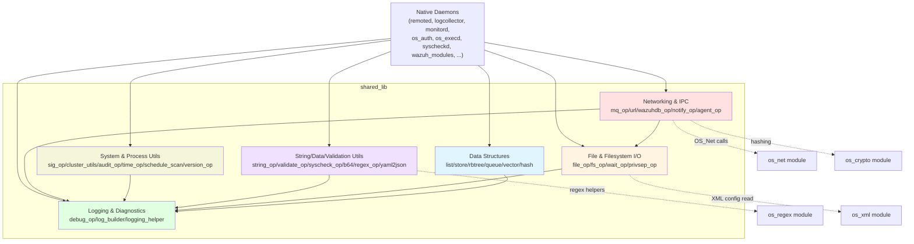
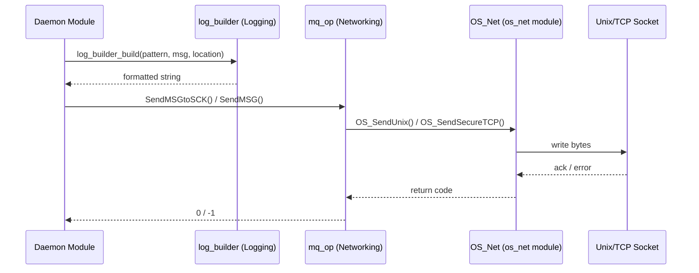

# Shared Library (`src/shared/`)

## 1. Purpose and Overview

The **Shared Library** is the foundational C utility layer used by virtually every native Wazuh daemon and tool (`remoted`, `logcollector`, `monitord`, `os_auth`, `os_execd`, `syscheckd`, `wazuh_modules`, `wazuh_db`, the agent, etc.). It provides low-level, dependency-free (or minimally-dependent) building blocks that are *not* business logic but generic infrastructure:

- Generic **data structures** (linked lists, ordered stores, red-black trees, circular/linked/indexed queues, dynamic vectors, hash tables)
- **File and filesystem** helpers (safe file I/O, path validation, compression, alert/JSON queue readers, privilege-aware directory operations)
- **String, encoding & validation** utilities (string manipulation, Base64, IP/time/day validators, Windows ACL/permission decoding, YAML→JSON conversion)
- **Logging & diagnostics** (the `merror/mwarn/minfo/mdebug` family, JSON/plain log writers, dynamic log-pattern builder)
- **Networking & IPC** helpers (message queue senders, generic HTTP/cURL wrapper, `wazuh-db` socket protocol client, epoll/kqueue event notification)
- **System/process utilities** (signal handling, scheduled-scan time calculators, cluster/version helpers, audit rule management, DLL signature verification on Windows)

Because these components have no "business" semantics of their own, they are consumed—rather than orchestrated—by higher-level modules. For the actual daemons that use this library, see:
- `Agent_&_Manager_Native_Daemons_(C)` (parent module; siblings such as `os_net`, `os_regex`, `os_xml`, `os_crypto`, `remoted`, `logcollector`, `monitord` depend heavily on `shared_lib`)
- `Syscheck___FIM_Daemon_(C_C++)`
- `Wazuh_Modules_Daemon_(C)`
- `wazuh_db`

## 2. Architecture Overview

### Data Flow Example: Sending a Log Message via a Socket

## 3. Sub-Modules

| Sub-module | Description | Documentation |
|---|---|---|
| **Data Structures** | Thread-safe generic containers: singly/doubly linked list (`OSList`), ordered key-value store (`OSStore`), red-black tree (`rb_tree`), circular queue (`w_queue_t`), linked queue (`w_linked_queue_t`), indexed queue (`w_indexed_queue_t`, tree+queue hybrid), dynamic string vector (`W_Vector`), hash table (`OSHash`) | [shared_lib_data_structures.md](shared_lib_data_structures.md) |
| **File & Filesystem I/O** | Safe wrappers over `fopen`/`stat`/`mkdir`, network-path detection (Windows), file compression (gzip/bzip2), merged-file (un)packing, alert/JSON queue tailing, privilege separation, UTF-8↔Wide-char conversions | [shared_lib_file_io.md](shared_lib_file_io.md) |
| **String, Data & Validation Utilities** | String trimming/escaping/splitting, Base64 codec, IP/CIDR/time/day validators, Syscheck/FIM field (un)escaping and Windows ACL/permission decoding, POSIX/SQLite regex helpers, YAML→cJSON conversion | [shared_lib_string_validation.md](shared_lib_string_validation.md) |
| **Logging & Diagnostics** | Core `merror/mwarn/minfo/mdebug*` implementation with plain-text and JSON sinks, dynamic per-daemon log pattern builder (`log_builder`), module-tagged logging bridge (`logging_helper`) | [shared_lib_logging.md](shared_lib_logging.md) |
| **Networking & IPC** | Message-queue senders to `ossec` local sockets (`SendMSG`/`StartMQ`), generic HTTP(S)/cURL client with gzip/bz2 download support (`url.c`), `wazuh-db` request/response protocol client (`wazuhdb_op.c`), epoll/kqueue event notification (`notify_op.c`), agent enrollment/removal helpers (`agent_op.c`) | [shared_lib_networking.md](shared_lib_networking.md) |
| **System & Process Utilities** | Signal handlers and clean shutdown (`sig_op.c`), cluster configuration probing (`cluster_utils.c`), Linux Audit rule management (`audit_op.c`), scheduled-scan time arithmetic (`schedule_scan.c`), OS/time helpers (`time_op.c`, `version_op.c`), Windows DLL load-notification signature verification (`dll_load_notify.c`), legacy agent status/report helpers (`read-agents.c`, `report_op.c`) | [shared_lib_system_utils.md](shared_lib_system_utils.md) |

## 4. Cross-Cutting Concerns

- **Thread-safety**: Most data structures (`OSList`, `OSHash`, `OSStore`, `w_queue_t`, `w_indexed_queue_t`) expose both a non-locking core API and an `_ex` suffixed thread-safe variant guarded by `pthread_rwlock`/`pthread_mutex`.
- **Memory macros**: The whole library relies on the `os_calloc`/`os_malloc`/`os_realloc`/`os_free`/`os_strdup` macro family (defined outside this module) for consistent allocation-failure handling (`merror_exit` on OOM).
- **Platform abstraction**: Many files (`file_op.c`, `notify_op.c`, `time_op.c`, `utf8_winapi_wrapper.c`) branch heavily on `WIN32` to provide POSIX-equivalent behavior on Windows (e.g., `epoll`/`kqueue` vs `wnotify_t`, `fopen` vs UTF‑8 aware `wCreateFile`).
- **Unit testing hooks**: Several files use `#ifdef WAZUH_UNIT_TESTING` to relax `static` visibility so unit tests (see `Unit_Tests_-_Shared_Library`) can call internal helper functions directly.

## 5. Related Modules

- `Agent_&_Manager_Native_Daemons_(C)` — parent module and primary consumer.
- `Configuration_Data_Structures_(C_Headers)` — configuration structs manipulated using this library's readers/validators.
- `wazuh_db` — server-side counterpart of `wazuhdb_op.c`'s client protocol.
- `Unit_Tests_-_Shared_Library` — test suite validating this module.
