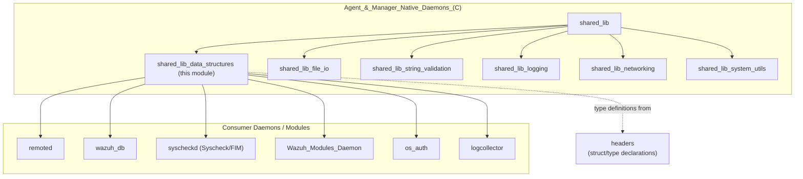
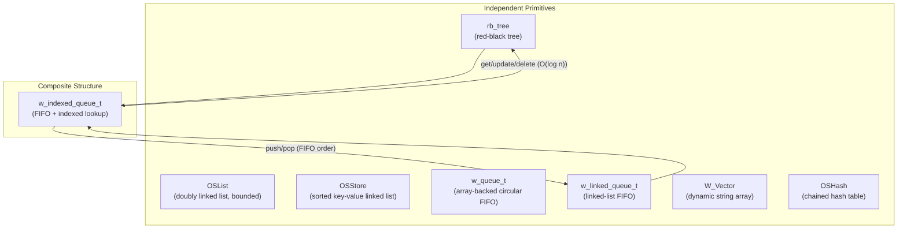
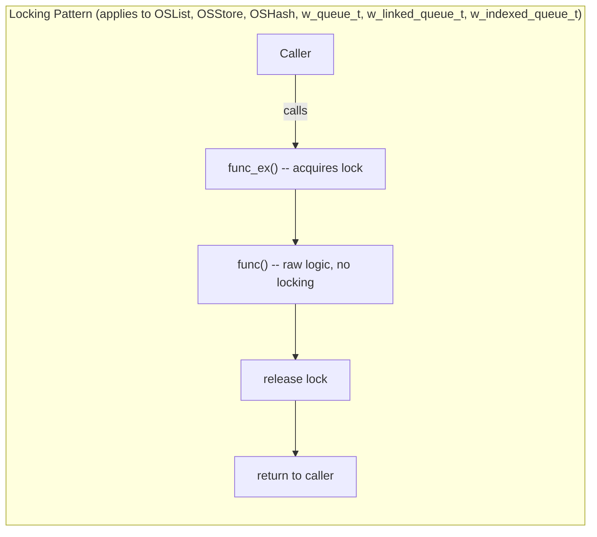
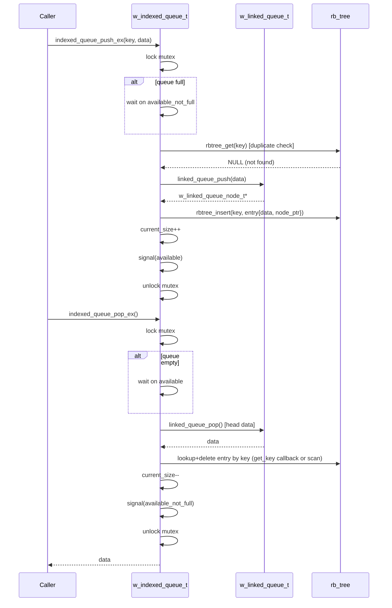
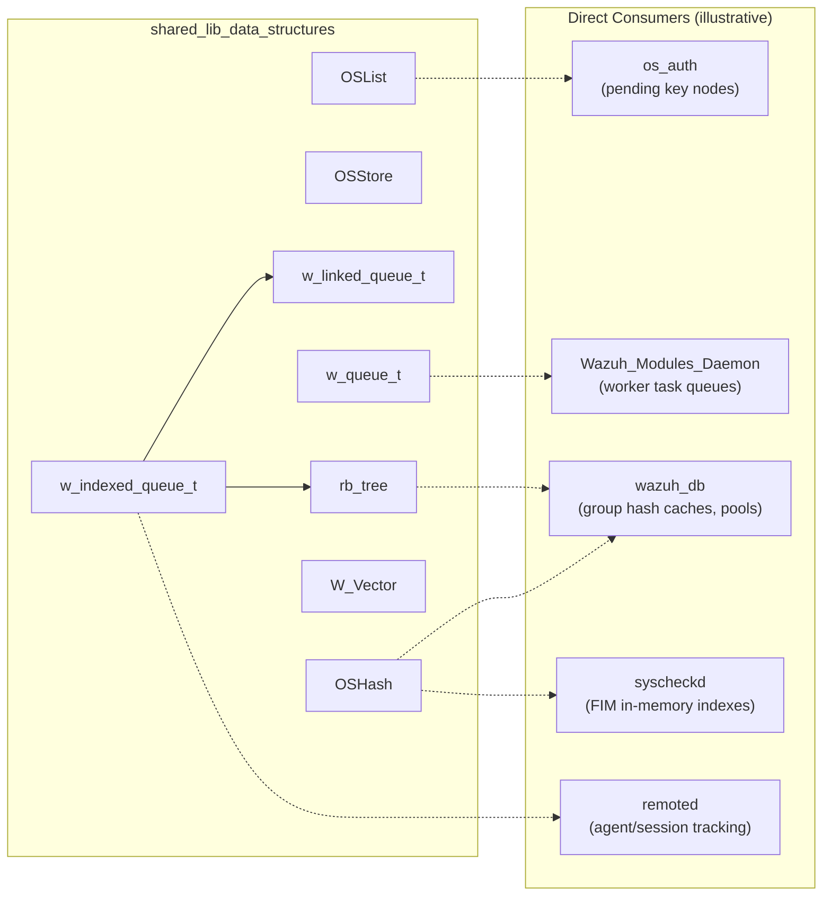

# Shared Library — Data Structures (`shared_lib_data_structures`)

## Introduction

The `shared_lib_data_structures` module is the foundational collection of generic, thread-safe data-structure primitives used throughout the Wazuh C codebase (agent daemons, manager daemons, `wazuh-remoted`, `wazuh-db`, `syscheckd`, `wazuh-modulesd`, etc.). It lives inside the broader **[shared_lib](shared_lib.md)** static library, which is itself a child of the **[Agent_&_Manager_Native_Daemons_(C)](Agent_&_Manager_Native_Daemons_(C).md)** module tree.

This module implements the classic "building block" containers that virtually every native daemon depends on:

- **Doubly linked list** (`OSList`) — bounded, thread-safe list with an application-controlled eviction policy.
- **Ordered key-value store** (`OSStore`) — a sorted, singly-navigable linked list keyed by string, used as a lightweight ordered dictionary.
- **Red-Black Tree** (`rb_tree`) — a balanced binary search tree providing O(log n) key-value operations, used as the backbone of higher-level indexes.
- **Array-backed circular queue** (`w_queue_t`) — a classic bounded FIFO queue implemented over a fixed-size array, with blocking and non-blocking push/pop semantics.
- **Linked-list FIFO queue** (`w_linked_queue_t`) — an unbounded FIFO queue implemented as a doubly linked list, supporting O(1) push/pop and node relocation.
- **Indexed queue** (`w_indexed_queue_t`) — a composite structure that combines the linked-list FIFO queue with a red-black tree index to provide both FIFO ordering **and** O(log n) key-based lookup, update, and deletion (used for agent/session tracking where insertion order and random access are both required).
- **Dynamic string vector** (`W_Vector`) — a growable array of C strings with uniqueness-checking insertion.
- **Hash table** (`OSHash`) — a chained hash table (map) with configurable resizing, free-data callback, and safe iteration.

All structures in this module are designed to be **thread-safe** by default (protected internally by `pthread_mutex_t` and/or `pthread_rwlock_t`), and most expose both a "raw" (unlocked) and a `_ex` (locked, thread-safe) variant of their API — a very common pattern across this module.

This document describes the architecture, the relationships between these structures, their concurrency model, and how they are consumed by the rest of the system.

---

## Module Purpose & Scope

| Aspect | Description |
|---|---|
| **Language** | C (part of the native `shared` static library, compiled into every Wazuh daemon) |
| **Primary Responsibility** | Generic, reusable, thread-safe container data structures |
| **Consumers** | Nearly all native daemons: `remoted`, `wazuh-db`, `syscheckd`, `wazuh-modulesd`, `logcollector`, `monitord`, `os-auth`, etc. |
| **Key Design Goal** | Provide low-level primitives so higher-level modules do not need to reimplement locking, memory management, or search/iteration logic |

### Position in the System

For details on the sibling utility groups, see:
- [shared_lib_file_io.md](shared_lib_file_io.md) — file/stream/queue-file helpers
- [shared_lib_string_validation.md](shared_lib_string_validation.md) — string parsing/encoding helpers
- [shared_lib_logging.md](shared_lib_logging.md) — debug/log macros
- [shared_lib_networking.md](shared_lib_networking.md) — message-queue and socket helpers
- [shared_lib_system_utils.md](shared_lib_system_utils.md) — signal, time, cluster, and OS helpers
- [headers.md](headers.md) — the `.h` files declaring the structs used here (`OSList`, `OSHash`, `w_queue_t`, `w_linked_queue_t`, `w_indexed_queue_t`, `W_Vector`, `rb_tree`, etc.)

---

## Architecture Overview

The module is composed of independent data structures, but one of them — the **Indexed Queue** — is a *composite* that is built directly on top of two others (**Linked Queue** + **Red-Black Tree**). This composition relationship is central to understanding the module's design.

### Key structural relationship: `w_indexed_queue_t`

The indexed queue is the most sophisticated component of this module. It wraps a `w_linked_queue_t` for ordering and a `rb_tree` for O(log n) key-based access, keeping both structures synchronized:

- Every element pushed into the indexed queue creates:
  1. A `w_linked_queue_node_t` appended to the FIFO tail.
  2. An `w_indexed_queue_entry_t` (containing the key, the data pointer, and a **pointer back to the linked-queue node**) inserted into the `rb_tree` under that key.
- `indexed_queue_get/update/delete` operate through the `rb_tree` (fast key lookup), and when deleting, the associated linked-queue node is unlinked directly (O(1) unlink because the entry holds a direct node pointer — no linear FIFO scan required).
- `indexed_queue_pop` removes from the head of the linked queue and then removes the matching entry from the tree, using either an O(log n) `get_key` callback (if configured via `indexed_queue_set_get_key`) or an O(n) fallback scan over `rbtree_keys()`.

This hybrid design allows a caller (e.g. an agent-connection tracker or session table) to enforce **first-in-first-out processing** while also supporting **fast existence checks, updates, and out-of-order removal by key** — something neither the array queue nor the plain linked queue can do alone.

---

## Core Components

### 1. `OSList` — Doubly Linked List (`src/shared/list_op.c`)

A general-purpose doubly linked list guarded by both a `pthread_rwlock_t` (`wr_mutex`, protecting the list's link structure and cursor) and a `pthread_mutex_t` (`mutex`, protecting node mutation). Supports:

- **Bounded eviction**: `OSList_SetMaxSize` configures a maximum node count; when `OSList_AddData` exceeds it, the oldest node is automatically evicted (invoking `free_data_function` if set).
- **Cursor-based iteration**: `OSList_GetFirstNode`/`OSList_GetNextNode`/`OSList_GetPrevNode` maintain an internal `cur_node` cursor.
- **Bulk cleanup variants**:
  - `OSList_CleanNodes` — frees nodes **and** their data (via `free_data_function`).
  - `OSList_CleanOnlyNodes` — frees only the list nodes, leaving the caller responsible for the `data` payloads (useful when data ownership is external).
  - `OSList_DeleteOldestNode` — removes just the head node (used internally by the eviction policy and by callers needing manual trimming).

**Typical consumer**: internal alert/event ring buffers, rootcheck/log-analysis internal message queues.

### 2. `OSStore` — Sorted Key-Value Store (`src/shared/store_op.c`)

An ordered, singly-directional-search linked list keyed by a `const char *`, maintained in **ascending sorted order** on insertion (`OSStore_Put`/`OSStore_Put_ex`). Because the list is sorted, lookups (`OSStore_Check`, `OSStore_NCheck`, `OSStore_NCaseCheck`, `OSStore_GetPosition`/`OSStore_GetPosition_ex`) can stop early as soon as `strcmp` indicates the target key would sort after the current cursor position (average case is a partial scan, not full O(n)).

- `OSStore_Put_ex`/`OSStore_GetPosition_ex` are the thread-safe (`w_rwlock_wrlock`) wrappers around the raw operations.
- `OSStore_SetMaxSize`/`OSStore_SetFreeDataPointer` mirror the configuration pattern seen in `OSList`.
- Case-sensitivity variants (`OSStore_NCheck` uses `strncmp`, `OSStore_NCaseCheck` uses `strncasecmp`) support flexible matching for configuration/group name lookups.

**Typical consumer**: rule/decoder group indexing, configuration directive stores.

### 3. Red-Black Tree — `rb_tree` (`src/shared/rbtree_op.c`)

A textbook, self-balancing binary search tree keyed by `const char *`. Provides `rbtree_insert`, `rbtree_get`, `rbtree_replace`, `rbtree_delete`, `rbtree_minimum`/`rbtree_maximum`, `rbtree_keys`, and `rbtree_range` (retrieve all keys within `[min, max]`).

- `rb_balance_insert` implements the standard red-black insertion fix-up algorithm (recoloring and left/right rotations to restore the red-black invariants after insertion).
- A parallel `rb_balance_delete` (not itself listed as a "core" export but present in the file) handles deletion fix-up.
- The tree does **not** implement its own locking — callers needing thread safety must supply their own synchronization (as `w_indexed_queue_t` does, wrapping all tree access with its own `pthread_mutex_t`).
- Optional `dispose` callback (`rbtree_set_dispose`) frees stored values on `rbtree_destroy`/`rbtree_delete`/`rbtree_replace`.

**Typical consumer**: the indexing engine behind `w_indexed_queue_t`; general-purpose ordered key sets elsewhere in the codebase.

### 4. `w_queue_t` — Bounded Circular Array Queue (`src/shared/queue_op.c`)

A classic ring-buffer FIFO backed by a fixed-size `void **data` array, sized at creation time (`queue_init(size)`). One slot is always kept empty to distinguish "full" from "empty" (`(begin + 1) % size == end` means full).

- Guarded by a single `pthread_mutex_t` plus **two** condition variables: `available` (signaled on push, waited on by poppers) and `available_not_empty`(sic — actually signaled on pop, waited on by blocking pushers to know space is available).
- API layering:
  - Raw (unlocked): `queue_push`, `queue_pop`, `queue_full`, `queue_empty`.
  - Thread-safe non-blocking: `queue_push_ex`, `queue_pop_ex` (the pop variant *blocks* on the `available` condition variable until data exists).
  - Thread-safe blocking-on-full: `queue_push_ex_block` (blocks until space is available).
  - Timed variant: `queue_pop_ex_timedwait` (bounded wait via `pthread_cond_timedwait`).
  - Introspection: `queue_full_ex`, `queue_empty_ex`, `queue_get_percentage_ex` (fill ratio, used for queue-pressure telemetry/backpressure decisions).

**Typical consumer**: internal producer/consumer pipelines within daemons (e.g. worker thread pools consuming from a bounded task queue). See also **[framework_core_communication](framework_core_communication.md)** and **[shared_lib_networking](shared_lib_networking.md)** for higher-level messaging built atop these primitives.

### 5. `w_linked_queue_t` — Unbounded Linked FIFO (`src/shared/queue_linked_op.c`)

An unbounded FIFO implemented as a doubly linked list of `w_linked_queue_node_t` (`first`/`last` pointers, per-node `prev`/`next`). Because it is unbounded and node-based, it complements `w_queue_t` when queue size cannot be predicted or when nodes need to be relocated without a full dequeue/enqueue cycle.

- `linked_queue_push`/`linked_queue_push_ex` append to `last`.
- `linked_queue_pop`/`linked_queue_pop_ex` remove from `first`; the internal helper `linked_queue_pop_node` (core component) unlinks the head node, updates `first`, and clears `last` if the queue becomes empty.
- `linked_queue_unlink_and_push_node` allows an existing node to be **moved to the tail** without a free/alloc cycle — this is exactly the mechanism `w_indexed_queue_t` could leverage for "touch"/promote-to-recent semantics.
- Thread safety is provided by a `pthread_mutex_t` plus a `pthread_cond_t` (`available`), following the same producer/consumer waiting pattern as `w_queue_t`.

**Typical consumer**: the FIFO backbone of `w_indexed_queue_t`.

### 6. `w_indexed_queue_t` — FIFO with Indexed Lookup (`src/shared/indexed_queue_op.c`)

The most complex structure in this module, combining `w_linked_queue_t` + `rb_tree` (see [Architecture Overview](#key-structural-relationship-w_indexed_queue_t) above).

Key operations and behaviors:

| Function | Behavior |
|---|---|
| `indexed_queue_push` / `indexed_queue_push_ex` | Rejects duplicate keys; blocking `_ex` variant waits on `available_not_full` when `max_size` is reached |
| `indexed_queue_upsert` / `indexed_queue_upsert_ex` | Inserts if the key is new, otherwise **replaces the data in place** (disposing the old value via the configured `dispose` callback) without disturbing FIFO order |
| `indexed_queue_get` / `indexed_queue_get_ex` | O(log n) lookup via the `rb_tree` index — no FIFO scan required |
| `indexed_queue_update` / `indexed_queue_update_ex` | Replaces the data pointer for an existing key in both the tree entry and its linked queue node |
| `indexed_queue_delete` / `indexed_queue_delete_ex` (core) | Removes an element **by key**, manually unlinking its `w_linked_queue_node_t` from the FIFO (adjusting the queue's `first`/`last` pointers directly) before deleting the tree entry — this avoids any O(n) list traversal |
| `indexed_queue_pop` / `indexed_queue_pop_ex` / `indexed_queue_pop_ex_timedwait` | Classic FIFO dequeue from the head; the matching tree entry is removed either via the fast `get_key` callback or a fallback linear scan over `rbtree_keys()` |
| `indexed_queue_peek` / `indexed_queue_peek_ex` | Non-destructive read of the head element |
| `indexed_queue_entry_free` (core, static) | Disposal callback registered with the tree (`rbtree_set_dispose`) — frees the entry's `key` and the entry struct itself (data disposal is handled separately via the queue-level `dispose` callback) |

Concurrency is centralized in a single `pthread_mutex_t` per queue plus two condition variables: `available` (non-empty signal for blocking pop) and `available_not_full` (space-available signal for blocking push, mirroring `w_queue_t`'s design).

**Typical consumer**: components that need both age-ordered processing and key-addressable state — for example, agent/session tracking tables where entries must be processed in arrival order but also be queryable/removable by agent ID.

### 7. `W_Vector` — Dynamic String Array (`src/shared/vector_op.c`)

A minimal growable array of `char *`, doubling its backing buffer (`realloc`) when full. Not internally locked — callers are expected to serialize access externally if needed.

- `W_Vector_insert` appends a `strdup`'d copy of the input string.
- `W_Vector_insert_unique` (core component) performs a linear `strcmp` scan before inserting, guaranteeing set-like uniqueness at the cost of O(n) insertion.
- `W_Vector_length` (core component) simply returns `used` — trivial, but the accessor centralizes NULL-safety (`if (v) ... else return 0`).
- `W_Vector_get`/`W_Vector_free` round out basic vector lifecycle management.

**Typical consumer**: accumulating unique lists (e.g., distinct group names, distinct file paths) where the total element count is expected to remain small enough that O(n) uniqueness checks are acceptable.

### 8. `OSHash` — Chained Hash Table (`src/shared/hash_op.c`)

A hash map using **separate chaining** (`OSHashNode` linked lists per bucket) with a polynomial (Horner's-rule-style) hash function seeded with two random primes at creation time (`initial_seed`, `constant`), reducing predictable collision patterns.

- **Resizing**: `OSHash_setSize`/`OSHash_setSize_ex` (core) grow the table to the next prime ≥ the requested size via `realloc`. Growing the table **discards all existing entries** (this is a "clear and resize" operation, not a rehash-preserving-data operation — callers must repopulate after resizing, or call `setSize` before populating).
- **Insertion variants**: `OSHash_Add` (fails silently on duplicate key), `OSHash_Set` (updates on duplicate), `_ex` suffixed thread-safe wrappers, and `OSHash_Add_ins`/`OSHash_Delete_ins`/`OSHash_Get_ins` (core: `OSHash_Add_ins`) which **lower-case the key** before delegating to the `_ex` variant — providing case-insensitive semantics without changing the core hash/compare logic.
- **Iteration**: `OSHash_Begin`/`OSHash_Next` provide a manual cursor-based iterator; `OSHash_It`/`OSHash_It_ex` (core: `OSHash_It_ex`) provide a callback-driven iteration with **three locking modes** (`0` = read lock, `1` = write lock, `2` = write lock + `sleep(1)`, likely to throttle iteration-with-mutation workloads) — the callback receives `OSHashNode **row, OSHashNode **node` so it may safely mutate the table (delete/replace) during iteration.
- **Index inspection**: `OSHash_GetIndex` (core) exposes the raw bucket index for a key — used by advanced callers needing direct bucket-level operations or diagnostics.
- **Duplication**: `OSHash_Duplicate`/`OSHash_Duplicate_ex` perform a structural deep-copy of the table (keys duplicated, data pointers shared).

**Typical consumer**: virtually every daemon that needs a fast key→pointer map — agent key stores (`os_auth`), group hash caches (`wazuh-db` global group hash), rule/decoder lookup tables, and more.

---

## Concurrency & Locking Model

A consistent pattern is used across the whole module: a **raw/unsynchronized function** implements the core logic, and a **`_ex` suffixed wrapper** adds locking. This lets internal code (e.g., inside a structure that already holds the lock) call the fast raw path, while external callers use the safe `_ex` path.

| Structure | Lock type(s) | Notes |
|---|---|---|
| `OSList` | `pthread_rwlock_t` (structure) + `pthread_mutex_t` (node mutation) | Dual-lock scheme: read operations can take the rwlock in read mode; add/delete take both |
| `OSStore` | `pthread_rwlock_t` | Single rwlock; write operations use `w_rwlock_wrlock` |
| `rb_tree` | *None* | Unsynchronized; caller must serialize access |
| `w_queue_t` | `pthread_mutex_t` + 2 `pthread_cond_t` | Classic bounded-buffer producer/consumer pattern |
| `w_linked_queue_t` | `pthread_mutex_t` + `pthread_cond_t` | Unbounded producer/consumer pattern |
| `w_indexed_queue_t` | `pthread_mutex_t` + 2 `pthread_cond_t` | Wraps both the linked queue and the rb_tree under one mutex — the sub-structures' own (absent) locks are irrelevant since the composite serializes everything |
| `W_Vector` | *None* | Caller-managed |
| `OSHash` | `pthread_rwlock_t` | Read operations (`Get`) use `rdlock`; mutation uses `wrlock` |

---

## Data Flow: Indexed Queue Push/Pop Lifecycle

---

## Component Interaction Overview

These consumer daemons are documented in their respective module docs:
- [Agent_&_Manager_Native_Daemons_(C).md](Agent_&_Manager_Native_Daemons_(C).md) — parent tree covering `remoted`, `os_auth`, `monitord`, `logcollector`, etc.
- [wazuh_db.md](wazuh_db.md) — `wazuh-db` daemon (heavy user of hash tables and pooling structures)
- [Syscheck___FIM_Daemon_(C_C++).md](Syscheck___FIM_Daemon_(C_C++).md) — File Integrity Monitoring daemon
- [Wazuh_Modules_Daemon_(C).md](Wazuh_Modules_Daemon_(C).md) — pluggable wodules architecture

---

## Testing

Unit tests for every structure in this module live under `src/unit_tests/shared/` and are documented in **[Unit_Tests_-_Shared_Library.md](Unit_Tests_-_Shared_Library.md)**, notably:
- `test_list_op` — `OSList` behavior (insertion ordering, node deletion)
- `test_rbtree_op` — exhaustive red-black invariant checks (`black_depth`, insert/delete/replace/range)
- `test_queue_op` — bounded queue push/pop, blocking behavior, percentage reporting
- `test_queue_linked_op` — linked queue push/pop and node relocation
- `test_indexed_queue_op` — combined FIFO + indexed access semantics, callback fallback behavior
- `test_syscheck_op`/other consumer tests exercise these structures indirectly via higher-level FIM logic

---

## Summary

`shared_lib_data_structures` provides the low-level, reusable, thread-safe containers that the rest of the native Wazuh codebase builds upon. Its design consistently favors:

1. **A raw/`_ex` split** to separate core logic from concurrency control.
2. **Configurable memory ownership** via `free_data_function`/`dispose` callbacks, avoiding memory leaks when structures own opaque `void *` payloads.
3. **Composability** — most visibly in `w_indexed_queue_t`, which composes `w_linked_queue_t` and `rb_tree` to deliver FIFO ordering with fast keyed access, a pattern that avoids reinventing balanced-tree or linked-list logic in every module that needs indexed queueing.

Understanding these primitives is a prerequisite for reading the higher-level daemon code in [remoted](Agent_&_Manager_Native_Daemons_(C).md), [wazuh_db](wazuh_db.md), and [Syscheck/FIM](Syscheck___FIM_Daemon_(C_C++).md), all of which rely heavily on these containers for internal state management.
