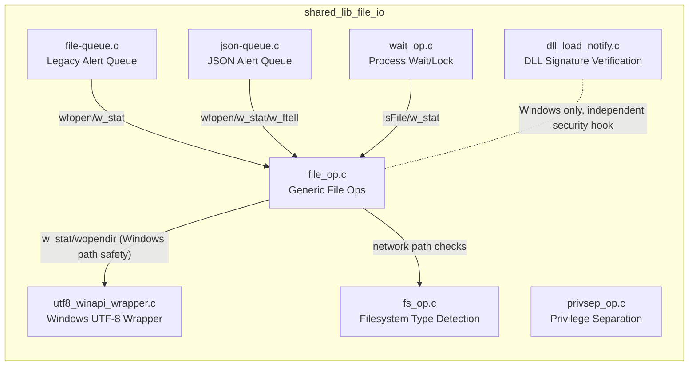
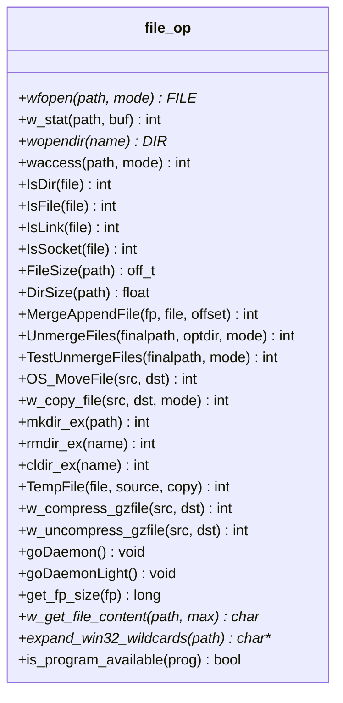
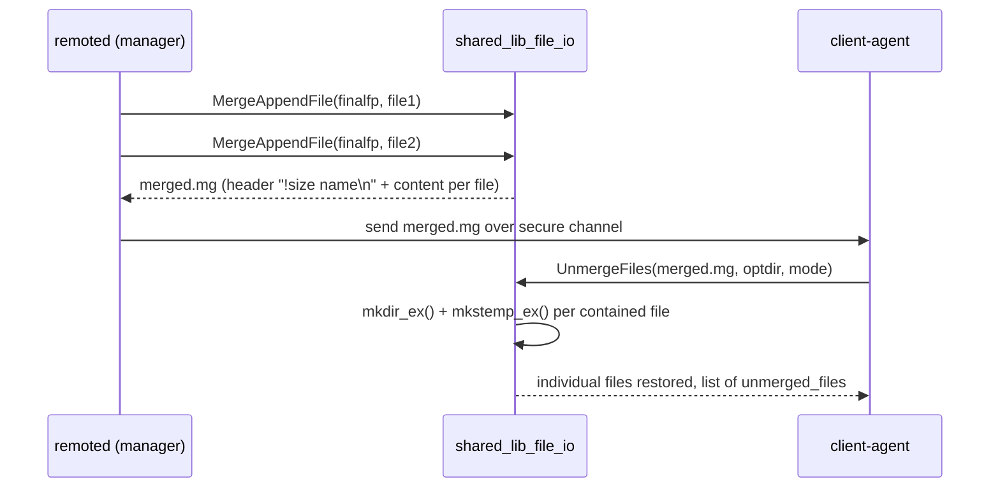
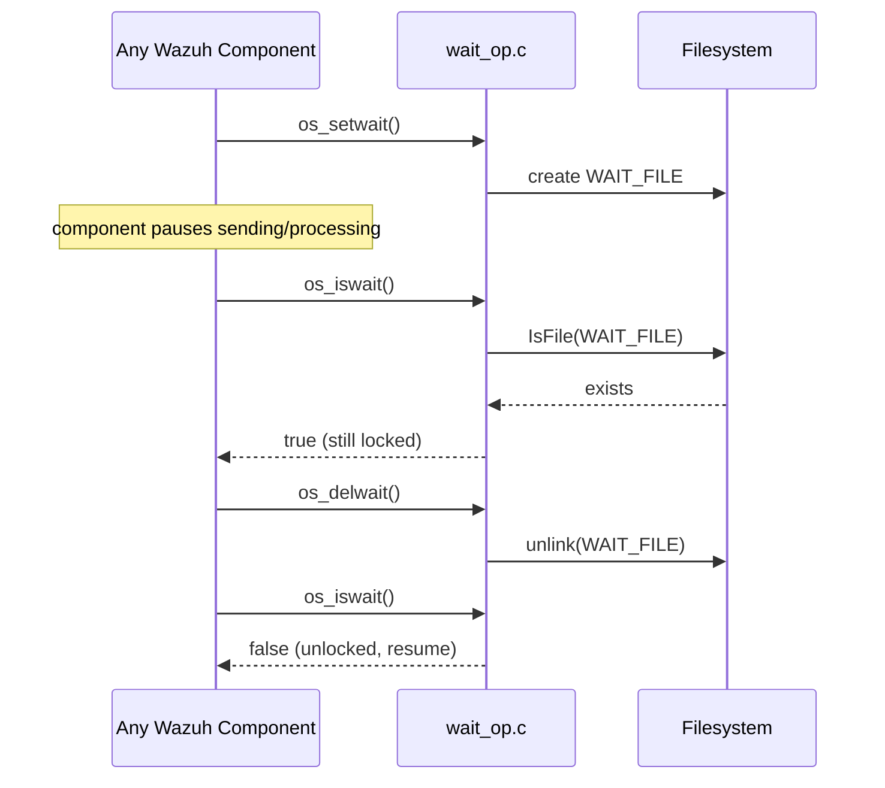
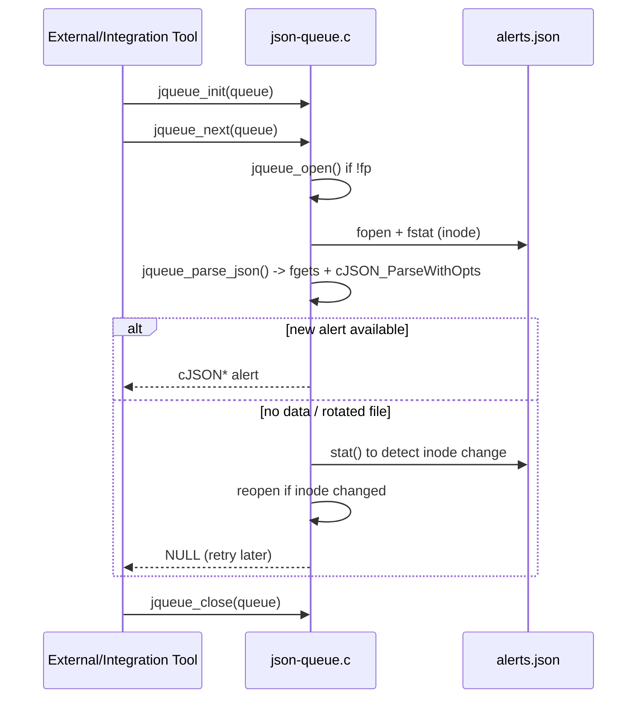
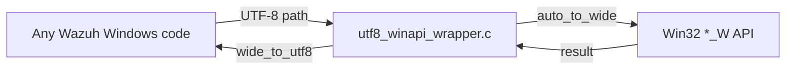
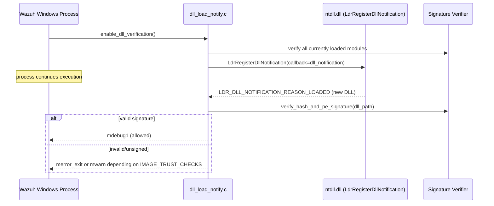

# Shared Library — File I/O & OS Abstraction (`shared_lib_file_io`)

## Introduction

`shared_lib_file_io` is the foundational **cross-platform file, filesystem and OS-primitive abstraction layer** used by virtually every native C daemon and utility in Wazuh (agent, manager, `remoted`, `os_auth`, `os_execd`, `wazuh_modules`, `monitord`, CLI tools, etc.). It lives inside `src/shared/` and is compiled directly into every daemon binary (it is *not* a shared object, but a set of translation units linked statically into each executable).

Its responsibilities include:

- **Portable file operations**: opening, reading, writing, merging/un-merging, copying, moving, compressing and inspecting files (`file_op.c`).
- **Filesystem introspection**: identifying network filesystems (NFS/CIFS) and special filesystems (procfs, tmpfs, overlayfs, etc.) to avoid unsafe recursive scanning (`fs_op.c`).
- **Inter-process soft-locking**: a simple file-based "wait" mechanism that pauses agent/manager activity while a lock file exists (`wait_op.c`).
- **Privilege separation primitives**: safe, reentrant wrappers around `getpwnam`/`getgrnam` family calls plus `setuid`/`setgid`/`chroot` helpers (`privsep_op.c`).
- **Legacy & JSON alert file queues**: tailing/reading of `alerts.log` and `alerts.json` for tools that consume Wazuh's alert stream (`file-queue.c`, `json-queue.c`).
- **Windows UTF-8 interoperability**: wrappers that transparently convert UTF-8 paths to UTF-16 before calling native Win32 file APIs (`utf8_winapi_wrapper.c`).
- **Windows DLL load-time signature verification**: a security control that validates the Authenticode signature of every DLL loaded into a Wazuh process (`dll_load_notify.c`).

This module is a sibling of [shared_lib_data_structures](shared_lib_data_structures.md), [shared_lib_string_validation](shared_lib_string_validation.md), [shared_lib_logging](shared_lib_logging.md), [shared_lib_networking](shared_lib_networking.md) and [shared_lib_system_utils](shared_lib_system_utils.md) inside the larger **`shared_lib`** utility layer that underpins the [Agent & Manager Native Daemons](Agent_&_Manager_Native_Daemons_(C).md) codebase.

---

## Position in the Overall System

```mermaid
graph TB
    subgraph shared_lib["shared_lib (src/shared)"]
        FIO["shared_lib_file_io\n(this module)"]
        DS["shared_lib_data_structures"]
        SV["shared_lib_string_validation"]
        LOG["shared_lib_logging"]
        NET["shared_lib_networking"]
        SYS["shared_lib_system_utils"]
    end

    subgraph Daemons["Native Daemons"]
        REMOTED["remoted"]
        CLIENTAGENT["client_agent_native"]
        OSAUTH["os_auth"]
        OSEXECD["os_execd"]
        MONITORD["monitord"]
        LOGCOLLECTOR["logcollector"]
        WMODULES["wazuh_modules_core"]
        ADDAGENT["addagent_native"]
        UTIL["util_cli_tools"]
    end

    FIO --> REMOTED
    FIO --> CLIENTAGENT
    FIO --> OSAUTH
    FIO --> OSEXECD
    FIO --> MONITORD
    FIO --> LOGCOLLECTOR
    FIO --> WMODULES
    FIO --> ADDAGENT
    FIO --> UTIL

    FIO -.uses.-> LOG
    FIO -.uses.-> SYS
    FIO -.uses.-> SV
```



Almost every daemon documented in [Agent & Manager Native Daemons (C)](Agent_&_Manager_Native_Daemons_(C).md) links against this module for basic filesystem access, and many higher level subsystems (e.g. [remoted group management](Agent_&_Manager_Native_Daemons_(C).md), the [Wazuh Modules Daemon](Wazuh_Modules_Daemon_(C).md), and [Syscheck/FIM](Syscheck___FIM_Daemon_(C_C++).md)) build their file-merging, config-reading and log-tailing logic directly on top of the primitives defined here.

---

## Architecture Overview



### File Responsibilities

| File | Core Components | Purpose |
|------|------------------|---------|
| `file_op.c` | `IsLink`, `get_creation_date`, `get_fp_size`, `goDaemonLight`, `qsort_strcmp`, `trail_path_separator`, `win_path_backslash`, `stat`/`dirent`/`utsname` usage | Generic, cross-platform file/directory operations: existence checks, size/inode queries, merge & unmerge of grouped files, daemonization, path normalization, temp file creation, gzip compression helpers |
| `fs_op.c` | `file_system_type` | Detects special/network filesystems (NFS, CIFS, procfs, tmpfs, overlayfs, btrfs, etc.) via `statfs()` to guide safe recursive directory scans (used heavily by FIM/syscheck) |
| `wait_op.c` | `os_iswait` | Implements a simple file-based lock (`WAIT_FILE`) so agent components can pause processing while the manager enrolls/reconnects |
| `privsep_op.c` | `group`, `passwd` | Thread-safe (`_r`) wrappers for `getpwnam`/`getpwuid`/`getgrnam`/`getgrgid`, plus `Privsep_SetUser`, `Privsep_SetGroup`, `Privsep_Chroot` for daemon privilege drop |
| `file-queue.c` | `file_sleep`, `timeval`, `tm` | Legacy plain-text alert queue reader (`alerts.log`) used by external log-forwarding tools |
| `json-queue.c` | `jqueue_init`, `jqueue_open`, `jqueue_close`, `stat` | JSON alert queue reader (`alerts.json`) with inode-change detection and partial-read protection |
| `utf8_winapi_wrapper.c` | `_stat64` | Converts UTF-8 strings to UTF-16 (and back) so Windows-only APIs (`CreateFileW`, `GetFileSecurityW`, `_wstat64`, etc.) can be safely called with UTF-8 paths |
| `dll_load_notify.c` | `dll_notification` | Registers an `LdrRegisterDllNotification` callback (Windows) to verify the Authenticode signature of every DLL loaded at runtime, hardening the process against DLL side-loading attacks |

---

## Key Functional Areas

### 1. Generic File Operations (`file_op.c`)

This is the largest and most heavily used file in the module. It centralizes almost all file-related I/O so that the rest of the codebase never calls raw POSIX/Win32 functions directly (`wfopen`, `w_stat`, `wopendir`, `waccess` wrap the OS equivalents and, on Windows, block execution against UNC/mapped network paths for security).



#### Group File Merge / Unmerge Flow

`MergeAppendFile` / `UnmergeFiles` implement Wazuh's grouped-configuration protocol: multiple files (e.g. per-group `agent.conf`, `.txt` CDB lists) are concatenated into one "merged" file transmitted to agents, and unpacked again on the agent side. This underpins the [remoted group management](Agent_&_Manager_Native_Daemons_(C).md) and [agent group synchronization](API_&_Management_Framework_(Python).md) features.



### 2. Filesystem Type Detection (`fs_op.c`)

`HasFilesystem`, `IsNFS` and `skipFS` call `statfs()` (Linux) to classify a mount point. This is primarily consumed by the [Syscheck/FIM daemon](Syscheck___FIM_Daemon_(C_C++).md) to decide whether a directory should be scanned, ignored, or scanned without inode-based deduplication (e.g. `overlayfs`, `btrfs`, `aufs` do not provide stable hard-link counts).

```mermaid
flowchart TD
    Start[Directory to scan] --> Statfs[statfs on path]
    Statfs --> Check{f_type matches?}
    Check -->|NFS/CIFS| NetworkFS[network_file_systems table\nflag=1 => treat as remote]
    Check -->|BTRFS/AUFS/OVERLAYFS/V9FS| SkipFS[skip_file_systems table\nskip link-count test]
    Check -->|DEVFS/PROCFS/TMPFS/SYSFS| HasFS[HasFilesystem() set match]
    Check -->|none matched| Local[Treat as local ext4/xfs/etc.]
```

### 3. Process Wait / Soft Locking (`wait_op.c`)

`os_setwait()` / `os_delwait()` create/remove a sentinel file (`WAIT_FILE`). `os_iswait()` (core component here) and `os_wait()`/`os_wait_predicate()` allow any component (e.g. `client-agent` buffering, [os_auth](Agent_&_Manager_Native_Daemons_(C).md) enrollment) to pause until the manager signals readiness, using a polling loop (`LOCK_LOOP` = 5s) with an optional predicate callback for early exit.



### 4. Privilege Separation (`privsep_op.c`)

Provides POSIX-only, thread-safe user/group lookups (`Privsep_GetUser`, `Privsep_GetGroup`) built atop reentrant `_r` variants with automatic buffer growth on `ERANGE`, plus `Privsep_SetUser`/`Privsep_SetGroup`/`Privsep_Chroot` used during daemon startup to drop root privileges (a standard hardening step for `remoted`, `logcollector`, `os_execd`, etc.).

```mermaid
flowchart LR
    Daemon[Daemon main()] --> GetUser[Privsep_GetUser username]
    Daemon --> GetGroup[Privsep_GetGroup groupname]
    GetUser --> SetGroup[Privsep_SetGroup gid]
    SetGroup --> SetUser[Privsep_SetUser uid]
    SetUser --> Chroot[Privsep_Chroot path]
    Chroot --> Running[Daemon runs unprivileged & chrooted]
```

### 5. Alert File Queues (`file-queue.c` & `json-queue.c`)

Two parallel implementations exist for historical reasons:

- **Legacy** (`file-queue.c`): reads `ALERTS_DAILY` (plain-text `alerts.log`), rotating by day/month/year, with `Read_FileMon` blocking up to `timeout` iterations of `file_sleep()` (5s each) waiting for new events.
- **JSON** (`json-queue.c`): reads `ALERTSJSON_DAILY` (`alerts.json`), using `jqueue_parse_json` to safely extract one JSON object per line, detecting inode changes (log rotation) via `fstat`, and guarding against partial/overlong lines.

Both are consumed by external tooling (integrations, [Wodles - Cloud Integration Services](Wodles_-_Cloud_Integration_Services_(Python).md), and custom alert forwarders) that tail Wazuh's alert output outside of the Wazuh Indexer/Engine pipeline.



### 6. Windows UTF-8 Interoperability (`utf8_winapi_wrapper.c`)

Windows' native Win32 API is UTF-16 (`*_W` functions); Wazuh's internal strings are UTF-8. This file centralizes conversion (`auto_to_wide`, `wide_to_utf8`, `wide_to_ansi`) and re-exposes UTF-8-safe equivalents of the Win32 calls actually used elsewhere in the codebase: `utf8_stat64` (`_stat64` component), `utf8_CreateFile`, `utf8_ReplaceFile`, `utf8_DeleteFile`, `utf8_GetFileAttributes`, `utf8_GetShortPathName`, `utf8_GetFileSecurity`, `utf8_GetNamedSecurityInfo`, `utf8_SetNamedSecurityInfo`.

`file_op.c`'s Windows branch (`wCreateFile`, `w_stat64`, `wfopen`) calls directly into these wrappers, so **all** file access on Windows agents/managers is guaranteed to be UTF-8 safe.



### 7. DLL Load Signature Verification (`dll_load_notify.c`)

A Windows-only security control. `enable_dll_verification()` is invoked once at process start; it:

1. Verifies every **already-loaded** module (`loaded_modules_verification`) using Authenticode signature checks against a specific CA (`CA_NAME`).
2. Registers `dll_notification` (the core component) via `LdrRegisterDllNotification` so that **every future DLL load** triggers signature validation.
3. Depending on the `IMAGE_TRUST_CHECKS` build flag, either aborts the process (`merror_exit`, level 2 — strict) or only warns (level 1) if an unsigned/invalid DLL is detected.



---

## Cross-Platform Abstraction Summary

| Concern | POSIX Path | Windows Path |
|---------|-----------|--------------|
| Stat a file | `stat()` via `w_stat` | `utf8_stat64` → `_wstat64` |
| Open a file | `fopen()` via `wfopen` | `wCreateFile` (UTF-16) + `_open_osfhandle` + `_fdopen` |
| List directory | `opendir()` via `wopendir` | `opendir()` (network-path guarded) / `FindFirstFileW` for wildcard expansion |
| Daemonize | `fork()` + `setsid()` (`goDaemon`, `goDaemonLight`) | N/A (Windows services) |
| Privilege drop | `privsep_op.c` (`setuid`/`setgid`/`chroot`) | N/A (Windows uses service accounts) |
| Path network check | N/A (not required) | `is_network_path()` blocks UNC/mapped drives for `wfopen`/`wCreateFile`/`wopendir` |
| DLL/library security | N/A | `dll_load_notify.c` signature enforcement |

---

## Consumers & Dependency Graph

```mermaid
graph TD
    FIO[shared_lib_file_io]

    FIO --> Headers["headers (src/headers)\nfile_op.h, file-queue.h"]
    FIO --> Remoted["remoted_group_management\n(shared_download.c, manager.c)"]
    FIO --> ClientAgent["client_agent_native"]
    FIO --> OSAuth["os_auth"]
    FIO --> OSExecd["os_execd"]
    FIO --> Monitord["monitord (log rotation)"]
    FIO --> Logcollector["logcollector"]
    FIO --> Syscheckd["Syscheck / FIM daemon"]
    FIO --> WazuhModules["wazuh_modules_core\n(agent_upgrade, wm_database, etc.)"]
    FIO --> Rootcheck["rootcheck"]
    FIO --> CLI["util_cli_tools\n(agent_control, list_agents, etc.)"]
    FIO --> Tests["Unit_Tests_-_Shared_Library\n& Unit Test Wrappers"]

    FIO -.depends on.-> shared_lib_logging
    FIO -.depends on.-> shared_lib_system_utils
```



- **[shared_lib_data_structures](shared_lib_data_structures.md)** — sibling module providing lists, hash tables and queues, occasionally used alongside file iteration (e.g., `wreaddir` results).
- **[shared_lib_logging](shared_lib_logging.md)** — supplies the `merror`/`mdebug`/`mwarn` macros used pervasively throughout this module for diagnostics.
- **[shared_lib_networking](shared_lib_networking.md)** — network path detection in this module (`is_network_path`) complements socket/network operations documented there.
- **[shared_lib_system_utils](shared_lib_system_utils.md)** — time and OS utility helpers (e.g., `get_windows_file_time_epoch`) called from `utf8_winapi_wrapper.c` and `file_op.c`.
- **[Unit Tests - Shared Library](Unit_Tests_-_Shared_Library.md)** and **[Unit Test Wrappers & Mocks](Unit_Test_Wrappers_&_Mocks.md)** — extensive test coverage (`test_file_op.c`, `test_fs_op.c`, `test_json-queue.c`, `test_privsep_op.c`) and wrapper mocks (`stat_wrappers.c`, `dirent_wrappers.c`) validate this module in isolation.

---

## Summary

`shared_lib_file_io` is the bedrock file-system and OS-primitive layer for all native Wazuh C components. By centralizing platform differences (POSIX vs. Windows), security-sensitive operations (privilege drop, network-path blocking, DLL signature verification) and higher-level file protocols (merge/unmerge, alert queues), it lets the rest of the codebase — from `remoted`'s group synchronization to the `Wazuh Modules Daemon`'s upgrade packages — perform file I/O safely and portably without re-implementing these concerns per component.
