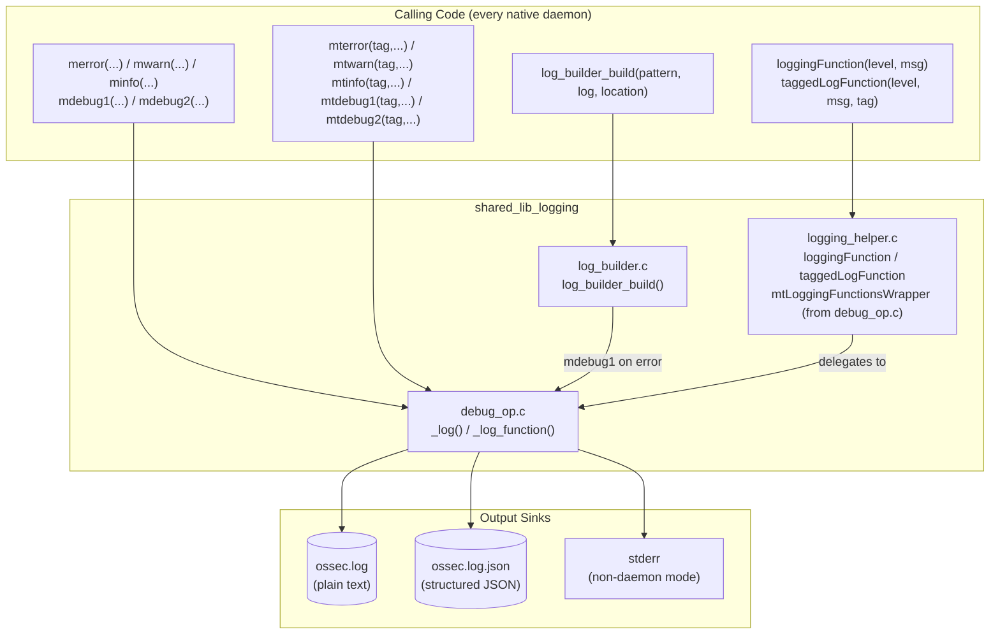
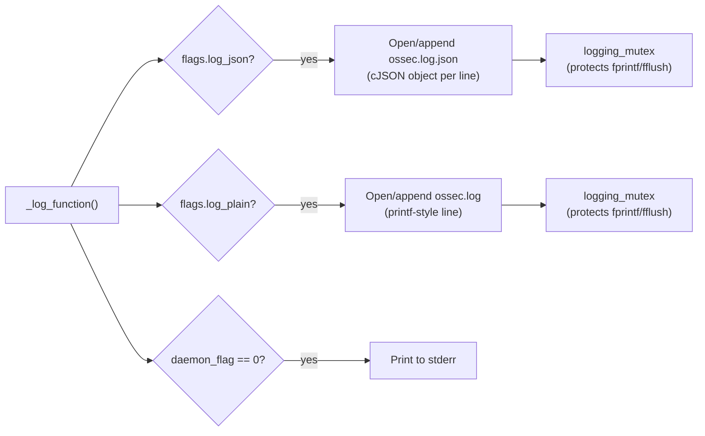
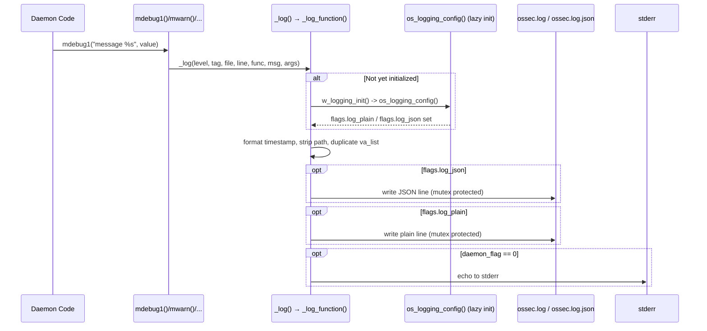
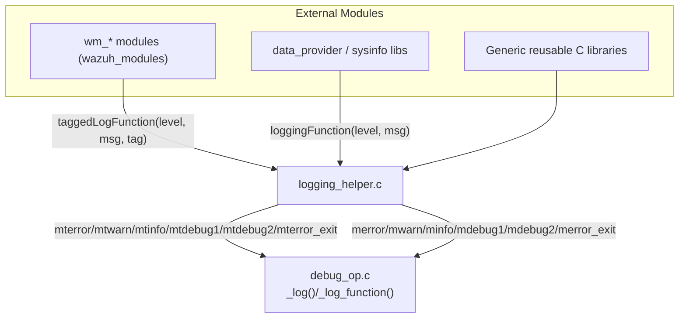
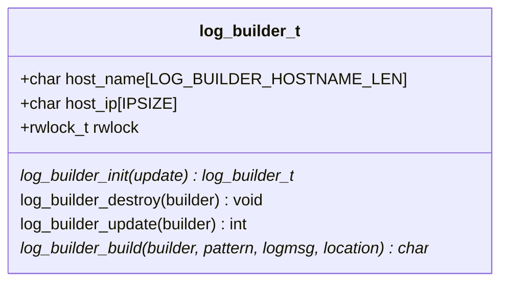
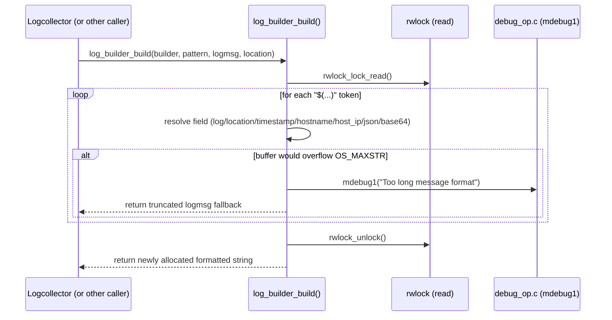
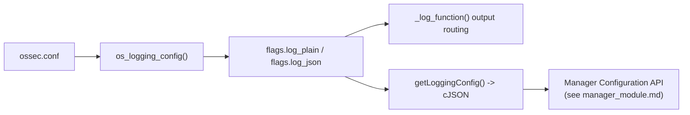
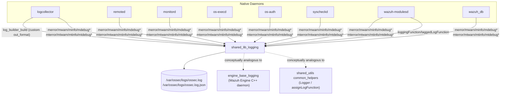

# Shared Library — Logging (`shared_lib_logging`)

## Introduction

`shared_lib_logging` is the foundational, cross-daemon logging subsystem of the Wazuh C codebase. It lives inside the broader `shared_lib` library (see [shared_lib_data_structures.md](shared_lib_data_structures.md), [shared_lib_file_io.md](shared_lib_file_io.md), [shared_lib_string_validation.md](shared_lib_string_validation.md), [shared_lib_networking.md](shared_lib_networking.md) and [shared_lib_system_utils.md](shared_lib_system_utils.md) for sibling utilities) and is statically linked into virtually every native Wazuh daemon and utility — `logcollector`, `remoted`, `monitord`, `os-execd`, `os-auth`, `wazuh-modulesd`, `syscheckd`, `wazuh_db`, CLI tools, etc. (see [Agent_&_Manager_Native_Daemons_(C)](shared_lib.md) tree).

It provides:

- A **core logging engine** (`debug_op.c`) that implements the `merror`/`mwarn`/`minfo`/`mdebug1`/`mdebug2` family of macros (plain and tagged variants), writes to `ossec.log` (plain text) and/or `ossec.log.json` (structured JSON), and also echoes to `stderr` when not running as a daemon.
- A **log message templating engine** (`log_builder.c`) that renders custom output formats (used mainly by `logcollector`) by substituting placeholders such as `$(timestamp)`, `$(hostname)`, `$(host_ip)`, `$(log)`, `$(json_escaped_log)`, `$(base64_log)`.
- A **logging adapter/bridge** (`logging_helper.c`) that exposes a level-enum based API (`loggingFunction`, `taggedLogFunction`) so that decoupled or C++ components (e.g. [shared_utils](shared_utils.md)'s `loggerHelper.h`, `wazuh_modules`, `data_provider`) can log through this same engine without directly depending on the `debug_op` macros.

This document describes the internal architecture, data flow, and integration points of this module.

---

## 1. Module Purpose & Scope

| File | Responsibility |
|---|---|
| `src/shared/debug_op.c` | Core logging engine: log level filtering, JSON/plain file writers, mutex-protected I/O, daemon/chroot awareness, `stderr` echo, XML-based logging configuration (`logging.log_format` in `ossec.conf`). |
| `src/shared/log_builder.c` | Dynamic, pattern-based log line construction (`$(...)` placeholders) with periodic hostname/IP refresh; primarily consumed by `logcollector`'s custom output formats. |
| `src/shared/logging_helper.c` | Thin adapter mapping a generic `modules_log_level_t` enum to the internal `debug_op` macros, enabling non-native or reusable components to plug into the same logging pipeline. |

Out of scope (covered elsewhere):
- File I/O primitives (`wfopen`, `IsFile`) → [shared_lib_file_io.md](shared_lib_file_io.md)
- String/JSON escaping helpers (`wstr_escape_json`, Base64 `encode_base64`) → [shared_lib_string_validation.md](shared_lib_string_validation.md)
- Read/write locks (`rwlock_lock_read/write`) and mutex primitives → [shared_lib_data_structures.md](shared_lib_data_structures.md) / [shared_lib_system_utils.md](shared_lib_system_utils.md)
- Control-socket communication for host IP resolution (`control_check_connection`) → [shared_lib_networking.md](shared_lib_networking.md)
- Analogous, independent logging stack for the C++ engine daemon → [engine_base_logging.md](engine_base_logging.md)
- Analogous logging bridge for C++ shared modules (RocksDB/DBSync/etc.) → `Logger`/`assignLogFunction` in [shared_utils.md](shared_utils.md) (`common_helpers`)

---

## 2. High-Level Architecture



Key design points:

- **Single funnel**: All logging macros, tagged or untagged, plain or verbose, eventually call the internal static function `_log_function()` in `debug_op.c`. This guarantees consistent formatting, mutex protection, and output routing regardless of caller.
- **Adapter pattern**: `logging_helper.c` exists so that libraries that must remain decoupled from the `debug_op.h` macro set (e.g., generic C++ utility code or modules that are also compiled outside the main daemon context) can still route messages into the same log files by injecting a function pointer of type `taggedLogFunction`/`loggingFunction` (see `assignLogFunction` pattern in [shared_utils.md](shared_utils.md)).
- **Independent formatting layer**: `log_builder.c` does not write to log files itself — it *builds strings* which are subsequently written to output destinations (files, syslog, sockets) by the caller (typically `logcollector`, see [logcollector_config_state.md](shared_lib.md)). It only calls `mdebug1` for internal diagnostic/error messages (e.g., "Too long message format").

---

## 3. Core Logging Engine (`debug_op.c`)

### 3.1 Responsibilities

- Maintains global state: `dbg_flag` (verbosity level), `chroot_flag`, `daemon_flag`, `flags.log_plain` / `flags.log_json` (output format toggles read from `ossec.conf`), and a shared `logging_mutex`.
- Exposes a family of internal functions (prefixed with `_`) that are wrapped by macros defined in `debug_op.h` (not shown in this component set, but inferred from usage): `merror`, `mwarn`, `minfo`, `mdebug1`, `mdebug2`, and their **tagged** (`mt*`) and **plain-only** (`_plain_*`) counterparts.
- `os_logging_config()` reads the `<logging><log_format>` element from `ossec.conf` via `OS_XML`, deciding whether `plain`, `json`, or both formats are enabled.
- `w_logging_init()` lazily initializes the mutex and configuration; if a log call happens before initialization completes it can safely emit a "plain only" message to avoid recursive dependency on XML-parsing libraries.
- `isChroot()` / `nowChroot()` / `nowDaemon()` / `nowDebug()` manage runtime state flags used elsewhere in the codebase (e.g., file path selection under chroot).
- `mtLoggingFunctionsWrapper()` is the single dispatch point used by [logging_helper.c](#4-logging-adapter-logging_helperc) to route level-enum-based calls into the internal engine, including handling `LOGLEVEL_CRITICAL` (which terminates the process, mirroring `_merror_exit`).

### 3.2 Log Levels

| Level | Macro examples | Behavior |
|---|---|---|
| `LOGLEVEL_DEBUG` | `mdebug1`, `mtdebug1` | Only emitted if `dbg_flag >= 1` |
| `LOGLEVEL_DEBUG_VERBOSE` | `mdebug2`, `mtdebug2` | Only emitted if `dbg_flag >= 2` |
| `LOGLEVEL_INFO` | `minfo`, `mtinfo` | Always emitted |
| `LOGLEVEL_WARNING` | `mwarn`, `mtwarn` | Always emitted |
| `LOGLEVEL_ERROR` | `merror`, `mterror` | Always emitted |
| `LOGLEVEL_CRITICAL` | `merror_exit`, `mterror_exit`, `mlerror_exit` | Emitted, then process **exits(1)** |

### 3.3 Output Channels



- Both the plain and JSON writers protect file writes with the same `logging_mutex` to guarantee atomic, non-interleaved lines under multi-threaded daemons.
- File ownership: on POSIX systems, when created fresh and running as root, the log file's group is set to the Wazuh group (`Privsep_GetGroup(GROUPGLOBAL)`), integrating with [shared_lib_file_io.md](shared_lib_file_io.md) permission handling.
- JSON entries include `timestamp`, `tag`, `level`, `description`, and (only in debug mode, `dbg_flag > 0`) `pid`, `file`, `line`, `routine` for deep diagnostics.
- The `plain_only` flag on `_log_function()` allows very early-boot or self-referential logging code (like `log_builder.c`'s own error path) to bypass JSON/XML re-entrancy risks.

### 3.4 Sequence: A Typical Log Call



---

## 4. Logging Adapter (`logging_helper.c`)

### 4.1 Purpose

`logging_helper.c` decouples generic/reusable code from the `debug_op.h` macro API by exposing two simple functions keyed on a `modules_log_level_t` enum:

- `loggingFunction(level, log)` — untagged logging, maps to `merror`, `mwarn`, `minfo`, `mdebug1`, `mdebug2`, or `merror_exit`.
- `taggedLogFunction(level, log, tag)` — tagged logging, maps to the `mt*` family (`mterror`, `mtwarn`, `mtinfo`, `mtdebug1`, `mtdebug2`, `mterror_exit`).
- `loggingErrorFunction(log)` — a convenience wrapper always logging at `merror` level.

### 4.2 Consumers

This adapter pattern mirrors (and is conceptually aligned with) the `Logger` / `assignLogFunction` mechanism found in the C++ [shared_utils.md](shared_utils.md) module (`common_helpers`), and is the bridge typically used by:

- `wazuh_modules` (C daemon module framework) — see [Wazuh_Modules_Daemon_(C)](shared_lib.md) tree.
- Data provider / sysinfo libraries — see [SysInfo_Provider](shared_lib.md).
- Any shared static library that must remain independent from `client-agent`/`logcollector` specific globals but still needs to write into `ossec.log`.



### 4.3 Relationship to `mtLoggingFunctionsWrapper`

`debug_op.c` also defines `mtLoggingFunctionsWrapper(level, tag, file, line, func, msg, args)`, a lower-level dispatcher that performs the same level-based routing but preserves file/line/function context (useful when a caller already has a `va_list`). `logging_helper.c`'s `taggedLogFunction`/`loggingFunction` are the simplified, message-only counterparts intended for call sites that don't have direct access to `__FILE__`/`__LINE__`/`__func__` macros (e.g., through a function-pointer callback signature).

---

## 5. Log Pattern Builder (`log_builder.c`)

### 5.1 Purpose

Used primarily by **Logcollector** (see `Localfile_Config` under [shared_lib.md](shared_lib.md) → `logcollector_config_state`) to let users define custom output line formats via the `<out_format>` configuration tag, e.g.:

```
$(timestamp) $(hostname) $(log)
```

### 5.2 Data Structure & Lifecycle



- `log_builder_init()` allocates the structure, reads the `ip_update_interval` internal option, and optionally performs an immediate hostname/IP refresh.
- `log_builder_update()` refreshes both hostname (`gethostname`) and host IP (via the agent control socket or, on Windows, `get_agent_ip_legacy_win32()` — see [shared_lib_networking.md](shared_lib_networking.md) / [client_agent_native.md](shared_lib.md)) under a write lock.
- `log_builder_build()` performs placeholder substitution under a **read lock**, supporting the following tokens:

| Token | Substituted With |
|---|---|
| `$(log)` / `$(output)` | Raw log message |
| `$(location)` / `$(command)` | Source location string |
| `$(timestamp[ format])` | `strftime`-formatted timestamp (RFC3164 default) |
| `$(hostname)` | Cached host name |
| `$(host_ip)` | Cached host IP (periodically refreshed) |
| `$(json_escaped_log)` | JSON-escaped log message (`wstr_escape_json`, see [shared_lib_string_validation.md](shared_lib_string_validation.md)) |
| `$(base64_log)` | Base64-encoded log message (`encode_base64`, see [shared_lib_string_validation.md](shared_lib_string_validation.md)) |

### 5.3 Build Sequence



Note the layering: `log_builder.c` is a **consumer** of `debug_op.c` (for its own diagnostic messages) but does not participate in the tag/level dispatch of `logging_helper.c`; it is a distinct, higher-level formatting utility rather than a log sink.

---

## 6. Configuration

Logging output format is controlled via `ossec.conf`:

```xml
<ossec_config>
  <logging>
    <log_format>plain,json</log_format>
  </logging>
</ossec_config>
```

- Parsed once by `os_logging_config()` using `OS_XML` (see [shared_lib.md](shared_lib.md) → `src/os_xml`), triggered lazily by the first log call via `w_logging_init()`.
- Defaults to `plain` if unset or malformed, and logs a diagnostic (`XML_NO_ELEM`) at debug level.
- Exposed programmatically via `getLoggingConfig()`, returning a `cJSON` object consumable by management APIs (e.g., `GET /manager/configuration?section=logging` handled in [manager_module.md](manager_module.md) / `framework/wazuh/manager.py::get_config`).



---

## 7. Thread-Safety & Reliability Considerations

- A single global `pthread_mutex_t logging_mutex` serializes writes to both `ossec.log` and `ossec.log.json`, preventing interleaved/corrupted lines across the many daemon threads described in [shared_lib.md](shared_lib.md) (e.g., `logcollector_core_threading`, `remoted_networking`).
- The mutex is lazily initialized exactly once (`flags.mutex_initialized`), safe even if the first log call happens before `w_logging_init()` completes (the `plain_only` fast path in `_log_function()` avoids re-entrant XML parsing).
- `log_builder_t` uses a separate `rwlock_t` (read for building strings, write for periodic hostname/IP refresh), allowing many concurrent readers (e.g., multiple logcollector input threads formatting output lines) without blocking each other, only blocking briefly during periodic refresh.
- Under Windows, `_merror_exit`/`_mterror_exit`/critical-level logs also call `WinSetError()` (unless compiled as `MA`) before exiting, integrating with Windows service error reporting — relevant to daemons under [win32_agent](win32_agent.md).

---

## 8. Where This Module Fits in the System



Related documentation:
- [shared_lib_file_io.md](shared_lib_file_io.md) — file creation/permission helpers used when opening log files.
- [shared_lib_string_validation.md](shared_lib_string_validation.md) — JSON escaping and Base64 encoding used by `log_builder.c`.
- [shared_lib_networking.md](shared_lib_networking.md) — control-socket IP resolution used by `log_builder_update_host_ip`.
- [shared_lib_system_utils.md](shared_lib_system_utils.md) — signal/time utilities used across the shared library.
- [shared_lib.md](shared_lib.md) — parent module tree covering all `shared_lib` siblings and the native daemons that consume this logging engine.
- [engine_base_logging.md](engine_base_logging.md) — the independent logging stack used by the C++ Wazuh Engine daemon.
- [shared_utils.md](shared_utils.md) — C++ shared utilities including the analogous `Logger`/`assignLogFunction` bridge pattern.
- [manager_module.md](manager_module.md) — exposes logging configuration via the Manager API (`getLoggingConfig`).
