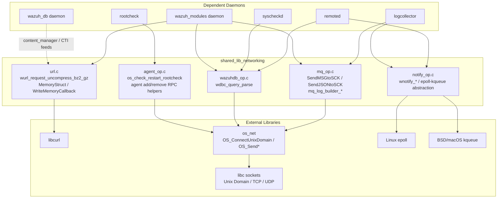
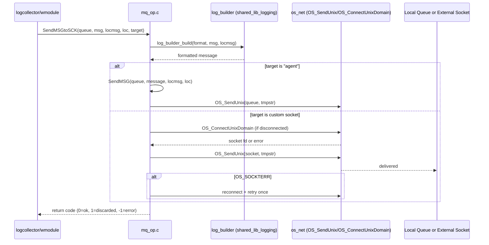
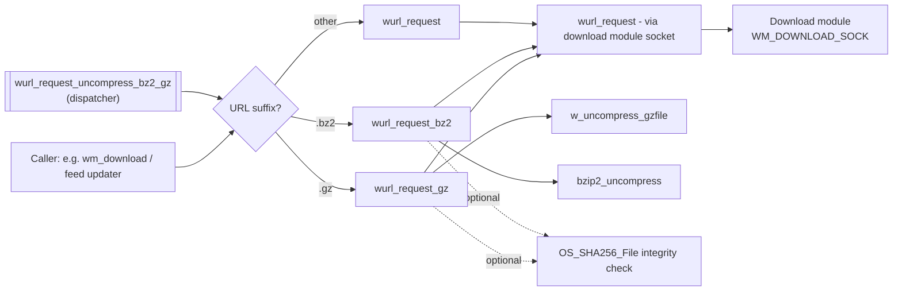
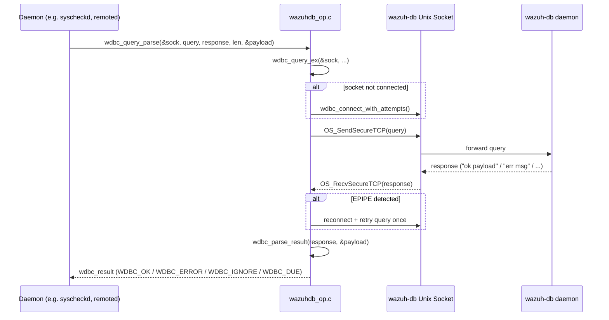
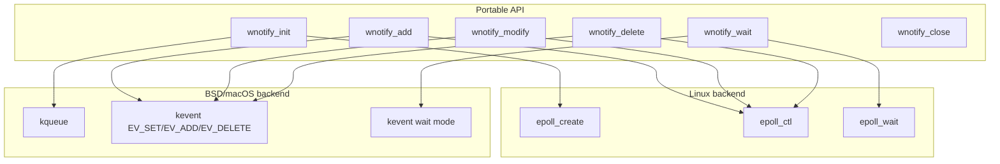
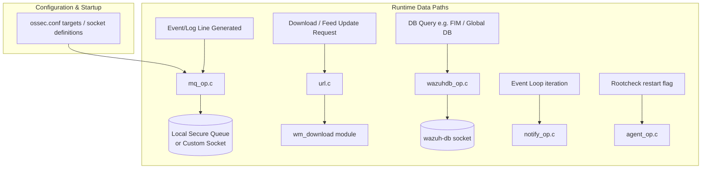

# Shared Library — Networking (`shared_lib_networking`)

## Introduction

The **`shared_lib_networking`** module is a foundational C library within the Wazuh agent/manager codebase (`src/shared/`) that provides low-level networking, IPC (inter-process communication), and remote-communication primitives used across nearly every native Wazuh daemon. It sits underneath higher-level components such as `remoted`, `logcollector`, `wazuh_modules`, `wazuh_db`, and `syscheckd`, offering the raw building blocks for:

- Sending events to the local **Message Queue** (the Unix-domain socket that daemons use to forward events to `analysisd`/`logcollector` output targets or arbitrary sockets).
- Performing **HTTP(S)/FTP downloads** and generic HTTP requests via libcurl (used for CTI feeds, WPK downloads, vulnerability feeds, cloud integrations, etc.).
- Issuing structured **queries to `wazuh-db`** and parsing its response protocol.
- Managing **event-notification** primitives (`epoll`/`kqueue` abstraction) used by event-driven daemons (`remoted`, `logcollector`).
- Signaling **on-demand restarts** of internal scanning subsystems (e.g., rootcheck) via a simple in-process flag.

This module is part of the larger **`Agent & Manager Native Daemons (C)`** codebase and is a sibling to other `shared_lib_*` submodules such as `shared_lib_logging`, `shared_lib_file_io`, `shared_lib_string_validation`, and `shared_lib_system_utils`. It has no direct sub-children of its own; it is a leaf module of "utility" functions grouped by networking concern.

---

## 1. Purpose and Scope

| Concern | Component(s) | File |
|---|---|---|
| Local IPC / Message Queue delivery | `SendMSGtoSCK`, `SendJSONtoSCK`, `mq_log_builder_init`, `mq_log_builder_update` | `src/shared/mq_op.c` |
| HTTP/HTTPS client & downloads | `wurl_request_uncompress_bz2_gz`, `MemoryStruct`, `WriteMemoryCallback`, `curl_slist` (external) | `src/shared/url.c` |
| Wazuh-DB query protocol parsing | `wdbc_query_parse` | `src/shared/wazuhdb_op.c` |
| OS-level event notification (epoll/kqueue abstraction) | `wnotify_delete`, `epoll_event`, `kevent`, `timespec` | `src/shared/notify_op.c` |
| Agent restart signaling flags | `os_check_restart_rootcheck` | `src/shared/agent_op.c` |

The module deliberately mixes a few distinct but related "networking" responsibilities:
1. **Socket-based local messaging** (Unix domain sockets) — the primary transport for Wazuh's internal event bus.
2. **External network I/O** (libcurl-based HTTP/S) — used for outbound internet requests.
3. **Cross-daemon RPC-like protocol** to `wazuh-db` over a local socket, using a lightweight text/JSON protocol.
4. **Event polling infrastructure** — a portable multiplexing wrapper (Linux epoll vs. BSD/macOS kqueue) used to build non-blocking network servers/clients.
5. **A tiny piece of shared mutable state** (`os_restart` flags) unrelated to networking per se, but colocated in `agent_op.c` which mixes agent registration/enrollment RPC helpers with local restart-signal bookkeeping.

---

## 2. Architecture Overview

---

## 3. Component Details

### 3.1 `mq_op.c` — Message Queue Delivery

This is the primary interface used by daemons (mainly `logcollector` and Wazuh modules) to deliver formatted log/event messages either to the local secure queue (`analysisd`) or to arbitrary external sockets configured as `<target>` blocks in `ossec.conf`.

- **`mq_log_builder_init()`** — Lazily initializes a global `log_builder_t` instance (see [`shared_lib_logging`](shared_lib_logging.md) for `log_builder_t` internals) which is used to compute per-message metadata (host name/IP) required to format outgoing log lines.
- **`mq_log_builder_update()`** — Refreshes the cached host metadata (e.g., after network changes) inside the log builder.
- **`SendMSGtoSCK(queue, message, locmsg, loc, target)`** — Builds the final message via `log_builder_build()` and either:
  - Forwards it to the local Wazuh queue using `SendMSG()` (when `target->log_socket->name == "agent"`), or
  - Opens/reuses a UDP or TCP Unix-domain connection to a custom socket target, handling reconnect-on-failure with a cool-down window (`sock_fail_time`) to avoid connection storms.
- **`SendJSONtoSCK(message, socket_forwarder*)`** — Similar to `SendMSGtoSCK` but for pre-serialized JSON payloads (used by the **Engine**'s output/archiver integrations and other JSON-based forwarders); manages its own connect/retry/backoff logic against a `socket_forwarder` (`Config`) structure.

Key design notes:
- All send paths use non-blocking best-effort semantics: on socket saturation (`EAGAIN`/`EWOULDBLOCK`), the message is **discarded** rather than blocking the caller (with rate-limited logging).
- Reconnection uses a cooldown counter (`last_attempt` + `sock_fail_time`) to avoid hammering a dead socket.
- Platform split: the `#else`/`WIN32` branch simplifies `SendMSGtoSCK` to only support the local agent queue (no custom socket targets on Windows agents).

### 3.2 `url.c` — HTTP(S) Client Layer

Implements Wazuh's libcurl-based HTTP client utilities, used for outbound calls such as downloading WPK upgrade packages, vulnerability/CTI feed content, and generic REST calls made by Wazuh modules (e.g., cloud integrations delegate to Python wodles, but native C modules such as `wm_download`, `content_manager` bindings, and `wdb`'s update flows use this layer).

Core internal helpers:
- **`struct MemoryStruct`** — An in-memory growable buffer (`memory`, `size`) with a `max_response_size` guard and a `max_size_error` flag to prevent unbounded memory growth from malicious/oversized HTTP responses.
- **`WriteMemoryCallback()`** — The libcurl `CURLOPT_WRITEFUNCTION`/`CURLOPT_HEADERFUNCTION` callback that appends data into a `MemoryStruct`, enforcing the size cap.
- **`curl_slist`** (external libcurl type, referenced/extended) — used to build custom HTTP header lists for `wurl_http_request`.

Public/exported download functions built on these primitives:
- `wurl_get()` — Simple file download to disk (non-Windows), with certificate discovery (`find_cert_list()`) across common Linux/BSD/macOS CA bundle locations.
- `wurl_request()` — Delegates the download to the **download module** (`wm_download`) via a local Unix socket (`WM_DOWNLOAD_SOCK`), decoupling network I/O from the calling process for security/sandboxing.
- `wurl_request_gz()` / `wurl_request_bz2()` — Wrap `wurl_request()` with automatic decompression and optional SHA-256 integrity verification.
- **`wurl_request_uncompress_bz2_gz()`** *(core component)* — Dispatches to the gzip or bzip2 variant based on the URL suffix (`.gz`, `.bz2`), or falls back to a plain download; this is the primary entry point used by higher-level update/feed-download logic (e.g., CTI/vulnerability feed managers).
- `wurl_http_get()` / `wurl_http_request()` — Full in-memory HTTP client supporting custom methods (`GET`/`POST`/etc.), custom headers, basic auth (`userpass`), timeouts, and optional SSL verification bypass — returns a `curl_response` (see `src/headers/url.h`).
- `wurl_free_response()` — Releases a `curl_response`'s heap-allocated buffers.

Design notes:
- Actual network sockets for `wurl_request()` are **not opened directly by the caller's process**; the request is delegated to the sandboxed `wm_download` wazuh-module over a local socket. This isolates outbound network access (and hence attack surface) from most daemons.
- `wurl_http_get`/`wurl_http_request`, in contrast, **do** use libcurl directly, and are intended for contexts where an isolated download module round-trip isn't necessary/available (guarded by `#ifndef WIN32`/`#ifndef CLIENT` compilation flags to restrict use to manager-side code paths).
- All in-memory response buffers use `MemoryStruct`'s bounded-growth reallocation to protect against unbounded memory usage.

### 3.3 `wazuhdb_op.c` — Wazuh-DB Client Protocol

Implements the client-side of the lightweight text protocol used to talk to `wazuh-db` over its local Unix-domain socket (`WDB_LOCAL_SOCK`). This module is a critical dependency for many higher-level DB-facing modules — see [`framework_core_communication`](framework_core_communication.md) (`wdb.py`) for the Python analog, and the C `wazuh_db` daemon module for the server side.

Key functions (only `wdbc_query_parse` is listed as a "core component", but it depends on the surrounding protocol helpers in the same file):
- `wdbc_connect()` / `wdbc_connect_with_attempts()` — Establish a connection to `wazuh-db`'s Unix socket with retry/backoff.
- `wdbc_query()` — Low-level send/receive over an already-connected socket using `OS_SendSecureTCP`/`OS_RecvSecureTCP` framing.
- `wdbc_query_ex()` — Adds auto-reconnect logic: if the socket is closed (`EPIPE`) mid-query, it transparently reconnects and retries once.
- `wdbc_parse_result()` — Parses the leading status token (`ok`, `err`, `ignore`, `due`) from a raw `wazuh-db` response line, splitting off the payload.
- **`wdbc_query_parse()`** *(core component)* — Combines `wdbc_query_ex()` + `wdbc_parse_result()` into a single convenience call: sends a query, receives the raw response, parses the status code, and returns both a `wdbc_result` enum and (via output parameter) a pointer to the payload substring within the response buffer.
- `wdbc_query_parse_json()` — Same as above but also parses the payload as a `cJSON` object.
- `wdbc_validate_component()` — Validates a named DB "component" string against the compiled-in whitelist (`WDBC_VALID_COMPONENTS`).
- `wdbc_close()` — Closes and invalidates a socket descriptor.

This protocol client is consumed extensively by the native `wazuh_db` helper code (`src/wazuh_db/helpers/wdb_global_helpers.c`, see the **`wazuh_db`** module) and by any daemon needing structured DB access without linking SQLite directly (e.g., `remoted`'s group management, `syscheckd`'s FIM DB queries).

### 3.4 `notify_op.c` — Cross-Platform Event Notification

Provides a unified abstraction (`wnotify_t`) over platform-specific I/O multiplexing mechanisms, allowing event-driven daemons to watch multiple file descriptors for readability/writability without conditionally compiling against `epoll` or `kqueue` throughout the codebase.

- **Linux implementation** (`__linux__`): backed by `epoll_create`/`epoll_ctl`/`epoll_wait`. Component `epoll_event` refers to the `struct epoll_event` used as the notification payload.
- **BSD/macOS implementation** (`__MACH__`, `__FreeBSD__`, `__OpenBSD__`): backed by `kqueue`/`kevent`. Component `kevent` refers to the `struct kevent` payload type, and `timespec` is used to convert the millisecond `timeout` parameter of `wnotify_wait()` into the `struct timespec` expected by the BSD `kevent()` syscall.
- **`wnotify_delete()`** *(core component)* — Removes a previously registered fd/operation pair from the notification set (calls `epoll_ctl(..., EPOLL_CTL_DEL, ...)` on Linux or `EV_SET(..., EV_DELETE, ...)` + `kevent()` on BSD/macOS).
- Companion functions in the same file (not separately listed but essential context): `wnotify_init()`, `wnotify_add()`, `wnotify_modify()`, `wnotify_wait()`, `wnotify_close()`.

Consumers: `remoted` (its main TCP/UDP event loop, see the `remoted` submodule `remoted_networking`/`remoted_lifecycle` in `Agent_&_Manager_Native_Daemons_(C).md`), `logcollector` (file/socket readers), and `syscheckd`'s realtime monitoring path all rely on this abstraction to build efficient, portable event loops.

### 3.5 `agent_op.c` — Agent State Flags & Enrollment RPC Helpers

While most of `agent_op.c` deals with agent identity (`os_read_agent_name/id/ip`), group-name validation, and clustered/local agent add/remove RPC calls (which lean heavily on the same Unix-socket connect/send/receive primitives used elsewhere in this module — `auth_connect()`, `w_send_clustered_message()`, `w_request_agent_add_local()`/`_clustered()`), the specific **core component** documented here is the narrower, networking-adjacent piece:

- **`os_check_restart_rootcheck()`** *(core component)* — A thread-safe getter/reset for a process-local "rootcheck needs restart" flag (`os_restart.rootcheck`), guarded by `restart_mutex`. Paired with `os_check_restart_syscheck()` and `os_set_restart_syscheck()` (which sets both flags together), this provides a simple in-memory signaling mechanism — **not** a network protocol — used by `syscheckd`/`rootcheck` to detect that a configuration reload (typically triggered via a remote/local command) requires re-running a scan.

The remaining RPC-style helpers in this file (`w_request_agent_add_local`, `w_request_agent_add_clustered`, `w_request_agent_remove_clustered`, `control_check_connection`, `auth_connect`) are networking-relevant in that they build JSON payloads and exchange them over Unix-domain (`AUTH_LOCAL_SOCK`, `CLUSTER_SOCK`, `CONTROL_SOCK`) sockets using the same `OS_ConnectUnixDomain`/`OS_SendSecureTCP*`/`OS_RecvSecureTCP*` primitives documented above; they represent the enrollment/registration RPC layer built atop this networking foundation and are covered in more detail by the `os_auth` and `addagent_native` submodules of `Agent_&_Manager_Native_Daemons_(C).md`.

---

## 4. Data & Control Flow Across the Module

---

## 5. Relationships to Other Modules

| Related Module | Relationship |
|---|---|
| [`shared_lib_logging`](shared_lib_logging.md) | `mq_op.c` depends on `log_builder_t` (declared in `src/headers/log_builder.h`) for message formatting/host metadata. |
| [`shared_lib_file_io`](shared_lib_file_io.md) | `url.c`'s `wurl_get()`/gz-decompression paths use file I/O helpers (`wfopen`, `FileSize`) from that module. |
| [`shared_lib_string_validation`](shared_lib_string_validation.md) | `mq_op.c` uses `wstr_escape()`; `url.c` uses `wstr_replace()`/`wstr_end()`. |
| [`shared_lib_system_utils`](shared_lib_system_utils.md) | `agent_op.c`'s restart flags and enrollment helpers interplay with cluster/version utilities in that module. |
| [`Agent_&_Manager_Native_Daemons_(C)`](Agent_&_Manager_Native_Daemons_(C).md) (`remoted`) | Primary consumer of `notify_op.c` for its TCP/UDP event loop; also a heavy user of Unix-domain socket patterns mirrored here. |
| `wazuh_db` daemon | Server-side counterpart to `wazuhdb_op.c`'s client protocol; see `src/wazuh_db/wdb_parser.c` and `wdb.c`. |
| `wazuh_modules` daemon (`wm_download`) | Server-side handler for `wurl_request()`'s delegated download protocol over `WM_DOWNLOAD_SOCK`. |
| `os_auth` / `addagent_native` | Consume `agent_op.c`'s enrollment RPC helpers (`w_request_agent_add_local/clustered`) which are built on the same socket primitives. |
| Python `framework_core_communication` (`wdb.py`, `wazuh_socket.py`) | Conceptual analog on the API/framework side — implements a similar Wazuh-DB and socket client protocol in Python for the API/manager framework. |

---

## 6. Key Design Patterns & Considerations

1. **Fail-soft delivery**: Both `mq_op.c` and `url.c` favor discarding/retrying over blocking the calling daemon, which is critical since most callers are on hot paths (event ingestion, log collection).
2. **Socket isolation for outbound network access**: Rather than letting arbitrary daemons open raw internet sockets, `wurl_request()` proxies downloads through the dedicated `wm_download` module — a privilege-separation/sandboxing pattern.
3. **Reconnect-with-backoff**: Consistent pattern across `mq_op.c` (`sock_fail_time` cooldown) and `wazuhdb_op.c` (`wdbc_connect_with_attempts`) to avoid connection-storm behavior against transiently unavailable local services.
4. **Platform abstraction**: `notify_op.c` demonstrates the codebase's general strategy of hiding OS differences (Linux vs. BSD-family) behind a single portable API surface, mirrored by conditional compilation blocks in `mq_op.c` and `url.c` (`WIN32`, `CLIENT`).
5. **Bounded memory for network responses**: `MemoryStruct`'s `max_response_size` guard in `url.c` is a defensive measure against oversized or malicious HTTP responses consuming unbounded memory.

---

## 7. Summary

`shared_lib_networking` is the low-level "plumbing" layer for all local IPC and external network operations in the native Wazuh C codebase. It is intentionally narrow in scope per file — message-queue delivery, HTTP client operations, Wazuh-DB query protocol, event-notification multiplexing, and a small restart-signaling utility — but is depended upon, directly or indirectly, by virtually every native daemon in the platform (`remoted`, `logcollector`, `syscheckd`, `wazuh_modules`, `wazuh_db`, `rootcheck`, `os_auth`). Understanding this module is prerequisite to understanding how events flow from collection points into the analysis pipeline, and how daemons interact with each other and with `wazuh-db` over local sockets.
