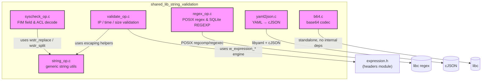
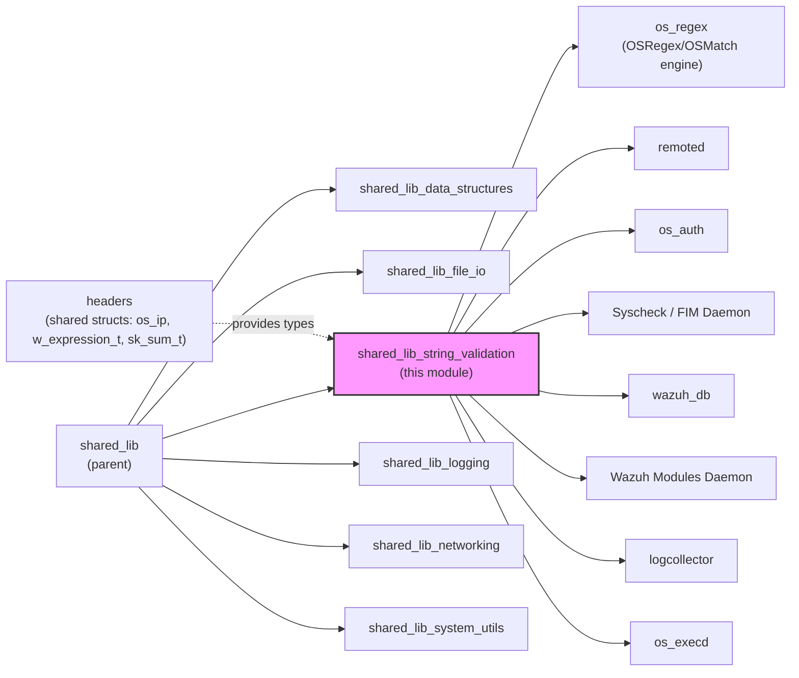
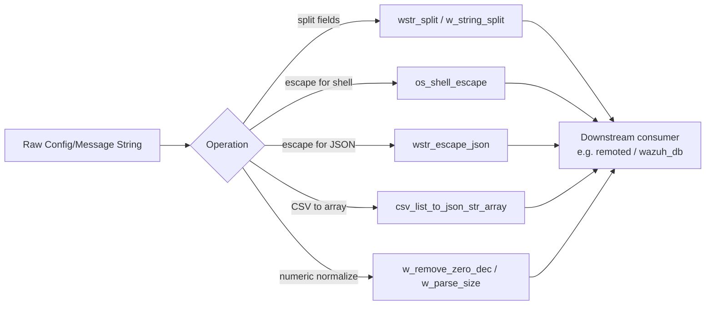
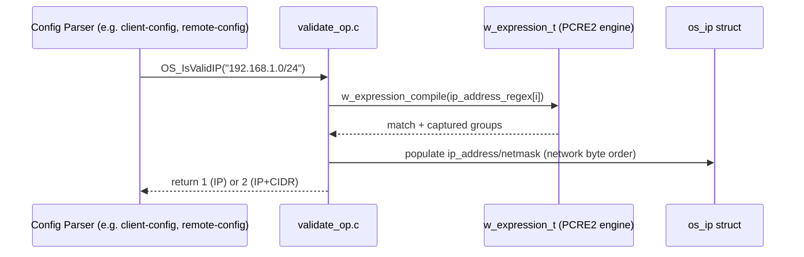
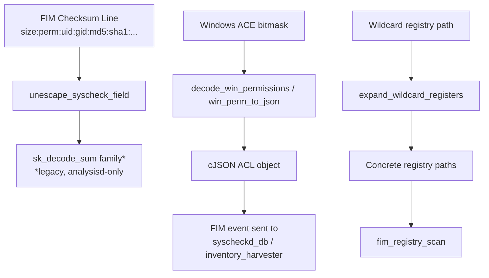
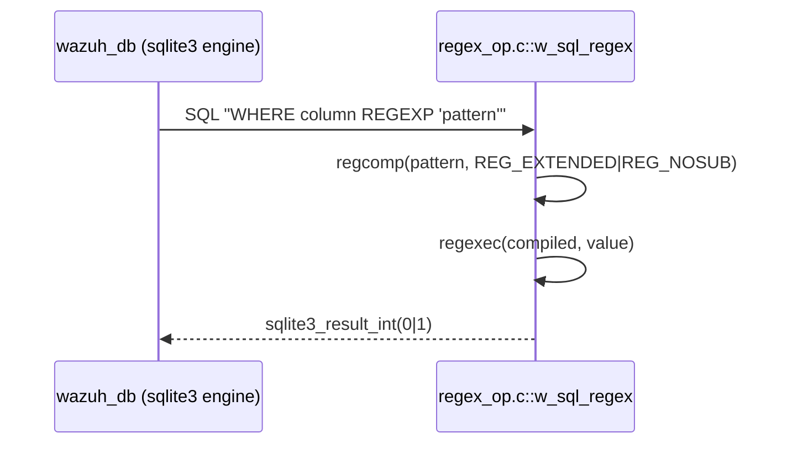
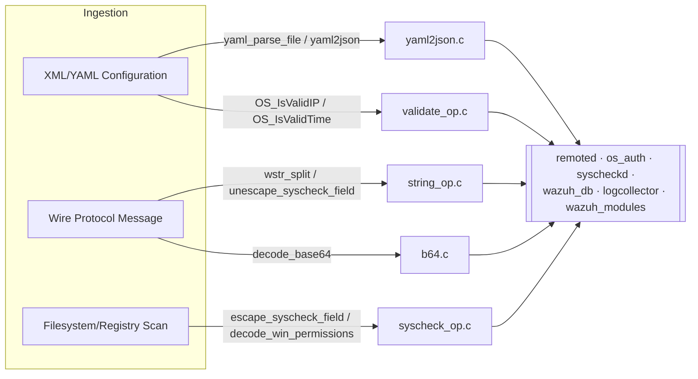
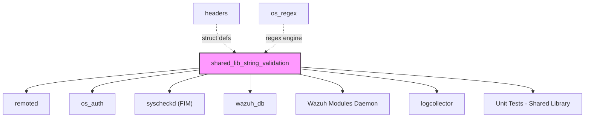

# Shared Library — String, Encoding & Validation Utilities

## Introduction

The **`shared_lib_string_validation`** module is a foundational C library within the Wazuh agent/manager codebase (`src/shared/`). It provides a broad set of low-level, dependency-light utility functions used **throughout almost every native daemon** (`remoted`, `os_auth`, `syscheckd`, `wazuh_modules`, `wazuh_db`, `logcollector`, etc.) for:

- **String manipulation and escaping** — tokenizing, splitting, trimming, concatenating, JSON-escaping.
- **Base64 encoding/decoding** — used for binary payloads in configuration, keys, and messages.
- **Input/data validation** — IP address parsing/validation (IPv4/IPv6, CIDR), time-range validation, byte-size parsing.
- **FIM (File Integrity Monitoring) string/permission decoding** — Windows ACL/permission serialization, syscheck field escaping, user/group lookups.
- **SQL regular expressions** — a custom `REGEXP` function registered into SQLite (used by `wazuh_db`).
- **YAML→JSON conversion** — used by configuration and CLI tooling that consumes YAML documents (e.g., SCA policies).

This module has **no dependency on any daemon-specific logic**; it is pure, reusable infrastructure that sits at the bottom of the dependency graph for the native (C) side of Wazuh, analogous in purpose to the [`shared_lib_data_structures`](shared_lib_data_structures.md), [`shared_lib_file_io`](shared_lib_file_io.md), and [`shared_lib_logging`](shared_lib_logging.md) sibling modules, and it is a direct C-analog of the `stringHelper.h` utilities found in [`shared_utils`](shared_utils.md) (C++ shared modules).

---

## 1. Purpose & Core Functionality

| Concern | Representative Functions | Source File |
|---|---|---|
| CSV/token splitting & string search | `wstr_split`, `os_strcnt`, `os_substr`, `w_compare_str`, `w_string_split`, `w_strtok` | `string_op.c` |
| JSON array/field helpers | `csv_list_to_json_str_array`, `W_JSON_AddField`, `wstr_escape_json`/`wstr_unescape_json` | `string_op.c` |
| Numeric string cleanup | `w_remove_zero_dec`, `w_parse_size`, `w_parse_time`, `w_validate_bytes` | `string_op.c`, `validate_op.c` |
| Base64 codec | `encode_base64`, `decode_base64`, `is_base64` (internal) | `b64.c` |
| IP address validation | `OS_IsValidIP`, `OS_IPFound`, `OS_IPFoundList`, `OS_GetIPv4FromIPv6`, `OS_ExpandIPv6`, `OS_CIDRtoStr` | `validate_op.c` |
| Time-range validation | `OS_IsonTime`, `OS_IsValidTime`, `OS_IsAfterTime`, `OS_IsonDay`, `OS_IsValidDay` | `validate_op.c` |
| FIM/syscheck string & ACL decoding | `escape_syscheck_field`, `unescape_syscheck_field`, `decode_win_permissions`, `win_perm_to_json`, `get_user`/`get_group` | `syscheck_op.c` |
| SQL regex predicate | `w_sql_regex` (SQLite UDF), `w_regexec`, `OS_PRegex` | `regex_op.c` |
| YAML ingestion | `yaml_parse_stdin`, `yaml_parse_file`, `yaml2json` | `yaml2json.c` |

The module intentionally groups **string transformation** and **validation/parsing** together because most validation routines (IP, time, base64) are implemented as specialized string-parsing state machines that reuse the same low-level helpers (`os_substr`, `wstr_replace`, `os_strcnt`, escaping helpers) found in `string_op.c`.

---

## 2. Architecture Overview

### Position in the Native Daemon Codebase

This module has almost no outbound dependencies beyond libc, `cJSON`, `libyaml`, and the shared `expression.h`/`os_regex` engine (see [`headers`](Agent_%26_Manager_Native_Daemons_%28C%29.md) and [`os_regex`](Agent_%26_Manager_Native_Daemons_%28C%29.md)). It is consumed almost universally as a **transitive dependency** of `shared.h` (the umbrella header included by virtually every C source file in `src/`).

---

## 3. Component Breakdown

### 3.1 `string_op.c` — General String Utilities

The largest file in the module. Provides:

- **Tokenizing/splitting**: `wstr_split` (splits by delimiter with optional re-joining of N occurrences into "columns"), `w_string_split`, `w_strtok` (quote-aware shell-like tokenizer), `w_strtok_r_str_delim` (multi-character delimiter `strtok`).
- **Substring/search helpers**: `os_substr` (bounds-checked substring extraction), `os_strcnt` (character occurrence counter), `w_compare_str` (prefix-length match), `find_string_in_array`, `wstr_chr`/`wstr_chr_escape` (escape-aware character search).
- **Escaping**: `os_shell_escape`, `wstr_escape`/`wstr_unescape` (generic char escaping), `wstr_escape_json`/`wstr_unescape_json` (JSON control character escaping).
- **Concatenation & array helpers**: `wm_strcat`, `w_strcat`, `w_strcat_list`, `w_strarray_append`, `free_strarray`, `strarray_size`.
- **CSV↔JSON**: `csv_list_to_json_str_array` converts a comma-separated string into a JSON string array (used for configuration lists such as label/group CSVs).
- **Numeric/size/time parsing**: `w_parse_bool`, `w_parse_time` (`"1w"`, `"2d"`, `"3h"` → seconds), `w_parse_size` (`"10M"` → bytes), `w_remove_zero_dec` (trims trailing zeros from decimal numbers).
- **JSON field injection**: `W_JSON_AddField` supports dotted-key nesting (`"a.b.c"` creates nested objects).

### 3.2 `b64.c` — Base64 Codec

Self-contained encode/decode implementation (`encode_base64`, `decode_base64`), with private helpers `encode()`, `decode()`, and `is_base64()`. Used wherever binary data must be safely embedded in text protocols (e.g., agent enrollment keys, WPK signing in [`os_execd`](Agent_%26_Manager_Native_Daemons_%28C%29.md) / agent-upgrade module, and cryptographic material in [`os_crypto`](Agent_%26_Manager_Native_Daemons_%28C%29.md)).

### 3.3 `validate_op.c` — IP, Time & Size Validation

The most complex file, built around a static table of PCRE2 patterns (`ip_address_regex[]`) compiled through the shared `w_expression_t` engine (defined in `headers/expression.h`, implemented in `shared_lib_networking`/`headers`).

Key routines:

- **IP validation**: `OS_IsValidIP` parses a string as IPv4/IPv6 (with optional CIDR/netmask), populating an `os_ip` struct with normalized network/mask bytes. `OS_IPFound` / `OS_IPFoundList` test membership of an address against configured allow/deny lists (used heavily by `remoted`'s access control and `os_auth`).
- **IPv6 helpers**: `OS_GetIPv4FromIPv6` extracts an embedded IPv4 from an IPv4-mapped IPv6 literal; `OS_ExpandIPv6` expands compressed IPv6 notation; `OS_CIDRtoStr` renders a normalized `os_ip` back to `"a.b.c.d/nn"` form.
- **Time validation**: `OS_IsValidTime`/`OS_IsonTime` parse and evaluate ossec-style time ranges (`"8:30-17:00"`, 12-hour `am/pm` forms) used by scheduled scan configuration (see [`framework_core_utils_query_engine`](framework_core_utils_query_engine.md) and native `schedule_scan.c`). `OS_IsValidDay`/`OS_IsonDay` handle weekday-range strings (`"monday,tuesday"`, `"weekdays"`).
- **Byte-size / definitions**: `getDefine_Int` reads integer option values from `internal_options.conf`; `w_validate_bytes` parses byte-size strings with `K/M/G` suffixes.

### 3.4 `syscheck_op.c` — FIM String & Permission Decoding

Provides the string-level building blocks consumed by the [`Syscheck — FIM Daemon`](Syscheck___FIM_Daemon_%28C_C%2B%2B%29.md):

- **Field escaping**: `escape_syscheck_field`/`unescape_syscheck_field` protect `:`, `!`, and space characters inside the colon-delimited FIM checksum wire format.
- **Windows ACL/permission JSON**: `decode_win_permissions`, `win_perm_to_json`, `decode_win_acl_json`, `compare_win_permissions`, `attrs_to_json`, `decode_win_attributes` translate raw Windows ACE/permission bitmasks into structured, human-readable `cJSON` (used in FIM Windows registry/file events).
- **User/Group resolution**: POSIX `get_user`/`get_group` (via `getpwuid_r`/`getgrgid_r`), and Windows equivalents `get_user`/`get_group`/`get_registry_group`/`get_registry_permissions` (SID lookups via `GetSecurityInfo`/`LookupAccountSid`).
- **Path utilities**: `normalize_path` (forward-to-backslash conversion on Windows drive paths), `remove_empty_folders` (recursive cleanup of empty diff-snapshot directories).
- **Registry wildcard expansion**: `expand_wildcard_registers`, `w_expand_by_wildcard`, `w_list_all_keys`, `get_subkey`, `w_switch_root_key` — resolve `*`/`?` wildcard registry-key configuration entries into concrete Windows registry paths.
- **IPC helper**: `ag_send_syscheck` sends a one-way message to the local syscheck socket (used by `wazuh_db`/agent components to trigger a rootcheck restart or push data).

### 3.5 `regex_op.c` — Regex Utilities

- `OS_PRegex`: thin wrapper over POSIX `regcomp`/`regexec` for one-off boolean matches.
- `w_regexec`: POSIX regex helper returning capture groups (`regmatch_t[]`).
- `w_sql_regex`: registered as a custom **SQLite scalar function** (`REGEXP`) so that `wazuh_db` SQL queries can filter rows using regular expressions directly in `WHERE ... REGEXP ...` clauses (see [`wazuh_db`](wazuh_db.md)).

### 3.6 `yaml2json.c` — YAML Ingestion

Wraps `libyaml` to parse YAML from `stdin` (`yaml_parse_stdin`) or a file (`yaml_parse_file`), then recursively converts the `yaml_document_t` tree into a `cJSON` tree (`yaml2json`/`yaml2json_node`), with special handling to preserve quoted scalars that look like floats as strings. This is primarily used by CLI/utility tools and configuration converters that need to accept YAML input and produce the JSON structures consumed elsewhere in the codebase (e.g., SCA policy YAML files consumed by [`wazuh_modules_core`](Wazuh_Modules_Daemon_%28C%29.md) `wm_sca.c`).

---

## 4. Data Flow: Typical End-to-End Usage

---

## 5. Dependency & Consumer Relationships

### 5.1 Upstream (what this module depends on)

- **`headers`** (sibling top-level module) — supplies core struct definitions consumed here: `os_ip`/`os_ipv4`/`os_ipv6` (`os_ip.h`), `w_expression_t`/`w_pcre2_code_t` (`expression.h`), `sk_sum_t`/`reg_path_struct` (`syscheck_op.h`).
- **`os_regex`** — the `OSMatch`/`OSRegex` engine used transitively via the `w_expression_*` API inside `validate_op.c`.
- **External libraries**: libc (`regex.h`, `pwd.h`, `grp.h`), `cJSON`, `libyaml`, SQLite3 (for `regex_op.c`'s UDF registration), and on Windows: `Advapi32`/security APIs.

### 5.2 Downstream (major consumers)

| Consumer Module | Usage |
|---|---|
| [`remoted`](Agent_%26_Manager_Native_Daemons_%28C%29.md) | IP allow-list checks (`OS_IPFound`), agent group/message string parsing (`wstr_split`) |
| [`os_auth`](Agent_%26_Manager_Native_Daemons_%28C%29.md) | Agent enrollment IP/time validation, base64 key encoding |
| [`Syscheck — FIM Daemon`](Syscheck___FIM_Daemon_%28C_C%2B%2B%29.md) | All `syscheck_op.c` functions (ACL decode, field escape, wildcard registry expansion) |
| [`wazuh_db`](wazuh_db.md) | `w_sql_regex` SQLite `REGEXP` UDF, generic string/JSON helpers in SQL parsing layers |
| [`Wazuh Modules Daemon (C)`](Wazuh_Modules_Daemon_%28C%29.md) | SCA/YAML policy ingestion (`yaml2json`), CSV list parsing for module configuration |
| [`logcollector`](Agent_%26_Manager_Native_Daemons_%28C%29.md) | String splitting/escaping for multiline and macOS log configuration |
| [`Unit_Tests_-_Shared_Library`](Unit_Tests_-_Shared_Library.md) | Exhaustive unit coverage for every function listed above (`test_string_op.c`, `test_validate_op.c`, `test_syscheck_op.c`, etc.) |

---

## 6. Sibling Modules (Shared Library Family)

This module is one of five siblings under the parent **`shared_lib`** grouping. See also:

- [`shared_lib_data_structures.md`](shared_lib_data_structures.md) — lists, stores, queues, hash tables, red-black trees.
- [`shared_lib_file_io.md`](shared_lib_file_io.md) — file/stat operations, compressed-file queues, privilege separation.
- [`shared_lib_logging.md`](shared_lib_logging.md) — debug/info/warn logging macros and tagged logging.
- [`shared_lib_networking.md`](shared_lib_networking.md) — message queues, URL/cURL helpers, wazuhdb query dispatch.
- [`shared_lib_system_utils.md`](shared_lib_system_utils.md) — signal handling, cluster status, audit rules, scheduling, version comparison.

For the C++ shared-modules equivalent of many of these string/encoding helpers (used by `dbsync`, `rsync`, `router`, and other C++ daemons), see [`common_helpers`](common_helpers.md) inside [`shared_utils`](shared_utils.md).

---

## 7. Testing

Comprehensive unit tests exist under `src/unit_tests/shared/` and are organized (per the module tree) as:

- `test_string_op` — covers `wstr_split`, escaping, JSON field injection, string search/compare helpers.
- `test_validate_op` — covers `OS_IsValidIP` (IPv4/IPv6/CIDR matrices), `OS_CIDRtoStr`, `w_validate_bytes`.
- `test_syscheck_op` — covers Windows ACL decode/encode, permission comparison, user/group resolution, wildcard registry expansion.
- Base64 and YAML routines are covered indirectly through consumers (e.g., `os_auth`, config parsing tests) since dedicated `test_b64.c`/`test_yaml2json.c` files are not present in the current unit-test tree; regex (`w_sql_regex`) behavior is exercised via `wazuh_db` parser tests.

See [`Unit_Tests_-_Shared_Library.md`](Unit_Tests_-_Shared_Library.md) for the full test inventory of this and sibling shared-library modules.

---

## 8. Key Design Notes

- **No heap-ownership ambiguity**: Functions consistently follow the Wazuh convention of using `os_malloc`/`os_calloc`/`os_realloc` (abort-on-failure wrappers) so callers do not need to null-check allocation results, simplifying string-building call chains (e.g., `wstr_replace`, `W_JSON_AddField`).
- **Escape-aware parsing**: Several functions (`wstr_chr_escape`, `wstr_escape`, `wstr_unescape`) implement a **backslash-escape state machine** reused across the colon-delimited FIM wire protocol (`syscheck_op.c`) and generic configuration string handling.
- **Platform bifurcation**: `syscheck_op.c` is split via `#ifdef WIN32` into two almost entirely distinct implementations — a POSIX branch (`getpwuid_r`/`getgrgid_r`) and a Windows branch (SID/ACL Win32 API calls) — while exposing the same function signatures to callers.
- **Regex reuse**: `validate_op.c` avoids hand-rolled IP parsing by compiling a table of PCRE2 patterns once via the shared `w_expression_t` abstraction, keeping IPv4/IPv6/CIDR parsing logic declarative and testable.
