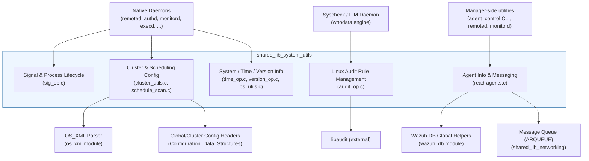
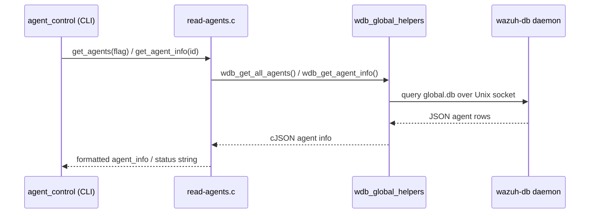

# Shared Library — System Utilities Module

## 1. Overview

The **`shared_lib_system_utils`** module is a collection of low-level, cross-cutting C utility
functions that live inside Wazuh's core **Shared Library** (`src/shared/`). Every Wazuh daemon
(`wazuh-remoted`, `wazuh-authd`, `wazuh-analysisd`, `wazuh-db`, the agent daemons, the various
`wazuh-modulesd` wodules, etc.) links against this shared library, so the functions documented
here are compiled into virtually every native process in the product.

Unlike the higher-level networking, logging or data-structure utilities (documented in sibling
modules — see [shared_lib_networking.md](shared_lib_networking.md),
[shared_lib_logging.md](shared_lib_logging.md) and
[shared_lib_data_structures.md](shared_lib_data_structures.md)), this module focuses on
**"system-facing" concerns**: OS process/version discovery, signal handling, daemon-level
scheduling, Linux Audit (`auditd`) rule management, and manager-side agent-information
retrieval/messaging.

Because the source files that make up this module cover a wide range of unrelated concerns, the
documentation is split into five focused sub-modules (see Section 3).

## 2. Architecture

### Data-flow snapshot: agent status query via CLI

## 3. Sub-modules

| Sub-module | Source Files | Responsibility |
|---|---|---|
| [shared_lib_system_utils_signals.md](shared_lib_system_utils_signals.md) | `sig_op.c` | POSIX signal handlers, graceful daemon shutdown (`atexit`, PID/state cleanup), `SIGPIPE` suppression for client-server sockets. |
| [shared_lib_system_utils_config_scheduling.md](shared_lib_system_utils_config_scheduling.md) | `cluster_utils.c`, `schedule_scan.c` | Reads `ossec.conf` to determine cluster role/status; parses and computes generic `<scheduling>` options (`interval`, `day`, `wday`, `time`) reused by every `wodle`. |
| [shared_lib_system_utils_sysinfo.md](shared_lib_system_utils_sysinfo.md) | `time_op.c`, `version_op.c`, `os_utils.c` | Cross-platform time helpers (epoch, ISO-8601, sleep/delay, leap-year), OS/version fingerprinting (Linux distro, macOS, Windows, BSD, Solaris, AIX, HP-UX), and OS process-listing / Windows debug-privilege helpers. |
| [shared_lib_system_utils_audit.md](shared_lib_system_utils_audit.md) | `audit_op.c` | Wraps `libaudit` to add/delete/list Linux Audit watch rules (used by Syscheck's *whodata* real-time monitoring) and to restart the `auditd` service. |
| [shared_lib_system_utils_agents.md](shared_lib_system_utils_agents.md) | `read-agents.c` | Manager-side helpers to retrieve agent information/status from Wazuh DB, list/filter agents, and forward active-response/administrative messages to agents through `remoted`'s queue. |

## 4. Key Relationships with Other Modules

* **[wazuh_db](Wazuh_DB.md)** — `read-agents.c` calls `wdb_get_all_agents`/`wdb_get_agent_info`
  (see `framework`/`wazuh_db/helpers/wdb_global_helpers.c`) to fetch agent state stored in
  `global.db`.
* **[shared_lib_networking](shared_lib_networking.md)** — agent messaging (`send_msg_to_agent`,
  `connect_to_remoted`) uses `StartMQ`/`OS_SendUnix` from the networking sub-module to push
  messages onto the `ARQUEUE`.
* **[os_xml](Agent_%26_Manager_Native_Daemons_%28C%29.md)** — `cluster_utils.c` parses
  `ossec.conf` using the `OS_XML` parser to read `<cluster>` settings.
* **[Configuration_Data_Structures_(C_Headers)](Configuration_Data_Structures_%28C_Headers%29.md)** —
  scheduling logic in `schedule_scan.c` is consumed by nearly every module documented under
  `Wazuh_Modules_Daemon_(C)` and `Wodles - Cloud Integration Services (Python)` counterparts that
  expose an interval-based configuration.
* **[Syscheck — FIM Daemon](Syscheck___FIM_Daemon_%28C_C%2B%2B%29.md)** — the *whodata* Linux
  implementation (`syscheckd_whodata`) relies on `audit_op.c` to register/remove Audit watch
  rules for monitored directories.
* **[CLI_Utilities_&_Migration_Tools](CLI_Utilities_%26_Migration_Tools.md)** — `agent_control`
  and `list_agents` executables are direct consumers of `read-agents.c`'s agent listing API.

## 5. Notable Design Characteristics

- **POSIX-only guard (`#ifndef WIN32`)**: Several files (`sig_op.c`, most of `read-agents.c`) are
  compiled only on Unix-like systems; Windows agents use separate implementations
  (see `win32_agent` module).
- **`OS_XML`-driven configuration reads**: Both `cluster_utils.c` and `version_op.c`/`os_utils.c`
  avoid a persistent configuration struct, instead re-reading `ossec.conf` or `/etc/os-release`
  on demand — trading a small amount of I/O for simplicity and to avoid stale state across
  daemons.
- **`wdbc_query_ex`/`cJSON` bridge pattern**: `read-agents.c` is a good example of the common
  Wazuh pattern of querying `wazuh-db` via a text protocol and parsing the JSON response with
  `cJSON`.
- **Defensive coding for legacy protocol compatibility**: `send_msg_to_agent` explicitly checks
  the connected agent's version to decide whether to use the legacy Active Response string format
  or the newer JSON-based command envelope (agents ≥ 4.2.0).
