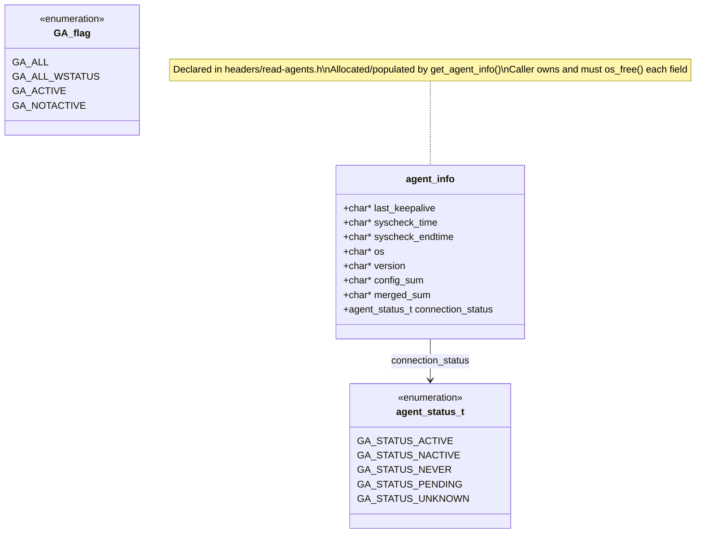
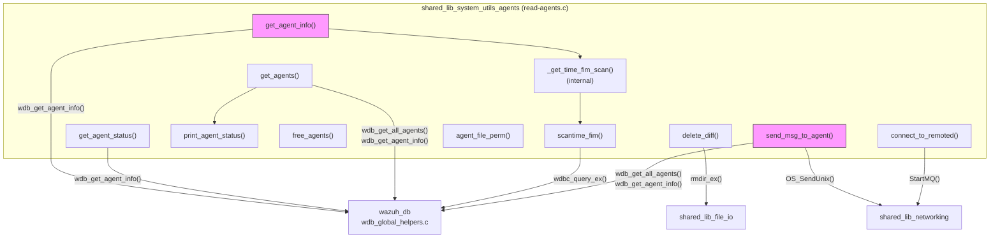
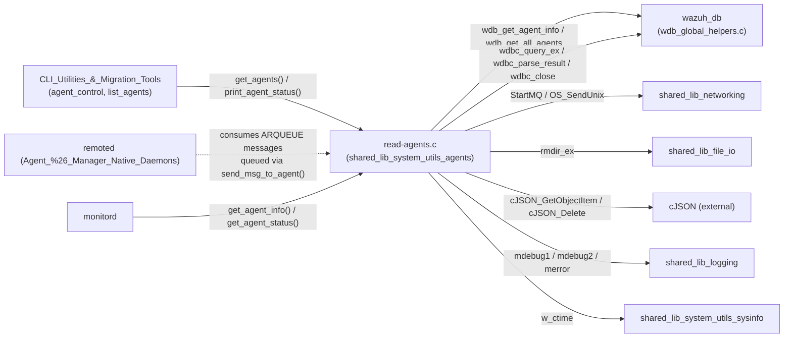
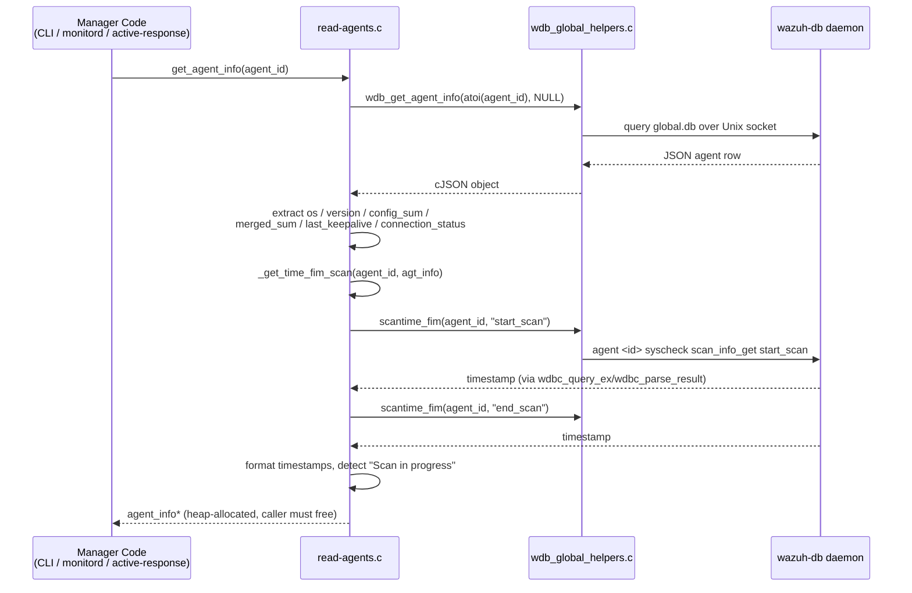
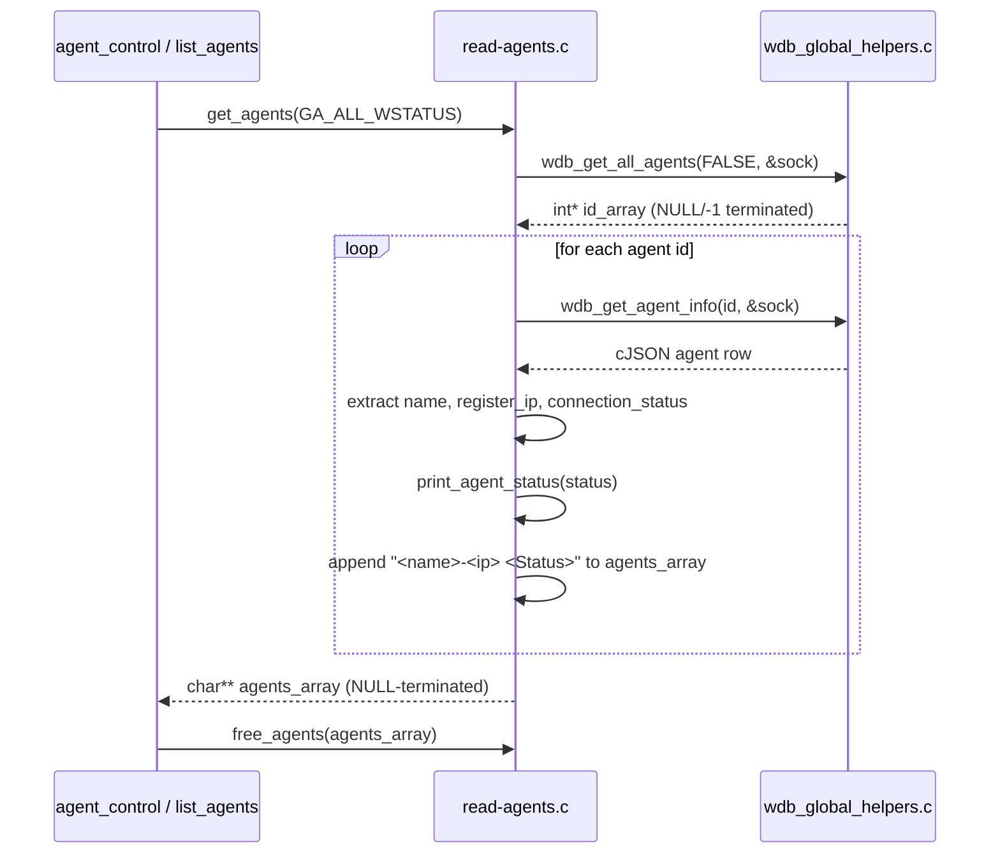
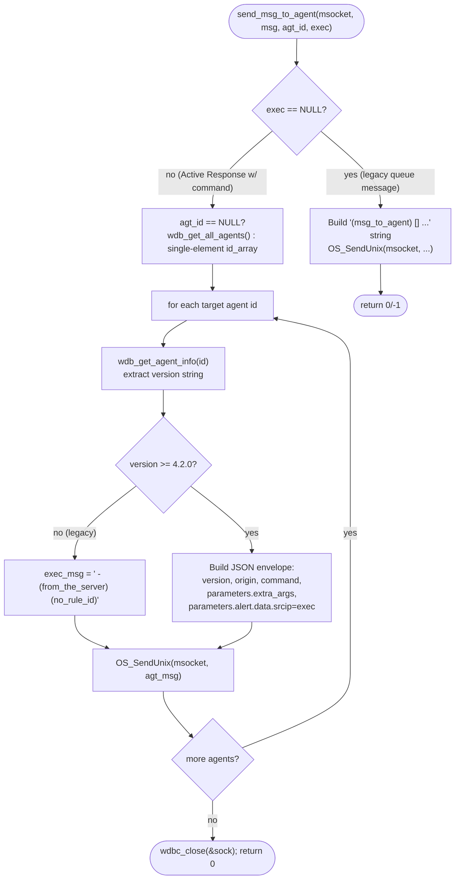
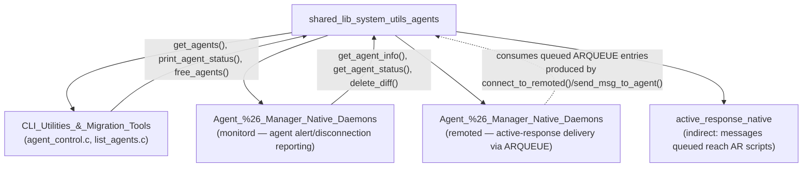

# Shared Library — System Utilities: Manager-Side Agent Helpers (`shared_lib_system_utils_agents`)

## Introduction

`shared_lib_system_utils_agents` is a small but pivotal C module inside Wazuh's core **Shared Library** (`src/shared/`). Its single source file, `read-agents.c` (declared in `src/headers/read-agents.h`), provides **manager-side helper functions to query agent state from Wazuh DB, format/list agents for CLI and API consumers, and forward Active-Response/administrative messages to agents through `remoted`'s message queue**.

Despite the module tree flagging only the internal helper `_get_time_fim_scan` as its explicit "core component," the file as a whole is a cohesive unit: every public function in `read-agents.c` builds on the same underlying pattern — query `wazuh-db` for JSON agent data via `wdbc_query_ex`/`wdb_get_agent_info`/`wdb_get_all_agents`, parse the response with `cJSON`, and expose the result as either a plain-old-data `agent_info` struct, a formatted string array, or a status enum. This module is therefore the canonical place where **manager-side C code (as opposed to the Python Framework/API layer)** goes to answer "what agents exist, what state are they in, and how do I send them something?"

It is compiled only on POSIX platforms for most of its functionality (`#ifndef WIN32`); a small always-available subset (`free_agents`, `delete_diff`, `print_agent_status`, `get_agent_status`, `get_agents`) is portable and used by both manager and (rarely) agent-side code paths.

This document is one of five siblings describing [`shared_lib_system_utils`](shared_lib_system_utils.md):

- [`shared_lib_system_utils_signals`](shared_lib_system_utils_signals.md) — POSIX signal handling & graceful shutdown
- [`shared_lib_system_utils_config_scheduling`](shared_lib_system_utils_config_scheduling.md) — cluster status & generic scan scheduling
- [`shared_lib_system_utils_sysinfo`](shared_lib_system_utils_sysinfo.md) — time/version/process primitives
- [`shared_lib_system_utils_audit`](shared_lib_system_utils_audit.md) — Linux Audit rule management
- **`shared_lib_system_utils_agents`** (this module) — manager-side agent info/messaging helpers

## Purpose and Core Functionality

| Function | Role |
|---|---|
| `get_agent_info(agent_id)` | Fetches a single agent's full record from `wazuh-db` (`wdb_get_agent_info`) and populates a heap-allocated `agent_info` struct: OS string, agent version, config/merged checksum, last keepalive, connection status, and FIM (Syscheck) scan start/end timestamps. |
| `_get_time_fim_scan(agent_id, agt_info)` *(internal, static)* | Helper invoked by `get_agent_info()`. Calls `scantime_fim()` twice (`start_scan`/`end_scan`), formats the resulting `time_t` values into human-readable strings (`w_ctime`), and detects an **in-progress scan** (start time newer than end time) by appending `"(Scan in progress)"` to the timestamp. |
| `scantime_fim(agent_id, scan)` | Low-level query against `wazuh-db`'s `syscheck scan_info_get` command, returning the raw `time_t` timestamp for either the `start_scan` or `end_scan` marker of a given agent's FIM database. |
| `get_agent_status(agent_id)` | Lightweight variant of `get_agent_info` that queries only the `connection_status` field and maps the JSON string (`active`, `pending`, `disconnected`, `never_connected`) to the `agent_status_t` enum. |
| `get_agents(flag)` | Bulk-lists agents: fetches every agent ID (`wdb_get_all_agents`), retrieves each agent's `name`+`register_ip` and connection status, and returns a `NULL`-terminated `char**` array filtered by `flag` (`GA_ALL`, `GA_ALL_WSTATUS`, `GA_ACTIVE`, `GA_NOTACTIVE`). Used directly by the [`agent_control`](CLI_Utilities_%26_Migration_Tools.md) and `list_agents` CLI utilities. |
| `print_agent_status(status)` | Pure formatting helper: converts an `agent_status_t` enum value into its human-readable English label (`"Active"`, `"Disconnected"`, `"Never connected"`, `"Pending"`, `"Unknown"`). |
| `free_agents(agent_list)` | Frees a `NULL`-terminated `char**` array (and each string inside it) as produced by `get_agents()`. |
| `delete_diff(name)` | Removes an agent's FIM "diff" snapshot folder (`DIFF_DIR/<name>`) via `rmdir_ex`, used when an agent is deleted/purged. |
| `agent_file_perm(mode)` | Converts a POSIX `mode_t` bitmask into the classic 10-character `rwxrwxrwx`-style permission string (used when reporting Syscheck file-permission changes for agent-related paths). |
| `connect_to_remoted()` | Opens a write-only Unix-socket connection to `remoted`'s administrative queue (`ARQUEUE`) via `StartMQ`, returning the socket descriptor for subsequent `send_msg_to_agent()` calls. |
| `send_msg_to_agent(msocket, msg, agt_id, exec)` | The module's most complex function: pushes a message onto `remoted`'s queue for delivery to one specific agent (`agt_id`) or **all agents** (`agt_id == NULL`). Supports two message shapes: a legacy plain-text Active-Response command, or (for agents ≥ 4.2.0) a structured JSON envelope with `version`, `origin`, `command`, and `parameters.alert.data.srcip` fields — the version check is done per-agent by parsing the `version` field returned by `wdb_get_agent_info`. |

## Data Structures

- **`agent_info`** (`src/headers/read-agents.h`) is the primary data-carrier struct returned by `get_agent_info()`. Every string field is heap-allocated (`os_strdup`/`os_calloc`) and must be freed by the caller; there is no dedicated `free_agent_info()` — callers typically free the struct inline after use.
- **`agent_status_t`** is a shared enum (declared alongside connection-status constants such as `AGENT_CS_ACTIVE`, `AGENT_CS_PENDING`, `AGENT_CS_DISCONNECTED`, `AGENT_CS_NEVER_CONNECTED`) used consistently by `get_agent_info`, `get_agent_status`, and `get_agents` to represent an agent's connectivity state.
- **`GA_flag`** values (`GA_ALL`, `GA_ALL_WSTATUS`, `GA_ACTIVE`, `GA_NOTACTIVE`) are the filter selectors accepted by `get_agents()`, controlling both which agents are returned and whether the human-readable status suffix is appended to each entry.

## Architecture

## Component Relationships and Dependencies

Related sibling modules under [`shared_lib_system_utils`](shared_lib_system_utils.md):

- [`shared_lib_system_utils_sysinfo`](shared_lib_system_utils_sysinfo.md) — supplies `w_ctime()`, used by `_get_time_fim_scan()` to render FIM scan timestamps.
- [`shared_lib_system_utils_audit`](shared_lib_system_utils_audit.md) — a sibling with no direct call dependency, but conceptually related as both ultimately support agent-facing subsystems (FIM/whodata vs. agent messaging/status).
- [`shared_lib_networking`](shared_lib_networking.md) — provides `StartMQ`/`OS_SendUnix`, the transport primitives `connect_to_remoted()`/`send_msg_to_agent()` build on to reach `remoted`'s administrative queue.
- [`shared_lib_file_io`](shared_lib_file_io.md) — provides `rmdir_ex()` used by `delete_diff()`.
- [`shared_lib_logging`](shared_lib_logging.md) — provides the `mdebug1`/`mdebug2`/`merror`/`mwarn` macros used throughout for diagnostics.
- **wazuh_db** (see [`Unit_Tests_-_Wazuh_DB`](Unit_Tests_-_Wazuh_DB.md) and the `framework/wazuh_db` sources referenced in the module tree) — the single most important dependency: virtually every function in this module ultimately issues a query against `wazuh-db`'s `global.db` via helpers in `wazuh_db/helpers/wdb_global_helpers.c`.

## Process Flow: Retrieving Full Agent Information

## Process Flow: Listing All Agents (CLI use case)

## Process Flow: Forwarding a Message / Active Response to Agents

## Consumers Across the Codebase

- **[`CLI_Utilities_&_Migration_Tools`](CLI_Utilities_%26_Migration_Tools.md)** — `agent_control` (`src/util/agent_control.c`) and `list_agents` (`src/util/list_agents.c`) are the most direct, human-facing consumers: they call `get_agents()` to enumerate/filter agents and `print_agent_status()` to render status text at the terminal.
- **Manager daemons** ([`monitord`](monitord.md), and indirectly [`remoted`](remoted.md)) — `monitord` calls `get_agent_info()`/`get_agent_status()` when generating agent-connect/disconnect alerts and cleans up an agent's FIM diff snapshots via `delete_diff()` upon agent removal. `remoted` is the *downstream consumer* of the `ARQUEUE` messages that `connect_to_remoted()`/`send_msg_to_agent()` place there — it dequeues and relays them to the actual agent socket.
- **wazuh_db** is not a consumer but the mandatory upstream dependency: nearly every function here fails gracefully (returns `NULL`/`-1`/`GA_STATUS_UNKNOWN`) if the `wazuh-db` socket is unreachable or returns malformed JSON, and every call logs via `mdebug1`/`mdebug2` on failure rather than aborting the caller.

## Error Handling & Logging

- Every Wazuh-DB round trip is defensively checked: `wdb_get_agent_info()`/`wdb_get_all_agents()` returning `NULL` is treated as a soft failure — the function logs at `mdebug1` and returns `NULL` (for `get_agent_info`) or skips the agent (inside `get_agents()`'s loop) rather than crashing.
- `_get_time_fim_scan()` distinguishes three FIM scan states purely from two `time_t` values: **never scanned** (`fim_start <= 0` → `"Unknown"`), **scan currently in progress** (`fim_start > fim_end` → timestamp annotated with `"(Scan in progress)"`), and **scan completed** (normal case). This avoids needing a separate "is scanning" flag in the schema.
- `send_msg_to_agent()` guards against agents running Wazuh versions older than 4.2.0 (which lack the modern JSON Active-Response envelope) by parsing the `version` string per-target-agent and falling back to the legacy plain-text format; a malformed/unparsable version string causes that agent to be skipped with a `merror`, not the whole broadcast to fail.
- `OS_SendUnix()` failures when pushing a message onto `ARQUEUE` are logged via `merror("Error communicating with remoted queue.")`; for the broadcast case (`agt_id == NULL`), a single agent's send failure does not abort delivery to the remaining agents.
- `scantime_fim()` returns `-1` (via the initialized `ts` variable) whenever `wdbc_query_ex`/`wdbc_parse_result` fails, allowing `_get_time_fim_scan()` to treat both "wazuh-db unreachable" and "no scan on record" identically as `"Unknown"`.

## Testing

Unit tests for the manager-side agent utilities in this module fall under **[Unit_Tests_-_Shared_Library](Unit_Tests_-_Shared_Library.md)**. Notably, the closely related `remoted_op`/`agent_op` message-formatting logic used alongside `send_msg_to_agent()` is covered by `test_agent_op_shared` (`src/unit_tests/shared/test_agent_op.c`) and `test_remoted_op` (`src/unit_tests/shared/test_remoted_op.c`), which validate:

| Area | Representative Tests |
|---|---|
| Active Response payload construction | `test_create_agent_add_payload`, `test_create_agent_remove_payload`, `test_create_sendsync_payload` |
| Agent add/remove response parsing | `test_parse_agent_add_response`, `test_parse_agent_remove_response` |
| Clustered messaging helpers | `test_w_send_clustered_message_success`, `test_w_send_clustered_message_recv_empty_message`, `test_w_send_clustered_message_recv_max_len` |
| Agent OS/arch & update-message parsing | `test_get_os_arch_*`, `test_parse_agent_update_msg_*` (in `test_remoted_op.c`) |

Because `read-agents.c` itself has no dedicated `test_read-agents.c` file in the current test tree, its logic is primarily exercised indirectly through the manager-daemon integration tests for [`monitord`](Unit_Tests_-_Monitord.md) (agent connect/disconnect handling, e.g. `test_monitor_agents_deletion_success`, `test_monitor_agents_alert_message_sent` in `test_monitor_actions.c`) and through [`Unit_Tests_-_Remoted`](Unit_Tests_-_Remoted.md)'s `test_manager.c`, which exercises the group/shared-file distribution paths that rely on the same Wazuh-DB agent-query conventions.

## Summary

`shared_lib_system_utils_agents` is the thin, well-defined bridge between **manager-side native C code** and the agent state persisted in `wazuh-db`. It has no configuration of its own and holds no long-lived state beyond the transient sockets it opens per call; its value lies in centralizing the somewhat intricate JSON-parsing and version-compatibility logic (particularly in `send_msg_to_agent()`) so that CLI tools, `monitord`, and Active-Response delivery paths all share one consistent, well-tested code path for "who are my agents, what state are they in, and how do I talk to them."
