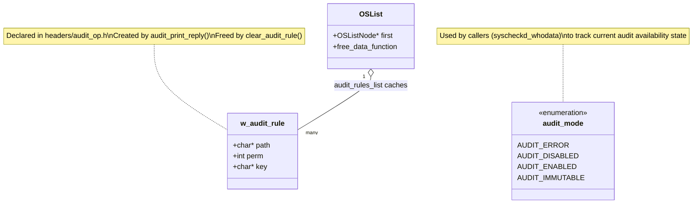
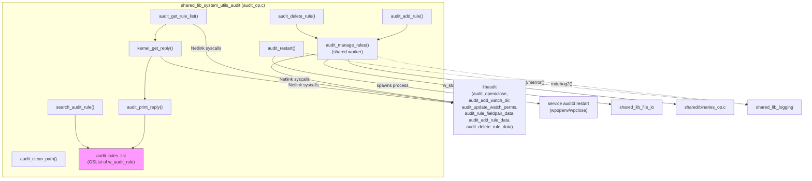
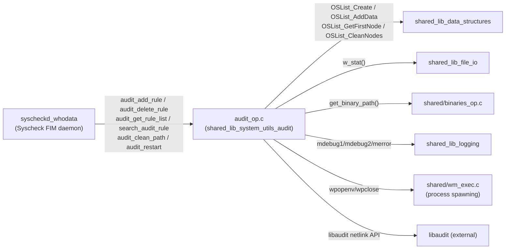
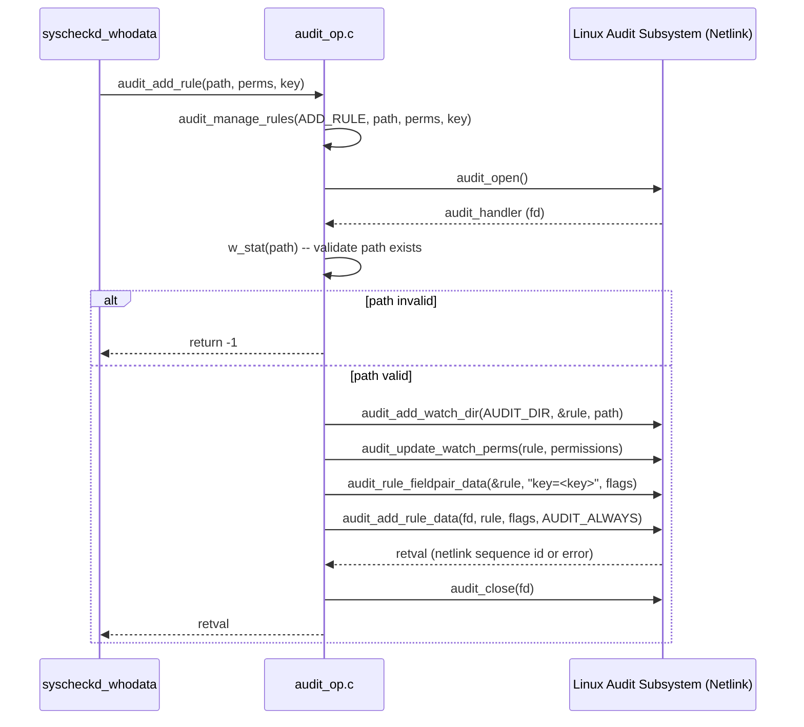
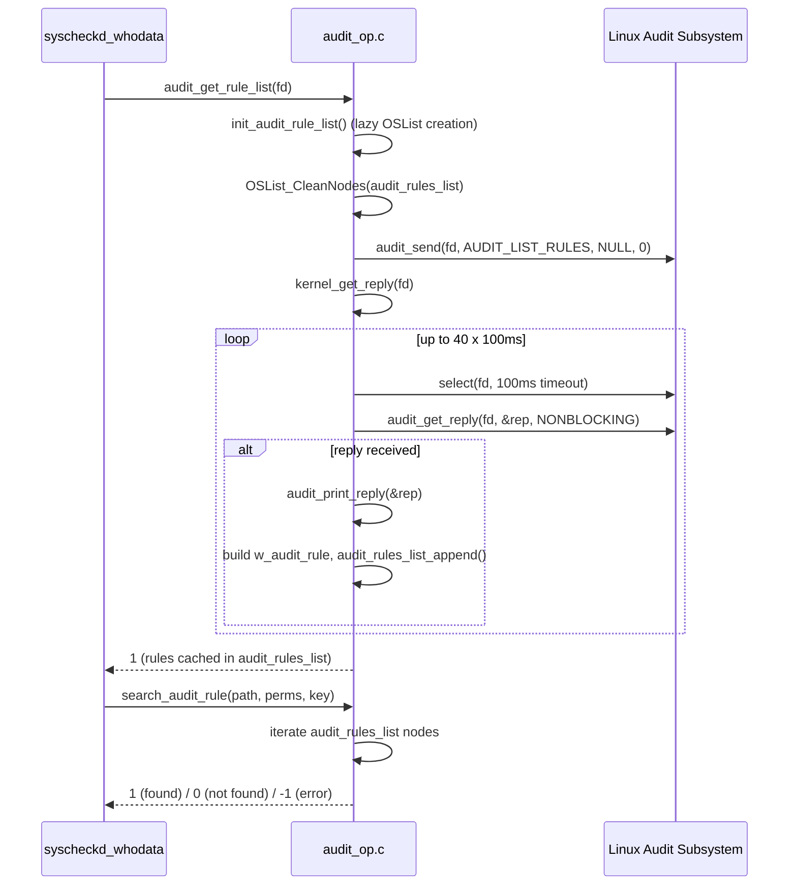
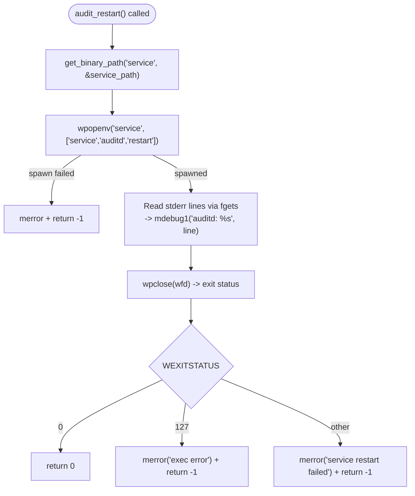
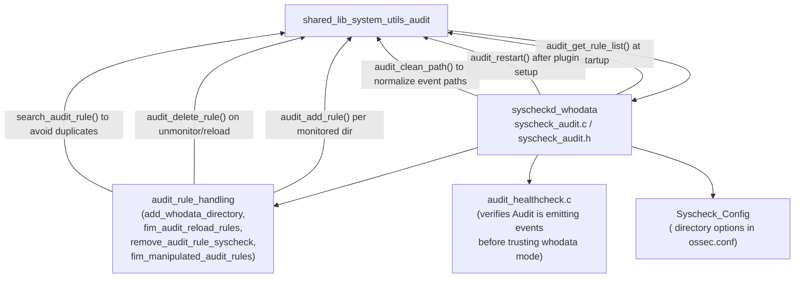

# Shared Library — System Utilities: Linux Audit Integration (`shared_lib_system_utils_audit`)

## Introduction

`shared_lib_system_utils_audit` is a focused C module inside Wazuh's core **Shared Library** (`src/shared/`). Its single source file, `audit_op.c` (declared in `src/headers/audit_op.h`), wraps the Linux `libaudit` API to let Wazuh **add, delete, list, and track Audit watch rules**, and to **restart the `auditd` service** when its configuration changes.

This functionality exists almost exclusively to support **Syscheck's *whodata* real-time file-integrity-monitoring mode on Linux** (see [`syscheckd_whodata`](Syscheck___FIM_Daemon_(C_C%2B%2B).md)), which needs kernel-level Audit watches on monitored directories in order to capture *who* (which process/user) touched a file, not merely *that* it changed. Because managing raw Audit rules via `libaudit` is intricate (netlink communication, binary rule encoding, asynchronous kernel replies), this module centralizes that complexity into a small, reusable API so the rest of the codebase never talks to `libaudit` directly.

The module is compiled only when Wazuh is built `--enable-audit` (`#ifdef ENABLE_AUDIT`), and only makes sense on Linux, since `auditd`/`libaudit` is a Linux-kernel-specific subsystem.

This document is one of five siblings describing [`shared_lib_system_utils`](shared_lib_system_utils.md):

- [`shared_lib_system_utils_signals`](shared_lib_system_utils_signals.md) — POSIX signal handling & graceful shutdown
- [`shared_lib_system_utils_config_scheduling`](shared_lib_system_utils_config_scheduling.md) — cluster status & generic scan scheduling
- [`shared_lib_system_utils_sysinfo`](shared_lib_system_utils_sysinfo.md) — time/version/process primitives
- **`shared_lib_system_utils_audit`** (this module) — Linux Audit rule management
- `shared_lib_system_utils_agents` — manager-side agent info/messaging helpers

## Purpose and Core Functionality

| Function | Role |
|---|---|
| `audit_add_rule(path, perms, key)` | Adds a new Audit watch rule for `path` with the requested permission bitmask (`AUDIT_PERM_READ/WRITE/EXEC/ATTR`) and a filter `key` string (used later to identify/parse the resulting kernel events). Thin wrapper over `audit_manage_rules(ADD_RULE, ...)`. |
| `audit_delete_rule(path, perms, key)` | Removes an existing Audit watch rule with the same parameters. Thin wrapper over `audit_manage_rules(DELETE_RULE, ...)`. |
| `audit_manage_rules(action, path, permissions, key)` | The core worker: opens a Netlink Audit socket (`audit_open`), validates the path (`stat`), builds an `audit_rule_data` structure (`audit_add_watch_dir`, `audit_update_watch_perms`, `audit_rule_fieldpair_data` for the key), and finally calls `audit_add_rule_data`/`audit_delete_rule_data` before closing the socket. |
| `audit_get_rule_list(fd)` | Requests the full list of currently-loaded Audit rules from the kernel (`AUDIT_LIST_RULES`) over an already-open Netlink socket `fd`, populating the module-internal `audit_rules_list`. |
| `kernel_get_reply(fd)` | Low-level poll loop (`select` + `audit_get_reply`) that reads asynchronous Netlink replies from the kernel with a bounded timeout (40 × 100 ms), feeding each reply to `audit_print_reply`. |
| `audit_print_reply(rep)` | Parses a single `AUDIT_LIST_RULES` reply, extracting the watched path, permission bits, and filter key, then appends a `w_audit_rule` to the internal list via `audit_rules_list_append`. |
| `search_audit_rule(path, perms, key)` | Checks whether a rule matching `path`+`perms`+`key` already exists in the cached `audit_rules_list` — used to avoid adding duplicate rules. |
| `audit_clean_path(cwd, path)` | Resolves a relative path (containing `../` segments) reported by an Audit event against a `cwd`, producing an absolute path string. |
| `audit_restart(void)` | Restarts the OS `auditd` service (`service auditd restart`) via `wpopenv`/`wpclose`, used after modifying `/etc/audit/rules.d/` or the plugin configuration. |
| `init_audit_rule_list()` / `audit_rules_list_append()` / `audit_rules_list_free()` / `clear_audit_rule()` | Lifecycle management for the internal `OSList` (from [`shared_lib_data_structures`](shared_lib_data_structures.md)) that caches the set of rules read back from the kernel. |

## Data Structures

- **`w_audit_rule`** (`src/headers/audit_op.h`) is the plain data-carrier struct for one Audit watch rule: the watched `path`, the OR'd permission bitmask (`perm`), and the free-text filter `key` string used later to correlate kernel events back to Wazuh configuration.
- **`audit_mode`** is an enum (`AUDIT_ERROR`, `AUDIT_DISABLED`, `AUDIT_ENABLED`, `AUDIT_IMMUTABLE`) declared alongside `w_audit_rule`; it is primarily consumed by the calling module ([`syscheckd_whodata`](Syscheck___FIM_Daemon_(C_C%2B%2B).md)'s `audit_data_t`, see `src/syscheckd/src/whodata/syscheck_audit.c::_audit_data_s`) to track whether the Audit subsystem is usable, disabled, or running in immutable mode (`-e 2`, which blocks rule modification until reboot).
- **`audit_rules_list`** is a private, file-static `OSList*` (see [`shared_lib_data_structures`](shared_lib_data_structures.md)) that caches the rules read back from the kernel via `audit_get_rule_list`/`audit_print_reply`, freed with a custom deleter (`clear_audit_rule`) registered via `OSList_SetFreeDataPointer`.

## Architecture

## Component Relationships and Dependencies

Related sibling modules under [`shared_lib_system_utils`](shared_lib_system_utils.md):

- [`shared_lib_system_utils_signals`](shared_lib_system_utils_signals.md) — signal handling used by Syscheck's Audit health-check thread when shutting down.
- [`shared_lib_system_utils_config_scheduling`](shared_lib_system_utils_config_scheduling.md) — generic scheduling not directly used by this module, but a sibling in the same parent grouping.
- [`shared_lib_system_utils_sysinfo`](shared_lib_system_utils_sysinfo.md) — time helpers occasionally used alongside Audit health-check timeouts.
- [`shared_lib_data_structures`](shared_lib_data_structures.md) — provides the `OSList` type used for `audit_rules_list`.
- [`shared_lib_file_io`](shared_lib_file_io.md) — provides `w_stat()` used to validate watched paths before adding a rule.
- [`shared_lib_logging`](shared_lib_logging.md) — provides the `mdebug1`/`mdebug2`/`merror` macros for diagnostics.

## Process Flow: Adding an Audit Watch Rule

## Process Flow: Listing Rules Loaded in the Kernel

## Process Flow: Restarting `auditd`

## Consumers Across the Codebase

This module has effectively **one consumer subsystem**: the Linux *whodata* implementation of Syscheck / FIM.

- **[`syscheckd_whodata`](Syscheck___FIM_Daemon_(C_C%2B%2B).md)** is the sole caller. When a directory is configured with `whodata="yes"` on Linux, Syscheck:
  1. Calls `audit_get_rule_list()` once at startup to discover already-loaded rules (avoiding duplicate `audit_add_rule` calls across daemon restarts).
  2. Calls `audit_add_rule()` for each monitored directory, encoding read/write/attribute permissions and a Wazuh-specific filter key (e.g., `wazuh_fim`), so that subsequent `auditd` log lines can be filtered and attributed back to FIM.
  3. Periodically (or on `SIGHUP`/config reload) calls `fim_audit_reload_rules`/`fim_manipulated_audit_rules`, which internally use `search_audit_rule()` and `audit_delete_rule()`/`audit_add_rule()` to reconcile the desired rule set with what the kernel actually has (defending against an administrator or another tool tampering with `auditctl` rules).
  4. Uses `audit_clean_path()` when parsing raw Audit log lines (`type=PATH` records) that report paths relative to the process's `cwd` at the time of the syscall.
  5. Calls `audit_restart()` after writing/verifying the `audisp`/`auditd` plugin configuration that pipes Audit events to Wazuh's Unix socket listener.
- **[`os_regex`](os_regex.md)** and **[`shared_lib_networking`](shared_lib_networking.md)** are used *by* `syscheckd_whodata` to parse the raw Audit log text and to receive events over the Audit plugin socket, but they do not call into `audit_op.c` directly — they are peers consumed alongside it, not dependents of it.

## Error Handling & Logging

- All fallible `libaudit` calls (`audit_add_watch_dir`, `audit_update_watch_perms`, `audit_rule_fieldpair_data`, `audit_add_rule_data`, `audit_delete_rule_data`) are checked for negative/zero return codes and logged via `mdebug2` together with a human-readable translation from `audit_errno_to_name()`.
- `audit_manage_rules()` treats `-EEXIST` specially — a rule that already exists is **not** treated as a hard failure (it simply means the rule is already active, which is the desired end-state for `ADD_RULE`).
- `kernel_get_reply()` has a bounded timeout: up to 40 iterations of a 100 ms `select()` + non-blocking `audit_get_reply()`, meaning at most ~4 seconds are spent waiting for a complete `AUDIT_LIST_RULES` dump before giving up — this prevents Syscheck startup from hanging indefinitely if the Audit kernel subsystem is unresponsive.
- `audit_restart()` distinguishes three outcomes: successful restart (`0`), an `exec()`-level failure (`WEXITSTATUS == 127`, binary not found/not executable), and a generic service-manager failure (any other non-zero exit code), logging an actionable `merror` in the latter two cases.

## Testing

Unit tests for this module live under **[Unit_Tests_-_Shared_Library](Unit_Tests_-_Shared_Library.md)**, specifically `test_audit_op_shared` (`src/unit_tests/shared/test_audit_op.c`):

| Test | Verifies |
|---|---|
| `test_audit_add_rule` | Full happy-path of `audit_add_rule()`: `audit_open` → `audit_add_watch_dir` → `audit_update_watch_perms` → `audit_rule_fieldpair_data` → `audit_add_rule_data` → `audit_close`, asserting the final return code. |
| `test_audit_delete_rule` | Same flow for `audit_delete_rule()`, additionally asserting that a `libaudit` failure (`audit_delete_rule_data` returning `-1`) is logged via `mdebug2` with `audit_errno_to_name()` translation. |
| `test_audit_get_rule_list` | Verifies `audit_get_rule_list()` sends `AUDIT_LIST_RULES` on the given fd, drives the `select`/`audit_get_reply` polling loop, and ends with a populated (non-NULL) `audit_rules_list`. |
| `test_search_audit_rule` | Confirms a previously-cached rule can be found by `search_audit_rule()`. |
| `test_audit_restart` | Exercises the `get_binary_path` → `wpopenv` → `fgets` loop → `wpclose` sequence and validates a `0` (success) return on a clean `WEXITSTATUS`. |
| `test_audit_clean_path` / `test_audit_print_reply` / `test_kernel_get_reply` / `test_audit_rules_list_append` | Cover path-normalization edge cases, reply-parsing correctness, the bounded polling loop, and list-append bookkeeping respectively. |

These tests rely on mocked `libaudit` symbols provided by [`wrappers_externals_audit`](Unit_Test_Wrappers_%26_Mocks.md) (`src/unit_tests/wrappers/externals/audit/libaudit_wrappers.c`), which stub every `libaudit` entry point (`audit_open`, `audit_send`, `audit_get_reply`, `audit_add_rule_data`, etc.) so the tests run deterministically without a real kernel Audit subsystem or root privileges.

## Key Design Notes

- **Single-purpose wrapper, not a general Audit client**: the module exposes only the narrow slice of `libaudit` functionality Syscheck's *whodata* mode needs (directory watch rules with permission bits + a filter key) — it is not a general-purpose Audit rule editor (it has no concept of syscall rules, user/group filters beyond the key, or the full `auditctl` rule grammar).
- **Netlink is inherently asynchronous**: both `audit_manage_rules` (implicitly, since `libaudit` batches replies) and `audit_get_rule_list`/`kernel_get_reply` must poll for kernel responses rather than get a synchronous return value for every operation; `kernel_get_reply`'s bounded retry loop is the mechanism that turns this into a bounded, testable operation.
- **File-static cache, explicit lifecycle**: `audit_rules_list` is intentionally not exposed directly — callers interact with it only through `audit_get_rule_list()` (populate), `search_audit_rule()` (query), and `audit_rules_list_free()` (teardown), keeping the cache's internal representation (`OSList` of `w_audit_rule`) an implementation detail.
- **Idempotent-friendly add semantics**: treating `-EEXIST` as non-fatal in `audit_manage_rules` lets calling code in `syscheckd_whodata` simply "ensure this rule exists" without first having to check `search_audit_rule()`, simplifying reconciliation logic on daemon restart or config reload.
- **Compile-time gating**: the entire file is wrapped in `#ifdef ENABLE_AUDIT`, so on builds without Audit support (or on non-Linux platforms where `libaudit` is unavailable) this translation unit compiles to nothing, and `syscheckd_whodata` falls back to alternative real-time monitoring mechanisms (`inotify`-only mode, or eBPF-based whodata — see [`syscheckd_ebpf`](Syscheck___FIM_Daemon_(C_C%2B%2B).md)).
