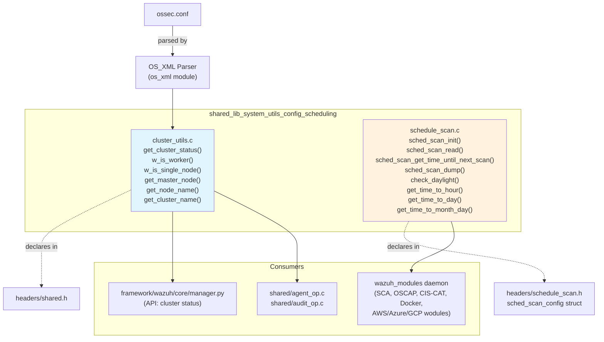
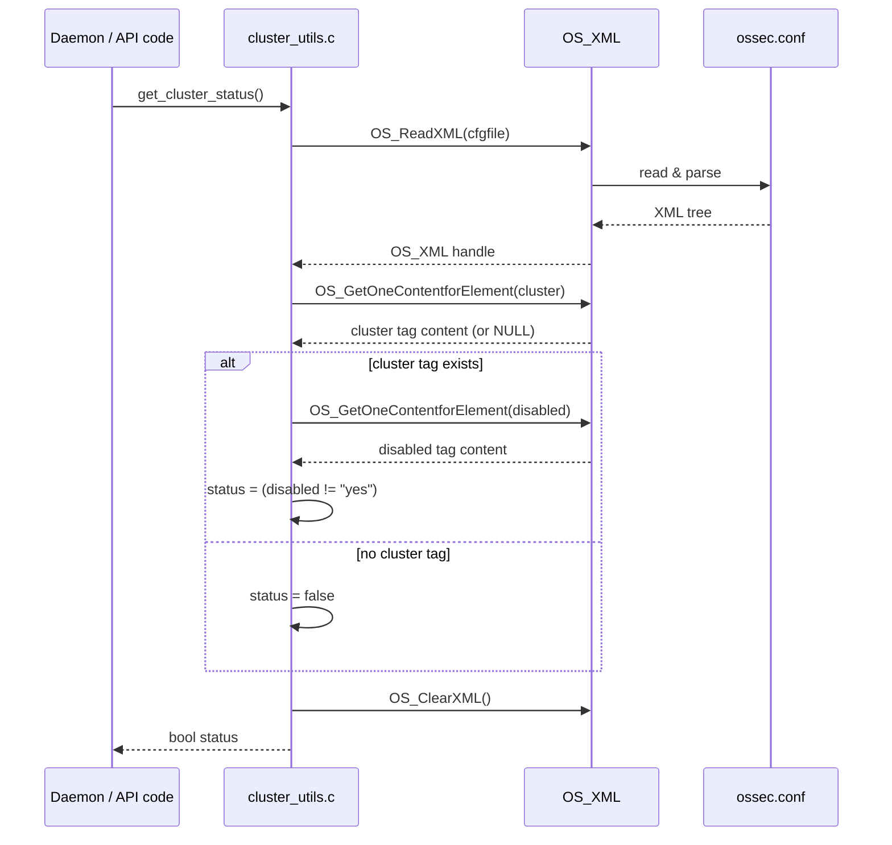
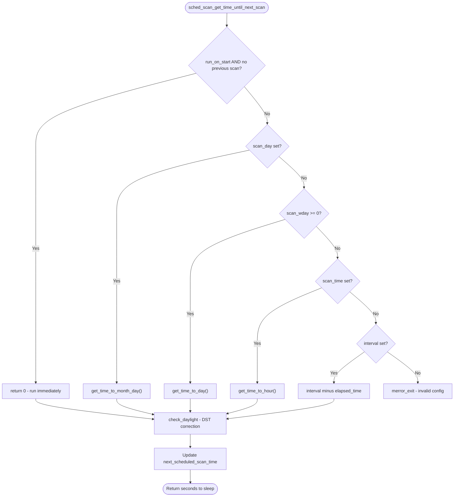
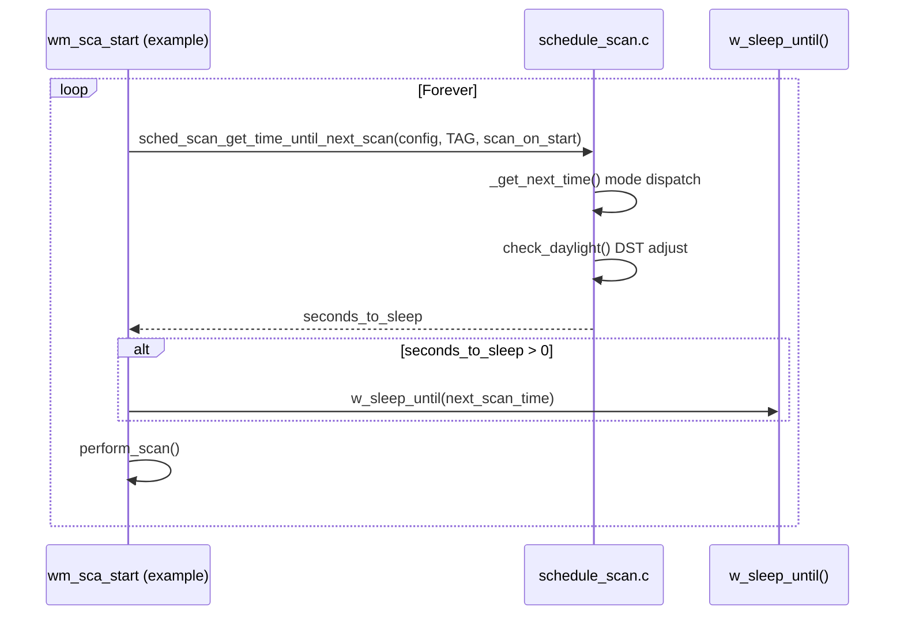
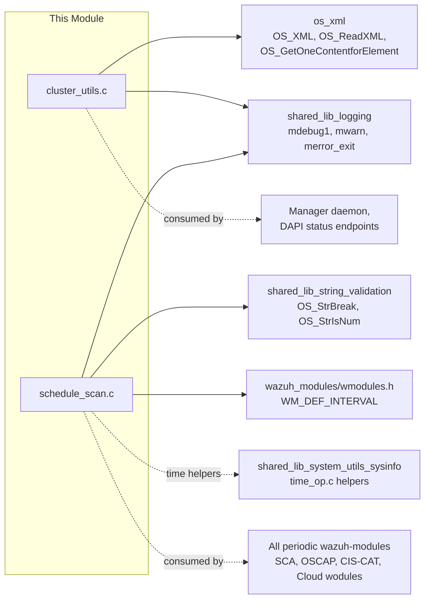
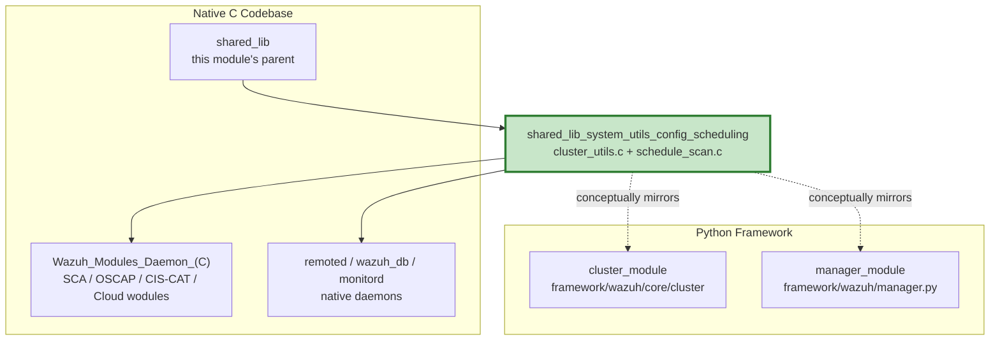

# Shared Library: System Utils – Configuration & Scheduling

## Introduction

The **`shared_lib_system_utils_config_scheduling`** module is a small but foundational part of the Wazuh **Shared Library** (`src/shared/`). It provides two independent, self-contained utilities that are consumed by virtually every daemon and wodule in the Wazuh agent and manager:

1. **Cluster configuration inspection** (`src/shared/cluster_utils.c`) — reads `ossec.conf` to determine cluster-related runtime facts (whether clustering is enabled, whether the current node is a worker, node/cluster names, etc.).
2. **Generic scan scheduling** (`src/shared/schedule_scan.c`) — a reusable time-scheduling engine that computes "when should my next scan run?" based on flexible configuration options (fixed interval, day-of-month, day-of-week, or time-of-day), used by nearly all periodic wazuh-modules (SCA, OSCAP, CIS-CAT, Docker listener, cloud integrations, etc.).

Both utilities are pure C, header-declared in `src/headers/` (`schedule_scan.h`) and `src/headers/shared.h` respectively, and have no dependency on each other — they are grouped together because they both live under `shared_lib_system_utils` and address **"system-level configuration and timing utilities"** consumed by higher-level modules.

This document explains the internal design of both components, how they are exercised by callers, and how they fit into the broader Wazuh shared library and Wodules ecosystem.

---

## 1. Module Purpose & Scope

| Component | Responsibility |
|---|---|
| `get_cluster_status()` (and sibling functions `w_is_worker`, `w_is_single_node`, `get_master_node`, `get_node_name`, `get_cluster_name`) | Parse `ossec.conf` XML and answer questions about cluster topology and role, without requiring the caller to know anything about XML parsing. |
| `sched_scan_config` + `sched_scan_*` functions (`schedule_scan.c`) | Parse `<interval>`, `<day>`, `<wday>`, `<time>` XML tags into a normalized configuration struct, validate them, and compute the number of seconds until the next scheduled execution — while gracefully handling daylight-saving-time transitions. |

Both are **stateless helper libraries** — they do not run their own threads or maintain long-lived state beyond what is passed in by the caller (typically a `sched_scan_config` struct embedded in a module's configuration struct, e.g. `wm_sca_t`, `wm_oscap`, `wm_ciscat`).

---

## 2. Architecture Overview



### Relationship to sibling modules

This module is a child of [`shared_lib_system_utils`](shared_lib_system_utils.md) alongside:
- `shared_lib_system_utils_signals` (`sig_op.c`) — signal handling
- `shared_lib_system_utils_sysinfo` (`time_op.c`, `version_op.c`, `os_utils.c`) — OS/time primitives
- `shared_lib_system_utils_audit` (`audit_op.c`) — Linux audit subsystem helpers
- `shared_lib_system_utils_agents` (`read-agents.c`) — agent info helpers

It is a grandchild of [`shared_lib`](shared_lib.md), the umbrella shared C library used across the entire native Wazuh codebase (see [`Agent_&_Manager_Native_Daemons_(C)`](Agent_and_Manager_Native_Daemons.md)).

---

## 3. Component Deep Dive

### 3.1 Cluster Utilities (`cluster_utils.c`)

#### Purpose
Centralizes all logic for reading the `<cluster>` block of `ossec.conf` so that callers never need to touch `OS_XML` directly. This avoids duplicated XML-parsing logic scattered across the manager, API, and wodules.

#### Key Functions

| Function | Returns | Description |
|---|---|---|
| `get_cluster_status()` | `bool` | `true` if a `<cluster>` block exists **and** is not explicitly `<disabled>yes</disabled>`. |
| `w_is_worker()` | `int` (`1`/`0`/`OS_INVALID`) | Determines if the current node is configured as `worker`/`client` (legacy tag) and cluster is enabled. |
| `w_is_single_node(int *is_worker)` | `int` (`1`/`0`) | Determines if the deployment is a single-node (non-clustered) setup; optionally also returns worker status via out-parameter. |
| `get_master_node()` | `char *` (caller frees) | Returns configured master node identifier, or `"undefined"`. |
| `get_node_name()` | `char *` (caller frees) | Returns the configured `<node_name>`, or `"undefined"`. |
| `get_cluster_name()` | `char *` (caller frees) | Returns the configured `<name>` of the cluster, or `"undefined"`. |

#### Design Notes
- All functions independently open/parse/close `ossec.conf` via `OS_XML` (see [`os_xml` module](Agent_and_Manager_Native_Daemons.md)) — there is no shared/cached XML tree, so each call incurs a full file read + parse. This is acceptable because these functions are called infrequently (e.g. at daemon startup, or when the manager builds cluster status responses for the API).
- `get_cluster_status()` specifically implements a "presence + not-disabled" check: the `<cluster>` tag must exist, and if a `<disabled>` tag is present it must equal `"no"` (any other value, or absence of the tag, results in `true`/enabled by default when `<cluster>` exists).
- Memory-safety: all XML content getters (`OS_GetOneContentforElement`) return heap-allocated strings that must be freed — the functions carefully free intermediate strings before returning.

#### Data Flow



#### Consumers
- Used by the manager daemon (`src/remoted`, `src/wazuh_db`) and by higher-level Python cluster code (see [`cluster_module`](API_and_Management_Framework.md) — `framework/wazuh/core/cluster/utils.py` — which wraps analogous logic for the Python side via `raise_if_exc`/`ClusterFilter`, though that is a **separate, parallel implementation** in Python for the DAPI/cluster daemon, not a direct caller of this C code).
- `framework/wazuh/core/manager.py::get_status` and the `manager_module` API controllers surface cluster-related status derived conceptually from the same `ossec.conf` structure this C code parses (via `wazuh-clusterd` and `wdb`/socket queries rather than directly invoking this C function, since Python and C are separate runtimes).

---

### 3.2 Scan Scheduling Engine (`schedule_scan.c`)

#### Purpose
Provides a **single reusable scheduling algorithm** so that every periodic wazuh-module (SCA, OSCAP, CIS-CAT, GCP, Azure, AWS, Docker listener, GitHub, Office365, etc. — see [`Wazuh_Modules_Daemon_(C)`](Wazuh_Modules_Daemon_C.md) and [`Unit_Tests_-_Wazuh_Modules_(Cloud_Misc)`](Unit_Tests_Wazuh_Modules_Cloud_Misc.md)) can configure "when do I run?" using a consistent XML syntax and consistent semantics, instead of re-implementing ad-hoc interval/cron-like logic per module.

#### Core Data Structure

`sched_scan_config` (declared in `src/headers/schedule_scan.h`):

```c
typedef struct _sched_scan_config {
    int scan_day;                    // Day of month [1..31]
    int scan_wday;                   // Day of week [0..6]
    char* scan_time;                 // "hh:mm" time of day
    unsigned int interval;           // Interval in seconds (or months if month_interval)
    bool month_interval;             // Interval unit flag
    time_t next_scheduled_scan_time; // Absolute epoch time of next run
    time_t time_start;               // Module-internal bookkeeping
    int daylight;                    // Cached DST flag for adjustment
} sched_scan_config;
```

This struct is embedded directly inside numerous wodule configuration structs (e.g. `wm_sca_t`, `wm_oscap`, `wm_ciscat`, `wm_docker_t`), making scheduling a **composable trait** rather than a base class.

#### Key Functions

| Function | Purpose |
|---|---|
| `sched_scan_init()` | Initializes a `sched_scan_config` with safe defaults (`WM_DEF_INTERVAL`, no day/wday, `daylight = -1`). |
| `sched_scan_free()` | Frees `scan_time` string. |
| `is_sched_tag(tag)` | Utility predicate to check if an XML tag name is one of `interval`/`day`/`wday`/`time`, used by module config parsers to decide whether to delegate parsing. |
| `sched_scan_read(config, nodes, module_name)` | Parses XML nodes for `<interval>`, `<day>`, `<wday>`, `<time>`, applying interval unit suffixes (`M`=months, `w`=weeks, `d`=days, `h`=hours, `m`=minutes, `s`/none=seconds). Delegates to internal `_sched_scan_validate_parameters()`. |
| `sched_scan_get_time_until_next_scan(config, tag, run_on_start)` | **Main entry point** — computes seconds to sleep before next scan, applies DST correction via `check_daylight()`, and updates `next_scheduled_scan_time`. |
| `sched_scan_dump(config, cjson_obj)` | Serializes the schedule config to JSON (used by module `_dump()` handlers, e.g. for `GET /manager/configuration` API responses). |
| `check_daylight(config, next_scan_time, test)` | Adjusts the computed next-scan time by ±1 hour if DST state changed since last computation. |
| `get_time_to_hour()`, `get_time_to_day()`, `get_time_to_month_day()` | Low-level time-arithmetic helpers used internally by `_get_next_time()` to implement each of the four scheduling modes. |

#### Scheduling Modes (mutually validated)

`_sched_scan_validate_parameters()` enforces which combinations of `scan_day`/`scan_wday`/`scan_time`/`interval` are legal:

1. **Day of month** (`scan_day` set) → forces `month_interval = true`, defaults `scan_time` to `"00:00"`. Incompatible with `scan_wday`.
2. **Day of week** (`scan_wday >= 0`) → forces interval to be a multiple of 1 week (604800s), defaults `scan_time`.
3. **Time of day** (`scan_time` set, no day/wday) → forces interval to be a multiple of 1 day (86400s).
4. **Plain interval** (only `interval` set) → used as-is, in seconds.
5. **Month interval only** (`month_interval` but no `scan_day`) → defaults `scan_day = 1`.

#### Scheduling Decision Flow



#### Typical Usage Pattern (in a wodule's main loop)



This exact pattern (as shown in `wm_sca_start`) is repeated with minor variation across: `wm_oscap`, `wm_ciscat`, `wm_docker`, `wm_aws`, `wm_azure`, `wm_gcp`, `wm_github`, `wm_office365`, `wm_ms_graph`, `wm_command`, confirming this module's role as the **canonical scheduling primitive** for the [`Wazuh_Modules_Daemon_(C)`](Wazuh_Modules_Daemon_C.md).

#### DST Handling Detail

`check_daylight()` compares the cached `daylight` flag (DST state at last computation) against the DST state (`tm_isdst`) at the *target* future time. If they differ, it shifts `next_scan_time` by ±3600 seconds to compensate for the calendar's DST transition, preventing schedules from drifting by an hour across DST boundaries. The `daylight` field starts at `-1` (uninitialized sentinel) so no correction is applied on the very first computation.

---

## 4. Dependency Graph



---

## 5. Testing

Both components have dedicated unit test suites under `src/unit_tests/shared/`:

- **`test_schedule_scan.c`** ([`test_schedule_scan`](Unit_Tests_Shared_Library.md)) — extensively covers:
  - Daylight-saving transition detection (`test_check_daylight_*`)
  - Each scheduling mode's time computation (`test_get_time_to_day_*`, `test_get_time_to_hour_*`, `test_get_time_to_month_day_*`)
  - XML parsing and validation of all four scheduling modes and their invalid/incompatible combinations (`test_sched_scan_read_*`, `test_sched_scan_validate_*`)
  - JSON dump correctness (`test_sched_scan_dump_day`, `test_sched_scan_dump_wday`)

- **`test_cluster_utils`** functionality is exercised indirectly via `shared/agent_op.c` tests and cluster-related manager/API unit tests (e.g. `test_wazuhdb_op.c`, cluster control tests in [`Unit_Tests_-_Wazuh_DB`](Unit_Tests_Wazuh_DB.md)), since `cluster_utils.c` itself has no dedicated standalone test file in the provided component list.

Additionally, the [`wm_scheduling_tests`](Unit_Tests_Wazuh_Modules_Cloud_Misc.md) suite (`test_wmodules_scheduling.c` + `wmodules_scheduling_helpers.c/.h`) provides higher-level, module-agnostic tests that exercise `sched_scan_read`/`sched_scan_dump` through a full XML-to-config-to-JSON round trip, using mocked `time()` (`__wrap_time`) to make DST/interval assertions deterministic.

---

## 6. How This Module Fits Into the Overall System



### Key Takeaways for Maintainers

1. **No cross-language sharing**: The Python cluster/scheduling logic in `framework/wazuh/core/cluster/utils.py` and `framework/wazuh/manager.py` (see [`cluster_module`](API_and_Management_Framework.md)) is a **separate implementation** for the Python-based cluster daemon (`wazuh-clusterd`) and REST API — it does not call into this C code. Any behavioral change to scheduling or cluster-detection semantics here should be cross-checked against the Python equivalents for consistency.
2. **Single source of truth for scheduling**: Any new periodic wodule should reuse `sched_scan_config`/`sched_scan_read`/`sched_scan_get_time_until_next_scan` rather than reimplementing timing logic, to keep XML configuration syntax (`<interval>`, `<day>`, `<wday>`, `<time>`) consistent across all modules (see [`Wazuh_Modules_Daemon_(C)`](Wazuh_Modules_Daemon_C.md) for examples of consumers).
3. **`ossec.conf` is re-parsed on each cluster query**: Callers that need cluster status repeatedly (e.g. in a hot loop) should cache the result themselves; `cluster_utils.c` does not cache.
4. **DST correctness depends on state continuity**: Because `check_daylight()` relies on the previous `daylight` value stored in `sched_scan_config`, this struct must persist across scan iterations (not be re-initialized each loop) for DST correction to function properly.

---

## 7. Related Documentation

- [`shared_lib.md`](shared_lib.md) — parent module, overall shared C library structure.
- [`shared_lib_system_utils.md`](shared_lib_system_utils.md) — sibling utilities (signals, sysinfo, audit, agents).
- [`Wazuh_Modules_Daemon_C.md`](Wazuh_Modules_Daemon_C.md) — primary consumers of the scheduling engine.
- [`API_and_Management_Framework.md`](API_and_Management_Framework.md) — Python-side cluster and manager modules with analogous (but independent) concepts.
- [`Unit_Tests_Shared_Library.md`](Unit_Tests_Shared_Library.md) — test suites covering both components.
- [`Unit_Tests_Wazuh_Modules_Cloud_Misc.md`](Unit_Tests_Wazuh_Modules_Cloud_Misc.md) — scheduling integration tests (`wm_scheduling_tests`).
