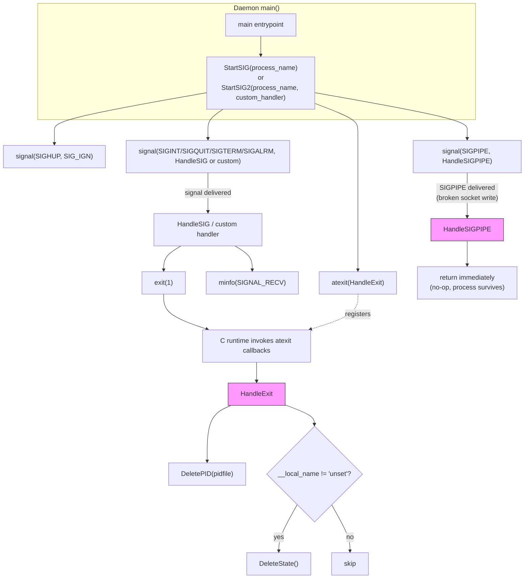
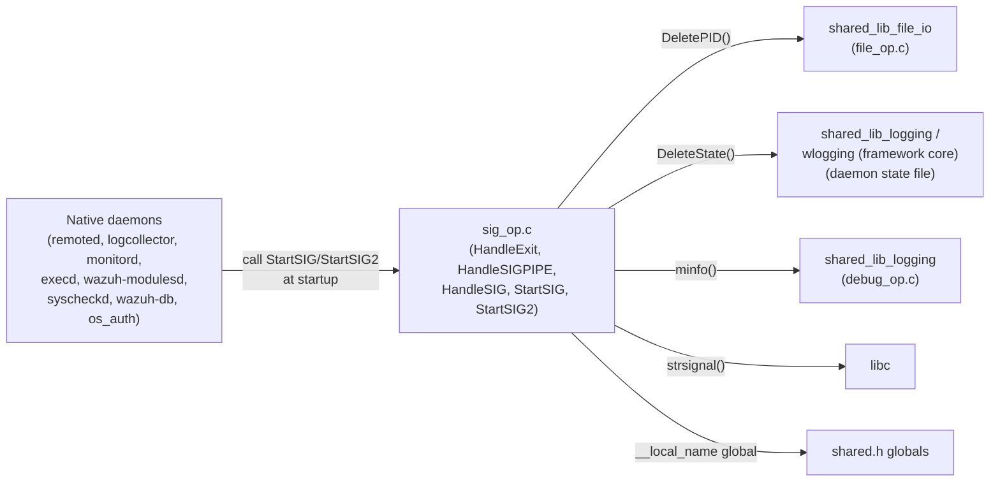
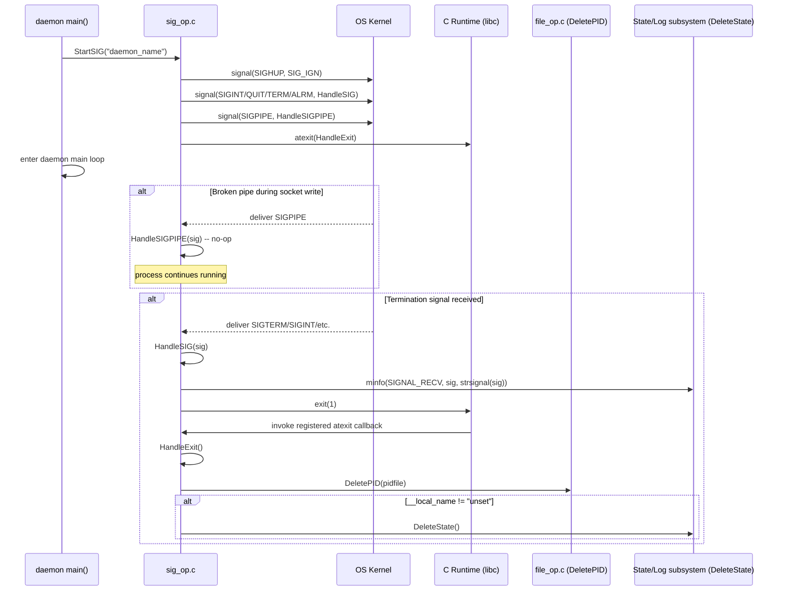

# Signal & Process-Exit Handling (`shared_lib_system_utils_signals`)

## Introduction

This module is one of the smallest but most structurally important pieces of the Wazuh native (C) codebase. It lives in `src/shared/sig_op.c` and provides the low-level **POSIX signal handling** and **graceful process-exit** primitives that every Wazuh daemon (`ossec-remoted`, `ossec-logcollector`, `ossec-monitord`, `ossec-execd`, `wazuh-modulesd`, `wazuh-syscheckd`, `wazuh-db`, etc.) relies on to:

- Register consistent signal handlers (`SIGINT`, `SIGQUIT`, `SIGTERM`, `SIGALRM`, `SIGHUP`, `SIGPIPE`).
- Guarantee that a PID file and any daemon "state" file are cleaned up automatically when the process terminates, regardless of the termination path (`exit()` call, signal, or normal `return` from `main()`).
- Prevent daemons from being killed unexpectedly by broken-pipe conditions (`SIGPIPE`) that frequently occur during client-server socket communication.

Although the file `sig_op.c` also defines `StartSIG()` and `StartSIG2()` (the functions that *install* the handlers), the two components documented in depth here — **`HandleExit`** and **`HandleSIGPIPE`** — are the actual callback bodies invoked by the C runtime (`atexit`) and by the kernel (`signal`) respectively. They represent the terminal behavior of the signal/exit subsystem for all POSIX (non-Windows) Wazuh daemons.

This module is a child of `shared_lib_system_utils`, which is itself part of the broader **Agent & Manager Native Daemons (C)** codebase area, specifically the `shared_lib` static library shared by every native daemon.

## Purpose and Core Functionality

| Component | Role |
|---|---|
| `HandleExit()` | Registered via `atexit()`. Executed automatically whenever the process calls `exit()` (including indirectly via signal handlers such as `HandleSIG`). Deletes the daemon's PID file (`DeletePID`) and, if the process has a named daemon state (`__local_name != "unset"`), removes the daemon state file (`DeleteState`). |
| `HandleSIGPIPE(int sig)` | Registered as the handler for `SIGPIPE`. Intentionally does **nothing** (a no-op) so that a broken pipe/socket write does not terminate the daemon; the write() call that triggered `SIGPIPE` returns `EPIPE` instead, and calling code (in the networking utilities) is expected to handle the error explicitly. |
| `StartSIG()` / `StartSIG2()` *(supporting, non-core functions in the same file)* | Wire up all the standard signals for a daemon process. `StartSIG` uses a generic `HandleSIG` handler for termination signals; `StartSIG2` allows the caller to supply a custom handler function (used by daemons needing special shutdown logic, e.g. flushing buffers). Both always install `HandleSIGPIPE` for `SIGPIPE` and register `HandleExit` with `atexit()`. |

Because `sig_op.c` is guarded by `#ifndef WIN32`, this entire module applies only to Unix/Linux/macOS builds; Windows agents use different mechanisms (see `win32_agent`).

## Architecture

## Component Relationships and Dependencies

`sig_op.c` is a thin orchestration layer that depends on other parts of `shared_lib` to perform actual cleanup work:

Related sibling modules under the same parent (`shared_lib_system_utils`) that are frequently used alongside signal handling during daemon startup/shutdown:

- `shared_lib_system_utils_config_scheduling` – cluster status and scheduled scan helpers consulted during daemon lifecycle.
- `shared_lib_system_utils_sysinfo` – time/version/OS privilege helpers used in conjunction with process startup.
- `shared_lib_system_utils_audit` – audit rule management (also needs clean shutdown handling).
- `shared_lib_system_utils_agents` – agent-related utility functions used by manager daemons.
- `shared_lib_file_io` – provides `DeletePID`, actually referenced by `HandleExit`.
- `shared_lib_logging` – provides `minfo`/`_minfo` logging primitives referenced by `HandleSIG`.
- `shared_lib_networking` – the primary consumer of `SIGPIPE` suppression, since socket writes (`send`, `SendMSG`) can trigger broken-pipe conditions.

## Process Flow: Daemon Startup to Shutdown

## How This Module Fits Into the Overall System

Every C-based Wazuh daemon documented under **Agent & Manager Native Daemons (C)** — including `client_agent_native`, `remoted`, `logcollector_core`, `monitord`, `os_execd`, and the daemon lifecycle portions of `wazuh_modules_core` and `syscheckd_core` — calls `StartSIG`/`StartSIG2` once, near the very start of `main()`, immediately after parsing command-line arguments and before entering the daemon's primary event loop. This guarantees a single, consistent point where:

1. All daemons behave predictably under `service stop` / `kill` operations issued by process managers (systemd, init scripts, `wazuh-control`).
2. PID files in `/var/run` (or equivalent) never become stale, which would otherwise break daemon supervision and `wazuh-control status`.
3. Long-lived TCP/UDP connections (used heavily by `shared_lib_networking`, `remoted_networking`, and the `cluster_module`'s inter-node protocol) do not crash the process on transient peer disconnects.

Because the surface area of this module is intentionally minimal (a `HandleExit` cleanup callback and a no-op `SIGPIPE` handler), it has no children sub-modules; it is a leaf utility consumed uniformly by nearly every other native-daemon module in the codebase.

## Key Design Notes

- **Single point of truth for cleanup**: rather than requiring every daemon to remember to delete its PID file on every exit path, `HandleExit` is installed once via `atexit()`, so it fires on `exit()` calls anywhere in the codebase (explicit `exit()` in error paths, `HandleSIG`, or a normal `return` from `main` that eventually calls `exit`).
- **State file is conditional**: `DeleteState()` is only invoked when `__local_name` has been set to something other than `"unset"`, meaning only daemons that register a named runtime state (see `shared_lib_logging` / `wlogging`) participate in state cleanup; utilities and short-lived CLI tools that never set a local name skip this step.
- **`SIGPIPE` suppression is defensive, not silent-failure**: `HandleSIGPIPE` performs no error reporting itself; it simply prevents process death. The write operation that raised the signal still fails with `EPIPE`, and it is the responsibility of calling code in `shared_lib_networking` (e.g., `OS_SendTCP`, `SendMSG`) to check the return value and handle the failure (reconnect, log, drop message, etc.).
- **Portability boundary**: the entire file is compiled only for non-Windows targets (`#ifndef WIN32`). Windows agents implement equivalent shutdown/console-handler behavior separately in `win32_agent` (`win_service.c`, `win_utils.c`).
