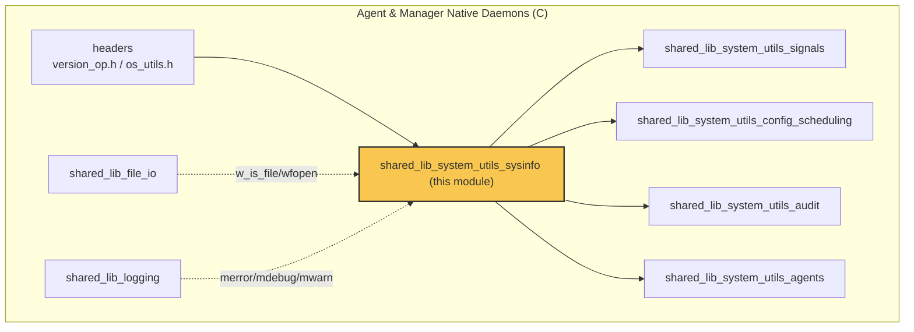
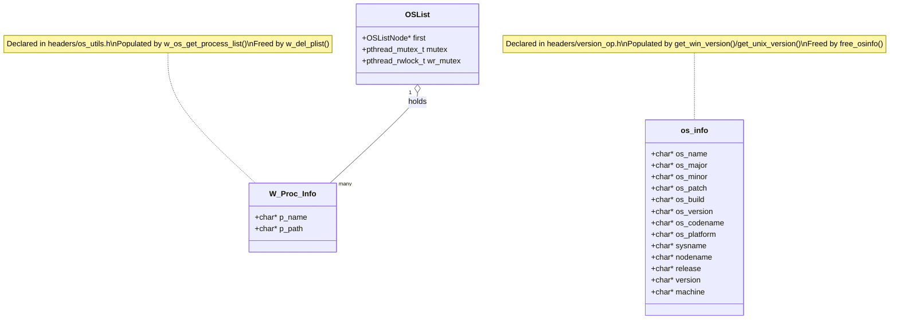
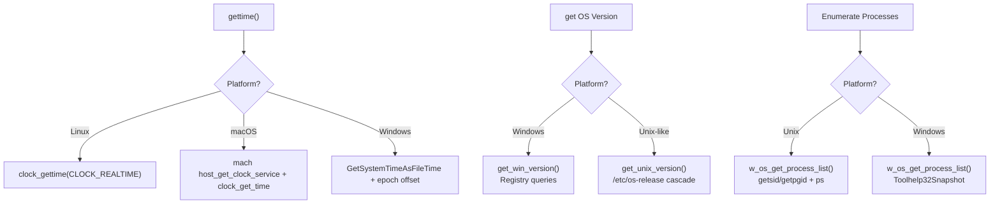
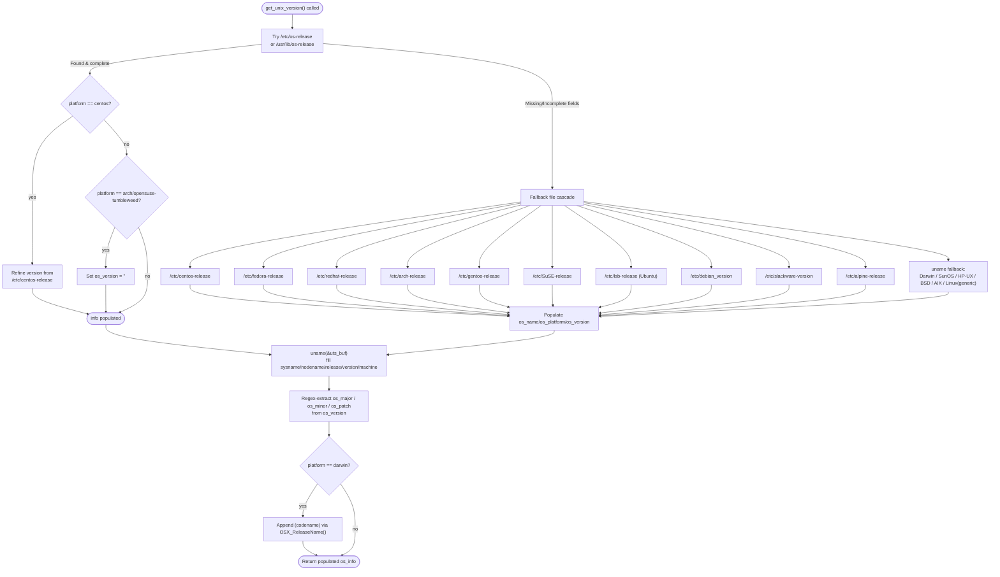
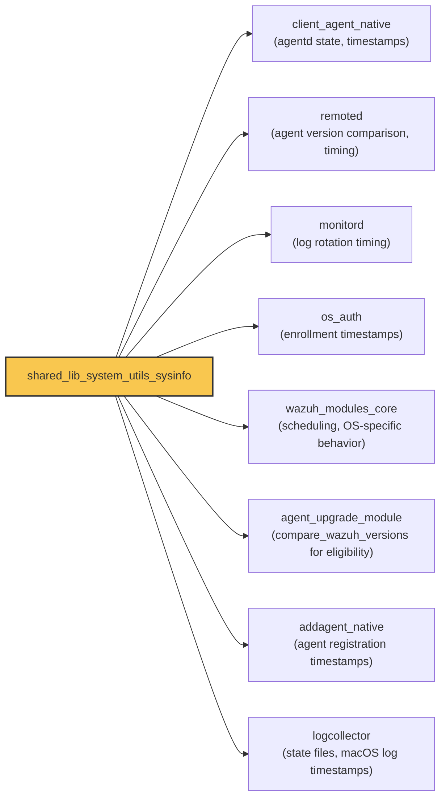
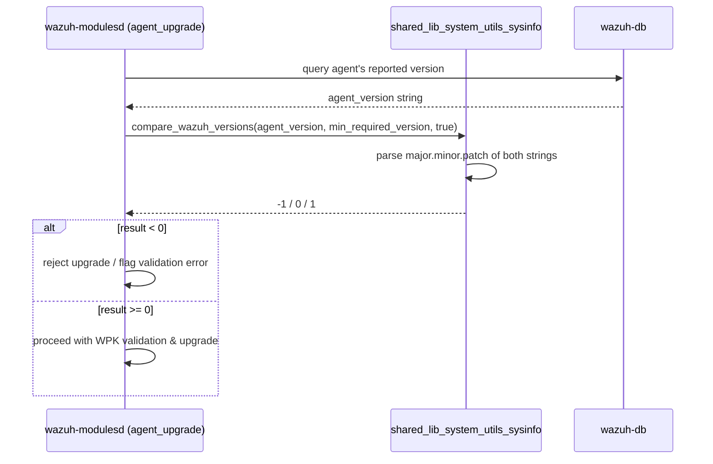

# Shared Library — System Utilities: SysInfo

## Introduction

`shared_lib_system_utils_sysinfo` is a low‑level, cross‑platform C module inside Wazuh's core `shared` library (`src/shared/`). It provides the fundamental **time-keeping** and **operating-system identification/utility** primitives that virtually every native Wazuh daemon (agent, manager, cluster, modules) links against.

The module is composed of three translation units:

| File | Responsibility |
|---|---|
| `src/shared/time_op.c` | Monotonic/calendar time retrieval, timestamp formatting, sleep/delay helpers, time arithmetic, leap-year and ISO‑8601 utilities. |
| `src/shared/version_op.c` | Detection of the running OS name/version/platform/codename (Windows registry parsing and Unix `/etc/*-release` parsing), CPU core count, and Wazuh version comparison. |
| `src/shared/os_utils.c` | OS-level process enumeration (`ps` on Unix, Toolhelp32 snapshot on Windows), Windows privilege elevation (`SeDebugPrivilege`), and small file-existence helpers. |

Because these functions are consumed everywhere (from `client-agent` to `wazuh-modulesd` to `remoted`), this module has **no dependencies on higher-level Wazuh subsystems** — only on the OS APIs and on other foundational pieces of `shared_lib` (see [shared_lib_system_utils_signals](shared_lib_system_utils_signals.md), [shared_lib_logging](shared_lib_logging.md), [shared_lib_file_io](shared_lib_file_io.md)) and the common header declarations in [headers](headers.md).

---

## 1. Purpose & Position in the System

This module sits at the very bottom of the dependency stack for Wazuh's native (C) components. It is a sibling of other `shared_lib_system_utils_*` sub-modules:

- [shared_lib_system_utils_signals](shared_lib_system_utils_signals.md) — signal handling (`sig_op.c`)
- [shared_lib_system_utils_config_scheduling](shared_lib_system_utils_config_scheduling.md) — cluster status & scan scheduling (`cluster_utils.c`, `schedule_scan.c`)
- **shared_lib_system_utils_sysinfo** (this module) — time & OS/version primitives
- [shared_lib_system_utils_audit](shared_lib_system_utils_audit.md) — Linux Audit subsystem wrappers (`audit_op.c`)
- [shared_lib_system_utils_agents](shared_lib_system_utils_agents.md) — agent read helpers (`read-agents.c`)

All of these roll up into [shared_lib](shared_lib_file_io.md) (the parent grouping of `src/shared/*`), which in turn is part of the broader **Agent & Manager Native Daemons (C)** codebase.

The struct types this module exposes (`os_info`, `W_Proc_Info`) are declared in the [headers](headers.md) module (`src/headers/version_op.h`, `src/headers/os_utils.h`), which every consumer includes.

---

## 2. Component Inventory

### 2.1 `time_op.c` — Time Operations

| Function | Platform | Description |
|---|---|---|
| `gettime(struct timespec *ts)` | Unix / Windows / macOS | Retrieves current calendar time with nanosecond precision. Uses `clock_gettime` on Linux, Mach clock service on macOS, and `GetSystemTimeAsFileTime` on Windows. |
| `get_windows_time_epoch()` | Windows only | Returns current time as a Unix epoch (seconds) derived from `FILETIME`. |
| `get_windows_file_time_epoch(FILETIME ft)` | Windows only | Converts an arbitrary `FILETIME` into Unix epoch seconds (subtracts the 1601→1970 epoch difference). |
| `w_get_timestamp(time_t time)` | All | Formats a `time_t` into a human-readable `YYYY/MM/DD HH:MM:SS` string (caller must free). |
| `w_sleep_until(time_t abs_time)` | All | Busy-sleeps in 1‑second increments until an absolute wall-clock time is reached. |
| `w_time_delay(unsigned long ms)` | All | Millisecond-granularity sleep (`Sleep()` on Windows, `select()` timeout on Unix). |
| `time_sub(struct timespec *a, const struct timespec *b)` | All | In-place `timespec` subtraction with borrow handling. |
| `time_diff(const struct timespec *a, const struct timespec *b)` | All | Returns elapsed seconds (as `double`) between two `timespec`s. |
| `is_leap_year(int year)` | All | Standard Gregorian leap-year test. |
| `get_iso8601_utc_time(char *buffer, size_t size)` | All | Produces an ISO-8601 UTC timestamp with millisecond precision (`YYYY-MM-DDTHH:MM:SS.mmmZ`). |

### 2.2 `version_op.c` — OS Version & Identification

| Function | Platform | Description |
|---|---|---|
| `get_win_version()` | Windows | Populates an `os_info` struct by reading `HKLM\SOFTWARE\Microsoft\Windows NT\CurrentVersion` and related registry keys (product name, major/minor/build, release ID, service pack, architecture, hostname). Falls back to legacy OS name detection for Windows 9x/NT/2000/XP/2003. |
| `get_release_from_build(char *os_build)` | Windows | Maps a Windows 10 build number to its public release ID (e.g., `18363` → `1909`) when the registry `ReleaseId` key is absent. |
| `get_unix_version()` | Linux/Unix/macOS/BSD/Solaris/AIX/HP-UX | The most complex routine: parses `/etc/os-release`, then falls back through a cascade of distro-specific files (`/etc/centos-release`, `/etc/fedora-release`, `/etc/redhat-release`, `/etc/arch-release`, `/etc/gentoo-release`, `/etc/SuSE-release`, `/etc/lsb-release`, `/etc/debian_version`, `/etc/slackware-version`, `/etc/alpine-release`) or shells out to `uname`, `system_profiler`, `sw_vers`, `oslevel` for macOS/Solaris/HP-UX/BSD/AIX. Extracts major/minor/patch/codename via regex. |
| `OSX_ReleaseName(int version)` | macOS | Maps Darwin kernel major version to macOS marketing name (Snow Leopard → Sequoia). |
| `free_osinfo(os_info *osinfo)` | All | Frees every string field of an `os_info` struct plus the struct itself. |
| `get_nproc()` | Linux/macOS/BSD | Returns logical CPU core count (`sched_getaffinity` / `/proc/cpuinfo` fallback on Linux, `sysctl(HW_NCPU)` on BSD/macOS). |
| `compare_wazuh_versions(const char *v1, const char *v2, bool compare_patch)` | All | Parses `major.minor.patch` (optionally prefixed with `v`) from two version strings and returns `-1/0/1` — used for upgrade eligibility checks across the agent/manager. |

### 2.3 `os_utils.c` — Process & Privilege Utilities

| Function | Platform | Description |
|---|---|---|
| `w_os_get_runps(const char *ps, int mpid)` | Unix | Invokes `ps -p <pid>` and extracts the command name from its output. |
| `w_os_get_process_list()` | Unix | Iterates PIDs `1..MAX_PID`, checks liveness via `getsid`/`getpgid`, and builds an `OSList` of `W_Proc_Info` entries. |
| `w_os_get_process_list()` | Windows | Uses `CreateToolhelp32Snapshot` + `Process32Next`/`Module32First` to enumerate running processes and their executable paths, after temporarily elevating to `SeDebugPrivilege`. |
| `w_os_win32_setdebugpriv(HANDLE h, int en)` | Windows | Enables/disables `SeDebugPrivilege` on a thread token — required to snapshot processes owned by other users. |
| `w_is_file(const char *file)` | All | Simple existence check via `wfopen`. |
| `w_del_plist(OSList *p_list)` | All | Frees an `OSList` of `W_Proc_Info`, including per-node `p_name`/`p_path` strings. |
| `SafeWow64DisableWow64FsRedirection(PVOID *oldValue)` | Windows | Dynamically resolves and (if available) calls `Wow64DisableWow64FsRedirection` from `kernel32.dll`, so 32-bit-on-64-bit processes can access the real `System32` path. |

---

## 3. Data Structures

Both `os_info` and `W_Proc_Info` are declared in the [headers](headers.md) module and are pure data carriers — all lifecycle logic (allocation/parsing/freeing) lives in this module.

---

## 4. Platform Abstraction

Nearly every function in this module is guarded by `#ifdef WIN32` / `#else`, implementing the classic **strategy-per-platform** pattern at compile time rather than through polymorphism (this is idiomatic C, not C++). The diagram below shows how a single logical operation resolves to different OS calls:

---

## 5. Detailed Process: `get_unix_version()` Resolution Cascade

This is the most involved routine in the module and illustrates the layered fallback strategy used to guarantee OS identification works across the very wide range of Unix-like systems Wazuh supports.

---

## 6. Consumers Across the Codebase

Because this module has no upward dependencies, it is imported (via `shared.h`) by nearly all native daemons. Representative consumers include:

A closely related, but architecturally separate, subsystem is the [System_Information_Data_Provider (C++)](data_provider_sysinfo_core.md) (`src/data_provider/`), which offers a much richer, object-oriented `SysInfo` API (hardware, network, packages, ports). That module targets **inventory/syscollector** use-cases, whereas `shared_lib_system_utils_sysinfo` targets **lightweight, dependency-free OS/version detection and timing** needed by every daemon at startup and during normal operation (e.g., `compare_wazuh_versions` for upgrade gating, `get_unix_version`/`get_win_version` for basic OS reporting in enrollment and alerts).

---

## 7. Typical Call Sequence: Version-Gated Agent Upgrade

The `compare_wazuh_versions` function is a good example of how this module's outputs feed into higher-level business logic in the [agent_upgrade_module](agent_upgrade_upgrades.md):

---

## 8. Error Handling & Logging

All fallible operations (registry access on Windows, file opens on Unix, `sysctl`/`sched_getaffinity` calls) route through the [shared_lib_logging](shared_lib_logging.md) macros (`merror`, `mwarn`, `mdebug1`, `mdebug2`) rather than returning error codes directly to the caller in most cases — functions instead return `NULL`/partial structures (e.g., `get_win_version()` returns `NULL` if `GetVersionEx` fails; `get_unix_version()` `goto free_os_info` on unrecoverable parsing failures).

---

## 9. Testing

Unit tests for this module live under **Unit_Tests_-_Shared_Library**:

- `test_time_op.c` — leap-year and time helper coverage (see `test_time_op` in the test suite documentation).
- `test_version_op.c` — extensive coverage of the `/etc/os-release` fallback cascade (CentOS, Fedora, RHEL, Arch, Debian, Ubuntu, SUSE, Alpine, Solaris, HP-UX, BSD, AIX, Zscaler OS) plus `compare_wazuh_versions` edge cases.
- `test_sysinfo_utils.c` (in `src/unit_tests/shared/`) — related helper coverage for `w_sysinfo_*` wrapper functions used by higher-level modules.

These rely on the shared mocking infrastructure documented in [Unit Test Wrappers & Mocks](wrappers_posix_stat.md) (e.g., `stat_wrappers`, `unistd_wrappers`) to simulate registry/file-system responses without touching the real OS.

---

## 10. Summary

| Aspect | Detail |
|---|---|
| **Language** | C (POSIX + Win32 conditional compilation) |
| **Layer** | Lowest-level shared utility (`src/shared/`) |
| **Dependents** | Every native daemon: agent, manager, remoted, monitord, os_auth, wazuh_modulesd, wazuh_db, addagent |
| **Dependencies** | OS APIs only (`clock_gettime`, Windows Registry, `uname`, `sysctl`, Toolhelp32) plus `shared_lib_logging` / `shared_lib_file_io` for logging and file checks |
| **Key exports** | `gettime`, `w_get_timestamp`, `w_sleep_until`, `w_time_delay`, `time_diff`, `is_leap_year`, `get_iso8601_utc_time`, `get_win_version`, `get_unix_version`, `free_osinfo`, `get_nproc`, `compare_wazuh_versions`, `w_os_get_process_list`, `w_os_win32_setdebugpriv`, `w_is_file`, `w_del_plist` |
| **Sibling modules** | [shared_lib_system_utils_signals](shared_lib_system_utils_signals.md), [shared_lib_system_utils_config_scheduling](shared_lib_system_utils_config_scheduling.md), [shared_lib_system_utils_audit](shared_lib_system_utils_audit.md), [shared_lib_system_utils_agents](shared_lib_system_utils_agents.md) |
| **Related subsystem** | [System_Information_Data_Provider (C++)](data_provider_sysinfo_core.md) — richer inventory-oriented sysinfo used by syscollector |
