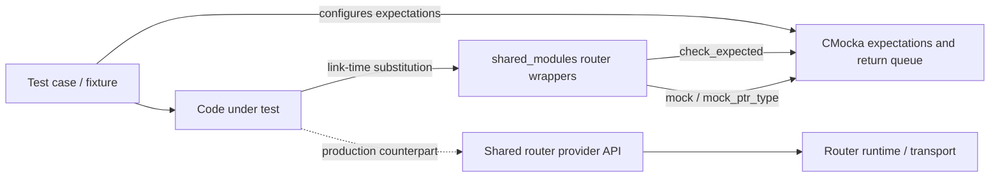
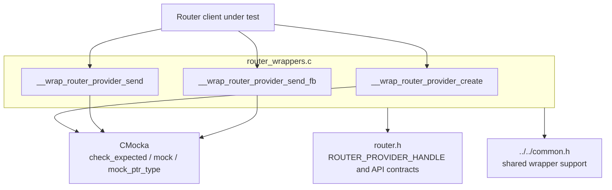
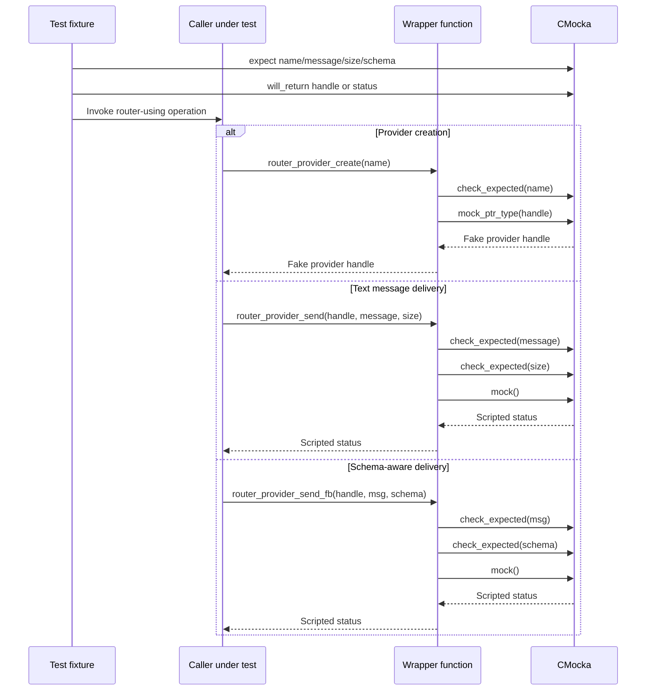
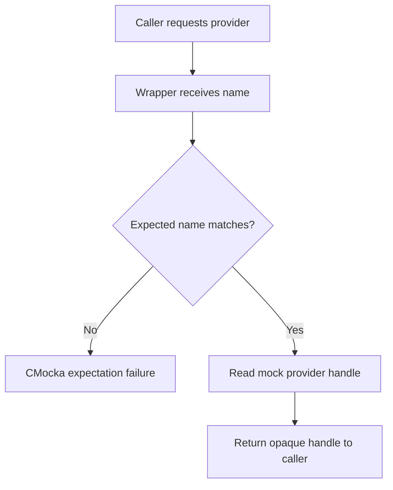
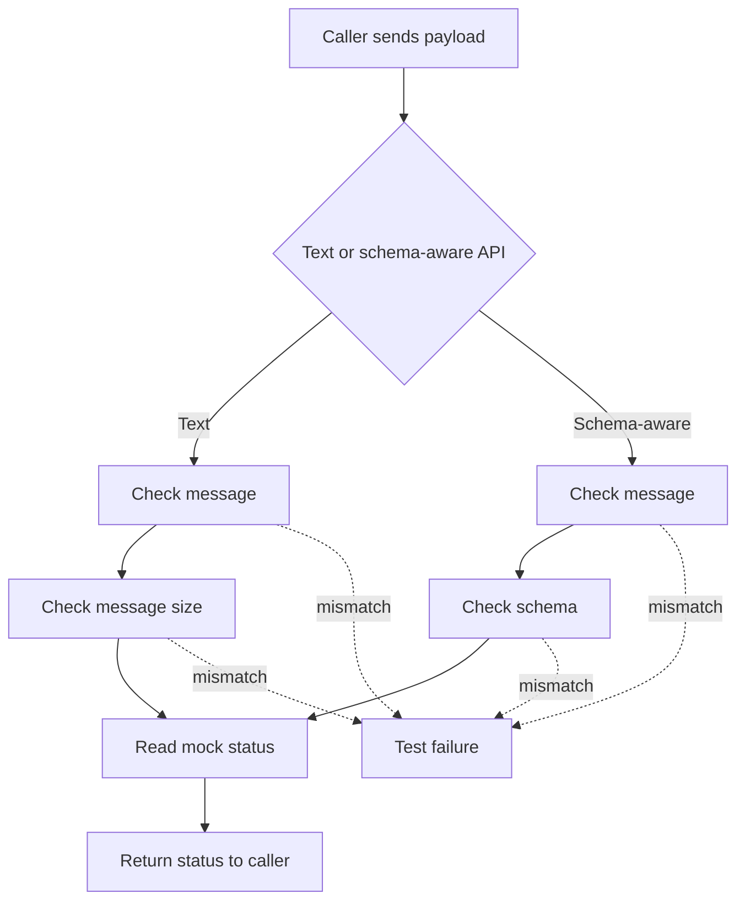
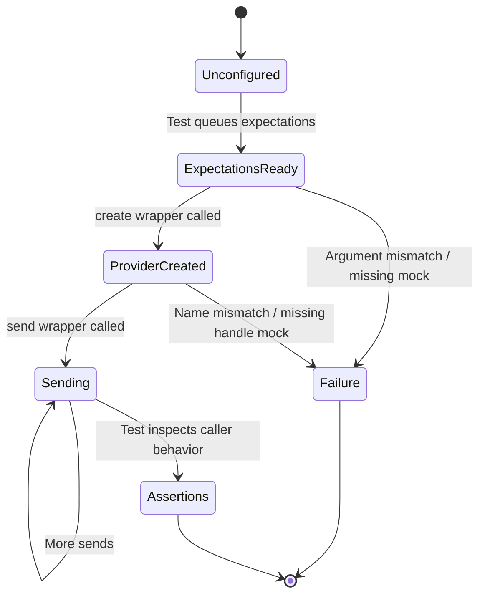

# Shared modules unit-test wrappers

`shared_modules_wrappers` is a narrow CMocka adapter for the Wazuh shared router module. It replaces the router provider’s creation and message-delivery functions during unit tests, allowing tests to verify arguments and prescribe return values without opening router connections or starting the production router runtime.

The module contains one source file, [`src/unit_tests/wrappers/wazuh/shared_modules/router_wrappers.c`](src/unit_tests/wrappers/wazuh/shared_modules/router_wrappers.c). It belongs to the broader wrapper and mock layer documented in [`wrappers_common.md`](wrappers_common.md), while the production router API and its runtime responsibilities are described in [`Router.md`](Router.md) and [`router_core.md`](router_core.md).

## Purpose and scope

The wrapper isolates callers from the shared router provider boundary:

- `__wrap_router_provider_create()` checks the provider name and returns a CMocka-controlled provider handle.
- `__wrap_router_provider_send()` checks a text message and its byte count, then returns a CMocka-controlled integer.
- `__wrap_router_provider_send_fb()` checks a message and schema identifier, then returns a CMocka-controlled integer.

These functions are test seams, not alternate router implementations. They do not allocate providers, serialize messages, validate schemas, send data, or manage router lifecycle. Their role is to make those production effects observable and controllable at the unit-test boundary.

## Position in the system



In a production binary, callers resolve against the router provider API from the shared router implementation. In a wrapper-enabled test binary, the linker redirects those calls to the `__wrap_` functions. This keeps the test focused on the caller’s behavior while the actual routing and transport path remains outside the unit under test.

## Architecture



### Source-level dependencies

| Dependency | Use in this module |
|---|---|
| `../../common.h` | Imports common wrapper/test declarations used by the unit-test wrapper tree. |
| `<stddef.h>`, `<stdarg.h>`, `<setjmp.h>` | Standard definitions required by the CMocka test interface and compilation environment. |
| `<cmocka.h>` | Supplies `check_expected()`, `mock()`, and `mock_ptr_type()`. |
| `router.h` | Supplies `ROUTER_PROVIDER_HANDLE` and the router-provider API types/contracts. |

The wrapper has no direct dependency on sockets, threads, databases, files, or the router daemon. Those concerns belong to the production router and its other test seams; see [`router_pubsub.md`](router_pubsub.md) for the router’s publication/subscription concepts.

## Wrapped interfaces

### `__wrap_router_provider_create`

```c
ROUTER_PROVIDER_HANDLE __wrap_router_provider_create(const char* name);
```

The wrapper performs two operations:

1. `check_expected(name)` verifies that the caller requested the expected provider name.
2. `mock_ptr_type(ROUTER_PROVIDER_HANDLE)` returns the next configured handle from CMocka.

The input string is not copied or interpreted. The returned handle is also not initialized or released by this file; ownership and cleanup remain the responsibility of the test fixture or the code under test, according to the production API contract.

### `__wrap_router_provider_send`

```c
int __wrap_router_provider_send(
    ROUTER_PROVIDER_HANDLE handle,
    const char* message,
    unsigned int message_size);
```

The provider handle is explicitly marked unused. The wrapper verifies `message` and `message_size`, then returns `mock()`. The handle is intentionally not checked, so these tests validate the payload contract rather than a particular opaque handle value.

### `__wrap_router_provider_send_fb`

```c
int __wrap_router_provider_send_fb(
    ROUTER_PROVIDER_HANDLE handle,
    const char* msg,
    const char* schema);
```

This is the schema-aware delivery seam. It verifies both the serialized message (`msg`) and schema identifier (`schema`) before returning `mock()`. As with the text-send wrapper, the provider handle is unused and no FlatBuffers encoding or schema validation occurs here.

## Component interaction



The order of `check_expected()` calls matters: CMocka evaluates each expected argument at the point the wrapper receives it. A mismatch causes the test to fail through CMocka rather than being converted into a router error code.

## Data flow

```mermaid
flowchart TD
    Name[Provider name] --> Create[Create wrapper]
    Create --> NameCheck[check_expected(name)]
    NameCheck --> Handle[Mock provider handle]
    Create --> Handle

    Text[Text message] --> Send[Send wrapper]
    Size[Message size] --> Send
    Send --> TextCheck[check_expected(message)]
    Send --> SizeCheck[check_expected(message_size)]
    TextCheck --> Status1[Mock status]
    SizeCheck --> Status1

    FBMessage[Schema-aware message] --> SendFB[FlatBuffer send wrapper]
    Schema[Schema name] --> SendFB
    SendFB --> MessageCheck[check_expected(msg)]
    SendFB --> SchemaCheck[check_expected(schema)]
    MessageCheck --> Status2[Mock status]
    SchemaCheck --> Status2

    Handle --> Caller[Caller assertions / control flow]
    Status1 --> Caller
    Status2 --> Caller
```

There is no transformation in the wrapper. Pointers and the message-size integer flow only into expectation checks; return values flow back from CMocka unchanged. This makes the seam suitable for success, failure, retry, and initialization-path tests.

## Process flows

### Provider initialization



### Message delivery



## Test configuration contract

Tests using these wrappers generally configure expectations before invoking the code under test:

```c
expect_string(__wrap_router_provider_create, name, "agent-events");
will_return(__wrap_router_provider_create, fake_handle);

expect_string(__wrap_router_provider_send, message, payload);
expect_value(__wrap_router_provider_send, message_size, payload_size);
will_return(__wrap_router_provider_send, 0);
```

For schema-aware delivery, the fixture should provide expectations for both `msg` and `schema`, then queue the desired integer return value. Exact macro forms depend on whether the test compares pointer identity, string content, or scalar values; the wrapper itself only requires that matching CMocka expectations exist.

The functions use CMocka’s `mock()` mechanism rather than hard-coded success. Tests can therefore model a provider creation failure, a send failure, or a sequence of different statuses across repeated calls. The provider creation path uses `mock_ptr_type()` because the API returns an opaque pointer-like handle.

## Failure and lifecycle behavior

- Unexpected provider names or payload arguments fail immediately through CMocka’s expectation mechanism.
- Missing return values are a test setup error and follow CMocka’s mock-queue behavior.
- The wrapper does not inspect `handle`, so invalid-handle behavior must be tested in the production router or with a more targeted seam.
- No provider handle is allocated, registered, disconnected, or freed by this module.
- No message is copied, encoded, decoded, sent, or persisted.
- The wrapper has no global mutable state and no teardown routine.



## Relationship to neighboring modules

The wrapper is part of the Wazuh unit-test wrapper hierarchy, but it is specific to the C++ shared-modules router boundary:

- [`Shared Modules Infrastructure (C++)`](Shared_Modules_Infrastructure_(C++).md) describes the production shared modules that provide reusable router, database, synchronization, and utility services.
- [`Router.md`](Router.md) documents the overall router module and its public role.
- [`router_core.md`](router_core.md) covers the production router core and lifecycle entry points.
- [`router_pubsub.md`](router_pubsub.md) covers publisher/subscriber behavior used by router clients.
- [`wrappers_common.md`](wrappers_common.md) describes common CMocka wrapper conventions and shared test controls.
- The other `wrappers_*.md` documents cover platform, libc, external-library, and Wazuh subsystem seams; this module should remain focused on router-provider calls.

The current module is intentionally small because detailed routing behavior belongs in the production router documentation and detailed fixture behavior belongs in the consuming test-suite documentation.

## Source reference

| File | Symbols |
|---|---|
| `src/unit_tests/wrappers/wazuh/shared_modules/router_wrappers.c` | `__wrap_router_provider_create`, `__wrap_router_provider_send`, `__wrap_router_provider_send_fb` |
