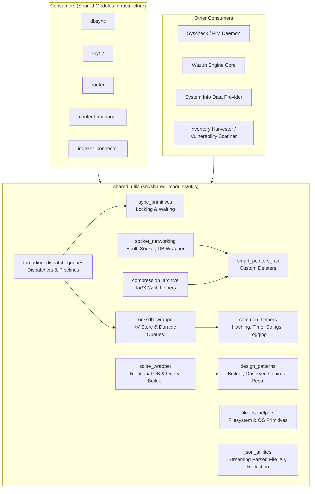
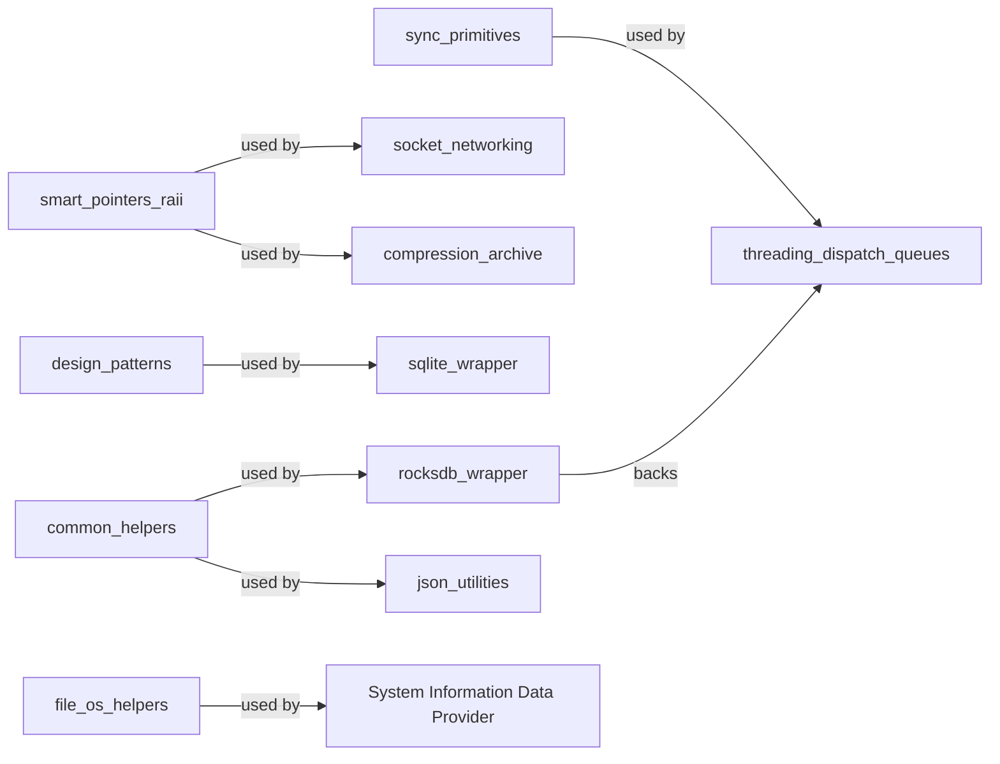
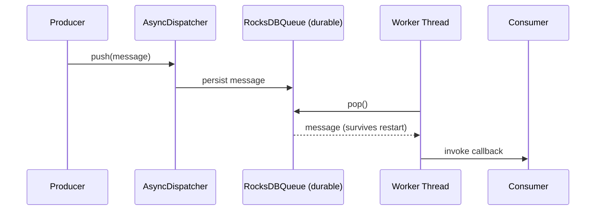

# `shared_utils` Module Overview

## Purpose

The `shared_utils` module (located at `src/shared_modules/utils/`) is a foundational, header-only C++ utility library that underpins the entire **Shared Modules Infrastructure** of Wazuh. It provides generic, reusable, dependency-light building blocks — synchronization primitives, RAII/smart-pointer helpers, design-pattern implementations, socket/networking wrappers, filesystem and OS abstractions, JSON utilities, threading/dispatch queues, embedded database wrappers (RocksDB and SQLite), compression helpers, and common miscellaneous utilities (hashing, time formatting, string manipulation, logging).

This module does not implement business logic itself. Instead, it acts as the common toolbox consumed by higher-level shared modules such as `dbsync`, `rsync`, `router`, `content_manager`, `indexer_connector`, and `keystore`, as well as by native daemons (`syscheckd`, `wazuh_db`), the Wazuh Engine, and the System Information Data Provider. Its goal is to eliminate duplicated low-level code across the C++ codebase while ensuring consistent behavior, thread-safety, and testability (via dependency-injectable abstractions over OS primitives).

## Architecture

The module is organized into eleven cohesive, largely independent sub-modules, each addressing a specific cross-cutting concern:

### Design Principles

- **Header-only, minimal footprint**: Most components compile directly into consumers, avoiding a dedicated linkable library.
- **RAII everywhere**: Locking, deleters, database transactions, and archive handling all rely on scope-based resource management to guarantee cleanup, even on exceptions.
- **Testability via abstraction**: OS/network/database calls are wrapped behind small interfaces or template parameters, enabling mocking in unit tests.
- **Composable primitives**: Higher-level constructs (e.g., persistent dispatch queues) are built by combining lower-level ones (e.g., RocksDB queues + thread dispatchers).

## Sub-Module Breakdown

| Sub-Module | Responsibility |
|---|---|
| **sync_primitives** | Locking (`ILocking`, `SharedLocking`, `ExclusiveLocking`), waiting (`IWait`, `PromiseWaiting`, `BusyWaiting`), condition synchronization (`ConditionSync`), and a factory (`PromiseFactory`) for selecting wait strategies. |
| **smart_pointers_raii** | Generic (`CustomDeleter`) and specific RAII deleters (`CJsonSmartDeleter`, `FileSmartDeleter`, `DirSmartDeleter`, `IfAddressSmartDeleter`), plus `UniqueFD` for file descriptors and a C++11 `make_unique` polyfill. |
| **design_patterns** | Reusable pattern implementations: `Builder`, Chain-of-Responsibility (`Handler`/`AbstractHandler`), Observer/Pub-Sub (`Subject`, `Observer`, `Subscriber`, `Provider`), and `RoundRobinSelector`. |
| **compression_archive** | TAR extraction (`ArchiveHelper`), XZ compression pipeline (`Wrapper`, `IDataProvider`, `VectorDataProvider/Collector`, `XzHelper`), and GZIP/ZIP decompression (`ZlibHelper`). |
| **socket_networking** | Epoll wrapper, socket abstraction with pluggable framing protocols, `SocketClient`/`SocketServer` runtimes, and `SocketDBWrapper` for querying `wazuh-db`. |
| **file_os_helpers** | Cross-platform file/filesystem helpers (`FileIO`, `RealFileSystemT`, `findHomeDirectory`) and mockable OS primitives (`OSPrimitives`, `OsPrimitivesMac`, Linux/Windows-specific helpers). |
| **json_utilities** | Streaming SAX-based array parser (`JsonSaxArrayParser`), generic file I/O (`JsonIO`), and compile-time reflective JSON serialization (`REFLECTABLE`, `serializeToJSON`). |
| **threading_dispatch_queues** | Synchronous/asynchronous dispatchers (`SyncDispatcher`, `AsyncDispatcher`), thread-safe queues (`TSafeQueue`, `TSafeMultiQueue`), message routing/filtering dispatchers, and pipeline composition primitives. |
| **rocksdb_wrapper** | Core KV wrapper (`TRocksDBWrapper`, `RocksDBTransaction`, `ColumnFamilyRAII`), durable queue abstractions (`RocksDBQueue`, `RocksDBQueueCF`), and shared memory budget management (`RocksDBSharedBuffers`). |
| **sqlite_wrapper** | Modern RAII SQLite wrapper (`SQLite::Connection`/`Statement`), interface-based/testable wrapper (`IConnection`, `IStatement`, `ITransaction`), and the `WazuhDBQueryBuilder` fluent query builder. |
| **common_helpers** | Byte/numeric conversions, string manipulation, time/date formatting, hashing (`HashData`, OpenSSL primitives), LRU caching, singleton pattern, thread-safe map, "defer" RAII utility, and a pluggable logging facade. |

## Data Flow Example: Persistent Message Dispatch

This illustrates how `threading_dispatch_queues` and `rocksdb_wrapper` compose to provide crash-resilient message processing, a pattern used by `content_manager` and `router`.

## References to Core Components Documentation

- [Sync Primitives](sync_primitives.md)
- [Compression & Archive Utilities](compression_archive.md)
- [Smart Pointers & RAII Utilities](smart_pointers_raii.md)
- [Design Patterns Module](design_patterns.md)
- [Socket Networking](socket_networking.md)
- [File & OS Helpers Module](file_os_helpers.md)
- [JSON Utilities](json_utilities.md)
- [Threading & Dispatch Queues Module](threading_dispatch_queues.md)
- [RocksDB Wrapper Module](rocksdb_wrapper.md)
- [SQLite Wrapper Module](sqlite_wrapper.md)
- [Common Helpers](common_helpers.md)