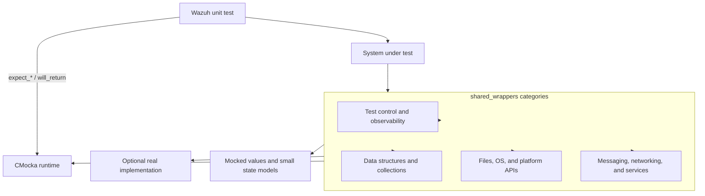
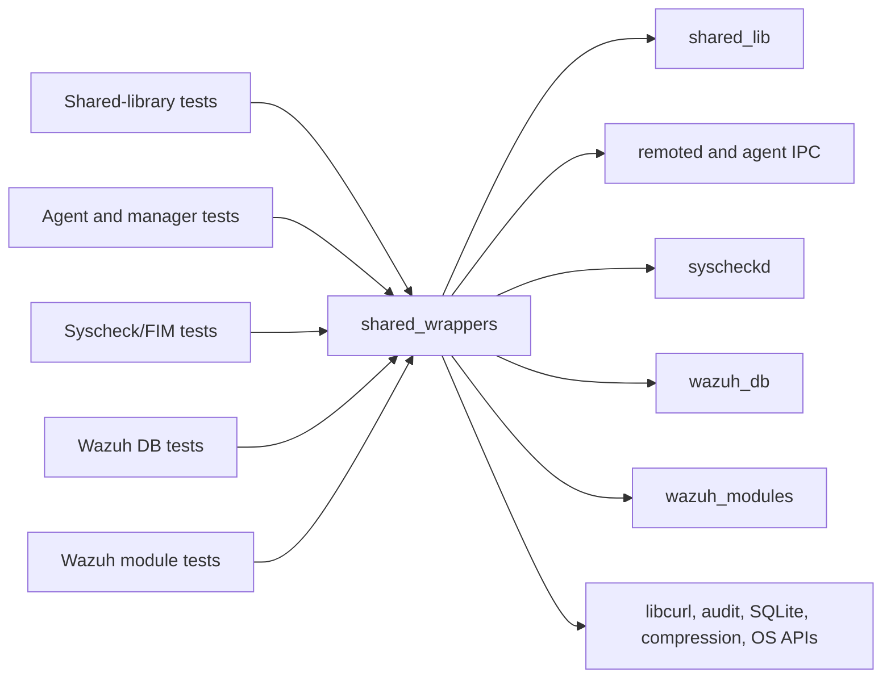
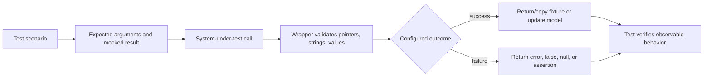

# `shared_wrappers`

`shared_wrappers` is the CMocka link-time test seam for Wazuh’s shared C library and common service boundaries. It replaces filesystem, networking, IPC, collection, time, logging, platform, and system APIs with controllable functions so unit tests can assert inputs, inject return values, simulate failures, and avoid host or daemon side effects.

The module is under `src/unit_tests/wrappers/wazuh/shared/`. It is consumed by tests across the agent, manager, remoted, syscheck, Wazuh DB, and Wazuh modules codebases. The wrappers are test infrastructure rather than runtime functionality.

## Architecture overview

The central pattern is:

1. A test registers expected arguments and return values with CMocka.
2. Production code calls a wrapped symbol as if it were calling the real dependency.
3. The wrapper checks arguments and returns the configured result, optionally copying mocked data or updating a minimal state model.
4. Tests assert the caller’s behavior and resource cleanup.

## Sub-module documentation

| Sub-module | Scope |
|---|---|
| [Test control and observability](shared_wrappers_test_control.md) | Atomic operations, logging, cluster role checks, threads, locks, time, scheduling, randomness, and dynamic-library seams. |
| [Data structures and collections](shared_wrappers_data_structures.md) | Hash maps, queues, indexed queues, lists, vectors, and labels, including controlled state mutation and cleanup. |
| [Files, OS, and platform APIs](shared_wrappers_io_platform.md) | Filesystem, JSON, process, privileges, system information, validation, UTF-8, and Windows API boundaries. |
| [Messaging, networking, and service boundaries](shared_wrappers_messaging_services.md) | Agent/remoted operations, MQ, audit, rootcheck, HTTP/libcurl, notifications, and cluster-facing calls. |

## Component inventory

### Control and observability

- `atomic_wrappers.c`: atomic get/set/inc/dec.
- `debug_op_wrappers.c`: formatted tagged and untagged logs, error assertions, chroot state, and Windows error text.
- `cluster_op_wrappers.c`: worker and single-node detection.
- `pthreads_op_wrappers.c`: non-starting thread creation.
- `rwlock_op_wrappers.c`: lock lifecycle notifications.
- `randombytes_wrappers.c`: random result injection.
- `time_op_wrappers.c`, `time_op_wrappers.h`: simulated time and time conversion.
- `schedule_scan_wrappers.c`: scheduler parse/dump/next-run seams.
- `sym_load_wrappers.c`: dynamic-library handle and symbol seams.

See [shared_wrappers_test_control.md](shared_wrappers_test_control.md) for behavior and test semantics.

### Data structures and collections

- `hash_op_wrappers.c`: hash map lifecycle, lookup, mutation, iteration, and cleanup callbacks; includes a real auxiliary map for stateful tests.
- `queue_op_wrappers.c`, `queue_op_wrappers.h`: ring queue push/pop/full behavior.
- `bqueue_op_wrappers.c`: byte queue push/peek/drop/clear/usage behavior.
- `indexed_queue_op_wrappers.c`, `indexed_queue_op_wrappers.h`: keyed queue lifecycle and operations.
- `list_op_wrappers.c`: list add, traversal, deletion, and destruction.
- `vector_op_wrappers.c`: unique insertion and length.
- `labels_op_wrappers.c`: label lookup, value lookup, and real cleanup.

See [shared_wrappers_data_structures.md](shared_wrappers_data_structures.md).

### Files, OS, and platform

- `file_op_wrappers.c`: path, file, directory, archive, compression, temporary-file, merge, and content operations.
- `fs_op_wrappers.c`: filesystem capability checks.
- `json_op_wrappers.c`, `json_queue_wrappers.c`: JSON persistence and queue reads.
- `exec_op_wrappers.c`, `binaries_op_wrappers.c`: process pipes and binary discovery.
- `privsep_op_wrappers.c`: user/group and privilege separation.
- `syscheck_op_wrappers.c`: file attributes, ACLs, permissions, registry, and account helpers.
- `sysinfo_utils_wrappers.c`: OS/process inventory helpers.
- `validate_op_wrappers.c`, `utf8_op_wrappers.c`: IP/configuration and UTF-8 validation.
- `utf8_winapi_wrapper_wrappers.c`, `utf8_winapi_wrapper_wrappers.h`: Windows conversions, file APIs, metadata, and security descriptors.

See [shared_wrappers_io_platform.md](shared_wrappers_io_platform.md).

### Messaging, networking, and services

- `agent_op_wrappers.c`: authentication, agent registration, remoted connectivity, clustered payloads, and socket address inspection.
- `auth_client_wrappers.c`: authentication-client agent removal.
- `mq_op_wrappers.c`: queue startup and message sending.
- `read-agents_wrappers.c`: remoted connection and agent command sending.
- `rootcheck_op_wrappers.c`: rootcheck log submission.
- `audit_op_wrappers.c`: audit rule and audit database operations.
- `url_wrappers.c`, `url_wrappers.h`: Wazuh URL and libcurl lifecycle.
- `notify_op_wrappers.c`: non-Windows notification registration.

See [shared_wrappers_messaging_services.md](shared_wrappers_messaging_services.md).

## Dependency relationships

The wider test tree groups this module with sibling wrapper families such as `remoted_wrappers`, `wazuh_db_wrappers`, `syscheckd_wrappers`, `wazuh_modules_wrappers`, and `shared_modules_wrappers`. Those families mock subsystem-specific functions; `shared_wrappers` supplies the lower-level dependencies they commonly transitively use. The module therefore sits below many tests and above external libraries and operating-system facilities.

## Data and failure flow

Common failure scenarios include unavailable files or binaries, invalid paths and IPs, full queues, failed IPC, failed HTTP/libcurl operations, missing users/groups, audit errors, allocation-like null returns, unsupported platform operations, and timeouts. Several wrappers deliberately copy response data into caller buffers so parsing and error-handling code can be tested as if a real service responded.

## Design and maintenance guidance

- Keep wrappers deterministic. Use CMocka for behavior and preserve only the smallest state needed by the caller.
- Check the same inputs that define the boundary contract. Use string checks for serialized payloads and pointer checks for opaque handles/structures.
- Make ownership visible. If a wrapper allocates or copies a mocked string/structure, document who frees it; if it performs cleanup, retain the production ownership behavior.
- Respect `test_mode` and platform guards. Some wrappers delegate to real implementations outside test mode, while Windows-only and Unix-only seams are conditionally compiled.
- Treat buffer writes as part of the test contract. Fixtures for response, ACL, file, and socket buffers must be writable and large enough.
- Keep helper expectation functions beside their wrapper when they encode a repeated protocol or filesystem setup.

## Relationship to sibling documentation

Subsystem-specific wrapper behavior belongs in the corresponding module documentation—such as syscheckd, Wazuh DB, remoted, or Wazuh modules—rather than being duplicated here. This document describes only the shared dependency seams and their architectural role.

