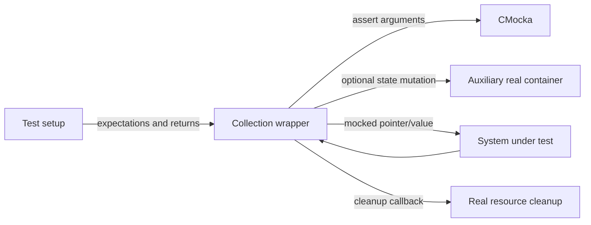

# Shared wrappers: data structures and collections

These wrappers isolate the containers used by Wazuh daemons and modules. They can either return a configured result or perform a small in-memory state update, allowing tests to cover success, capacity, lookup, and cleanup paths.

## Covered components

### Hash maps — `hash_op_wrappers.c`

The wrapper layer covers creation, insertion, update, lookup, deletion, iteration, size configuration, element counting, and free-data callbacks. In test mode, calls assert the supplied map and keys and consume CMocka values. `mock_hashmap` is a real auxiliary map used to retain enough state for tests that need insertion/update/delete side effects; setup and teardown create and release it through the real hash implementation.

Several functions delegate to the real implementation when `test_mode` is disabled. This makes the same wrapper usable in focused unit tests and broader integration-style tests.

### Queues — `queue_op_wrappers.c`, `bqueue_op_wrappers.c`

- `w_queue_t` wrappers model push/pop and timed pop by changing ring-buffer indices and element counts when the mocked result indicates success.
- `bqueue_t` wrappers validate queue, payload, length, and flags, while returning mocked capacity, peek, drop, and push results. A successful peek can copy mocked bytes into the caller buffer.

### Indexed queues — `indexed_queue_op_wrappers.c`

Initialization, free, push, upsert, get, pop, timed pop, delete, and update are all controllable. Pointer arguments are checked explicitly, including `struct timespec` for timed operations.

### Lists and vectors — `list_op_wrappers.c`, `vector_op_wrappers.c`

List add, first-node lookup, node deletion, and destruction are intercepted. List destruction delegates to the real implementation outside test mode. Vector insertion and length are mocked for uniqueness and sizing decisions.

### Labels — `labels_op_wrappers.c`

Label lookup and key retrieval are mock-driven. `labels_free` performs real cleanup of the null-terminated key/value array, preserving ownership behavior needed by callers.

## Data-flow model

## Maintenance notes

The small state mutations are intentional: they make callers observe realistic queue indexes or hash entries without coupling the test to the complete production implementation. New wrappers should follow the same rule—mock the boundary, preserve only the minimum state needed by the caller, and make ownership explicit.

