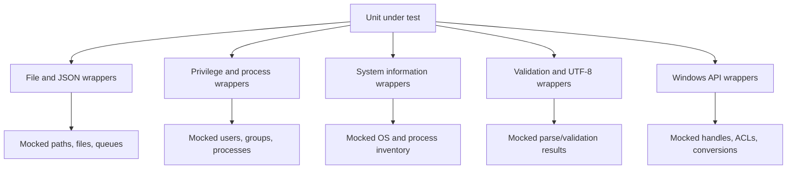

# Shared wrappers: files, operating system, and platform APIs

This sub-module replaces filesystem, archive, process, privilege, system-information, validation, and platform-specific APIs. It is the main portability seam for unit tests that otherwise depend on disk state, kernel facilities, Windows security APIs, or host metadata.

## Filesystem and JSON

`file_op_wrappers.c` controls path canonicalization, path type, file/directory/link/socket checks, file sizes, timestamps, directory operations, temporary files, rename/move/copy, compression, uncompression, file seeking, merged-file handling, binary checks, and file content. Helper functions such as `expect_abspath`, `expect_rename_ex`, `expect_mkdir_ex`, and `expect_wfopen` standardize common expectations. `wfopen` delegates to the real function outside `test_mode`.

`fs_op_wrappers.c` controls filesystem-type checks. `json_op_wrappers.c` and `json_queue_wrappers.c` isolate JSON file reads/writes and JSON queue iteration.

## System and security APIs

- `syscheck_op_wrappers.c` controls Windows ACL decoding, target deletion, user/group lookup, directory existence, file attributes and permissions, registry permissions, and removal of empty folders. Windows and Unix signatures are selected with `WIN32`.
- `privsep_op_wrappers.c` controls privilege-separated user/group lookup and can copy mocked `struct group` and buffer data into caller-owned storage.
- `sysinfo_utils_wrappers.c` controls system-info initialization, teardown, process enumeration, OS data, child PIDs, and OS codename. It delegates to production helpers outside test mode.
- `validate_op_wrappers.c` controls IP validation/conversion and integer configuration lookups. The two SCA-related configuration keys have stable defaults so tests do not depend on host configuration.
- `utf8_op_wrappers.c` controls UTF-8 validation.
- `utf8_winapi_wrapper_wrappers.c` controls UTF-8/Unicode conversion, file operations, file metadata, and Windows security descriptors. The entire implementation is compiled only on Windows.

## Process, privileges, and dynamic libraries

`exec_op_wrappers.c` controls process pipe open/close operations. `binaries_op_wrappers.c` controls executable path resolution. `sym_load_wrappers.c` controls dynamic library handles and symbols. These seams let tests cover missing binaries, load failures, and cleanup without invoking host processes or shared libraries.

## Platform-aware data flow

## Portability rules

Platform guards are part of the contract. Unix-only wrappers must not leak into Windows builds, and Windows wrappers must not be required by Unix tests. When a wrapper copies a structure (`_stat64`, ACL, security descriptor, or group data), test fixtures must match the platform ABI.

