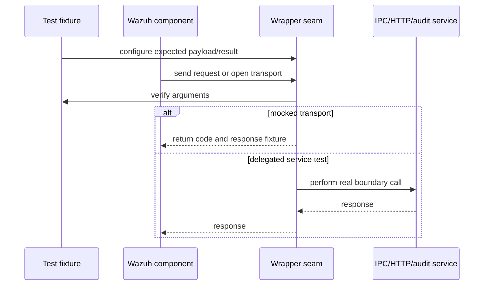

# Shared wrappers: messaging, networking, and service boundaries

These wrappers isolate Wazuh IPC, agent control, audit, rootcheck, HTTP, and service-facing operations. They allow tests to assert protocol payloads and simulate transport failures without connecting to daemons or external services.

## Components

| Source | Boundary modeled |
|---|---|
| `agent_op_wrappers.c` | Authentication connection, controller connectivity, agent lookup/registration, clustered messages, and socket address inspection. Clustered responses are copied into caller buffers. |
| `auth_client_wrappers.c` | Agent removal through the authentication client, validating the requested agent ID. |
| `mq_op_wrappers.c` | Queue startup and message sending, including predicate callbacks. Expectation helpers cover path, queue type, payload, location, and return code. |
| `read-agents_wrappers.c` | Connection to remoted and sending commands to an agent. |
| `rootcheck_op_wrappers.c` | Rootcheck log submission, including response-buffer population. |
| `audit_op_wrappers.c` | Audit rule add/delete/search, rule-list retrieval, restart, and database consistency. |
| `url_wrappers.c` | Wazuh URL requests and the lower-level libcurl lifecycle: init, options, perform, response inspection, header lists, cleanup, and response release. |
| `notify_op_wrappers.c` | Notification registration and modification on non-Windows platforms. |
| `cluster_op_wrappers.c` | Cluster role decisions used by service routing. |

## Request path

## Behavioral details

- CMocka `check_expected` calls distinguish payload content from pointer identity where appropriate. This is important for serialized JSON and protocol strings.
- `url_wrappers.c` validates every configured HTTP header and transport option, including TLS verification, credentials, payload, maximum size, and timeout.
- Buffer-writing wrappers (`w_send_clustered_message`, `send_rootcheck_log`, and HTTP response seams) require the test fixture to provide writable storage of sufficient size.
- Audit consistency returns a fixed success value because the test seam is intended to bypass database/kernel setup; rule operations remain mock-configurable.

