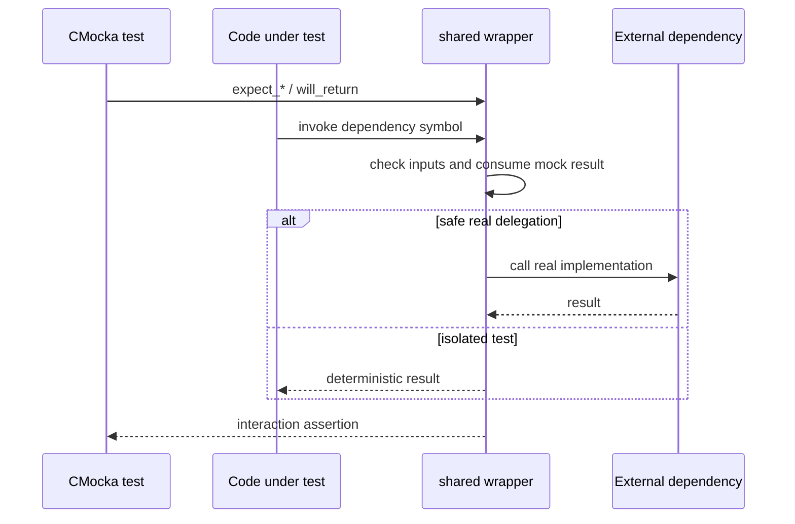

# Shared wrappers: test control and observability

This sub-module contains CMocka replacements for control-flow and observability dependencies. The wrappers make external behavior deterministic and let tests verify calls without starting daemons, creating threads, or writing production logs.

## Responsibilities

| Source | Wrapped behavior |
|---|---|
| `atomic_wrappers.c` | Atomic get, set, increment, and decrement. Pointer identity is checked; reads and updates are returned through CMocka. |
| `debug_op_wrappers.c` | Untagged and tagged debug, info, warning, and error logging. Variadic messages are formatted with `vsnprintf` before assertions. `merror_exit` also becomes a CMocka assertion. `isChroot` and Windows error text are mocked. |
| `cluster_op_wrappers.c` | Single-node and worker-role detection, including the output worker flag. |
| `pthreads_op_wrappers.c` | Thread creation; it returns success without starting a thread. |
| `rwlock_op_wrappers.c` | Read-lock, write-lock, and unlock events through `function_called()`. |
| `randombytes_wrappers.c` | Randomness result injection. |
| `time_op_wrappers.c` | Time reads, elapsed-time results, timestamps, sleeps, delays, and Windows file-time conversion. `current_time` provides a simulated clock. |
| `schedule_scan_wrappers.c` | Schedule parsing, serialization, and next-run calculation. |
| `sym_load_wrappers.c` | Shared-library handle, symbol lookup, and unload operations. In non-test mode, selected calls delegate to the real implementation. |

## Interaction pattern

Most wrappers use `check_expected*()` for inputs and `mock()`/`mock_type()` for outputs. A few wrappers deliberately preserve enough behavior to exercise state transitions: queue-like time advances update `current_time`, while thread creation and lock operations only report the interaction.

## Important testing semantics

- Variadic logging is asserted after formatting, so tests verify the final rendered message rather than format arguments.
- `test_mode` controls whether several wrappers use CMocka or delegate to production code.
- Wrappers that copy mocked buffers or strings (`getsockname`, clustered responses, file content, ACLs, and HTTP responses) assume the test supplied a compatible destination and lifetime.
- The wrappers are link-time seams, not production services; they should remain behaviorally small and predictable.

