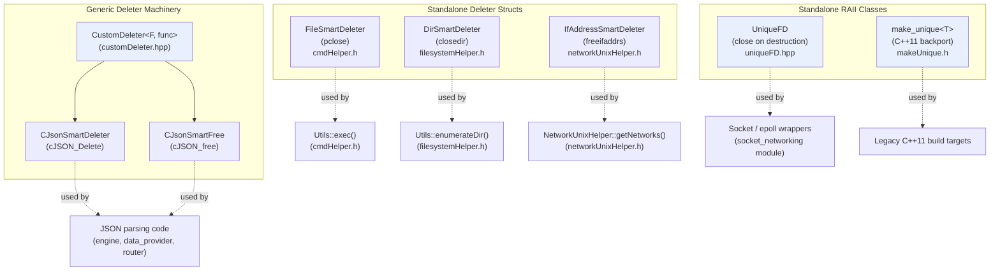
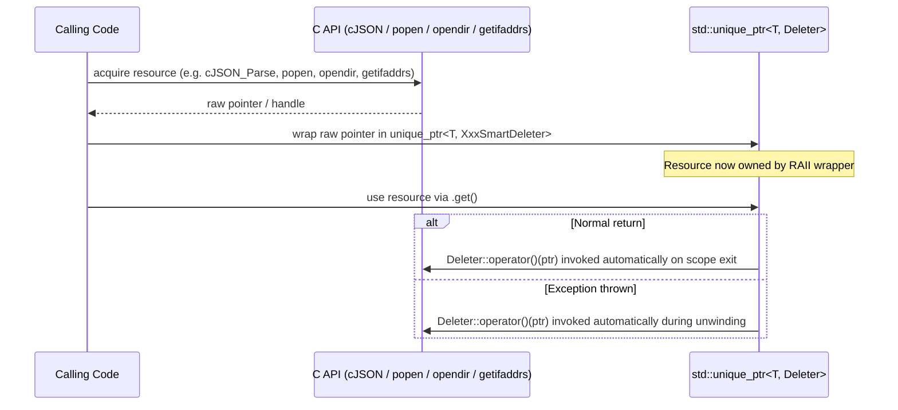

# Smart Pointers & RAII Utilities

## 1. Purpose

The **Smart Pointers & RAII** module is a small, foundational collection of C++ header-only
utilities that live under `src/shared_modules/utils/`. It provides reusable **RAII (Resource
Acquisition Is Initialization)** wrappers and **custom deleters** that let the rest of the Wazuh
C++ codebase manage low-level, C-style resources (raw `FILE*` handles, `DIR*` streams,
`ifaddrs*` linked lists, `cJSON*` objects and raw file descriptors) safely through
`std::unique_ptr` and dedicated wrapper classes, instead of relying on manual `free`/`close`/`delete`
calls.

This module does not implement any business logic; it is a **cross-cutting infrastructure
building block** consumed throughout the C++ side of Wazuh — from the
[System Information Data Provider](System_Information_Data_Provider_(C++).md),
the [Wazuh Engine Core](Wazuh_Engine_Core_(C++).md), the
[Syscheck / FIM Daemon](Syscheck___FIM_Daemon_(C_C++).md), and the
[Shared Modules Infrastructure](Shared_Modules_Infrastructure_(C++).md) (`dbsync`, `rsync`,
`router`, `content_manager`, etc.) — anywhere a C API returns a resource that must be released
deterministically, including on exception unwinding.

Because every header in this module is self-contained and extremely small, the module is
documented as a single, cohesive unit rather than being split into sub-modules.

## 2. Architecture Overview

The module is composed of two complementary families of utilities:

1. **Generic deleter machinery** — a minimal template (`CustomDeleter`) that adapts any C
   free-function (e.g. `cJSON_Delete`, `pclose`, `closedir`, `freeifaddrs`) into a *functor* that
   can be plugged as the second template argument of `std::unique_ptr<T, Deleter>`.
2. **Standalone RAII wrapper classes** — `UniqueFD` (file descriptors) and the C++11
   `make_unique` backport, which do not rely on `std::unique_ptr` custom-deleter syntax but
   provide the same "acquire once, release automatically" guarantee.



### Design rationale

* **Zero-overhead adaptation**: `CustomDeleter` is a stateless functor template instantiated at
  compile time with a function *pointer as a template argument* (`F func`), so calling the
  deleter compiles down to a direct call of the underlying C function — no virtual dispatch, no
  `std::function` overhead.
* **Composable with `std::unique_ptr`**: Every deleter in this module (`CJsonSmartDeleter`,
  `CJsonSmartFree`, `FileSmartDeleter`, `DirSmartDeleter`, `IfAddressSmartDeleter`) is designed to
  be used as `std::unique_ptr<T, Deleter>`, giving automatic, exception-safe cleanup.
* **Encapsulation over inheritance**: `UniqueFD` is a small hand-rolled RAII class (rather than a
  `unique_ptr` specialization) because a POSIX file descriptor is an `int`, not a pointer, so it
  needs its own move-only semantics (`release()`, `reset()`, `clear()`).
* **Backward compatibility**: `make_unique` is guarded by `#if __cplusplus < 201402L` so it only
  supplies a `std::make_unique` polyfill on toolchains compiled without C++14 support.

## 3. Core Components

### 3.1 `CustomDeleter` — Generic Deleter Template
**File:** `src/shared_modules/utils/customDeleter.hpp`

```cpp
template <typename F, F func>
struct CustomDeleter
{
    template <typename T>
    constexpr void operator()(T* arg) const
    {
        func(arg);
    }
};
```

A minimal, reusable template that turns *any* free function with the signature `void
func(T*)`-like behavior into a `unique_ptr`-compatible deleter functor. It is the foundation used
by `CJsonSmartDeleter` and `CJsonSmartFree`.

### 3.2 `CJsonSmartDeleter` / `CJsonSmartFree` — cJSON RAII Deleters
**File:** `src/shared_modules/utils/cjsonSmartDeleter.hpp`

```cpp
struct CJsonSmartFree final : CustomDeleter<decltype(&cJSON_free), cJSON_free> {};
struct CJsonSmartDeleter final : CustomDeleter<decltype(&cJSON_Delete), cJSON_Delete> {};
```

Two ready-made deleters built on top of `CustomDeleter`:
* `CJsonSmartDeleter` — invokes `cJSON_Delete`, used for `std::unique_ptr<cJSON, CJsonSmartDeleter>`
  to release a full cJSON tree.
* `CJsonSmartFree` — invokes `cJSON_free`, used to release memory allocated by cJSON's internal
  allocator (e.g., strings returned by `cJSON_Print`).

These are heavily used across JSON-producing/consuming code in the
[Wazuh Engine Core](Wazuh_Engine_Core_(C++).md) and
[System Information Data Provider](System_Information_Data_Provider_(C++).md) modules to avoid
manual `cJSON_Delete`/`free` calls.

### 3.3 `FileSmartDeleter` — Process Pipe RAII Deleter
**File:** `src/shared_modules/utils/cmdHelper.h`

```cpp
struct FileSmartDeleter
{
    void operator()(FILE* file)
    {
        pclose(file);
    }
};
```

Used internally by `Utils::exec()` (also declared in `cmdHelper.h`) to wrap the `FILE*` returned
by `popen()` in a `std::unique_ptr<FILE, FileSmartDeleter>`, guaranteeing `pclose()` is called
even if an exception is thrown while reading the command's output.

### 3.4 `DirSmartDeleter` — Directory Stream RAII Deleter
**File:** `src/shared_modules/utils/filesystemHelper.h`

```cpp
struct DirSmartDeleter
{
    void operator()(DIR* dir)
    {
        closedir(dir);
    }
};
```

Used by `Utils::enumerateDir()` (in the same header) to safely close a `DIR*` obtained from
`opendir()`, ensuring the descriptor is released as soon as directory enumeration finishes or an
exception unwinds the stack. This header also contains related filesystem helpers
(`existsDir`, `existsRegular`, `existsSocket`, `getFileContent`, `getBinaryContent`,
`resolvePath`, `getFilename`) that are part of the broader
[File & OS Helpers](file_os_helpers.md) utility group but rely on this RAII deleter for safe
directory traversal.

### 3.5 `IfAddressSmartDeleter` / `ifaddrs` — Network Interface List RAII Deleter
**File:** `src/shared_modules/utils/networkUnixHelper.h`

```cpp
struct IfAddressSmartDeleter
{
    void operator()(ifaddrs* address)
    {
        freeifaddrs(address);
    }
};
```

Pairs with `std::unique_ptr<ifaddrs, IfAddressSmartDeleter>` inside
`NetworkUnixHelper::getNetworks()` to release the linked list of interface addresses returned by
`getifaddrs()`. This helper is a dependency of network inventory logic used by the
[System Information Data Provider](System_Information_Data_Provider_(C++).md) module
(`data_provider_network` sub-modules) when enumerating Unix network interfaces.

### 3.6 `UniqueFD` — File Descriptor RAII Wrapper
**File:** `src/shared_modules/utils/uniqueFD.hpp`

```cpp
class UniqueFD
{
    public:
        explicit UniqueFD(const int fd) : m_fd(fd) { }
        ~UniqueFD() { clear(); }
        UniqueFD(const UniqueFD&) = delete;
        UniqueFD& operator=(const UniqueFD&) = delete;
        UniqueFD(UniqueFD&& other);
        UniqueFD& operator=(UniqueFD&& other);
        int release();
        int get() const;
        void reset(const int fd);
        void clear();
    private:
        int m_fd;
};
```

A move-only class analogous to `std::unique_ptr` but specialized for raw POSIX file descriptors
(which are plain `int`s and cannot be wrapped directly by `unique_ptr`). Key semantics:

| Method | Behavior |
|---|---|
| `UniqueFD(int fd)` | Takes ownership of an already-open descriptor. |
| `~UniqueFD()` | Calls `close(fd)` automatically if the descriptor is valid (`!= -1`). |
| `release()` | Relinquishes ownership, returning the raw `fd` without closing it. |
| `get()` | Read-only access to the underlying descriptor. |
| `reset(fd)` | Closes the currently owned descriptor (if any) and takes ownership of a new one. |
| `clear()` | Equivalent to `reset(-1)` — closes and invalidates. |
| Move constructor / move assignment | Transfers ownership; copy is disabled to prevent double-close bugs. |

`UniqueFD` is the RAII primitive of choice wherever raw sockets, `epoll` instances, or other
descriptor-based resources are managed in the C++ codebase (e.g., consumers in the
[socket_networking](socket_networking.md) utility group).

### 3.7 `make_unique` — C++11 `std::make_unique` Backport
**File:** `src/shared_modules/utils/makeUnique.h`

```cpp
#if __cplusplus < 201402L
namespace std
{
    template<class T> struct _Unique_if { ... };
    template<class T, class... Args>
    typename _Unique_if<T>::_Single_object make_unique(Args&& ... args);
    template<class T>
    typename _Unique_if<T>::_Unknown_bound make_unique(size_t n);
    template<class T, class... Args>
    typename _Unique_if<T>::_Known_bound make_unique(Args&& ...) = delete;
}
#endif
```

Sourced from the original N3656 proposal (the paper that introduced `std::make_unique` into
C++14). The whole block is compiled out (`#if __cplusplus < 201402L`) on any toolchain that
already ships C++14 `std::make_unique`, so it is a **conditional polyfill** rather than a
permanent addition — it exists purely for compatibility with older compiler configurations still
present in parts of the Wazuh build matrix. `_Unique_if` is the internal type-trait helper used to
select the correct overload for single objects, unknown-bound arrays, and (deleted) known-bound
arrays.

## 4. Component Interaction / Usage Flow

The typical usage pattern across the codebase follows the same shape for every deleter in this
module:



For `UniqueFD`, the same "acquire → own → auto-release" pattern applies, but ownership transfer is
explicit via `release()`/`reset()` rather than the `unique_ptr` deleter mechanism.

## 5. Relationship to Other Modules

This module is one of several utility groups that make up the parent
[Shared Modules Infrastructure](Shared_Modules_Infrastructure_(C++).md) `shared_utils` collection.
Related sibling utility groups documented separately include:

* [Design Patterns](design_patterns.md) — `Builder`, `Observer`, `Subscriber`, `Provider`,
  `RoundRobinSelector`, `AbstractHandler`/`Handler` (chain of responsibility).
* [Compression / Archive Helpers](compression_archive.md) — `ArchiveHelper`, `XzHelper`,
  `ZlibHelper`, vector-based data providers/collectors.
* [Synchronization Primitives](sync_primitives.md) — `ExclusiveLocking`, `SharedLocking`,
  `BusyWaiting`, `PromiseWaiting`, `ConditionSync`.
* [Socket / Networking Wrappers](socket_networking.md) — `Socket`, `SocketWrapper`,
  `EpollWrapper`, which frequently rely on `UniqueFD` for descriptor lifetime management.
* [File & OS Helpers](file_os_helpers.md) — `FileIO`, `RealFileSystemT`, Windows/Linux system
  helpers, which build on `DirSmartDeleter` for directory traversal.
* [JSON Utilities](json_utilities.md) — `JsonIO`, `reflectiveJson` serialization helpers, which
  complement `CJsonSmartDeleter`/`CJsonSmartFree` for cJSON tree lifetime management.
* [RocksDB Wrapper](rocksdb_wrapper.md) and [SQLite Wrapper](sqlite_wrapper.md) — higher-level
  database wrappers that apply the same RAII philosophy (e.g. `ColumnFamilyRAII`) to database
  handles, following patterns established by this module.
* [Threading & Dispatch Queues](threading_dispatch_queues.md) and
  [Common Helpers](common_helpers.md) — additional utility groups within the same
  `shared_utils` parent collection.

Consumers of these RAII primitives span nearly every C++ subsystem in the repository, including:

* [System Information Data Provider (C++)](System_Information_Data_Provider_(C++).md) — network,
  package, and OS inventory collection code uses `IfAddressSmartDeleter`, `DirSmartDeleter`, and
  `CJsonSmartDeleter` extensively.
* [Wazuh Engine Core (C++)](Wazuh_Engine_Core_(C++).md) — JSON-based configuration and event
  processing pipelines use the cJSON deleters.
* [Syscheck / FIM Daemon (C/C++)](Syscheck___FIM_Daemon_(C_C++).md) and
  [Advanced Security Modules (C++ Inventory & Vulnerability)](Advanced_Security_Modules_(C++_Inventory_&_Vulnerability).md)
  — file/registry inventory and vulnerability scanning code manage descriptors and directory
  streams via these wrappers.

## 6. Summary

| Component | File | Wraps / Manages | Release Mechanism |
|---|---|---|---|
| `CustomDeleter<F, func>` | `customDeleter.hpp` | Any C free-function | Direct call to `func` |
| `CJsonSmartDeleter` | `cjsonSmartDeleter.hpp` | `cJSON*` tree | `cJSON_Delete` |
| `CJsonSmartFree` | `cjsonSmartDeleter.hpp` | cJSON-allocated buffer | `cJSON_free` |
| `FileSmartDeleter` | `cmdHelper.h` | `FILE*` from `popen` | `pclose` |
| `DirSmartDeleter` | `filesystemHelper.h` | `DIR*` from `opendir` | `closedir` |
| `IfAddressSmartDeleter` | `networkUnixHelper.h` | `ifaddrs*` from `getifaddrs` | `freeifaddrs` |
| `UniqueFD` | `uniqueFD.hpp` | Raw POSIX file descriptor | `close` |
| `make_unique` / `_Unique_if` | `makeUnique.h` | N/A (allocation helper, C++11 polyfill) | N/A |

This module has no children/sub-modules — its seven headers are small enough to be understood and
maintained as a single cohesive unit, and are meant to be included directly wherever a
C-style resource needs deterministic, exception-safe cleanup.
