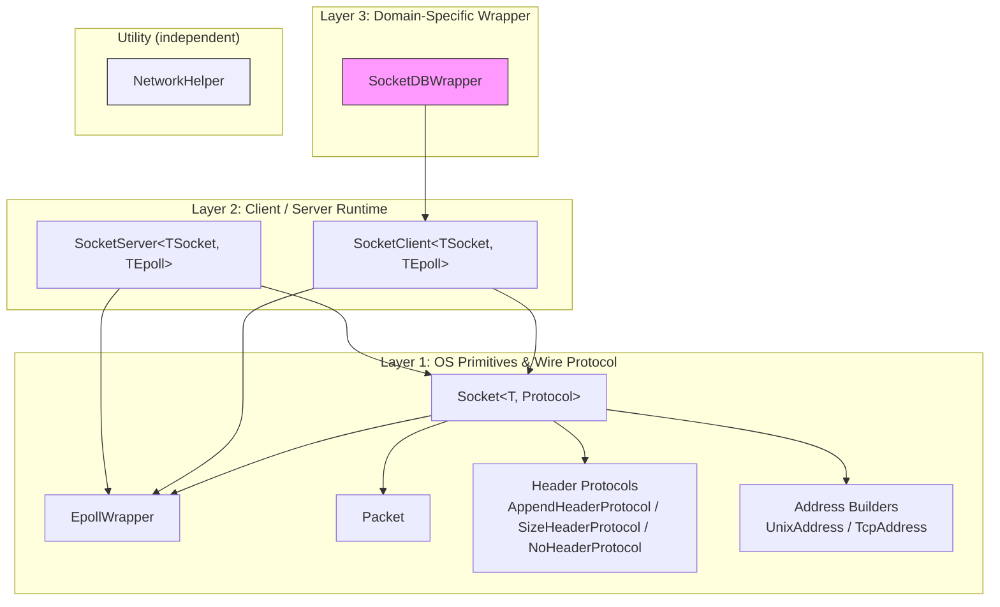
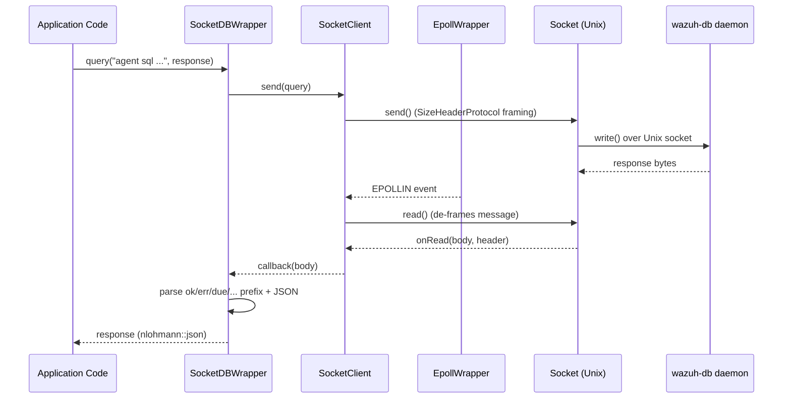

# Socket Networking

## Purpose

The `socket_networking` module is a header-only C++ library, part of Wazuh's `shared_modules/utils` collection, that provides the low-level building blocks for **inter-process communication over Unix domain and TCP sockets** used throughout the Wazuh agent, manager and shared modules (e.g. `dbsync`, `rsync`, `router`, `indexer_connector`, `content_manager`).

It abstracts away the details of:
- Linux `epoll` event-driven I/O.
- Raw socket creation, binding, listening, connecting, and buffered send/receive.
- Wire-format framing protocols (how message boundaries and optional headers are encoded on the wire).
- Asynchronous client and multi-client server loops built on top of `epoll`.
- A specialized client (`SocketDBWrapper`) used to talk to Wazuh DB (`wdb`) using its query/response protocol.
- Small network utility helpers (IP/broadcast address calculations) unrelated to the socket I/O stack but grouped in the same utility namespace.

Any Wazuh C++ component that needs to expose or consume a Unix/TCP socket service (the syscheck/FIM daemon, `wazuh-db`, the `router`, `dbsync`, `rsync`, `content_manager`, `indexer_connector`, etc.) builds on top of these primitives instead of re-implementing socket handling.

## Architecture Overview

The module is organized in layers, from raw OS primitives up to ready-to-use client/server abstractions and one domain-specific wrapper:

### Data flow: a typical query/response cycle (e.g. SocketDBWrapper → wdb)

## Sub-modules

The module is split into four documented sub-modules, mirroring the layered architecture above:

| Sub-module | Focus | Documentation |
|---|---|---|
| **Socket Primitives** | `EpollWrapper`, `Packet`, `Socket<T, Protocol>`, framing protocols (`AppendHeaderProtocol`, `SizeHeaderProtocol`, `NoHeaderProtocol`), address builders (`UnixAddress`, `TcpAddress`) | [socket_networking_primitives.md](socket_networking_primitives.md) |
| **Client & Server Runtime** | `SocketClient`, `SocketServer` — the asynchronous, epoll-driven connection managers built on top of the primitives | [socket_networking_client_server.md](socket_networking_client_server.md) |
| **DB Socket Wrapper** | `SocketDBWrapper` — a singleton client specialized for querying `wazuh-db` (`wdb`) and parsing its textual/JSON response protocol | [socket_networking_db_wrapper.md](socket_networking_db_wrapper.md) |
| **Network Helpers** | `NetworkHelper` — small static utilities for IP/broadcast address string conversions, unrelated to the epoll/socket stack but part of the same utils library | [socket_networking_helpers.md](socket_networking_helpers.md) |

## High-Level Functionality

- **`EpollWrapper`** (see [Socket Primitives](socket_networking_primitives.md)): RAII wrapper around Linux's `epoll_create1`/`epoll_wait`/`epoll_ctl`, exposing `wait`, `addDescriptor`, `modifyDescriptor`, `deleteDescriptor`. Used by both `SocketClient` and `SocketServer` to multiplex I/O events without ever calling the raw `epoll_*` syscalls directly.

- **`Socket<T, TCommunicationProtocol>`** (see [Socket Primitives](socket_networking_primitives.md)): A templated socket abstraction parameterized by an OS-primitives policy (`T`, typically `OSPrimitives`, for testability via dependency injection) and a wire-framing protocol. It implements connect, listen, accept, buffered non-blocking `send`/`read`, and unsent-message queuing (`Packet`) for backpressure handling. Three framing protocols are provided: a length+optional-header protocol (`AppendHeaderProtocol`), a plain length-prefixed protocol (`SizeHeaderProtocol`, used to talk to `wazuh-db`), and a raw no-framing protocol (`NoHeaderProtocol`).

- **`SocketClient`** and **`SocketServer`** (see [Client & Server Runtime](socket_networking_client_server.md)): High-level, thread-backed, `epoll`-driven runtimes. `SocketClient` manages a single outbound connection with automatic reconnection/backoff; `SocketServer` accepts and manages many concurrent client connections over a Unix domain socket, dispatching read/write events per file descriptor.

- **`SocketDBWrapper`** (see [DB Socket Wrapper](socket_networking_db_wrapper.md)): A `Singleton`-based, synchronous-looking (blocking with condition variables) façade over a `SocketClient` connected to `queue/db/wdb`. It encodes requests, waits for the response callback, decodes the `ok`/`err`/`due`/`ign`/`unk` protocol prefixes used by `wazuh-db`, and returns parsed `nlohmann::json` responses (or throws on error/desync conditions).

- **`NetworkHelper`** (see [Network Helpers](socket_networking_helpers.md)): Independent static utility class offering IPv4 broadcast address computation and generic binary-to-string address conversion (`inet_ntop`-based), plus a helper for mapping numeric network interface type codes to human-readable strings.

## Relationship to Other Modules

- **`framework_core_communication`** (Python side, see `framework_core_communication_sockets.md`, `framework_core_communication_wdb.md`) implements conceptually parallel constructs (`WazuhSocketJSON`, `WazuhDBConnection`) for the Python framework/API layer — same responsibilities (socket framing, DB query wrapping) but a separate implementation stack.
- **`dbsync`**, **`rsync`**, **`router`**, and **`content_manager`** (other `Shared_Modules_Infrastructure_(C++)` children) as well as **`syscheckd`**, **`wazuh_db`**, and **`wazuh_modules`** daemons consume this module's `SocketClient`/`SocketServer`/`SocketDBWrapper` to implement their own IPC channels.
- Sibling sub-modules of `shared_utils` such as **`threading_dispatch_queues`** and **`smart_pointers_raii`** provide auxiliary utilities (queues, RAII deleters) sometimes used alongside these networking primitives, but are documented separately since they are functionally independent.
