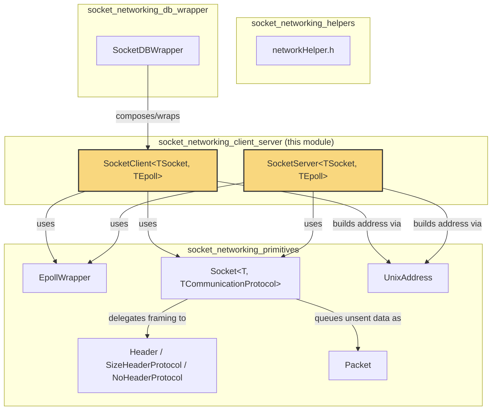
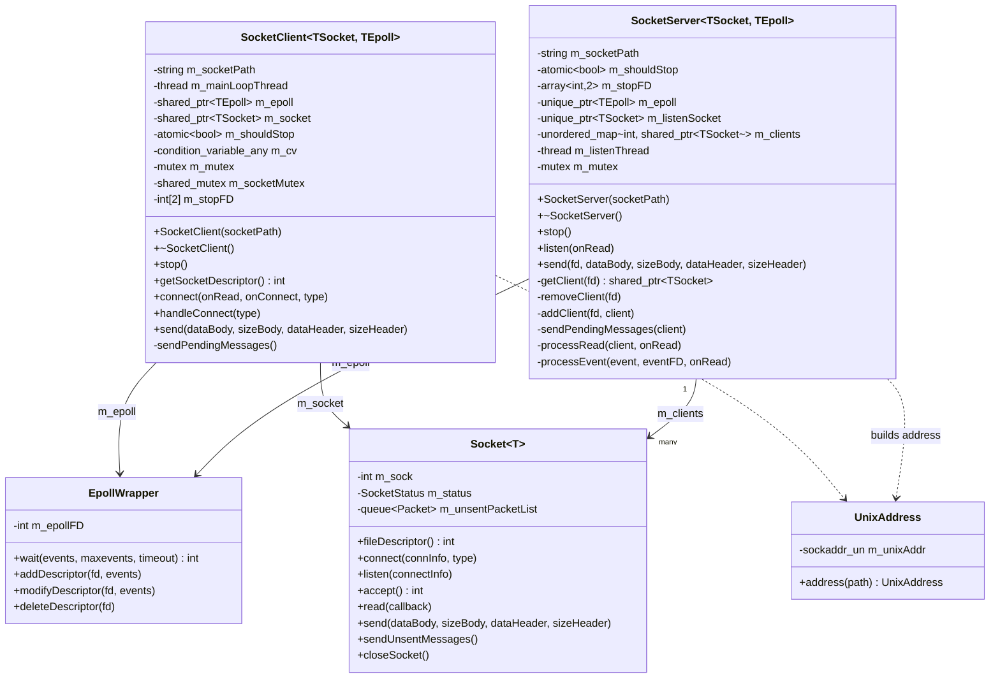
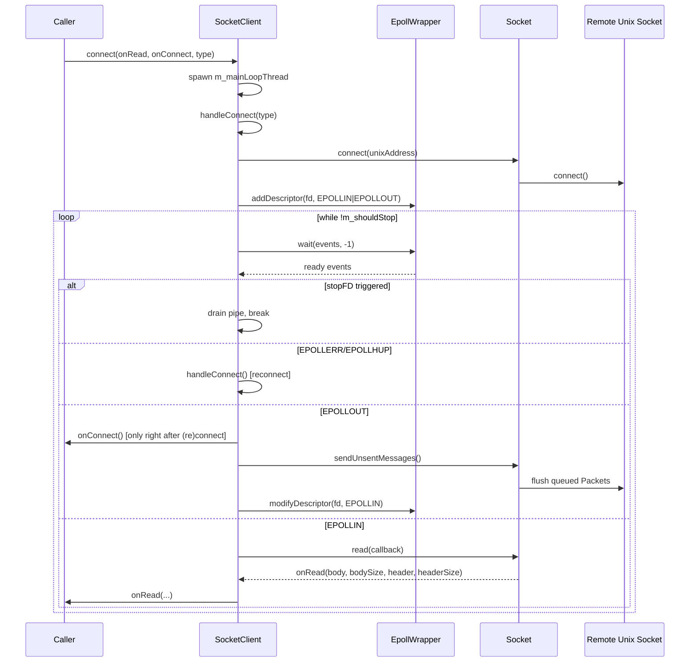
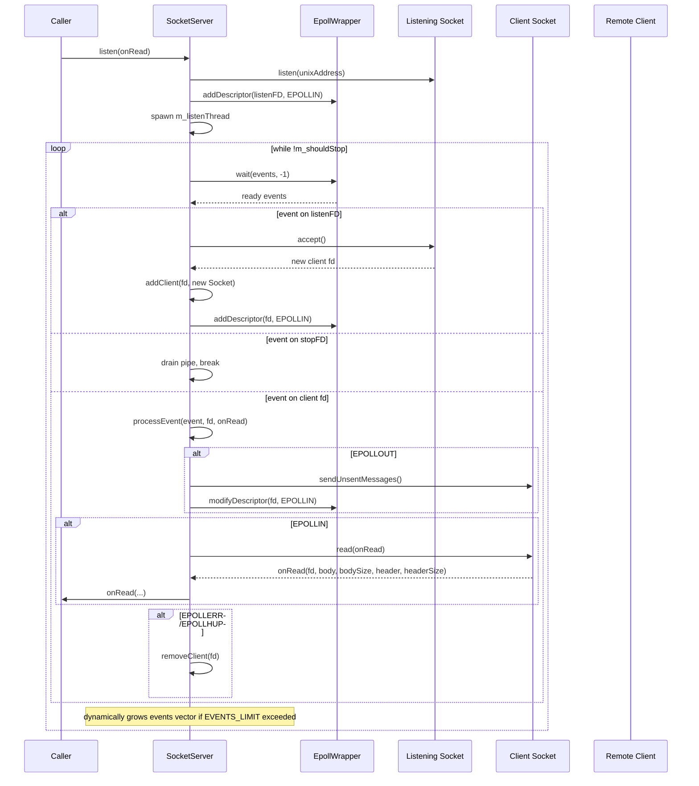
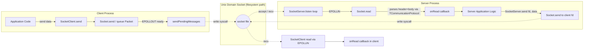

# Socket Networking Client/Server Module

## Introduction

The **socket_networking_client_server** module provides high-level, event-driven Unix-domain-socket client and server abstractions used throughout Wazuh's C++ components (`shared_modules`, `wazuh_modules`, `syscheckd`, and various daemons that communicate over local sockets). It sits directly on top of the `socket_networking_primitives` module (which supplies `EpollWrapper` and `Socket`/`UnixAddress`) and exposes two templated, RAII-friendly classes:

- **`SocketClient<TSocket, TEpoll>`** (`socketClient.hpp`) — an asynchronous, auto-reconnecting client that connects to a Unix domain socket, and reads/writes framed messages using an internal epoll event loop running on a dedicated thread.
- **`SocketServer<TSocket, TEpoll>`** (`socketServer.hpp`) — an asynchronous Unix domain socket server that accepts multiple client connections, multiplexes I/O with epoll, and dispatches messages to a user-supplied callback.

Both classes are templated on the underlying socket and epoll implementations, allowing dependency injection for unit testing (mock sockets/epoll) while defaulting to the production `Socket<OSPrimitives>` and `EpollWrapper` implementations. This module is a foundational building block for higher-level communication components such as `SocketDBWrapper` (`socket_networking_db_wrapper`), the `router` module, `dbsync`, `rsync`, and `indexer_connector`.

This document describes the module's architecture, its internal control flow, and how it relates to neighboring modules in the `shared_utils` / `socket_networking` family.

---

## 1. Purpose and Core Functionality

| Component | Responsibility |
|---|---|
| `SocketClient` | Connects (with automatic exponential-backoff retry) to a Unix domain socket, runs a background thread with an epoll loop, sends/receives length-prefixed messages, and automatically reconnects on socket errors (`EPOLLERR`/`EPOLLHUP`). |
| `SocketServer` | Binds and listens on a Unix domain socket, accepts multiple concurrent client connections, tracks each client socket in a thread-safe map, and dispatches read/write events via epoll to caller-supplied callbacks. |

Both classes share the same design philosophy:

- **Non-blocking I/O** using `SOCK_NONBLOCK` sockets combined with `epoll` for readiness notification.
- **Self-pipe trick** (`m_stopFD` pipe pair) to cleanly and immediately break out of the blocking `epoll_wait` call when `stop()` is invoked, avoiding the need for polling timeouts.
- **Templated design** (`TSocket`, `TEpoll`) enabling compile-time substitution of mock objects for unit testing.
- **Message framing** delegated to the underlying `Socket` class (from `socket_networking_primitives`), which uses a pluggable `TCommunicationProtocol` (e.g., `SizeHeaderProtocol`) to build/parse header+body packets.
- **Thread safety** via mutexes/shared_mutex guarding socket access and client maps.

---

## 2. Architecture Overview

### 2.1 Component Relationships



### 2.2 Class Diagram



---

## 3. `SocketClient` — Detailed Behavior

### 3.1 Construction and Lifecycle

- The constructor creates a self-pipe (`m_stopFD`) used exclusively to interrupt the blocking `epoll_wait` call during shutdown. The read end is registered with epoll using edge-triggered mode (`EPOLLET`).
- `connect(onRead, onConnect, type)` spawns the background thread (`m_mainLoopThread`) only once; subsequent calls are no-ops while the thread is alive.
- `stop()` sets `m_shouldStop`, writes a dummy byte to the stop pipe to wake up `epoll_wait`, notifies the condition variable (in case a reconnect backoff is in progress), and joins the thread.

### 3.2 Connection & Reconnection Logic (`handleConnect`)

`handleConnect` implements an **exponential backoff retry** (capped at 30 seconds) loop:

1. Build a `UnixAddress` from `m_socketPath`.
2. Attempt `m_socket->connect(...)`; on success, register the socket file descriptor with epoll for `EPOLLIN | EPOLLOUT`.
3. On failure, wait on a condition variable for `delay` seconds (doubling each iteration, capped at `MAX_DELAY = 30`), or return early if `stop()` was requested.

This same method is re-invoked whenever the main loop detects `EPOLLERR`/`EPOLLHUP` on the socket, providing automatic reconnection.

### 3.3 Main Event Loop (`connect`)



### 3.4 Sending Data

`send(dataBody, sizeBody, dataHeader, sizeHeader)`:
- Acquires a **shared** lock on `m_socketMutex` (allowing concurrent sends but exclusive access during reconnect).
- Delegates to `Socket::send`, which attempts an immediate `send()` syscall; unsent bytes are queued as a `Packet` (from `socket_networking_primitives`) for later transmission.
- On failure, re-arms the epoll descriptor for `EPOLLIN | EPOLLOUT` so the event loop retries via `sendPendingMessages()`.

---

## 4. `SocketServer` — Detailed Behavior

### 4.1 Construction and Lifecycle

- Similar self-pipe pattern as `SocketClient` for graceful, immediate shutdown.
- `listen(onRead)` removes any stale socket file, builds the bind address using `UnixAddress`, calls `Socket::listen` (which creates the file, sets permissions `0666`, and starts listening with `SOMAXCONN` backlog), registers the listening socket with epoll for `EPOLLIN`, and starts the background accept/dispatch thread.
- `stop()` signals the thread to exit, deletes the listening descriptor from epoll, and closes the socket. The destructor also removes the socket file from disk (`std::filesystem::remove_all`).

### 4.2 Client Management

Clients are tracked in `std::unordered_map<int, shared_ptr<TSocket>> m_clients`, guarded by `m_mutex`:

- `addClient(fd, socket)` — called upon `accept()`.
- `getClient(fd)` — thread-safe lookup used by the event dispatcher and by `send()`.
- `removeClient(fd)` — called when `EPOLLERR`/`EPOLLHUP` is detected for a client descriptor.

### 4.3 Main Event Loop (`listen`)



### 4.4 Sending Data to a Specific Client

`send(fd, dataBody, sizeBody, dataHeader, sizeHeader)`:
- Looks up the client by `fd`; throws `std::out_of_range` if not found.
- Delegates to `Socket::send`; on failure, re-registers the descriptor for `EPOLLIN | EPOLLOUT` to retry sending once writable.

---

## 5. Data Flow: End-to-End Message Exchange



---

## 6. Relationship to Other Modules

| Related Module | Relationship |
|---|---|
| [socket_networking_primitives](socket_networking_primitives.md) | Supplies `EpollWrapper`, `Socket<T, TCommunicationProtocol>`, `UnixAddress`, `Header`/`SizeHeaderProtocol`/`NoHeaderProtocol`, and `Packet` — the low-level primitives that `SocketClient`/`SocketServer` are built upon. |
| [socket_networking_db_wrapper](socket_networking_db_wrapper.md) | `SocketDBWrapper` composes a `SocketClient<Socket<OSPrimitives, SizeHeaderProtocol>, EpollWrapper>` internally to talk to Wazuh DB (`wazuh-db` socket), demonstrating a typical consumer of this module. |
| [socket_networking_helpers](socket_networking_helpers.md) | Provides lower-level network helper utilities (e.g., `networkHelper.h`) that may be used alongside socket communication for non-Unix-domain use cases. |
| [framework_core_communication_sockets](framework_core_communication.md) | The Python/C framework layer (`wazuh_socket.py`, `wazuh_queue.py`) implements analogous client/server socket patterns for the Python-based API and framework, serving a similar purpose at a different layer of the stack (JSON-based Wazuh socket protocol vs. this module's raw framed binary protocol). |
| [engine_httpsrv](Wazuh_Engine_Core_(C++).md) / [Router](Wazuh_Engine_Core_(C++).md) | Higher-level engine components (e.g., the Router's `udgramsrv`, `router.cpp`) build on similar epoll-based networking patterns for datagram and pub/sub communication, though they use different primitives (`iqueue`, `udsrv.cpp`). |
| [dbsync](Shared_Modules_Infrastructure_(C++).md), [rsync](Shared_Modules_Infrastructure_(C++).md), [indexer_connector](Shared_Modules_Infrastructure_(C++).md) | These shared modules commonly rely on socket-based IPC; `SocketClient`/`SocketServer` (or `SocketDBWrapper`, built on top of them) are the standard mechanism for such communication within the `shared_modules` C++ codebase. |

---

## 7. Design Notes & Testability

- **Template parameterization** (`TSocket`, `TEpoll`) is the primary testability mechanism: unit tests can substitute mock socket/epoll implementations (see `OSPrimitives`/`OsPrimitivesMac` abstractions and related wrapper interfaces in `socket_networking_primitives`) to simulate connection failures, partial reads/writes, and epoll event sequences without real OS sockets.
- **Self-pipe trick**: Both classes use a pipe (`m_stopFD`) registered in the epoll set with `EPOLLET` (edge-triggered) to guarantee immediate wake-up on `stop()`, avoiding polling delays inherent to a timeout-based `epoll_wait`.
- **Locking strategy**:
  - `SocketClient` uses a `shared_mutex` (`m_socketMutex`) to allow multiple concurrent `send()` calls (shared lock) while reserving exclusive access during reconnect (`handleConnect`) and pending-message flush (`sendPendingMessages`).
  - `SocketServer` uses a plain `mutex` guarding the `m_clients` map, since client socket objects themselves are not expected to be accessed concurrently by multiple sender threads in the same way.
- **Error handling**: Both classes swallow most I/O exceptions inside the event loop (logging to `stderr`) and rely on `EPOLLERR`/`EPOLLHUP` for terminal socket-state detection — for the client, this triggers reconnection; for the server, it triggers client removal.
- **Framing agnostic**: Neither class parses message framing directly — this responsibility is delegated to the templated `Socket<T, TCommunicationProtocol>` from `socket_networking_primitives`, allowing the same client/server logic to support different wire protocols (e.g., `SizeHeaderProtocol`, `NoHeaderProtocol`).

---

## 8. Typical Usage Pattern

```cpp
// Server side
SocketServer<Socket<OSPrimitives>, EpollWrapper> server("/var/ossec/queue/my.sock");
server.listen([](int fd, const char* body, uint32_t bodySize, const char* header, uint32_t headerSize) {
    // process the client's message
    // ... respond if needed:
    // server.send(fd, responseData, responseSize);
});
// ... later
server.stop();

// Client side
SocketClient<Socket<OSPrimitives>, EpollWrapper> client("/var/ossec/queue/my.sock");
client.connect(
    [](const char* body, uint32_t bodySize, const char* header, uint32_t headerSize) {
        // handle incoming data
    },
    []() {
        // called right after a (re)connection succeeds; good place to send initial handshake
    }
);
client.send(requestData, requestSize);
// ... later
client.stop();
```

This pattern is exemplified in production code by `SocketDBWrapper::init()`, which wraps a `SocketClient` to implement request/response semantics against the Wazuh DB daemon.
